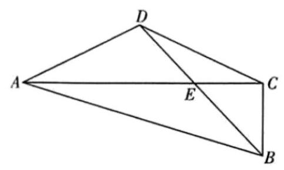
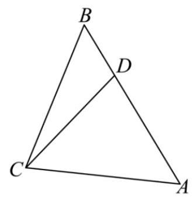
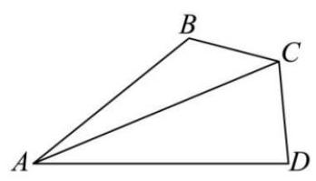
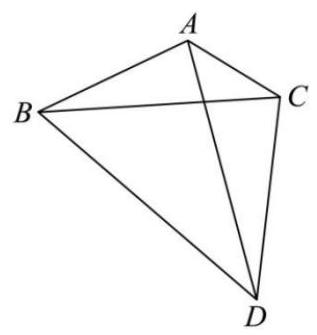
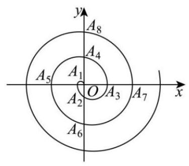
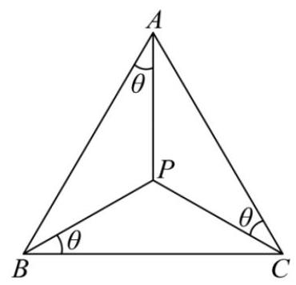

# 第7章 解三角形

## 7-1 基本方法(边角互化)

### 7-1-1

(2024 北京高考)在 \( \bigtriangleup  {ABC} \) 中，内角 \( A, B, C \) 的对边分别为 \( a, b, c,{\angle A} \) 为钝角, \( a = 7,\sin {2B} = \frac{\sqrt{3}}{7}b\cos B \) .

(1)求 \( \angle A \) ；

(2)从条件①、条件②、条件③这三个条件中选择一个作为已知，使得 \( \bigtriangleup  {ABC} \) 存在,求 \( \bigtriangleup  {ABC} \) 的面积.

条件①: \( b = 7 \) ; 条件②: \( \cos B = \frac{13}{14} \) ; 条件③: \( c\sin A = \frac{5}{2}\sqrt{3} \) .

注:如果选择的条件不符合要求，第(2)问得 0 分；如果选择多个符合要求的条件分别解答, 按第一个解答计分.

### 7-1-2

(2016 浙江高考)在 \( \bigtriangleup  {ABC} \) 中，内角 \( A, B, C \) 所对的边分别为 \( a, b, c \) ，已知 \( b + c = {2a}\cos B. \)

(1)证明: \( A = {2B} \) ；

(2)若 \( \bigtriangleup  {ABC} \) 的面积 \( S = \frac{{a}^{2}}{4} \) ，求角 \( A \) 的大小.

### 7-1-3

( 2010 江苏高考)在锐角三角形 \( {ABC} \) 中，内角 \( A, B, C \) 的对边分别为 \( a, b, c \) ， \( \frac{b}{a} + \frac{a}{b} = 6\cos C \) ，则 \( \frac{\tan C}{\tan A} + \frac{\tan C}{\tan B} = \) ___.

### 7-1-4

(2024 浙江温州一模)设 \( \bigtriangleup  {ABC} \) 的三个内角 \( A, B, C \) 所对的边分别为 \( a, b, c \) ， 且 \( C = \frac{\pi }{3} \) .

(1)若 \( a + b = 1 \) ，求 \( c \) 的最小值；

(2)求 \( \cos A + \cos B - \cos \frac{A - B}{2} \) 的值.

### 7-1-5

(2024 湖北武汉五调)在 \( \bigtriangleup  {ABC} \) 中，角 \( A, B, C \) 的对边分别为 \( a, b, c \) 且满足 \( {c}^{2} - {a}^{2} = {ab}, c = 2 \) ，则 \( \bigtriangleup  {ABC} \) 面积取最大值时， \( \cos C = \) ( )

A. \( \frac{\sqrt{3} - 1}{2} \) B. \( \frac{\sqrt{3} + 1}{4} \)

C. \( \frac{2 - \sqrt{2}}{2} \) D. \( \frac{2 + \sqrt{2}}{4} \)

### 7-1-6

在斜 \( \bigtriangleup {ABC} \) 中, \( A \) 为锐角,且满足 \( 3\sin \left( {{2B} + C}\right)  =  - \sin C \) ,则 \( \frac{2}{\tan A} + \frac{1}{\tan B} + \frac{1}{\tan C} \) 的最小值为___.

### 7-1-7

在 \( \bigtriangleup {ABC} \) 中,角 \( A, B, C \) 所对应的边分别为 \( a, b, c \) ,若 \( {ac} = 8,\sin B + \; 2\sin C\cos A = 0 \) ,则:

① \( \tan B \) 的最大值为___；

② \( {S}_{\bigtriangleup {ABC}} \) 的最大值为___.

### 7-1-8

如图，四边形 \( {ABCD} \) 由 \( \bigtriangleup {ABC} \) 和 \( \bigtriangleup {ACD} \) 拼接而成，其中 \( \angle {ACB} = {90}^{ \circ  } \) ， \( \angle {ADC} > \; {90}^{ \circ  } \) ,若 \( {AC} \) 与 \( {BD} \) 相交于点 \( E,\angle {ACD} = {30}^{ \circ  },{AD} = 2,{AC} = 2\sqrt{3} \) ,且 \( \tan \angle {BAD} = \frac{3\sqrt{3}}{5} \) , 则 \( \bigtriangleup  {CDE} \) 的面积 \( S = \) ___.

### 7-1-9

在 \( \bigtriangleup {ABC} \) 中,内角 \( A, B, C \) 所对的三边分别为 \( a, b, c \) ,且 \( c = {2b} \) ,若 \( \bigtriangleup {ABC} \) 的面积为 1 ，则 \( {BC} \) 的最小值是___.

### 7-1-10

在 \( \bigtriangleup {ABC} \) 中, \( B = \frac{\pi }{3} \) ,点 \( D \) 在边 \( {AB} \) 上, \( {BD} = 2 \) ,且 \( {DA} = {DC} \) .

(1)若 \( \bigtriangleup  {BCD} \) 的面积为 \( 2\sqrt{3} \) ，求边 \( {CD} \) 的长；

(2)若 \( {AC} = {2\sqrt{3}} \) ，求 \( \angle  {DCA} \) .

## 7-2 几何性质、四心相关

### 7-2-1

证明下述三角形面积公式:

(1) \( {S}_{\Delta ABC} = \frac{1}{2}{ac}\sin B \) .

(2) \( {S}_{\Delta ABC} = \frac{1}{2}\left( {a + b + c}\right)  \cdot  r \) (其中 \( r \) 为内切圆半径).

(3)请利用余弦定理证明海伦公式 \( {S}_{\bigtriangleup {ABC}} = \sqrt{p\left( {p - a}\right) \left( {p - b}\right) \left( {p - c}\right) } \) ,其中 \( p = \; \frac{1}{2}\left( {a + b + c}\right) \) .

### 7-2-2

(多选) (2024 江苏宿迁三模) 在 \( \bigtriangleup {ABC} \) 中,角 \( A, B, C \) 所对的边分别为 \( a, b, c \) . 若 \( 2\sqrt{3}c{\cos }^{2}\frac{A + C}{2} = b\sin C \) ,且边 \( {AC} \) 上的中线 \( {BD} \) 长为 \( \sqrt{3} \) ,则(   )

A. \( B = \frac{\pi }{3} \) B. \( b \) 的取值范围为 \( \lbrack 2,2\sqrt{3}) \)

C. \( \bigtriangleup {ABC} \) 面积的最大值为 \( 2\sqrt{3} \) D. \( \bigtriangleup {ABC} \) 周长的最大值为 \( 3\sqrt{6} \)

### 7-2-3

(2023 重庆三模)在① \( \left( {{2b} - c}\right) \cos A = a\cos C \) ，② \( a\sin B = \sqrt{3}b\cos A \) ，③ \( a\cos C + \; \sqrt{3}c\sin A = b + c \) ,这三个条件中任选一个,补充在下面问题中,并完成解答. 问题: 锐角 \( \bigtriangleup  {ABC} \) 的内角 \( A, B, C \) 的对边分别为 \( a, b, c \) ，已知___.

(1)求A；

(2)若 \( b = 2 \) ， \( D \) 为 \( {AB} \) 的中点，求 \( {CD} \) 的取值范围.

### 7-2-4

(2024 福建省检)在三角形 \( {ABC} \) 中， \( D \) 为 \( {BC} \) 中点，且 \( \angle {DAC} + \angle {BAC} = \pi \) .

(1)求 \( \frac{AB}{AD} \) ；

(2)若 \( {BC} = {2\sqrt{2}}{AC} \) ，求 \( \cos C \) .

### 7-2-5

(2023 全国高考)在 \( \bigtriangleup {ABC} \) 中， \( \angle {BAC} = {60}^{ \circ  },{AB} = 2,{BC} = \sqrt{6},\angle {BAC} \) 的角平分线交 \( {BC} \) 于 \( D \) ,则 \( {AD} = \) ___.

### 7-2-6

(2018江苏高考)在 \( \bigtriangleup  {ABC} \) 中，角 \( A, B, C \) 所对的边分别为 \( a, b, c,\angle {ABC} = {120}^{ \circ  } \) ， \( \angle {ABC} \) 的平分线交 \( {AC} \) 于点 \( D \) ，且 \( {BD} = 1 \) ，则 \( {4a} + c \) 的最小值为___.

### 7-2-7

(多选) (2024 江西二模) 已知 \( \bigtriangleup {ABC} \) 中, \( {AB} = 1,{AC} = 4,\angle {BAC} = {60}^{ \circ  },{AE} \) 为 \( \angle {BAC} \) 的角平分线，交 \( {BC} \) 于点 \( E, D \) 为 \( {AC} \) 中点，下列结论正确的是( )

A. \( {BE} = \frac{\sqrt{13}}{5} \)

B. \( {AE} = \frac{4\sqrt{2}}{5} \)

C. \( \bigtriangleup {ABE} \) 的面积为 \( \frac{\sqrt{3}}{5} \)

D. \( P \) 在 \( \bigtriangleup {ABD} \) 的外接圆上,则 \( {PB} + \frac{1}{2}{PD} \) 的最大值为 \( \sqrt{7} \)

### 7-2-8

(2023 河南信阳三模)在 \( \bigtriangleup  {ABC} \) 中，内角 \( A, B, C \) 的对边分别为 \( a, b, c \) ，若 \( a = \; 6\sqrt{2}\sin \left( {B + \frac{\pi }{4}}\right) , c = 6 \) 且 \( O \) 为 \( \bigtriangleup {ABC} \) 的外心, \( G \) 为 \( \bigtriangleup {ABC} \) 的重心,则 \( \left| {OG}\right| \) 的最小值为___.

## 7-3 四边形或多三角形

### 7-3-1

(2024 四川南充一模)已知平面四边形 \( {ABCD} \) 中， \( {AB} = 1 \) ， \( {BC} = 2 \) ， \( {CD} = 3 \) ，

\( {DA} = 4 \) ，则该平面四边形 \( {ABCD} \) 面积的最大值为___.

### 7-3-2

(2024 浙江绍兴二模)在 \( \bigtriangleup  {ABC} \) 中，内角 \( A, B, C \) 对应边分别为 \( a, b, c \) 且 \( b\cos C + \sqrt{3}c\sin B = a + {2c} \) .

(1)求 \( \angle B \) 的大小；

(2)如图所示， \( D \) 为 \( \bigtriangleup {ABC} \) 外一点， \( \angle {DCB} = \angle B,{CD} = \sqrt{3},{BC} = 1,\angle {CAD} = {30}^{ \circ  } \) ， 求 \( \sin \angle {BCA} \) 及 \( \bigtriangleup {ABC} \) 的面积.

### 7-3-3

(2024 重庆三模)若圆内接四边形 \( {ABCD} \) 满足 \( {AC} = 2,\angle {CAB} = \angle {CAD} = {30}^{ \circ  } \) ， 则四边形 \( {ABCD} \) 的面积为( )

A. \( \frac{\sqrt{3}}{2} \) B. \( 2\sqrt{3} \) C. 3 D. \( 2\sqrt{3} \)

### 7-3-4

(2024 河南模拟预测)在 \( \bigtriangleup  {ABC} \) 中，角 \( A, B, C \) 的对边分别为 \( a, b, c \) ，且 \( c\cos B + {2a}\cos A + b\cos C = 0. \)

(1)求 \( A \) ；

(2)如图所示， \( D \) 为平面上一点，与 \( \bigtriangleup  {ABC} \) 构成一个四边形 \( {ABDC} \) ，且 \( \angle {BDC} = \frac{\pi }{3} \) ， 若 \( c = {2b} = 2 \) ，求 \( {AD} \) 的最大值.

### 7-3-5

(2024 四川成都二诊)平面四边形 \( {ABCD} \) 中， \( {BC} = {CD} = 2 \) ， \( \frac{AB}{BD} = \frac{3}{4} \) ， \( \angle {ABD} = {90}^{ \circ  } \) ， 则 \( {AC} \) 的最大值为___.

### 7-3-6

(2022 北大强基)已知凸四边形 \( {ABCD} \) 满足: \( {AB} = 1,{BC} = 2,{CD} = 4 \) ， \( {DA} = 3 \) ，则其内切圆半径的取值范围为___.

## 7-4 三角形中的恒等式

### 7-4-1

(2016 江苏高考) 在锐角三角形 \( {ABC} \) 中,若 \( \sin A = 2\sin B\sin C \) ,则 \( \tan A\tan B\tan C \) 的最小值是___.

### 7-4-2

(2014 重庆高考)已知 \( \bigtriangleup  {ABC} \) 的内角 \( A, B, C \) 满足 \( \sin {2A} + \sin \left( {A - B + C}\right)  = \; \sin \left( {C - A - B}\right)  + \frac{1}{2} \) ，面积 \( S \) 满足 \( 1 \leq  S \leq  2 \) ，记 \( a, b, c \) 分别为 \( A, B, C \) 所对的边， 则下列不等式一定成立的是( )

A. \( {bc}\left( {b + c}\right)  > 8 \) B. \( {ac}\left( {a + b}\right)  > {16}\sqrt{2} \)

C. \( 6 \leq  {abc} \leq  {12} \) D. \( {12} \leq  {abc} \leq  {24} \)

### 7-4-3

若非负实数 \( x, y, z \) 满足 \( x + y + z = \pi \) ,求 \( 2\cos x + 2\cos y + 3\cos z \) 的最小值.

## 7-5 综合应用

### 7-5-1

(2024 江西新余模拟)在等腰直角三角形 \( {ABC} \) 中， \( A \) 为直角顶点， \( M \) 为线段BC 上一点, \( N \) 为射线 \( {CA} \) 上一点, \( {BC} = 2 \) .

(1)若 \( 2\overrightarrow{AN} = \overrightarrow{CA},{MP} \bot  {BN} \) ， \( {\bigtriangleup {MBN}} \) 的面积为 \( \frac{3}{4} \) ，求 \( \lambda \) 使 \( \lambda \overrightarrow{BP} = \overrightarrow{BN} \) .

(2)D为线段 \( {AB} \) 上一点， \( {MD}\bot {DN} \) 且 \( {MD} = {DN} \) ，求 \( \bigtriangleup  {MDN} \) 面积的最小值.

### 7-5-2

(2022 江苏盐城模拟)在 \( \bigtriangleup  {ABC} \) 中，内角 \( A, B, C \) 的对边分别是 \( a, b, c,(a + \; c)\left( {\sin A - \sin C}\right)  + b\sin B = a\sin B, b + {2a} = 4,\overrightarrow{CA} = 3\overrightarrow{CD} - 2\overrightarrow{CB} \) ,则线段 \( {CD} \) 长度的最小值为( )

A. 2

B. \( \frac{2\sqrt{2}}{3} \) C. 3

D. \( \frac{2\sqrt{3}}{3} \)

### 7-5-3

(2010 江苏高考)已知 \( \bigtriangleup  {ABC} \) 的三边长为有理数.

(1)求证: \( \cos A \) 是有理数.

(2)求证:对任意正整数 \( n \) ， \( \cos {nA} \) 也是有理数.

### 7-5-4

(2024 浙江舟山模拟) 阿基米德螺线广泛存在于自然界中, 具有重要作用. 如图,在平面直角坐标系 \( {xOy} \) 中,螺线与坐标轴依次交于点 \( {A}_{1}\left( {-1,0}\right) ,{A}_{2}\left( {0, - 2}\right) \) , \( {A}_{3}\left( {3,0}\right) ,{A}_{4}\left( {0,4}\right) ,{A}_{5}\left( {-5,0}\right) ,{A}_{6}\left( {0, - 6}\right) ,{A}_{7}\left( {7,0}\right) ,{A}_{8}\left( {0,8}\right) \) ,并按这样的规律继续下去.

(1)求 \( {A}_{3}{A}_{4} \) ， \( {A}_{n}{A}_{n + 4} \) ；

(2)求证:不存在正整数 \( n \) ，使得三角形 \( {A}_{n}{A}_{n + 1}{A}_{n + 2} \) 的面积为 2022；

(3)求证:对于任意正整数 \( n \) ，三角形 \( {A}_{n}{A}_{n + 1}{A}_{n + 2} \) 为锐角三角形.

### 7-5-5

(2024 黑龙江大庆三模) 法国数学家费马在给意大利数学家托里拆利的一封信中提到 “费马点”, 即平面内到三角形三个顶点距离之和最小的点, 托里拆利确定费马点的方法如下:

①当 \( \bigtriangleup {ABC} \) 的三个内角均小于120°时，满足 \( \angle {AOB} = \angle {BOC} = \angle {COA} = {120}^{ \circ  } \) 的点 0为费马点;

②当 \( \bigtriangleup  {ABC} \) 有一个内角大于或等于 \( {120}^{ \circ  } \) 时，最大内角的顶点为费马点.

请用以上知识解决下面的问题:

已知 \( \bigtriangleup {ABC} \) 的内角 \( A, B, C \) 所对的边分别为 \( a, b, c \) ,点 \( M \) 为 \( \bigtriangleup {ABC} \) 的费马点, 且 \( \cos {2A} + \cos {2B} - \cos {2C} = 1 \) .

(1)求 \( C \) ；

(2)若 \( c = 4 \) ，求 \( \left| {MA}\right|  \cdot  \left| {MB}\right|  + \left| {MB}\right|  \cdot  \left| {MC}\right|  + \left| {MC}\right|  \cdot  \left| {MA}\right| \) 的最大值；

(3)若 \( \left| {MA}\right|  + \left| {MB}\right|  = t\left| {MC}\right| \) ，求实数 \( t \) 的最小值.

### 7-5-6

(2024 河北二模)若 \( \bigtriangleup {ABC} \) 内一点 \( P \) 满足 \( \angle {PAB} = \angle {PBC} = \angle {PCA} = \theta \) ，则称点 \( P \) 为 \( \bigtriangleup {ABC} \) 的布洛卡点, \( \theta \) 为 \( \bigtriangleup {ABC} \) 的布洛卡角. 如图,已知 \( \bigtriangleup {ABC} \) 中, \( {BC} = a \) , \( {AC} = b,{AB} = c \) ,点 \( P \) 为 \( \bigtriangleup {ABC} \) 的布洛卡点, \( \theta \) 为 \( \bigtriangleup {ABC} \) 的布洛卡角.

(1)若 \( b = c \) ，且满足 \( \frac{PB}{PA} = \sqrt{3} \) ，求 \( \angle {ABC} \) 的大小.

(2)若 \( \bigtriangleup  {ABC} \) 为锐角三角形.

(i) 证明: \( \frac{1}{\tan \theta } = \frac{1}{\tan \angle {BAC}} + \frac{1}{\tan \angle {ABC}} + \frac{1}{\tan \angle {ACB}} \) .

(ii) 若 \( {PB} \) 平分 \( \angle {ABC} \) ，证明: \( {b}^{2} = {ac} \) .
