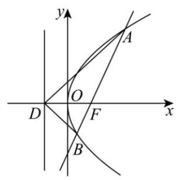
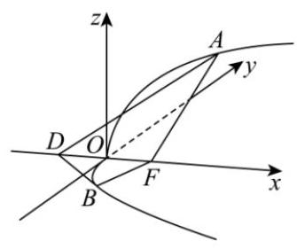
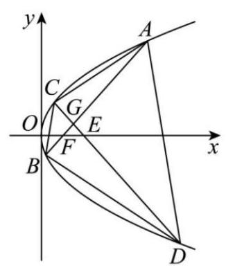
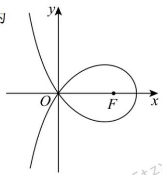
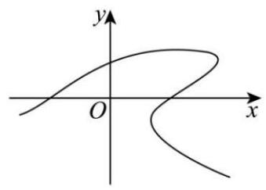

# 第14章 圆锥曲线(小题)

## 14-1 第一定义&几何性质

### 14-1-1

请完成下述问题:

(1)请写出圆锥曲线的第一定义；

(2)请写出圆锥曲线的统一定义(第二定义)，并证明；

(3)请写出圆锥曲线的第三定义，并证明.

### 14-1-2

求解下列问题中的 \( e = \frac{c}{a} \) 的值.

(1)已知 \( a > c > 0,{a}^{2} - {5ac} + 4{c}^{2} = 0 \) ，求 \( e \) .

(2)已知 \( a > c > 0,{a}^{2} = {b}^{2} + {c}^{2}, a = {2b} \) ，求 \( e \) .

(3)已知 \( c > a > 0 \) ， \( {c}^{2} = {a}^{2} + {b}^{2} \) ， \( {a}^{2} + {ac} = {b}^{2} \) ，求 \( e \) .

(4)已知 \( c > a > 0 \) ， \( {c}^{2} = {a}^{2} + {b}^{2} \) ， \( \frac{{b}^{2}}{a} = 3\left( {c - a}\right) \) ，求 \( e \) .

(5) 已知 \( a > {c}_{1} > 0,{c}_{2} > a > 0,{a}^{2} - {b}^{2} = {c}_{1}^{2},{a}^{2} + {b}^{2} = {c}_{2}^{2},{c}_{1}{c}_{2} = \frac{\sqrt{3}}{2}{a}^{2} \) , 求 \( {e}_{1} = \frac{c}{{a}_{1}},{e}_{2} = \frac{c}{{a}_{2}} \) .

### 14-1-3

求解下列求范围问题.

(1)已知 \( a > b > 0 \) ， \( {a}^{2} - {b}^{2} = {c}^{2} \) ， \( \sqrt{{a}^{2} + {b}^{2}} \leq  {2c} \) ，求 \( e \) 的范围.

(2)已知 \( {a}_{1} > c > 0, c > {a}_{2} > 0,4{c}^{2} = {a}_{1}^{2} + 3{a}_{2}^{2},{e}_{1} = \frac{c}{{a}_{1}},{e}_{2} = \frac{c}{{a}_{2}} \) ，求 \( \frac{1}{{e}_{1}} + \frac{1}{{e}_{2}} \) 的最大值.

(3)已知 \( {a}_{1} > c > 0, c > {a}_{2} > 0, x > 0, y > 0, x + y = 2{a}_{1}, x - y = 2{a}_{2} \) , \( 4{c}^{2} = {x}^{2} + {y}^{2} - {xy},{e}_{1} = \frac{c}{{a}_{1}},{e}_{2} = \frac{c}{{a}_{2}} \) ,求 \( {e}_{1}^{2} + {e}_{2}^{2} \) 的最小值.

### 14-1-4

(2024 天津高考) 双曲线 \( \frac{{x}^{2}}{{a}^{2}} - \frac{{y}^{2}}{{b}^{2}} = 1\left( {a > 0, b > 0}\right) \) 的左，右焦点分别为 \( {F}_{1} \) ， \( {F}_{2}.P \) 是双曲线右支上一点,且直线 \( P{F}_{2} \) 的斜率为 2 . 若 \( \bigtriangleup P{F}_{1}{F}_{2} \) 是面积为 8 的直角三角形，则双曲线的方程为 ( )

A. \( \frac{{x}^{2}}{2} - \frac{{y}^{2}}{8} = 1 \) B. \( \frac{{x}^{2}}{4} - \frac{{y}^{2}}{8} = 1 \) C. \( \frac{{x}^{2}}{8} - \frac{{y}^{2}}{2} = 1 \) D. \( \frac{{x}^{2}}{8} - \frac{{y}^{2}}{4} = 1 \)

### 14-1-5

(2023 全国高考) 已知双曲线 \( C : \frac{{x}^{2}}{{a}^{2}} - \frac{{y}^{2}}{{b}^{2}} = 1\left( {a > 0, b > 0}\right) \) 的左，右焦点分别为 \( {F}_{1},{F}_{2} \) . 点 \( A \) 在 \( C \) 上,点 \( B \) 在 \( y \) 轴上, \( \overrightarrow{{F}_{1}A} \bot  \overrightarrow{{F}_{1}B},\overrightarrow{{F}_{2}A} =  - \frac{2}{3}\overrightarrow{{F}_{2}B} \) ,则 \( C \) 的离心率为___.

### 14-1-6

(2021 全国高考)设 \( B \) 是椭圆 \( C : \frac{{x}^{2}}{{a}^{2}} + \frac{{y}^{2}}{{b}^{2}} = 1\left( {a > b > 0}\right) \) 的上顶点，若 \( C \) 上的任意一点 \( P \) 都满足 \( \left| {PB}\right|  \leq  {2b} \) ，则 \( C \) 的离心率的取值范围是( )

A. \( \left\lbrack  {\frac{\sqrt{2}}{2},1}\right) \) B. \( \left\lbrack  {\frac{1}{2},1}\right) \) C. \( \left( {0,\frac{\sqrt{2}}{2}}\right\rbrack \) D. \( \left( {0,\frac{1}{2}}\right\rbrack \)

### 14-1-7

(2014 湖北高考)已知 \( {F}_{1} \) ， \( {F}_{2} \) 是椭圆和双曲线的公共焦点， \( P \) 是它们的一个公共点,且 \( \angle {F}_{1}P{F}_{2} = \frac{\pi }{3} \) ,则椭圆和双曲线的离心率的倒数之和的最大值为( )

A. \( \frac{4\sqrt{3}}{3} \) B. \( \frac{2\sqrt{3}}{3} \) C. 3 D. 2

### 14-1-8

(2023 天津高考)已知双曲线 \( \frac{{x}^{2}}{{a}^{2}} - \frac{{y}^{2}}{{b}^{2}} = 1\left( {a > 0, b > 0}\right) \) 的左，右焦点分别为 \( {F}_{1} \) ， \( {F}_{2} \) . 过 \( {F}_{2} \) 向一条渐近线作垂线,垂足为 \( P \) . 若 \( \left| {P{F}_{2}}\right|  = 2 \) ,直线 \( P{F}_{1} \) 的斜率为 \( \frac{\sqrt{2}}{4} \) , 则双曲线的方程为( )

A. \( \frac{{x}^{2}}{8} - \frac{{y}^{2}}{4} = 1 \) B. \( \frac{{x}^{2}}{4} - \frac{{y}^{2}}{8} = 1 \)

C. \( \frac{{x}^{2}}{4} - \frac{{y}^{2}}{2} = 1 \) D. \( \frac{{x}^{2}}{2} - \frac{{y}^{2}}{4} = 1 \)

### 14-1-9

(多选) (2024 重庆三模) 已知双曲线 \( C : \frac{{x}^{2}}{{a}^{2}} - \frac{{y}^{2}}{16} = 1\left( {a > 0}\right) \) 的左,右焦点分别为 \( {F}_{1},{F}_{2}, P \) 为双曲线 \( C \) 上一点,且 \( \bigtriangleup P{F}_{1}{F}_{2} \) 的内切圆圆心为 \( I\left( {3,1}\right) \) ,则下列说法正确的是( )

A. \( a = 3 \) B. 直线 \( P{F}_{1} \) 的斜率为 \( \frac{1}{4} \)

C. \( \bigtriangleup P{F}_{1}{F}_{\mathrm{z}} \) 的周长为 \( \frac{64}{3} \) D. \( \bigtriangleup P{F}_{1}{F}_{2} \) 的外接圆半径为 \( \frac{65}{12} \)

### 14-1-10

(2023全国高考)设 \( A, B \) 为双曲线 \( {x}^{2} - \frac{{y}^{2}}{9} = 1 \) 上两点，下列四个点中，可为线段 \( {AB} \) 中点的是( )

A. \( \left( {1,1}\right) \) B. \( \left( {-1,2}\right) \) C. \( \left( {1,3}\right) \) D. \( \left( {-1, - 4}\right) \)

### 14-1-11

(多选) (2022 全国高考) 双曲线 \( C \) 的两个焦点为 \( {F}_{1},{F}_{2} \) ,以 \( C \) 的实轴为直径的圆记为 \( D \) ,过 \( {F}_{1} \) 作 \( D \) 的切线与 \( C \) 交于 \( M, N \) 两点,且 \( \cos \angle {F}_{1}N{F}_{2} = \frac{3}{5} \) ,则 \( C \) 的离心率为( )

A. \( \frac{\sqrt{5}}{2} \) B. \( \frac{3}{2} \) C. \( \frac{\sqrt{13}}{2} \) D. \( \frac{\sqrt{17}}{2} \)

### 14-1-12

(2022全国高考)椭圆 \( C : \frac{{x}^{2}}{{a}^{2}} + \frac{{y}^{2}}{{b}^{2}} = 1\left( {a > b > 0}\right) \) 的左顶点为 \( A \) ，点 \( P \) ， \( Q \) 均在 \( C \) 上，且关于 \( y \) 轴对称. 若直线 \( {AP} \) ， \( {AQ} \) 的斜率之积为 \( \frac{1}{4} \) ，则 \( C \) 的离心率为( )

A. \( \frac{\sqrt{3}}{2} \) B. \( \frac{\sqrt{2}}{2} \) C. \( \frac{1}{2} \) D. \( \frac{1}{3} \)

### 14-1-13

(2024 湖北模拟)斜率为 1 的直线与双曲线 \( E : \frac{{x}^{2}}{{a}^{2}} - \frac{{y}^{2}}{{b}^{2}} = 1\left( {a > 0, b > 0}\right) \) 交于两点 \( A, B \) ，点 \( C \) 是 \( E \) 上的一点，满足 \( {AC}\bot {BC},{\bigtriangleup {OAC}} \) ， \( {\bigtriangleup OBC} \) 的重心分别为 \( P, Q,\bigtriangleup {ABC} \) 的外心为 \( R \) . 记直线 \( {OP},{OQ},{OR} \) 的斜率为 \( {k}_{1},{k}_{2},{k}_{3} \) . 若 \( {k}_{1}{k}_{2}{k}_{3} =  - {27} \) ，则双曲线 \( E \) 的离心率为___.

### 14-1-14

已知过抛物线 \( {y}^{2} = {2px}\left( {p > 0}\right) \) 的焦点 \( F \) 作直线交抛物线于 \( A, B \) 两点，若 \( \left| {AF}\right|  = 3\left| {BF}\right| ,{AB} \) 的中点到 \( y \) 轴的距离为 \( \frac{5}{2} \) ，则 \( p \) 的值为( )

A. 2 B. 3 C. 4 D. 5

### 14-1-15

(多选) (2024 全国高考) 抛物线 \( C : {y}^{2} = {4x} \) 的准线为 \( l, P \) 为 \( C \) 上的动点, 过 \( P \) 作 \( \odot  A : {x}^{2} + {\left( y - 4\right) }^{2} = 1 \) 的一条切线, \( Q \) 为切点,过 \( P \) 作 \( l \) 的垂线,垂足为 \( B \) ,则 ( )

A. \( l \) 与 \( \odot  A \) 相切

B. 当 \( P, A, B \) 三点共线时, \( \left| {PQ}\right|  = \sqrt{15} \)

C. 当 \( \left| {PB}\right|  = 2 \) 时, \( {PA} \bot  {AB} \)

D. 满足 \( \left| {PA}\right|  = \left| {PB}\right| \) 的点 \( P \) 有且仅有 2 个

### 14-1-16

(多选) (2023 山西模拟) 已知抛物线 \( C : {y}^{2} = {4x} \) 的焦点为 \( F, C \) 的准线 \( l \) 与 \( x \) 轴交于点 \( P \) ,过 \( P \) 的一条直线与 \( C \) 交于 \( M, N \) 两点,过 \( M, N \) 作 \( l \) 的垂线,垂足分别为 \( S, T \) ,则(   )

A. \( \left| {MF}\right|  \cdot  \left| {NP}\right|  = \left| {NF}\right|  \cdot  \left| {MP}\right| \) B. \( \angle {MFS} + \angle {NFT} = \frac{\pi }{2} \)

C. \( \left| {MF}\right|  \cdot  \left| {NF}\right|  = \left| {SF}\right|  \cdot  \left| {TF}\right| \) D. \( \bigtriangleup {MNF} \) 的面积等于 \( \bigtriangleup {STF} \) 的面积

### 14-1-17

(2018 福建三明三模)已知椭圆 \( C : \frac{{x}^{2}}{4} + \frac{{y}^{2}}{3} = 1 \) ，直线 \( l \) : \( x = 4 \) 与 \( x \) 轴相交于点

\( E \) ,过椭圆右焦点 \( F \) 的直线与椭圆相交于 \( A, B \) 两点,点 \( C \) 在直线 \( l \) 上,则 “ \( {BC}//x \) 轴” 是 “直线 \( {AC} \) 过线段 \( {EF} \) 中点” 的( )

A. 充分不必要条件 B. 必要不充分条件

C. 充要条件 D. 既不充分也不必要条件

### 14-1-18

(2023 云南三模)在 3 世纪，古希腊数学家帕普斯在他的著作《数学汇编》 中完善了欧几里得关于圆锥曲线的统一定义. 他指出, 到定点的距离与到定直线的距离的比是常数 \( e \) 的点的轨迹叫做圆锥曲线; 当 \( 0 < e < 1 \) 时,轨迹为椭圆; 当 \( e = 1 \) 时,轨迹为抛物线; 当 \( e > 1 \) 时,轨迹为双曲线. 现有方程 \( k(x + {2y} + \; 1{)}^{2} = {x}^{2} + {y}^{2} - {4x} + 4 \) 表示的曲线是双曲线，则 \( k \) 的取值范围为( )

A. \( \left( {0,\frac{1}{5}}\right) \) B. \( \left( {\frac{1}{5}, + \infty }\right) \) C. \( \left( {5, + \infty }\right) \) D. \( \left( {0,5}\right) \)

## 14-2 第二定义

### 14-2-1

已知过抛物线 \( {y}^{2} = {2px}\left( {p > 0}\right) \) 的焦点 \( F \) 作直线交抛物线于 \( A, B \) 两点，若 \( \left| {AF}\right|  = 3\left| {BF}\right| ,{AB} \) 的中点到 \( y \) 轴的距离为 \( \frac{5}{2} \) ，则 \( p \) 的值为( )

A. 2 B. 3 C. 4 D. 5

### 14-2-2

(多选) (2024 全国高考) 抛物线 \( C : {y}^{2} = {4x} \) 的准线为 \( l, P \) 为 \( C \) 上的动点, 过 \( P \) 作 \( \odot  A : {x}^{2} + {\left( y - 4\right) }^{2} = 1 \) 的一条切线, \( Q \) 为切点,过 \( P \) 作 \( l \) 的垂线,垂足为 \( B \) ,则 ( )

A. \( l \) 与 \( \odot  A \) 相切

B. 当 \( P, A, B \) 三点共线时, \( \left| {PQ}\right|  = \sqrt{15} \)

C. 当 \( \left| {PB}\right|  = 2 \) 时, \( {PA} \bot  {AB} \)

D. 满足 \( \left| {PA}\right|  = \left| {PB}\right| \) 的点 \( P \) 有且仅有 2 个

### 14-2-3

(多选) (2023 山西模拟) 已知抛物线 \( C : {y}^{2} = {4x} \) 的焦点为 \( F, C \) 的准线 \( l \) 与 \( x \) 轴交于点 \( P \) ,过 \( P \) 的一条直线与 \( C \) 交于 \( M, N \) 两点,过 \( M, N \) 作 \( l \) 的垂线,垂足分别为 \( S, T \) ,则(   )

A. \( \left| {MF}\right|  \cdot  \left| {NP}\right|  = \left| {NF}\right|  \cdot  \left| {MP}\right| \) B. \( \angle {MFS} + \angle {NFT} = \frac{\pi }{2} \)

C. \( \left| {MF}\right|  \cdot  \left| {NF}\right|  = \left| {SF}\right|  \cdot  \left| {TF}\right| \) D. \( \bigtriangleup {MNF} \) 的面积等于 \( \bigtriangleup {STF} \) 的面积

### 14-2-4

(2018 福建三明三模)已知椭圆 \( C : \frac{{x}^{2}}{4} + \frac{{y}^{2}}{3} = 1 \) ，直线 \( l \) : \( x = 4 \) 与 \( x \) 轴相交于点

\( E \) ,过椭圆右焦点 \( F \) 的直线与椭圆相交于 \( A, B \) 两点,点 \( C \) 在直线 \( l \) 上,则 “ \( {BC}//x \) 轴” 是 “直线 \( {AC} \) 过线段 \( {EF} \) 中点” 的( )

A. 充分不必要条件 B. 必要不充分条件

C. 充要条件 D. 既不充分也不必要条件

### 14-2-5

(2023 云南三模)在 3 世纪，古希腊数学家帕普斯在他的著作《数学汇编》 中完善了欧几里得关于圆锥曲线的统一定义. 他指出, 到定点的距离与到定直线的距离的比是常数 \( e \) 的点的轨迹叫做圆锥曲线; 当 \( 0 < e < 1 \) 时,轨迹为椭圆; 当 \( e = 1 \) 时,轨迹为抛物线; 当 \( e > 1 \) 时,轨迹为双曲线. 现有方程 \( k(x + {2y} + \; 1{)}^{2} = {x}^{2} + {y}^{2} - {4x} + 4 \) 表示的曲线是双曲线，则 \( k \) 的取值范围为( )

A. \( \left( {0,\frac{1}{5}}\right) \) B. \( \left( {\frac{1}{5}, + \infty }\right) \) C. \( \left( {5, + \infty }\right) \) D. \( \left( {0,5}\right) \)

## 14-3 焦点弦

### 14-3-1

若椭圆方程 \( \frac{{x}^{2}}{{a}^{2}} + \frac{{y}^{2}}{{b}^{2}} = 1\left( {a > b > 0}\right) \) 的左右焦点分别为 \( {F}_{1},{F}_{2}, P\left( {{x}_{0},{y}_{0}}\right) \) 为椭圆上一点,请用 \( {x}_{0}, a, c \) 来表示 \( \left| {P{F}_{1}}\right| ,\left| {P{F}_{2}}\right| \) 的长度.

### 14-3-2

若双曲线方程 \( \frac{{x}^{2}}{{a}^{2}} - \frac{{y}^{2}}{{b}^{2}} = 1\left( {a > 0, b > 0}\right) \) 的左右焦点分别为 \( {F}_{1},{F}_{2}, P\left( {{x}_{0},{y}_{0}}\right) \) 为双曲线右支上一点,请用 \( {x}_{0}, a, c \) 来表示 \( \left| {P{F}_{1}}\right| ,\left| {P{F}_{2}}\right| \) 的长度.

### 14-3-3

若双曲线方程 \( \frac{{x}^{2}}{{a}^{2}} - \frac{{y}^{2}}{{b}^{2}} = 1\left( {a > 0, b > 0}\right) \) 的左右焦点分别为 \( {F}_{1},{F}_{2}, P\left( {{x}_{0},{y}_{0}}\right) \) 为双曲线左支上一点,请用 \( {x}_{0}, a, c \) 来表示 \( \left| {P{F}_{1}}\right| ,\left| {P{F}_{2}}\right| \) 的长度.

### 14-3-4

若椭圆方程 \( \frac{{x}^{2}}{{a}^{2}} + \frac{{y}^{2}}{{b}^{2}} = 1\left( {a > b > 0}\right) \) 的左右焦点分别为 \( {F}_{1},{F}_{2}, P \) 为椭圆上一点， 且 \( \angle {F}_{1}P{F}_{2} = \theta \) ,请用 \( a, b, c,\theta \) 来表示 \( {S}_{{\Delta P}{F}_{1}{F}_{2}} \) .

### 14-3-5

若双曲线方程 \( \frac{{x}^{2}}{{a}^{2}} - \frac{{y}^{2}}{{b}^{2}} = 1\left( {a > 0, b > 0}\right) \) 的左右焦点分别为 \( {F}_{1},{F}_{2}, P \) 为双曲线上一点,且 \( \angle {F}_{1}P{F}_{2} = \theta \) ,请用 \( a, b, c,\theta \) 来表示 \( {S}_{{\Delta P}{F}_{1}{F}_{2}} \) .

### 14-3-6

若抛物线 \( {y}^{2} = {2px}\left( {p > 0}\right) \) 的一条过焦点 \( F \) 的弦 \( {AB}\left( {\text{ 点 }B\text{ 在 }x\text{ 轴上方 }}\right) \) ，若直线 \( {AB} \) 的倾角为 \( \theta \) ,请用 \( p,\theta \) 表示 \( \left| {AF}\right| ,\left| {BF}\right| ,\left| {AB}\right| ,{S}_{\Delta AOB} \) .

### 14-3-7

(2024 南充一诊)已知椭圆 \( C : \frac{{x}^{2}}{4} + \frac{{y}^{2}}{3} = 1 \) 的左右焦点分别为 \( {F}_{1},{F}_{2} \) . 过点 \( {F}_{1} \) 倾斜角为 \( \theta \) 的直线 \( l \) 与椭圆 \( C \) 相交于 \( A, B \) 两点 \( \text{ ( }A \) 在 \( x \) 轴的上方)，则下列说法中正确的有( )

① \( \left| {A{F}_{1}}\right|  = \frac{3}{2 + \cos \theta } \)

② \( \frac{1}{\left| A{F}_{1}\right| } + \frac{1}{\left| B{F}_{1}\right| } = \frac{4}{3} \)

③若点 \( M \) 与点 \( B \) 关于 \( x \) 轴对称,则 \( \bigtriangleup {AM}{F}_{1} \) 的面积为 \( \frac{9\sin {2\theta }}{7 - \cos {2\theta }} \)

④ 当 \( \theta  = \frac{\pi }{3} \) 时， \( \bigtriangleup  {AB}{F}_{2} \) 内切圆的面积为 \( \frac{12\pi }{25} \)

A. 1 个 B. 2 个 C. 3 个 D. 4 个

### 14-3-8

设 \( {F}_{1},{F}_{2} \) 是椭圆 \( C : \frac{{x}^{2}}{{a}^{2}} + \frac{{y}^{2}}{{b}^{2}} = 1\left( {a > b > 0}\right) \) 的左、右焦点, \( O \) 为坐标原点,点 \( P \) 在椭圆 \( C \) 上，延长 \( P{F}_{2} \) 交椭圆 \( C \) 于点 \( Q \) . 且 \( \left| {P{F}_{1}}\right|  = \left| {PQ}\right| \) ,若 \( \bigtriangleup P{F}_{1}{F}_{2} \) 的面积为 \( \frac{\sqrt{3}}{3}{b}^{2} \) , 则 \( \frac{\left| PQ\right| }{\left| {F}_{1}{F}_{2}\right| } =  \) (   )

A. \( \frac{\sqrt{3}}{2} \) B. \( \frac{2\sqrt{3}}{3} \) C. \( \sqrt{3} \) D. \( \frac{4\sqrt{3}}{3} \)

### 14-3-9

(2023 河南二模)已知动点 \( P \) 在双曲线 \( C : {x}^{2} - \frac{{y}^{2}}{3} = 1 \) 上，双曲线 \( C \) 的左、 右焦点分别为 \( {F}_{1},{F}_{2} \) ,则下列结论:

① \( C \) 的离心率为 2;

② \( C \) 的焦点弦最短为 6;

③动点 \( P \) 到两条渐近线的距离之积为定值；

④ 当动点 \( P \) 在双曲线 \( C \) 的左支上时, \( \frac{\left| P{F}_{1}\right| }{{\left| P{F}_{2}\right| }^{2}} \) 的最大值为 \( \frac{1}{4} \) .

其中正确的个数是( )

A. 1 个 B. 2 个 C. 3 个 D. 4 个

### 14-3-10

(2024 海南模拟)抛物线 \( {y}^{2} = {4x} \) 的焦点为 \( F \) ，过点 \( F \) 的直线 \( l \) 交抛物线于 \( A, B \) 两点,则 \( \left| {AF}\right|  + 4\left| {BF}\right| \) 的最小值为 ( )

A. 5 B. 9 C. 8 D. 10

### 14-3-11

(多选) (2024 广西柳州一模) 过抛物线 \( E : {y}^{2} = {2px}\left( {p > 0}\right) \) 的焦点 \( F \) 作倾斜角为 \( \theta \) 的直线交 \( E \) 于 \( A, B \) 两点，经过点 \( A \) 和原点 \( O \) 的直线交抛物线的准线于点 \( D \) ， 则下列说法正确的是( )

A. \( {BD}//{OF} \) B. \( {OA} \bot  {OB} \)

C. 以 \( {AF} \) 为直径的圆与 \( y \) 轴相切 D. \( \left| {AF}\right| \left| {BF}\right|  = \frac{{p}^{2}}{{\sin }^{2}\theta } \)

### 14-3-12

(多选) (2023 浙江温州二模) 已知抛物线 \( C : {y}^{2} = x \) 的焦点为 \( F \) ，准线交 \( x \) 轴于点 \( D \) ,过点 \( F \) 作倾斜角为 \( \theta \) ( \( \theta \) 为锐角) 的直线交抛物线于 \( A, B \) 两点 (其中点 \( A \) 在第一象限). 如图,把平面 \( {ADF} \) 沿 \( x \) 轴折起,使平面 \( {ADF} \bot \) 平面 \( {BDF} \) ,则以下选项正确的为( )

A. 折叠前 \( \Delta {ABD} \) 的面积的最大值为 \( \frac{1}{4} \)

B. 折叠前DF平分 \( \angle {ADB} \)

C. 折叠后三棱锥 \( {V}_{B - {ADF}} \) 体积为定值 \( \frac{1}{48} \)

D. 折叠后异面直线 \( {AD} \) ， \( {BF} \) 所成角随 \( \theta \) 的增大而增大

### 14-3-13

(多选)(2023 浙江金华模拟)如图，已知 \( F \) 是抛物线 \( C : {y}^{2} = {4x} \) 的焦点，过点 \( F \) 和点 \( E\left( {2,0}\right) \) 分别作两条斜率互为相反数的直线 \( {l}_{1},{l}_{2} \) ,交抛物线于 \( A, B, C, D \) 四点, 且线段 \( {AB},{CD} \) 相交于点 \( G \) ,则下列选项中正确的是 ( )

A. \( {k}_{AC} + {k}_{BD} = 0 \)

B. \( \left| {GA}\right|  \cdot  \left| {GB}\right|  = \left| {GC}\right|  \cdot  \left| {GD}\right| \)

C. \( \angle {BCD} = \angle {BAD} \)

D. \( \frac{{S}_{\bigtriangleup {GAC}}}{{S}_{\bigtriangleup {GBD}}} = \frac{{S}_{\bigtriangleup {GBC}}}{{S}_{\bigtriangleup {GAD}}} \)

## 14-4 新曲线&求轨迹

### 14-4-1

(多选)(2024 广东江苏高考)设计一条美丽的丝带，其造型知可以看作图中的曲线 \( C \) 的一部分. 已知 \( C \) 过坐标原点 \( O \) ,且 \( C \) 上的点满足: 横坐标大于-2,

到点 \( F\left( {2,0}\right) \) 的距离与到定直线 \( x = a\left( {a < 0}\right) \) 的距离之积为 4, 则 ( )

A. \( a =  - 2 \)

B. 点 \( \left( {2\sqrt{2},0}\right) \) 在 \( C \) 上

C. \( C \) 在第一象限的点的纵坐标的最大值为 1

D. 当点 \( \left( {{x}_{0},{y}_{0}}\right) \) 在 \( C \) 上时, \( {y}_{0} \leq  \frac{4}{{x}_{0} + 2} \)

### 14-4-2

(多选) (2024 浙江模拟) 数学有时候也能很可爱，如题图所示是小 \( D \) 同学发现的一种曲线,因形如小恐龙,因此命名为小恐龙曲线. 对于小恐龙曲线 \( {C}_{1} : {x}^{2} + \; {y}^{3} - {axy} = {20} \) ,下列说法正确的是 ( )

A. 该曲线与 \( x = 8 \) 最多存在 3 个交点

B. 如果曲线如题图所示 ( \( x \) 轴向右为正方向, \( y \) 轴向上为正方向),则 \( a > 0 \)

C. 存在一个 \( a \) ,使得这条曲线是偶函数的图像

D. \( a = 3 \) 时,该曲线中 \( x \geq  8 \) 的部分可以表示为 \( y \) 关于 \( x \) 的某一函数

## 14-5 参数方程

### 14-5-1

在椭圆 \( \frac{{x}^{2}}{9} + \frac{{y}^{2}}{4} = 1 \) 上求一点 \( M \) ,使点 \( M \) 到直线 \( x + {2y} - {10} = 0 \) 的距离最大, 点 \( M \) 的坐标为( )

A. \( \left( {-3,0}\right) \) B. \( \left( {-\frac{9}{5}, - \frac{8}{5}}\right) \)

C. \( \left( {-2, - \frac{2\sqrt{5}}{5}}\right) \) D. \( \left( {-2,0}\right) \)

### 14-5-2

(2023 全国高考)已知实数 \( x, y \) 满足 \( {x}^{2} + {y}^{2} - {4x} - {2y} - 4 = 0 \) ，则 \( x - y \) 的最大值是 ( )

A. \( 1 + \frac{3\sqrt{2}}{2} \) B. 4 C. \( 1 + 3\sqrt{2} \) D. 7

### 14-5-3

(2020 复旦强基)实数 \( x, y \) 满足 \( {x}^{2} + {y}^{2} = 1 \) ，若 \( \left| {x + {2y} - a}\right|  + \left| {a + 6 - x - {2y}}\right| \) 的值与 \( x, y \) 无关，则 \( a \) 的取值范围是___.

## 14-6 综合应用

### 14-6-1

(2021 浙江高考) 已知 \( a, b \in  \mathbf{R},{ab} > 0 \) ,函数 \( f\left( x\right)  = a{x}^{2} + b\left( {x \in  \mathbf{R}}\right) \) . 若 \( f\left( {s - t}\right) \) , \( f\left( s\right) , f\left( {s + t}\right) \) 成等比数列,则平面上点 \( \left( {s, t}\right) \) 的轨迹是( )

A. 直线和圆 B. 直线和椭圆 C. 直线和双曲线 D. 直线和抛物线

### 14-6-2

(多选) (2024 浙江绍兴模拟) 对于任意的两点 \( A\left( {{x}_{1},{y}_{1}}\right) , B\left( {{x}_{2},{y}_{2}}\right) \) ,定义 \( A \) , \( B \) 间的折线距离 \( {d}_{AB} = \left| {{x}_{1} - {x}_{2}}\right|  + \left| {{y}_{1} - {y}_{2}}\right| \) ,反折线距离 \( {l}_{AB} = \left| {{x}_{1} - {y}_{2}}\right|  +  \mid  {x}_{2} - \; {y}_{1} \mid  , O \) 表示坐标原点. 下列说法正确的是 ( )

A. \( {d}_{AB} + {d}_{BC} \geq  {d}_{AC} \)

B. 若 \( {d}_{AB} < {l}_{AB} \) ,则 \( \left( {{y}_{1} - {x}_{1}}\right) \left( {{y}_{2} - {x}_{2}}\right)  \geq  0 \)

C. 若 \( {AB} \) 斜率为 \( k,{d}_{AB} = \frac{1 + k}{\sqrt{1 + {k}^{2}}}\left| {AB}\right| \)

D. 若存在四个点 \( P\left( {x, y}\right) \) 使得 \( {d}_{OP} = 1 \) ,且 \( {x}^{2} + {\left( y - r\right) }^{2} = {r}^{2}\left( {r > 0}\right) \) ,则 \( r \) 的取值范围 \( \left( {\sqrt{2} - 1,\frac{1}{2}}\right) \)

### 14-6-3

(2024 河南二模)抛物线 \( E : {y}^{2} = {2x} \) 的焦点为 \( F, P \) 为 \( E \) 上一点， \( M \) 为 \( y \) 轴正半轴上一点，若 \( \bigtriangleup  {PMF} \) 是等边三角形，则直线 \( {PF} \) 的斜率为___， \( \left| {PM}\right|  = \) ___.

### 14-6-4

(多选) (2023 浙江三模) 已知椭圆 \( \frac{{x}^{2}}{4} + \frac{{y}^{2}}{3} = 1 \) ，其右焦点为 \( F \) ，以 \( F \) 为端点作 \( n \) 条射线交椭圆于 \( {A}_{1},{A}_{2},\cdots ,{A}_{n} \) ,且每两条相邻射线的夹角相等,则( )

A. 当 \( n = 3 \) 时, \( \frac{1}{\left| {A}_{1}F\right| } + \frac{1}{\left| {A}_{2}F\right| } + \frac{1}{\left| {A}_{3}F\right| } = 2 \)

B. 当 \( n = 3 \) 时, \( \bigtriangleup {A}_{1}{A}_{2}{A}_{3} \) 的面积的最小值为 \( 2\sqrt{3} \)

C. 当 \( n = 4 \) 时, \( \left| {{A}_{1}F}\right|  + \left| {{A}_{2}F}\right|  + \left| {{A}_{3}F}\right|  + \left| {{A}_{4}F}\right|  = 8 \)

D. 当 \( n = 4 \) 时,过 \( {A}_{1},{A}_{2},{A}_{3},{A}_{4} \) 作椭圆的切线 \( {l}_{1},{l}_{2},{l}_{3},{l}_{4} \) ,且 \( {l}_{1},{l}_{3} \) 交于点 \( P,{l}_{2},{l}_{4} \) 交于点 \( Q \) ,则 \( \left| {PF}\right| ,\left| {QF}\right| \) 的斜率乘积为定值-1
