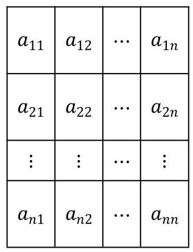

# 第3章 新定义

## 3-1 新定义

### 3-1-1

> 原PDF：[打开学生版PDF](<file:///C:/Users/lucky12345/Documents/%E9%AB%98%E4%B8%AD%E6%95%B0%E5%AD%A6%E5%A4%8D%E4%B9%A0/%E5%88%86%E7%B1%BB%E7%89%88/01_%E5%AD%A6%E7%94%9F%E7%89%88-%E8%AE%B2%E4%B9%89/3-1%E6%96%B0%E5%AE%9A%E4%B9%89%E8%AE%B2%E4%B9%89.pdf>)

(2021 北京朝阳一模)设数列 ${A}_{m} : {a}_{1},{a}_{2},\cdots ,{a}_{m}\left( {m \geq  2\text{ 且 }m \in  {\mathbf{N}}^{ * }}\right)$ ，若存在公比为 $q$ 的等比数列 ${B}_{m + 1} : {b}_{1},{b}_{2},\cdots ,{b}_{m + 1}$ ,使得 ${b}_{k} < {a}_{k} < {b}_{k + 1}$ ,其中 $k = 1,2,\cdots , m$ , 则称数列 ${B}_{m + 1}$ 为数列 ${A}_{m}$ 的 “等比分割数列”.

(1)写出数列 ${A}_{4} : \;3,6,{12},{24}$ 的一个 “等比分割数列” ${B}_{5}$ ;

* (1)请在 $m = 6,8,{10}$ ，且 $\left\{  {A}_{m}\right\}$ 为等比数列时，针对每个数列写出几个不同的等比分割;

(2)若数列 ${A}_{10}$ 的通项公式为 ${a}_{n} = {2}^{n}\left( {n = 1,2,\cdots ,{10}}\right)$ ，其 “等比分割数列” ${B}_{11}$ 的首项为 1,求数列 ${B}_{11}$ 的公比 $q$ 的取值范围;

(3)若数列 ${A}_{m}$ 的通项公式为 ${a}_{n} = {n}^{2}\left( {n = 1,2,\cdots , m}\right)$ ，且数列 ${A}_{m}$ 存在 “等比分割数列”,求 $m$ 的最大值.

### 3-1-2

> 原PDF：[打开学生版PDF](<file:///C:/Users/lucky12345/Documents/%E9%AB%98%E4%B8%AD%E6%95%B0%E5%AD%A6%E5%A4%8D%E4%B9%A0/%E5%88%86%E7%B1%BB%E7%89%88/01_%E5%AD%A6%E7%94%9F%E7%89%88-%E8%AE%B2%E4%B9%89/3-1%E6%96%B0%E5%AE%9A%E4%B9%89%E8%AE%B2%E4%B9%89.pdf>)

(2020 北京东城一模)数列A: ${x}_{1}$ ， ${x}_{2}$ ， ${x}_{3}$ ， $\ldots$ ， ${x}_{n}$ ， $\ldots$ ，对于给定的 $t$ ( $t > 1$ ， $t \in  {\mathbf{N}}_{ + }$ ),记满足不等式: ${x}_{n} - {x}_{t} \geq  {t}^{ * }\left( {n - t}\right) \left( {\forall n \in  {\mathbf{N}}_{ + }, n \neq  t}\right)$ 的 ${t}^{ * }$ 构成的集合为 $T\left( t\right)$ .

(I) 若数列 $A : {x}_{n} = {n}^{2}$ ,写出集合 $T\left( 2\right)$ ;

* (I) 请尝试自行举几个数列 $A$ 以及针对不同的 $t$ 对应的 $T\left( t\right)$ 的例子,同时请思考怎么举例子对 (II) 有帮助;

(II) 如果 $T\left( t\right) \left( {t \in  {\mathbf{N}}_{ + }, t > 1}\right)$ 均为相同的单元素集合,求证: 数列 ${x}_{1},{x}_{2},\ldots$ , ${x}_{n},\ldots$ 为等差数列;

(III) 如果 $T\left( t\right) \left( {t \in  {\mathbf{N}}_{ + }, t > 1}\right)$ 为单元素集合,那么数列 ${x}_{1},{x}_{2},\ldots ,{x}_{n},\ldots$ 还是等差数列吗? 如果是等差数列, 请给出证明; 如果不是等差数列, 请给出反例.

### 3-1-3

> 原PDF：[打开学生版PDF](<file:///C:/Users/lucky12345/Documents/%E9%AB%98%E4%B8%AD%E6%95%B0%E5%AD%A6%E5%A4%8D%E4%B9%A0/%E5%88%86%E7%B1%BB%E7%89%88/01_%E5%AD%A6%E7%94%9F%E7%89%88-%E8%AE%B2%E4%B9%89/3-1%E6%96%B0%E5%AE%9A%E4%B9%89%E8%AE%B2%E4%B9%89.pdf>)

(2020 北京西城一模) 对于正整数 $n$ ,如果 $k\left( {k \in  {\mathbf{N}}^{ * }}\right)$ 个整数 ${a}_{1},{a}_{2},\ldots ,{a}_{k}$ 满足 $1 \leq  {a}_{1} \leq  {a}_{2} \leq  \ldots  \leq  {a}_{k} \leq  n$ ,且 ${a}_{1} + {a}_{2} + \ldots  + {a}_{k} = n$ ,则称数组 $\left( {{a}_{1},{a}_{2},\ldots }\right.$ , $\left. {a}_{k}\right)$ 为 $n$ 的一个 “正整数分拆”. 记 ${a}_{1},{a}_{2},\ldots ,{a}_{k}$ 均为偶数的 “正整数分拆” 的个数为 ${f}_{n},{a}_{1},{a}_{2},\ldots ,{a}_{k}$ 均为奇数的 “正整数分拆” 的个数为 ${g}_{n}$ .

(I)写出整数 4 的所有 “正整数分拆”;

### 3-1-4

> 原PDF：[打开学生版PDF](<file:///C:/Users/lucky12345/Documents/%E9%AB%98%E4%B8%AD%E6%95%B0%E5%AD%A6%E5%A4%8D%E4%B9%A0/%E5%88%86%E7%B1%BB%E7%89%88/01_%E5%AD%A6%E7%94%9F%E7%89%88-%E8%AE%B2%E4%B9%89/3-1%E6%96%B0%E5%AE%9A%E4%B9%89%E8%AE%B2%E4%B9%89.pdf>)

(2020 北京大兴一模)已知数列 ${a}_{1},{a}_{2},\cdots ,{a}_{10}$ 满足:对任意的 $i, j \in \; \{ 1,2,3,4,5,6,7,8,9,{10}\}$ ,若 $i \neq  j$ ,则 ${a}_{i} \neq  {a}_{j}$ ,且 ${a}_{i} \in  \{ 1,2,3,4,5,6,7,8,9,{10}\}$ ,设集合 $A = \; \left\{  {{a}_{i} + {a}_{i + 1} + {a}_{i + 2} \mid  i = 1,2,3,4,5,6,7,8}\right\}$ ,集合 $A$ 中元素最小值记为 $m\left( A\right)$ ,集合 $A$ 中元素最大值记为 $n\left( A\right)$ .

(1)对于数列:10,6,1,2,7,8,3,9,5,4，写出集合 $\mathrm{A}$ 及 $\mathrm{m}\left( \mathrm{A}\right) ,\mathrm{n}\left( \mathrm{A}\right)$ ；

### 3-1-5

> 原PDF：[打开学生版PDF](<file:///C:/Users/lucky12345/Documents/%E9%AB%98%E4%B8%AD%E6%95%B0%E5%AD%A6%E5%A4%8D%E4%B9%A0/%E5%88%86%E7%B1%BB%E7%89%88/01_%E5%AD%A6%E7%94%9F%E7%89%88-%E8%AE%B2%E4%B9%89/3-1%E6%96%B0%E5%AE%9A%E4%B9%89%E8%AE%B2%E4%B9%89.pdf>)

(1)已知某层楼有 10 级台阶，阿不每次可以选择登上 1 级台阶或者 2 级台阶. 试问: 阿不共有多少种不同的登台阶方法?

(2)已知某层楼有 $n$ 级台阶，阿不每次可以选择登上 1 级台阶或者 2 级台阶. 试问: 阿不共有多少种不同的登台阶方法?

### 3-1-6

> 原PDF：[打开学生版PDF](<file:///C:/Users/lucky12345/Documents/%E9%AB%98%E4%B8%AD%E6%95%B0%E5%AD%A6%E5%A4%8D%E4%B9%A0/%E5%88%86%E7%B1%BB%E7%89%88/01_%E5%AD%A6%E7%94%9F%E7%89%88-%E8%AE%B2%E4%B9%89/3-1%E6%96%B0%E5%AE%9A%E4%B9%89%E8%AE%B2%E4%B9%89.pdf>)

(1)平面上有 100 条直线，这些曲线可以把平面分成若干个连通区域，则连通区域数量最大值为___.

(2)若平面上有 100 条二次曲线，这些曲线可以把平面分成若干个连通区域， 则连通区域数量最大值为___.

### 3-1-7

> 原PDF：[打开学生版PDF](<file:///C:/Users/lucky12345/Documents/%E9%AB%98%E4%B8%AD%E6%95%B0%E5%AD%A6%E5%A4%8D%E4%B9%A0/%E5%88%86%E7%B1%BB%E7%89%88/01_%E5%AD%A6%E7%94%9F%E7%89%88-%E8%AE%B2%E4%B9%89/3-1%E6%96%B0%E5%AE%9A%E4%B9%89%E8%AE%B2%E4%B9%89.pdf>)

(2015 北京西城二模)无穷数列 $P : {a}_{1},{a}_{2},\ldots ,{a}_{n},\ldots$ ，满足 ${a}_{i} \in  {\mathbf{N}}^{ * }$ ，且 ${a}_{i} \leq \; {a}_{i + 1}\left( {i \in  {\mathbf{N}}^{ * }}\right)$ ,对于数列 $P,{\operatorname{\text{ 记 }}}_{k}\left( P\right)  = \min \left\{  {n \mid  {a}_{n} \geq  k}\right\}  \left( {k \in  {\mathbf{N}}^{ * }}\right)$ ,其中 $\min \left\{  {n \mid  {a}_{n} \geq  k}\right\}$ 表示集合 $\left\{  {n \mid  {a}_{n} \geq  k}\right\}$ 中最小的数.

(1)若数列 $P : 1,3,4,7,\ldots$ ，写出 ${T}_{1}\left( P\right) ,{T}_{2}\left( P\right) ,\ldots ,{T}_{s}\left( P\right)$ ；

(2)若 ${T}_{k}\left( P\right)  = {2k} - 1$ ，求数列 $P$ 前 $n$ 项的和；

(3)已知 ${a}_{20} = {46}$ ，求 $s = {a}_{1} + {a}_{2} + \cdots  + {a}_{20} + {T}_{1}\left( P\right)  + {T}_{2}\left( P\right)  + \cdots  + {T}_{46}\left( P\right)$ 的值. 重点笔记

突破点 (规律):

难点 (技巧):

### 3-1-8

> 原PDF：[打开学生版PDF](<file:///C:/Users/lucky12345/Documents/%E9%AB%98%E4%B8%AD%E6%95%B0%E5%AD%A6%E5%A4%8D%E4%B9%A0/%E5%88%86%E7%B1%BB%E7%89%88/01_%E5%AD%A6%E7%94%9F%E7%89%88-%E8%AE%B2%E4%B9%89/3-1%E6%96%B0%E5%AE%9A%E4%B9%89%E8%AE%B2%E4%B9%89.pdf>)

(2024 新高考I)设 $m$ 为正整数，数列 ${a}_{1},{a}_{2},\ldots ,{a}_{{4m} + 2}$ 是公差不为 0 的等差数列,若从中删去两项 ${a}_{i}$ 和 ${a}_{j}\left( {i < j}\right)$ 后剩余的 ${4m}$ 项可被平均分为 $m$ 组,且每组的 4 个数都能构成等差数列,则称数列 ${a}_{1},{a}_{2},\ldots ,{a}_{{4m} + 2}$ 是 $\left( {i, j}\right)$ -可分数列.

(1)写出所有的 $\left( {i, j}\right) ,1 \leq  i < j \leq  6$ ,使数列 ${a}_{1},{a}_{2},\ldots ,{a}_{6}$ 是 $\left( {i, j}\right)$ -可分数列;

(2)当 $m \geq  3$ 时，证明:数列 ${a}_{1},{a}_{2},\ldots ,{a}_{{4m} + 2}$ 是(2,13)-可分数列；

(3)从 $1,2,\ldots ,{4m} + 2$ 中任取两个数 $i$ 和 $j\left( {i < j}\right)$ ，记数列 ${a}_{1},{a}_{2},\ldots ,{a}_{{4m} + 2}$ 是 $\left( {i, j}\right)  -$ 可分数列的概率为 ${P}_{m}$ ,证明: ${P}_{m} > \frac{1}{8}$ .

重点笔记

突破点 (规律):

难点 (技巧):

### 3-1-9

> 原PDF：[打开学生版PDF](<file:///C:/Users/lucky12345/Documents/%E9%AB%98%E4%B8%AD%E6%95%B0%E5%AD%A6%E5%A4%8D%E4%B9%A0/%E5%88%86%E7%B1%BB%E7%89%88/01_%E5%AD%A6%E7%94%9F%E7%89%88-%E8%AE%B2%E4%B9%89/3-1%E6%96%B0%E5%AE%9A%E4%B9%89%E8%AE%B2%E4%B9%89.pdf>)

(2024 北京昌平二模)已知 $Q : {a}_{1},{a}_{2},\cdots ,{a}_{N}$ 为有穷正整数数列， ${a}_{1} \leq  {a}_{2} \leq  \cdots  \leq \; {a}_{N}$ ,且 $s = {a}_{1} + {a}_{2} + \cdots  + {a}_{N}$ . 从 $Q$ 中选取第 ${i}_{1}$ 项,第 ${i}_{2}$ 项, $\cdots$ ,第 ${i}_{m}$ 项 $\left( {{i}_{1} < {i}_{2} < \cdots  < }\right. \; \left. {i}_{m}\right)$ ,称数列 ${a}_{{i}_{1}},{a}_{{i}_{2}},\cdots ,{a}_{{i}_{m}}$ 为 $Q$ 的长度为 $m$ 的子列. 规定: 数列 $Q$ 的任意一项都是 $Q$ 的长度为 1 的子列. 若对于任意的正整数 $t \leq  s$ ,数列 $Q$ 存在长度为 $m$ 的子列 ${a}_{{t}_{1}},{a}_{{t}_{2}},\cdots ,{a}_{{t}_{m}}$ ,使得 ${a}_{{t}_{1}} + {a}_{{t}_{2}} + \cdots  + {a}_{{t}_{m}} = t$ ,则称数列 $Q$ 为全覆盖数列.

(1)判断数列1,1,1,5和数列1,2,4,8是否为全覆盖数列；

(2)在数列 $Q$ 中，若 $s \leq  {2N} - 1$ ，求证:当 $2 \leq  n \leq  N$ 时， ${a}_{n} \leq  n \leq  1 + {a}_{1} + {a}_{2} + \; \cdots  + {a}_{n - 1}$

(3)若数列 $Q$ 满足: ${a}_{1} = 1$ ,且当 $2 \leq  n \leq  N$ 时, ${a}_{n} \leq  1 + {a}_{1} + {a}_{2} + \cdots  + {a}_{n - 1}$ , 求证: 数列 $Q$ 为全覆盖数列.

重点笔记

突破点 (规律):

难点 (技巧):

### 3-1-10

> 原PDF：[打开学生版PDF](<file:///C:/Users/lucky12345/Documents/%E9%AB%98%E4%B8%AD%E6%95%B0%E5%AD%A6%E5%A4%8D%E4%B9%A0/%E5%88%86%E7%B1%BB%E7%89%88/01_%E5%AD%A6%E7%94%9F%E7%89%88-%E8%AE%B2%E4%B9%89/3-1%E6%96%B0%E5%AE%9A%E4%B9%89%E8%AE%B2%E4%B9%89.pdf>)

(2023 北京丰台一模)已知集合 ${S}_{n} = \{ 1,2,3,\cdots ,2\mathrm{n}\} \left( {n \in  {\mathbf{N}}^{ * },\mathrm{n} \geq  4}\right)$ ，对于集合 ${S}_{n}$ 的非空子集 $A$ . 若 ${S}_{n}$ 中存在三个互不相同的元素 $a, b, c$ ,使得 $a + b, b + c, c + a$ 均属于 $A$ ，则称集合 $A$ 是集合 ${S}_{n}$ 的 “期待子集”.

(1)试判断集合 ${A}_{1} = \{ 3,4,5\} ,{A}_{2} = \{ 3,5,7\}$ 是否为集合 ${S}_{4}$ 的 “期待子集”；(直接写出答案, 不必说明理由)

(2)如果一个集合中含有三个元素 $x, y, z$ ，同时满足① $x < y < z$ ，② $x + y > z$ ， $\text{ ③ }x + y + z$ 为偶数. 那么称该集合具有性质 P. 对于集合 ${S}_{n}$ 的非空子集 $A$ ,证明: “集合 $A$ 是集合 ${S}_{n}$ 的 ‘期待子集’” 的充要条件是 “集合 $A$ 具有性质 P”;

(3)若 ${S}_{n}\left( {\mathrm{n} \geq  4}\right)$ 的任意含有 $m$ 个元素的子集都是集合 ${S}_{n}$ 的“期待子集”，求 $m$ 的最小值.

重点笔记

突破点 (规律):

难点 (技巧):

### 3-1-11

> 原PDF：[打开学生版PDF](<file:///C:/Users/lucky12345/Documents/%E9%AB%98%E4%B8%AD%E6%95%B0%E5%AD%A6%E5%A4%8D%E4%B9%A0/%E5%88%86%E7%B1%BB%E7%89%88/01_%E5%AD%A6%E7%94%9F%E7%89%88-%E8%AE%B2%E4%B9%89/3-1%E6%96%B0%E5%AE%9A%E4%B9%89%E8%AE%B2%E4%B9%89.pdf>)

证明 $\sqrt{2}$ 是无理数.

### 3-1-12

> 原PDF：[打开学生版PDF](<file:///C:/Users/lucky12345/Documents/%E9%AB%98%E4%B8%AD%E6%95%B0%E5%AD%A6%E5%A4%8D%E4%B9%A0/%E5%88%86%E7%B1%BB%E7%89%88/01_%E5%AD%A6%E7%94%9F%E7%89%88-%E8%AE%B2%E4%B9%89/3-1%E6%96%B0%E5%AE%9A%E4%B9%89%E8%AE%B2%E4%B9%89.pdf>)

求所有的整数 $k$ ,使得存在正整数 $a, b$ 满足 $\frac{b + 1}{a} + \frac{a + 1}{b} = k$ .

### 3-1-13

> 原PDF：[打开学生版PDF](<file:///C:/Users/lucky12345/Documents/%E9%AB%98%E4%B8%AD%E6%95%B0%E5%AD%A6%E5%A4%8D%E4%B9%A0/%E5%88%86%E7%B1%BB%E7%89%88/01_%E5%AD%A6%E7%94%9F%E7%89%88-%E8%AE%B2%E4%B9%89/3-1%E6%96%B0%E5%AE%9A%E4%B9%89%E8%AE%B2%E4%B9%89.pdf>)

(2024 北京西城二模)已知数列 $A : {a}_{1},{a}_{2},\cdots ,{a}_{n}$ ，从 $A$ 中选取第 ${i}_{1}$ 项、第 ${i}_{2}$ 项、 $\ldots$ 、 第 ${i}_{k}$ 项 $\left( {{i}_{1} < {i}_{2} < \cdots  < {i}_{k}}\right)$ 构成数列 $B : {a}_{{i}_{1}},{a}_{{i}_{2}},\cdots ,{a}_{{i}_{k}}, B$ 称为 $A$ 的 $k$ 项子列. 记数列 $B$ 的所有项的和为 $T\left( B\right)$ . 当 $k \geq  2$ 时,若 $B$ 满足: 对任意 $s \in  \{ 1,2,\cdots , k - 1\}$ , ${i}_{s + 1} - {i}_{s} = 1$ ,则称 $B$ 具有性质 $P$ . 规定: $A$ 的任意一项都是 $A$ 的 1 项子列,且具有性质 $P$ .

(1)当 $n = 4$ 时,比较 $A$ 的具有性质 $P$ 的子列个数与不具有性质 $P$ 的子列个数的大小, 并说明理由;

(2)已知数列 $A : 1,2,3,\cdots , n\left( {n \geq  2}\right)$ .

(i) 给定正整数 $k \leq  \frac{n}{2}$ ,对 $A$ 的 $k$ 项子列 $B$ ,求所有 $T\left( B\right)$ 的算术平均值;

(ii) 若 $A$ 有 $m$ 个不同的具有性质 $P$ 的子列 ${B}_{1},{B}_{2},\cdots ,{B}_{m}$ ,满足: $\forall 1 \leq  i < j \leq  m$ , ${B}_{i}$ 与 ${B}_{j}$ 都有公共项,且公共项构成 $A$ 的具有性质 $P$ 的子列,求 $m$ 的最大值.

重点笔记

突破点 (规律):

难点 (技巧):

### 3-1-14

> 原PDF：[打开学生版PDF](<file:///C:/Users/lucky12345/Documents/%E9%AB%98%E4%B8%AD%E6%95%B0%E5%AD%A6%E5%A4%8D%E4%B9%A0/%E5%88%86%E7%B1%BB%E7%89%88/01_%E5%AD%A6%E7%94%9F%E7%89%88-%E8%AE%B2%E4%B9%89/3-1%E6%96%B0%E5%AE%9A%E4%B9%89%E8%AE%B2%E4%B9%89.pdf>)

(2022 北京丰台二模)设 ${I}_{1} = \left\lbrack  {{a}_{1},{b}_{1}}\right\rbrack  ,{I}_{2} = \left\lbrack  {{a}_{2},{b}_{2}}\right\rbrack  ,\ldots ,{I}_{n} = \left\lbrack  {{a}_{n},{b}_{n}}\right\rbrack  ,{I}_{n + 1} = \; \left\lbrack  {{a}_{n + 1},{b}_{n + 1}}\right\rbrack$ ,是 $n + 1\left( {n \in  {\mathbf{N}}^{ * }}\right)$ 个互不相同的闭区间,若存在实数 ${x}_{0}$ 使得 ${x}_{0} \in \; {I}_{i}\left( {i = 1,2,\ldots , n + 1}\right)$ ,则称这 $n + 1$ 个闭区间为聚合区间, ${x}_{0}$ 为该聚合区间的聚合点.

(1)已知 ${I}_{1} = \left\lbrack  {1,3}\right\rbrack  ,{I}_{2} = \left\lbrack  {-2,\sin t}\right\rbrack  \left( {0 < t < \pi }\right)$ 为聚合区间,求 $t$ 的值;

(2)已知 ${I}_{1} = \left\lbrack  {{a}_{1},{b}_{1}}\right\rbrack  ,{I}_{2} = \left\lbrack  {{a}_{2},{b}_{2}}\right\rbrack  ,\ldots ,{I}_{n} = \left\lbrack  {{a}_{n},{b}_{n}}\right\rbrack  ,{I}_{n + 1} = \left\lbrack  {{a}_{n + 1},{b}_{n + 1}}\right\rbrack$ 为聚合区间.

(i) 设 ${x}_{0},{y}_{0}$ 是该聚合区间的两个不同的聚合点. 求证: 存在 $k, j \in  \{ 1,2,\ldots , n + 1\}$ , 使得 $\left\lbrack  {{a}_{k},{b}_{j}}\right\rbrack   \subseteq  {I}_{i}\left( {i = 1,2,\ldots , n + 1}\right)$ ;

(ii) 若对任意 $p, q\left( {p \neq  q\text{ 且 }p, q \in  \{ 1,2,\ldots , n + 1\} }\right)$ ,都有 ${I}_{p},{I}_{q}$ 互不包含. 求证: 存在不同的 $i, j \in  \{ 1,2,\cdots , n + 1\}$ ,使得 ${b}_{i} - {a}_{j} \geq  \frac{n - 1}{n}\left( {{b}_{i} - {a}_{i}}\right)$ .

### 3-1-15

> 原PDF：[打开学生版PDF](<file:///C:/Users/lucky12345/Documents/%E9%AB%98%E4%B8%AD%E6%95%B0%E5%AD%A6%E5%A4%8D%E4%B9%A0/%E5%88%86%E7%B1%BB%E7%89%88/01_%E5%AD%A6%E7%94%9F%E7%89%88-%E8%AE%B2%E4%B9%89/3-1%E6%96%B0%E5%AE%9A%E4%B9%89%E8%AE%B2%E4%B9%89.pdf>)

(2024 北京朝阳一模)若有穷自然数数列 $A$ : ${a}_{1},{a}_{2},\cdots ,{a}_{n}\left( {n \geq  2}\right)$ 满足如下两个性质,则称 $A$ 为 ${B}_{n}$ 数列:

① ${a}_{k} \geq  \max \left\{  {{a}_{1} + {a}_{k - 1},{a}_{2} + {a}_{k - 2},\cdots ,{a}_{k - 1} + {a}_{1}}\right\}  \left( {k = 2,3,\cdots , n}\right)$ ，其中， $\max \left\{  {{x}_{1},{x}_{2},\cdots ,{x}_{s}}\right\}$ 表示 ${x}_{1},{x}_{2},\cdots ,{x}_{s}$ 这 $s$ 个数中最大的数;

② ${a}_{k} \leq  \min \left\{  {{a}_{1} + {a}_{k - 1},{a}_{2} + {a}_{k - 2},\cdots ,{a}_{k - 1} + {a}_{1}}\right\}   + 1\left( {k = 2,3,\cdots , n}\right)$ ，其中， $\min \left\{  {{x}_{1},{x}_{2},\cdots ,{x}_{s}}\right\}$ 表示 ${x}_{1},{x}_{2},\cdots ,{x}_{s}$ 这 $s$ 个数中最小的数.

(1)判断 $A : 2,4,6,7,{10}$ 是否为 ${B}_{5}$ 数列,说明理由;

(2)若 $A : {a}_{1},{a}_{2},\cdots ,{a}_{6}$ 是 ${B}_{6}$ 数列，且 ${a}_{1},{a}_{2},{a}_{3}$ 成等比数列，求 ${a}_{6}$ ；

(3)证明:对任意 ${B}_{n}$ 数列 $A : {a}_{1},{a}_{2},\cdots ,{a}_{n}\left( {n \geq  2}\right)$ ，存在实数 $\lambda$ ，使得 ${a}_{k} = \left\lbrack  {k\lambda }\right\rbrack  (k = \; 1,2,\cdots , n).\left( {\left\lbrack  x\right\rbrack  \text{ 表示不超过 }x\text{ 的最大整数 }}\right)$

重点笔记

突破点 (规律):

难点 (技巧):

### 3-1-16

> 原PDF：[打开学生版PDF](<file:///C:/Users/lucky12345/Documents/%E9%AB%98%E4%B8%AD%E6%95%B0%E5%AD%A6%E5%A4%8D%E4%B9%A0/%E5%88%86%E7%B1%BB%E7%89%88/01_%E5%AD%A6%E7%94%9F%E7%89%88-%E8%AE%B2%E4%B9%89/3-1%E6%96%B0%E5%AE%9A%E4%B9%89%E8%AE%B2%E4%B9%89.pdf>)

一个小组有 7 名学生，每天选三名学生做值日，并要求任意两个学生只能共同值日一次, 那么最多能安排几天的值日?

### 3-1-17

> 原PDF：[打开学生版PDF](<file:///C:/Users/lucky12345/Documents/%E9%AB%98%E4%B8%AD%E6%95%B0%E5%AD%A6%E5%A4%8D%E4%B9%A0/%E5%88%86%E7%B1%BB%E7%89%88/01_%E5%AD%A6%E7%94%9F%E7%89%88-%E8%AE%B2%E4%B9%89/3-1%E6%96%B0%E5%AE%9A%E4%B9%89%E8%AE%B2%E4%B9%89.pdf>)

(1)在 $1,2,3,\cdots ,{99},{100}$ 中，任意取出 51 个数，试证明:在这 51 个数中，一定有两个数, 其中一个是另一个的倍数;

(2)从 1 到 100 这 100 个自然数中任意取 51 个不同的数，求证:必存在两个数互质.

### 3-1-18

> 原PDF：[打开学生版PDF](<file:///C:/Users/lucky12345/Documents/%E9%AB%98%E4%B8%AD%E6%95%B0%E5%AD%A6%E5%A4%8D%E4%B9%A0/%E5%88%86%E7%B1%BB%E7%89%88/01_%E5%AD%A6%E7%94%9F%E7%89%88-%E8%AE%B2%E4%B9%89/3-1%E6%96%B0%E5%AE%9A%E4%B9%89%E8%AE%B2%E4%B9%89.pdf>)

在边长为 1 的正方形中放 10 个点,求证: 必有两点的距离不超过 $\frac{\sqrt{2}}{3}$ .

### 3-1-19

> 原PDF：[打开学生版PDF](<file:///C:/Users/lucky12345/Documents/%E9%AB%98%E4%B8%AD%E6%95%B0%E5%AD%A6%E5%A4%8D%E4%B9%A0/%E5%88%86%E7%B1%BB%E7%89%88/01_%E5%AD%A6%E7%94%9F%E7%89%88-%E8%AE%B2%E4%B9%89/3-1%E6%96%B0%E5%AE%9A%E4%B9%89%E8%AE%B2%E4%B9%89.pdf>)

(2023 北京门头沟一模) 已知集合 $M = \{  \pm  1, \pm  2, \pm  3,\cdots , \pm  n\} \left( {n \geq  3}\right)$ . 若对于集合 $M$ 的任意 $k$ 元子集 $A$ ， $A$ 中必有 4 个元素的和为 -1，则称这样的正整数 $k$ 为 “好数”,所有 “好数” 的最小值记作 $g\left( M\right)$ .

(1)当 $n = 3$ ，即集合 $M = \{  - 3, - 2, - 1,1,2,3\}$ .

(i) 写出 $M$ 的一个子集 $B$ ,且 $B$ 中存在 4 个元素的和为 -1 ;

(ii) 写出 $M$ 的一个 5 元子集 $C$ ,使得 $B$ 中任意 4 个元素的和大于 -1 ;

(2)证明: $g\left( M\right)  > n + 2$ ;

(3)证明: $g\left( M\right)  = n + 3$ .

重点笔记

突破点 (规律):

难点 (技巧):

### 3-1-20

> 原PDF：[打开学生版PDF](<file:///C:/Users/lucky12345/Documents/%E9%AB%98%E4%B8%AD%E6%95%B0%E5%AD%A6%E5%A4%8D%E4%B9%A0/%E5%88%86%E7%B1%BB%E7%89%88/01_%E5%AD%A6%E7%94%9F%E7%89%88-%E8%AE%B2%E4%B9%89/3-1%E6%96%B0%E5%AE%9A%E4%B9%89%E8%AE%B2%E4%B9%89.pdf>)

(2021 北京通州一模) 已知有限数列 $A : {a}_{1},{a}_{2},\cdots ,{a}_{m}$ 为单调递增数列. 若存在等差数列 $B : {b}_{1},{b}_{2},\cdots ,{b}_{m + 1}$ ,对于 $A$ 中任意一项 ${a}_{i}$ ,都有 ${b}_{i} \leq  {a}_{i} < {b}_{i + 1}$ ,则称数列 $A$ 是长为 $m$ 的 $\Omega$ 数列.

(1)判断下列数列是否为 $\Omega$ 数列(直接写出结果):

①数列1,4,5,8；

②数列2,4,8,16.

(2)若 $a < b < c\left( {a, b, c \in  \mathbf{R}}\right)$ ，证明:数列 $a, b, c$ 为 $\Omega$ 数列；

(3)设 $M$ 是集合 $\{ x \in  \mathbf{N} \mid  0 \leq  x \leq  {63}\}$ 的子集，且至少有 28 个元素，证明: $M$ 中的元素可以构成一个长为 4 的Ω数列.

重点笔记

突破点 (规律):

难点 (技巧):

### 3-1-21

> 原PDF：[打开学生版PDF](<file:///C:/Users/lucky12345/Documents/%E9%AB%98%E4%B8%AD%E6%95%B0%E5%AD%A6%E5%A4%8D%E4%B9%A0/%E5%88%86%E7%B1%BB%E7%89%88/01_%E5%AD%A6%E7%94%9F%E7%89%88-%E8%AE%B2%E4%B9%89/3-1%E6%96%B0%E5%AE%9A%E4%B9%89%E8%AE%B2%E4%B9%89.pdf>)

只由 1,2,3 组成的不大于 1 万的正整数中,能够被 3 整除的有多少个.

### 3-1-22

> 原PDF：[打开学生版PDF](<file:///C:/Users/lucky12345/Documents/%E9%AB%98%E4%B8%AD%E6%95%B0%E5%AD%A6%E5%A4%8D%E4%B9%A0/%E5%88%86%E7%B1%BB%E7%89%88/01_%E5%AD%A6%E7%94%9F%E7%89%88-%E8%AE%B2%E4%B9%89/3-1%E6%96%B0%E5%AE%9A%E4%B9%89%E8%AE%B2%E4%B9%89.pdf>)

设 $S = \{ 1,2,\cdots ,{2020}\}$ . 如果 $S$ 的一个 31 元子集中的所有数之和是 5 的倍数,则称其为好子集. 求 $S$ 所有好子集的个数.

### 3-1-23

> 原PDF：[打开学生版PDF](<file:///C:/Users/lucky12345/Documents/%E9%AB%98%E4%B8%AD%E6%95%B0%E5%AD%A6%E5%A4%8D%E4%B9%A0/%E5%88%86%E7%B1%BB%E7%89%88/01_%E5%AD%A6%E7%94%9F%E7%89%88-%E8%AE%B2%E4%B9%89/3-1%E6%96%B0%E5%AE%9A%E4%B9%89%E8%AE%B2%E4%B9%89.pdf>)

设 $n$ 为正奇数,记 ${S}_{n} = \{ 1,2,\cdots ,{2n}\}$ . 定义 ${S}_{n}$ 的两个子集:

$$
{A}_{n} = \left\{  {A \subset  {S}_{n}\left| \right| A \mid   = n, A\text{ 中各元素之和为奇数 }}\right\}  ,
$$

$$
{B}_{n} = \left\{  {B \subset  {S}_{n}\left| \right| B \mid   = n, B\text{ 中各元素之和为偶数 }}\right\}  .
$$

求 $\left| {A}_{n}\right|  - \left| {B}_{n}\right|$ .

### 3-1-24

> 原PDF：[打开学生版PDF](<file:///C:/Users/lucky12345/Documents/%E9%AB%98%E4%B8%AD%E6%95%B0%E5%AD%A6%E5%A4%8D%E4%B9%A0/%E5%88%86%E7%B1%BB%E7%89%88/01_%E5%AD%A6%E7%94%9F%E7%89%88-%E8%AE%B2%E4%B9%89/3-1%E6%96%B0%E5%AE%9A%E4%B9%89%E8%AE%B2%E4%B9%89.pdf>)

(2023 北京延庆一模) 已知 $n$ 为正整数,集合 $A = \left\{  {\alpha  \mid  \alpha  = \left( {{x}_{1},{x}_{2},\cdots ,{x}_{2n}}\right) ,{x}_{i} \in  }\right. \; \{  - 1,1\} , i = 1,2,\cdots ,{2n}\}$ 具有性质 $P$ : “对于集合 $A$ 中的任意元素 $\alpha  = \left( {{x}_{1},{x}_{2},\cdots ,{x}_{2n}}\right)$ , ${x}_{1} + {x}_{2} + \cdots  + {x}_{2n} = 0$ ,且 ${x}_{1} + {x}_{2} + \cdots  + {x}_{i} \geq  0$ ,其中 $i = 1,2,\cdots ,{2n} - 1$ ”. 集合 $A$ 中的元素个数记为 $\left| {P\left( A\right) }\right|$ .

(1)当 $n = 2$ 时，求 $\left| {P\left( A\right) }\right|$ ；

(2)当 $n = 9$ 时,求 ${x}_{1} + {x}_{2} + \cdots  + {x}_{9}$ 的所有可能的取值;

(3)给定正整数 $n$ ，求 $\left| {P\left( A\right) }\right|$ .

重点笔记

突破点 (规律):

难点 (技巧):

### 3-1-25

> 原PDF：[打开学生版PDF](<file:///C:/Users/lucky12345/Documents/%E9%AB%98%E4%B8%AD%E6%95%B0%E5%AD%A6%E5%A4%8D%E4%B9%A0/%E5%88%86%E7%B1%BB%E7%89%88/01_%E5%AD%A6%E7%94%9F%E7%89%88-%E8%AE%B2%E4%B9%89/3-1%E6%96%B0%E5%AE%9A%E4%B9%89%E8%AE%B2%E4%B9%89.pdf>)

(2022 北京东城期末)已知数列 $A : {a}_{1}$ ， ${a}_{2}$ ， $\ldots$ ， ${a}_{n}$ 满足: ${a}_{i} \in  \{ 0,1\}$ ( $i = 1$ ， $2,\ldots , n, n \geq  2$ ),从 $A$ 中选取第 ${i}_{1}$ 项、第 ${i}_{2}$ 项、 $\ldots$ 、第 ${i}_{m}$ 项 $\left( {{i}_{1} < {i}_{2} < \cdots  < {i}_{m}}\right.$ , $m \geq  2$ ) 称数列 ${a}_{{i}_{1}},{a}_{{i}_{2}},\ldots ,{a}_{{i}_{m}}$ 为 $A$ 的长度为 $m$ 的子列.记 $T\left( A\right)$ 为 $A$ 所有子列的个数. 例如 $A : 0,0,1$ ,其 $T\left( A\right)  = 3$ .

(1)设数列 $A : 1,1,0,0$ ，写出 $A$ 的长度为 3 的全部子列，并求 $T\left( A\right)$ ；

(2)设数列 $A : {a}_{1},{a}_{2},\ldots ,{a}_{n},{A}^{\prime } : {a}_{n},{a}_{n - 1},\ldots ,{a}_{1},{A}^{\prime \prime } : 1 - {a}_{1},1 - {a}_{2},\ldots$ ， $1 - {a}_{n}$ ,判断 $T\left( A\right) , T\left( {A}^{\prime }\right) , T\left( {A}^{\prime \prime }\right)$ 的大小,并说明理由;

(3)对于给定的正整数 $n, k\left( {1 \leq  k \leq  n - 1}\right)$ ，若数列 $A : {a}_{1},{a}_{2},\ldots ,{a}_{n}$ 满足: ${a}_{1} + {a}_{2} + \cdots  + {a}_{n} = k$ ,求 $T\left( A\right)$ 的最小值.

重点笔记

突破点 (规律):

难点 (技巧):

### 3-1-26

> 原PDF：[打开学生版PDF](<file:///C:/Users/lucky12345/Documents/%E9%AB%98%E4%B8%AD%E6%95%B0%E5%AD%A6%E5%A4%8D%E4%B9%A0/%E5%88%86%E7%B1%BB%E7%89%88/01_%E5%AD%A6%E7%94%9F%E7%89%88-%E8%AE%B2%E4%B9%89/3-1%E6%96%B0%E5%AE%9A%E4%B9%89%E8%AE%B2%E4%B9%89.pdf>)

已知 ${x}_{1},{x}_{2},\cdots ,{x}_{n}$ 为正实数,且 ${x}_{1} + {x}_{2} + \cdots  + {x}_{n} = 1$ ,求 ${x}_{1}{x}_{2}\cdots {x}_{n}$ 的最大值.

### 3-1-27

> 原PDF：[打开学生版PDF](<file:///C:/Users/lucky12345/Documents/%E9%AB%98%E4%B8%AD%E6%95%B0%E5%AD%A6%E5%A4%8D%E4%B9%A0/%E5%88%86%E7%B1%BB%E7%89%88/01_%E5%AD%A6%E7%94%9F%E7%89%88-%E8%AE%B2%E4%B9%89/3-1%E6%96%B0%E5%AE%9A%E4%B9%89%E8%AE%B2%E4%B9%89.pdf>)

(第九届 CMO) $n\left( {n \geq  4}\right)$ 个盘子里放有总数不少于 4 块的糖,从任意选出的两个盘子里各取一块糖放入另一个盘子中称为一次操作，问能否经过有限次操作， 把所有的糖块集中到一个盘子里去? 并证明你的结论.

### 3-1-28

> 原PDF：[打开学生版PDF](<file:///C:/Users/lucky12345/Documents/%E9%AB%98%E4%B8%AD%E6%95%B0%E5%AD%A6%E5%A4%8D%E4%B9%A0/%E5%88%86%E7%B1%BB%E7%89%88/01_%E5%AD%A6%E7%94%9F%E7%89%88-%E8%AE%B2%E4%B9%89/3-1%E6%96%B0%E5%AE%9A%E4%B9%89%E8%AE%B2%E4%B9%89.pdf>)

$k$ 个开关顺次排成一行，分别指向上下左右四个方向. 若其中出现三个连续的开关, 它们的方向各不相同, 则将他们同时调整为第四个方向. 证明: 这个操作不能无限次进行下去.

思考:单调量一般要怎么构造？

### 3-1-29

> 原PDF：[打开学生版PDF](<file:///C:/Users/lucky12345/Documents/%E9%AB%98%E4%B8%AD%E6%95%B0%E5%AD%A6%E5%A4%8D%E4%B9%A0/%E5%88%86%E7%B1%BB%E7%89%88/01_%E5%AD%A6%E7%94%9F%E7%89%88-%E8%AE%B2%E4%B9%89/3-1%E6%96%B0%E5%AE%9A%E4%B9%89%E8%AE%B2%E4%B9%89.pdf>)

(2020 北京海淀练习) 给定一个 $n$ 项的实数列 ${a}_{1},{a}_{2},\ldots ,{a}_{n}\left( {n \in  {\mathbf{N}}^{ * }}\right)$ ,任意选取一个实数 $c$ ,变换 $T\left( c\right)$ 将数列 ${a}_{1},{a}_{2},\ldots ,{a}_{n}$ 变换为数列 $\left| {{a}_{1} - c}\right| ,\left| {{a}_{2} - c}\right| ,\ldots$ , $\left| {{a}_{n} - c}\right|$ ,再将得到的数列继续实施这样的变换,这样的变换可以连续进行多次, 并且每次所选择的实数 $c$ 可以不相同,第 $k\left( {k \in  {\mathbf{N}}^{ * }}\right)$ 次变换记为 ${T}_{k}\left( {c}_{k}\right)$ ,其中 ${c}_{k}$ 为第 $k$ 次变换时选择的实数. 如果通过 $k$ 次变换后,数列中的各项均为 0,则称 ${T}_{1}\left( {c}_{1}\right) ,{T}_{2}\left( {c}_{2}\right) ,\ldots ,{T}_{k}\left( {c}_{k}\right)$ 为 “ $k$ 次归零变换”.

(1)对数列:1，3，5，7，给出一个“ $k$ 次归零变换”，其中 $k \leq  4\left( {k \in  {\mathbf{N}}^{ * }}\right)$ ；

(2)证明:对任意 $n\left( {n \in  {\mathbf{N}}^{ * }}\right)$ 项数列，都存在 “ $n$ 次归零变换”；

(3)对于数列 $1,{2}^{2},{3}^{3},\ldots ,{n}^{n}$ ，是否存在 “ $n - 1$ 次归零变换”? 请说明理由.

重点笔记

突破点 (规律):

难点 (技巧):

### 3-1-30

> 原PDF：[打开学生版PDF](<file:///C:/Users/lucky12345/Documents/%E9%AB%98%E4%B8%AD%E6%95%B0%E5%AD%A6%E5%A4%8D%E4%B9%A0/%E5%88%86%E7%B1%BB%E7%89%88/01_%E5%AD%A6%E7%94%9F%E7%89%88-%E8%AE%B2%E4%B9%89/3-1%E6%96%B0%E5%AE%9A%E4%B9%89%E8%AE%B2%E4%B9%89.pdf>)

(2024 辽宁大连一模)对于数列 $A : {a}_{1},{a}_{2},{a}_{3}\left( {{a}_{1} \in  \mathrm{N}, i = 1,2,3}\right)$ ，定义 “ $T$ 变换”: $T$ 将数列 $A$ 变换成数列 $B : {b}_{1},{b}_{2},{b}_{3}$ ,其中 ${b}_{i} = \left| {{a}_{i + 1} - {a}_{i}}\right| \left( {i = 1,2}\right)$ ,且 ${b}_{3} =  \mid  {a}_{3} - \; {a}_{1} \mid$ . 这种“ $T$ 变换”记作 $B = T\left( A\right)$ ,继续对数列 $B$ 进行“ $T$ 变换”,得到数列 $C : {c}_{1},{c}_{2},{c}_{3}$ , 依此类推, 当得到的数列各项均为 0 时变换结束.

(1)写出数列 $A : \;3,\;6,\;5$ 经过 5 次 “ $T$ 变换” 后得到的数列；

(2)若 ${a}_{1},{a}_{2},{a}_{3}$ 不全相等，判断数列 $A : {a}_{1},{a}_{2},{a}_{3}$ 不断的 “ $T$ 变换” 是否会结束， 并说明理由;

(3)设数列 $A$ :2020，2，2024 经过 $k$ 次“ $T$ 变换”得到的数列各项之和最小， 求 $k$ 的最小值.

重点笔记

突破点 (规律):

难点 (技巧):

### 3-1-31

> 原PDF：[打开学生版PDF](<file:///C:/Users/lucky12345/Documents/%E9%AB%98%E4%B8%AD%E6%95%B0%E5%AD%A6%E5%A4%8D%E4%B9%A0/%E5%88%86%E7%B1%BB%E7%89%88/01_%E5%AD%A6%E7%94%9F%E7%89%88-%E8%AE%B2%E4%B9%89/3-1%E6%96%B0%E5%AE%9A%E4%B9%89%E8%AE%B2%E4%B9%89.pdf>)

(2019 北京朝阳期中)已知无穷数列 $\left\{  {a}_{n}\right\}$ ， $\left\{  {b}_{n}\right\}$ ， $\left\{  {c}_{n}\right\}$ 满足: $\forall n \in  {\mathbf{N}}^{ * }$ ， ${a}_{n + 1} = \left| {b}_{n}\right|  - \; \left| {c}_{n}\right| ,{b}_{n + 1} = \left| {c}_{n}\right|  - \left| {a}_{n}\right| ,{c}_{n + 1} = \left| {a}_{n}\right|  - \left| {b}_{n}\right|$ . 记

${d}_{n} = \max \left\{  {\left| {a}_{n}\right| ,\left| {b}_{n}\right| ,\left| {c}_{n}\right| }\right\}$ (max $\{ x, y, z\}$ 表示 3 个实数 $x, y, z$ 中的最大值).

(I) 若 ${a}_{1} = 1,{b}_{2} = 2,{c}_{3} = 3$ ,求 ${b}_{1},{c}_{1}$ 的可能值;

(II) 若 ${a}_{1} = 1,{b}_{1} = 2$ ,求满足 ${d}_{2} = {d}_{3}$ 的 ${c}_{1}$ 的所有值;

(III) 设 ${a}_{1},{b}_{1},{c}_{1}$ 是非零整数,且 $\left| {a}_{1}\right| ,\left| {b}_{1}\right| ,\left| {c}_{1}\right|$ 互不相等,证明: 存在正整数 $k$ , 使得数列 $\left\{  {a}_{n}\right\}  ,\left\{  {b}_{n}\right\}  ,\left\{  {c}_{n}\right\}$ 中有且只有一个数列自第 $k$ 项起各项均为 0 .

重点笔记

突破点 (规律):

难点 (技巧):

### 3-1-32

> 原PDF：[打开学生版PDF](<file:///C:/Users/lucky12345/Documents/%E9%AB%98%E4%B8%AD%E6%95%B0%E5%AD%A6%E5%A4%8D%E4%B9%A0/%E5%88%86%E7%B1%BB%E7%89%88/01_%E5%AD%A6%E7%94%9F%E7%89%88-%E8%AE%B2%E4%B9%89/3-1%E6%96%B0%E5%AE%9A%E4%B9%89%E8%AE%B2%E4%B9%89.pdf>)

(2021 北京怀柔一模)定义满足以下两个性质的有穷数列 ${a}_{1},{a}_{2},{a}_{3},\cdots ,{a}_{n}$ 为 $n\left( {n = 3,4,\cdots }\right)$ 阶“期待数列”: $\oplus  {a}_{1} + {a}_{2} + {a}_{3} + \cdots  + {a}_{n} = 0$ ; ② $\left| {a}_{1}\right|  + \left| {a}_{2}\right|  + \left| {a}_{3}\right|  + \; \cdots  + \left| {a}_{n}\right|  = 1$ .

(1)若等比数列 $\left\{  {a}_{n}\right\}$ 为 4 阶 “期待数列”，求 $\left\{  {a}_{n}\right\}$ 的公比；

(2)若等差数列 $\left\{  {a}_{n}\right\}$ 是 ${2k} + 1$ 阶“期待数列” $(n = 1,2,3,\cdots ,{2k} + 1, k$ 是正整数), 求 $\left\{  {a}_{n}\right\}$ 的通项公式;

(3)记 ${2k}$ 阶 “期待数列” $\left\{  {a}_{n}\right\}$ 的前 $n$ 项和为 ${S}_{n}(n = 1,2,3,\cdots ,{2k}.k$ 是不小于 2 的整数),求证: $\left| {S}_{k}\right|  \leq  \frac{1}{2}$ .

重点笔记

突破点 (规律):

难点 (技巧):

### 3-1-33

> 原PDF：[打开学生版PDF](<file:///C:/Users/lucky12345/Documents/%E9%AB%98%E4%B8%AD%E6%95%B0%E5%AD%A6%E5%A4%8D%E4%B9%A0/%E5%88%86%E7%B1%BB%E7%89%88/01_%E5%AD%A6%E7%94%9F%E7%89%88-%E8%AE%B2%E4%B9%89/3-1%E6%96%B0%E5%AE%9A%E4%B9%89%E8%AE%B2%E4%B9%89.pdf>)

(2021 北京东城二模) 设数列 $A : {x}_{1},{x}_{2},\cdots ,{x}_{n}\left( {n \geq  3}\right)$ . 定义集合 $S\left( {A, k}\right)  = \{ s \mid  s = \; \frac{{x}_{{i}_{1}} + {x}_{{i}_{2}} + \cdots  + {x}_{{i}_{k}}}{k},1 \leq  {i}_{1} < {i}_{2} < \cdots  < {i}_{k} \leq  n$ ,其中 $k\left( {2 \leq  k \leq  n}\right)$ 为给的正整数.

(1)若 $A : {0,2,4}$ ，求 $S\left( {A,2}\right)$ ；

(2)若 $A$ 中的项 ${x}_{i} \in  S\left( {A, n - 1}\right) \left( {i = 1,2,\cdots , n}\right)$ ，求证: $A$ 为常数列；

(3)记集合 $S\left( {A, k}\right)$ 的最大元素为 ${s}_{k}$ ，求证: ${s}_{k + 1} \leq  {s}_{k}\left( {2 \leq  k \leq  n - 1}\right)$ .

重点笔记

突破点 (规律):

难点 (技巧):

### 3-1-34

> 原PDF：[打开学生版PDF](<file:///C:/Users/lucky12345/Documents/%E9%AB%98%E4%B8%AD%E6%95%B0%E5%AD%A6%E5%A4%8D%E4%B9%A0/%E5%88%86%E7%B1%BB%E7%89%88/01_%E5%AD%A6%E7%94%9F%E7%89%88-%E8%AE%B2%E4%B9%89/3-1%E6%96%B0%E5%AE%9A%E4%B9%89%E8%AE%B2%E4%B9%89.pdf>)

(2024 北京海淀一模)已知: $Q : {a}_{1},{a}_{2},\cdots ,{a}_{{m}^{2}}\left( {m \geq  2, m \in  {\mathbf{N}}^{ * }}\right)$ 为有穷正整数数列,其最大项的值为 $m$ ,且当 $k = 0,1,\cdots , m - 1$ 时,均有 ${a}_{{km} + i} \neq  {a}_{{km} + j}(1 \leq  i < j \leq \; m)$ . 设 ${b}_{0} = 0$ ,对于 $t \in  \{ 0,1,\cdots , m - 1\}$ ,定义 ${b}_{t + 1} = \min \left\{  {n \mid  n > {b}_{t},{a}_{n} > t}\right\}$ ,其中, $\min M$ 表示数集 $M$ 中最小的数.

(1)若 $Q : {3,1,2,2,1,3,1,2,3}$ ，写出 ${b}_{1},{b}_{3}$ 的值；

(2)若存在 $Q$ 满足: ${b}_{1} + {b}_{2} + {b}_{3} = {11}$ ，求 $m$ 的最小值；

(3)当 $m = {2024}$ 时，证明:对所有 $Q,{b}_{2023} \leq  {20240}$ .

重点笔记

突破点 (规律):

难点 (技巧):

### 3-1-35

> 原PDF：[打开学生版PDF](<file:///C:/Users/lucky12345/Documents/%E9%AB%98%E4%B8%AD%E6%95%B0%E5%AD%A6%E5%A4%8D%E4%B9%A0/%E5%88%86%E7%B1%BB%E7%89%88/01_%E5%AD%A6%E7%94%9F%E7%89%88-%E8%AE%B2%E4%B9%89/3-1%E6%96%B0%E5%AE%9A%E4%B9%89%E8%AE%B2%E4%B9%89.pdf>)

(2022 北京高考) 已知 $Q : {a}_{1},{a}_{2},\cdots ,{a}_{k}$ 为有穷整数数列. 给定正整数 $m$ ,若对任意的 $n \in  \{ 1,2,\cdots , m\}$ ,在 $Q$ 中存在 ${a}_{i},{a}_{i + 1},{a}_{i + 2},\cdots ,{a}_{i + j}\left( {j \geq  0}\right)$ ,使得 ${a}_{i} + {a}_{i + 1} + \; {a}_{i + 2} + \cdots  + {a}_{i + j} = n$ ,则称 $Q$ 为 $m$ -连续可表数列.

(1)判断 $Q : 2,1,4$ 是否为 5 -连续可表数列? 是否为 6-连续可表数列? 说明理由;

(2)若 $Q : {a}_{1},{a}_{2},\cdots ,{a}_{k}$ 为 8-连续可表数列，求证: $k$ 的最小值为 4；

(3)若Q: ${a}_{1},{a}_{2},\cdots ,{a}_{k}$ 为 20-连续可表数列，且 ${a}_{1} + {a}_{2} + \cdots  + {a}_{k} < {20}$ ，求证: $k \geq  7$ .

重点笔记

突破点 (规律):

难点 (技巧):

### 3-1-36

> 原PDF：[打开学生版PDF](<file:///C:/Users/lucky12345/Documents/%E9%AB%98%E4%B8%AD%E6%95%B0%E5%AD%A6%E5%A4%8D%E4%B9%A0/%E5%88%86%E7%B1%BB%E7%89%88/01_%E5%AD%A6%E7%94%9F%E7%89%88-%E8%AE%B2%E4%B9%89/3-1%E6%96%B0%E5%AE%9A%E4%B9%89%E8%AE%B2%E4%B9%89.pdf>)

(2020 北京海淀二模)在平面直角坐标系中， $O$ 为坐标原点. 对任意的点 $P\left( {x, y}\right)$ ， 定义 $\parallel {OP}\parallel  = \left| x\right|  + \left| y\right|$ . 任取点 $A\left( {{x}_{1},{y}_{1}}\right) , B\left( {{x}_{2},{y}_{2}}\right)$ ,记 ${A}^{\prime }\left( {{x}_{1},{y}_{2}}\right) ,{B}^{\prime }\left( {{x}_{2},{y}_{1}}\right)$ , 若此时 $\parallel {OA}{\parallel }^{2} + \parallel {OB}{\parallel }^{2} \geq  {\begin{Vmatrix}O{A}^{\prime }\end{Vmatrix}}^{2} + {\begin{Vmatrix}O{B}^{\prime }\end{Vmatrix}}^{2}$ 成立,则称点 $A, B$ 相关.

(1)分别判断下面各组中两点是否相关，并说明理由;

① $A\left( {-2,1}\right)$ ， $B\left( {3,2}\right)$ ；② $C\left( {4, - 3}\right)$ ， $D\left( {2,4}\right)$ .

(2)给定 $n \in  {\mathbf{N}}^{ * }, n \geq  3$ ,点集 ${\Omega }_{n} = \{ \left( {x, y}\right)  \mid   - n \leq  x \leq  n, - n \leq  y \leq  n, x, y \in  Z\}$ .

(i) 求集合 ${\Omega }_{n}$ 中与点 $A\left( {1,1}\right)$ 相关的点的个数;

(ii) 若 $S \subseteq  {\Omega }_{n}$ ,且对于任意的 $A, B \in  S$ ,点 $A, B$ 相关,求 $S$ 中元素个数的最大值.

重点笔记

突破点 (规律):

难点 (技巧):

### 3-1-37

> 原PDF：[打开学生版PDF](<file:///C:/Users/lucky12345/Documents/%E9%AB%98%E4%B8%AD%E6%95%B0%E5%AD%A6%E5%A4%8D%E4%B9%A0/%E5%88%86%E7%B1%BB%E7%89%88/01_%E5%AD%A6%E7%94%9F%E7%89%88-%E8%AE%B2%E4%B9%89/3-1%E6%96%B0%E5%AE%9A%E4%B9%89%E8%AE%B2%E4%B9%89.pdf>)

(2017 北京石景山一模) 已知集合 ${R}_{n} = \left\{  {X \mid  X = \left( {{x}_{1},{x}_{2},\cdots ,{x}_{n}}\right) ,{x}_{i} \in  \{ 0,1\} , i = }\right. \; 1,2,\cdots , n\} \left( {n \geq  2}\right)$ . 对于 $A = \left( {{a}_{1},{a}_{2},\cdots ,{a}_{n}}\right)  \in  {R}_{n}, B = \left( {{b}_{1},{b}_{2},\cdots ,{b}_{n}}\right)  \in  {R}_{n}$ ,定义 $A$ 与 $B$ 之间的距离为 $d\left( {A, B}\right)  = \left| {{a}_{1} - {b}_{1}}\right|  + \left| {{a}_{2} - {b}_{2}}\right|  + \cdots  + \left| {{a}_{n} - {b}_{n}}\right|  = \mathop{\sum }\limits_{{i = 1}}^{n} \mid  {a}_{i} - \; {b}_{i} \mid$ .

(1)写出 ${R}_{2}$ 中的所有元素，并求两元素间的距离的最大值；

(2)若集合 $M$ 满足: $M \subseteq  {R}_{3}$ ，且任意两元素间的距离均为 2，求集合 $M$ 中元素个数的最大值并写出此时的集合 $M$ ;

(3)设集合 $P \subseteq  {R}_{n}, P$ 中有 $m\left( {m \geq  2}\right)$ 个元素，记 $P$ 中所有两元素间的距离的平均值为 $\bar{d}\left( P\right)$ ,证明 $\bar{d}\left( P\right)  \leq  \frac{mn}{2\left( {m - 1}\right) }$ .

重点笔记

突破点 (规律):

难点 (技巧):

### 3-1-38

> 原PDF：[打开学生版PDF](<file:///C:/Users/lucky12345/Documents/%E9%AB%98%E4%B8%AD%E6%95%B0%E5%AD%A6%E5%A4%8D%E4%B9%A0/%E5%88%86%E7%B1%BB%E7%89%88/01_%E5%AD%A6%E7%94%9F%E7%89%88-%E8%AE%B2%E4%B9%89/3-1%E6%96%B0%E5%AE%9A%E4%B9%89%E8%AE%B2%E4%B9%89.pdf>)

(2019 北京海淀二模) 对于给定的奇数 $m,\left( {m \geq  3}\right)$ ，设 $A$ 是由 $m \times  m$ 个数组成的 $m$ 行 $m$ 列的数表,数表中第 $i$ 行,第 $j$ 列的数 ${a}_{ij} \in  \{ 0,1\}$ ,记 $c\left( i\right)$ 为 $A$ 的第 $i$ 行所有数之和, $r\left( j\right)$ 为 $A$ 的第 $j$ 列所有数之和,其中 $i, j \in  \{ 1,2,\ldots , m\}$ . 对于 $i, j \in  \{ 1,2,\ldots , m\}$ , 若 $\left| {m{a}_{ij} - c\left( i\right) }\right|  < \frac{m}{2}$ 且 $\left| {m{a}_{ij} - r\left( j\right) }\right|  < \frac{m}{2}$ 同时成立,则称数对 $\left( {i, j}\right)$ 为数表 $A$ 的一个 “好位置”.

<table><tr><td>1</td><td>1</td><td>1</td></tr><tr><td>0</td><td>0</td><td>1</td></tr><tr><td>0</td><td>1</td><td>0</td></tr></table>

(I) 直接写出上面所给的 $3 \times  3$ 数表 $A$ 的所有的 “好位置”;

(II)当 $m = 5$ 时,若对任意的 $1 \leq  i \leq  5$ 都有 $c\left( i\right)  \geq  3$ 成立,求数表 $A$ 中的 “好位置”个数的最小值;

(III)求证: 数表 $A$ 中的 “好位置” 个数的最小值为 ${2m} - 2$ .

重点笔记

突破点 (规律):

难点 (技巧):

### 3-1-39

> 原PDF：[打开学生版PDF](<file:///C:/Users/lucky12345/Documents/%E9%AB%98%E4%B8%AD%E6%95%B0%E5%AD%A6%E5%A4%8D%E4%B9%A0/%E5%88%86%E7%B1%BB%E7%89%88/01_%E5%AD%A6%E7%94%9F%E7%89%88-%E8%AE%B2%E4%B9%89/3-1%E6%96%B0%E5%AE%9A%E4%B9%89%E8%AE%B2%E4%B9%89.pdf>)

证明: ${C}_{n + 1}^{m} = {C}_{n}^{m} + {C}_{n}^{m - 1}$ .

### 3-1-40

> 原PDF：[打开学生版PDF](<file:///C:/Users/lucky12345/Documents/%E9%AB%98%E4%B8%AD%E6%95%B0%E5%AD%A6%E5%A4%8D%E4%B9%A0/%E5%88%86%E7%B1%BB%E7%89%88/01_%E5%AD%A6%E7%94%9F%E7%89%88-%E8%AE%B2%E4%B9%89/3-1%E6%96%B0%E5%AE%9A%E4%B9%89%E8%AE%B2%E4%B9%89.pdf>)

证明: $\frac{n\left( {n + 1}\right) \left( {n + 2}\right) }{6} = 1 \cdot  n + 2 \cdot  \left( {n - 1}\right)  + 3 \cdot  \left( {n - 2}\right)  + \cdots  + n \cdot  1$ .

### 3-1-41

> 原PDF：[打开学生版PDF](<file:///C:/Users/lucky12345/Documents/%E9%AB%98%E4%B8%AD%E6%95%B0%E5%AD%A6%E5%A4%8D%E4%B9%A0/%E5%88%86%E7%B1%BB%E7%89%88/01_%E5%AD%A6%E7%94%9F%E7%89%88-%E8%AE%B2%E4%B9%89/3-1%E6%96%B0%E5%AE%9A%E4%B9%89%E8%AE%B2%E4%B9%89.pdf>)

25 个学生组成若干小组, 每个小组有 5 名学生, 每两个小组至多有一个公共学生. 证明: 小组的数量不大于 30 .

### 3-1-42

> 原PDF：[打开学生版PDF](<file:///C:/Users/lucky12345/Documents/%E9%AB%98%E4%B8%AD%E6%95%B0%E5%AD%A6%E5%A4%8D%E4%B9%A0/%E5%88%86%E7%B1%BB%E7%89%88/01_%E5%AD%A6%E7%94%9F%E7%89%88-%E8%AE%B2%E4%B9%89/3-1%E6%96%B0%E5%AE%9A%E4%B9%89%E8%AE%B2%E4%B9%89.pdf>)

(2000 全国数学联赛)有n个人，已知他们任意 2 人至多通话一次，他们任意 $n - 2$ 个人之间通话的总次数相等，都等于 ${3}^{k}$ ( $k$ 为正整数). 求 $n$ 的所有可能值.

### 3-1-43

> 原PDF：[打开学生版PDF](<file:///C:/Users/lucky12345/Documents/%E9%AB%98%E4%B8%AD%E6%95%B0%E5%AD%A6%E5%A4%8D%E4%B9%A0/%E5%88%86%E7%B1%BB%E7%89%88/01_%E5%AD%A6%E7%94%9F%E7%89%88-%E8%AE%B2%E4%B9%89/3-1%E6%96%B0%E5%AE%9A%E4%B9%89%E8%AE%B2%E4%B9%89.pdf>)

(2024 北京西城一模)对正整数 $m \geq  3, n \geq  6$ ，设数列 $A : {a}_{1},{a}_{2},\cdots ,{a}_{n},{a}_{i} \in \; \{ 0,1\} \left( {i = 1,2,\cdots , n}\right) .B$ 是 $m$ 行 $n$ 列的数阵, ${b}_{ij}$ 表示 $B$ 中第 $i$ 行第 $j$ 列的数, ${b}_{ij} \in \; \{ 0,1\} \left( {i = 1,2,\cdots , m;j = 1,2,\cdots , n}\right)$ ,且 $B$ 同时满足下列三个条件: ①每行恰有三个 1; ② 每列至少有一个 1; ③ 任意两行不相同. 记集合 $\left\{  {i \mid  {a}_{1}{b}_{i1} + {a}_{2}{b}_{i2} + \cdots  + }\right. \; \left. {{a}_{n}{b}_{in} = 0\text{ 或 }3, i = 1,2,\cdots , m}\right\}$ 中元素的个数为 $K$ .

(1)若 $A : 1,1,1,0,0,0, B = \left( \begin{array}{llllll} 1 & 1 & 1 & 0 & 0 & 0 \\  1 & 0 & 1 & 1 & 0 & 0 \\  0 & 0 & 0 & 1 & 1 & 1 \end{array}\right)$ ，求 $K$ 的值；

(2)若对任意 $p, q \in  \{ 1,2,\cdots , n\} \left( {p < q}\right)$ ， $B$ 中都恰有 $r$ 行满足第 $p$ 列和第 $q$ 列的数均为 1 .

① $B$ 能否满足 $m = {3r}$ ？说明理由；

②证明: $K \geq  \frac{1}{24}\left( {{n}^{2} - {4n}}\right)$ .

重点笔记

突破点 (规律):

难点 (技巧):

### 3-1-44

> 原PDF：[打开学生版PDF](<file:///C:/Users/lucky12345/Documents/%E9%AB%98%E4%B8%AD%E6%95%B0%E5%AD%A6%E5%A4%8D%E4%B9%A0/%E5%88%86%E7%B1%BB%E7%89%88/01_%E5%AD%A6%E7%94%9F%E7%89%88-%E8%AE%B2%E4%B9%89/3-1%E6%96%B0%E5%AE%9A%E4%B9%89%E8%AE%B2%E4%B9%89.pdf>)

(2024 北京海淀二模) 设正整数 $n \geq  2,{a}_{i},{d}_{i} \in  {\mathbf{N}}^{ * },{A}_{i} = \left\{  {x \mid  x = {a}_{i}+(k - }\right.$ 1) ${d}_{i}, k = 1,2,\cdots \}$ ,这里 $i = 1,2,\cdots , n$ . 若 ${A}_{1} \cup  {A}_{2} \cup  \cdots  \cup  {A}_{n} = {\mathbf{N}}^{ * }$ ,且 ${A}_{i} \cap  {A}_{j} = \; \varnothing \left( {1 \leq  i < j \leq  n}\right)$ ,则称 ${A}_{1},{A}_{2},\cdots ,{A}_{n}$ 具有性质 $P$ .

(1)当 $n = 3$ 时,若 ${A}_{1},{A}_{2},{A}_{3}$ 具有性质 $P$ ，且 ${a}_{1} = 1,{a}_{2} = 2,{a}_{3} = 3$ ，令 $m = {d}_{1}{d}_{2}{d}_{3}$ ， 写出 $m$ 的所有可能值;

(2)若 ${A}_{1},{A}_{2},\cdots ,{A}_{n}$ 具有性质 $P$ ，

① 求证: ${a}_{i} \leq  {d}_{i}\left( {i = 1,2,\cdots , n}\right)$ ;

② 求 $\mathop{\sum }\limits_{{i = 1}}^{n}\frac{{a}_{i}}{{d}_{i}}$ 的值.

重点笔记

突破点 (规律):

难点 (技巧):

### 3-1-45

> 原PDF：[打开学生版PDF](<file:///C:/Users/lucky12345/Documents/%E9%AB%98%E4%B8%AD%E6%95%B0%E5%AD%A6%E5%A4%8D%E4%B9%A0/%E5%88%86%E7%B1%BB%E7%89%88/01_%E5%AD%A6%E7%94%9F%E7%89%88-%E8%AE%B2%E4%B9%89/3-1%E6%96%B0%E5%AE%9A%E4%B9%89%E8%AE%B2%E4%B9%89.pdf>)

(2020 北京房山二模)已知集合 $P$ 的元素个数为 ${3n}\left( {n \in  {\mathbf{N}}^{ * }}\right)$ 且元素均为正整数， 若能够将集合 $P$ 分成元素个数相同且两两没有公共元素的三个集合 $A\text{ 、 }B\text{ 、 }C$ ,即 $P = A \cup  B \cup  C, A \cap  B = \varnothing , A \cap  C = \varnothing , B \cap  C = \varnothing$ ,其中 $A = \left\{  {{a}_{1},{a}_{2},\cdots ,{a}_{n}}\right\}  , B = \; \left\{  {{b}_{1},{b}_{2},\cdots ,{b}_{n}}\right\}  , C = \left\{  {{c}_{1},{c}_{2},\cdots ,{c}_{n}}\right\}$ ,且满足 ${c}_{1} < {c}_{2} < \cdots  < {c}_{n},{a}_{k} + {b}_{k} = {c}_{k}, k = 1$ , $2,\cdots , n$ ,则称集合 $P$ 为“完美集合”.

(1)若集合 $P = \{ 1,2,3\} , Q = \{ 1,2,3,4,5,6\}$ ，判断集合 $P$ 和集合 $Q$ 是否为 “完美集合”， 并说明理由;

(2)已知集合 $P = \{ 1, x,3,4,5,6\}$ 为“完美集合”，求正整数 $x$ 的值；

(3)设集合 $P = \left\{  {x \mid  1 \leq  x \leq  {3n}, n \in  {\mathbf{N}}^{ * }}\right\}$ ，证明:集合 $P$ 为 “完美集合” 的一个必要条件是 $n = {4k}$ 或 $n = {4k} + 1\left( {k \in  {\mathbf{N}}^{ * }}\right)$ .

重点笔记

突破点 (规律):

难点 (技巧):

### 3-1-46

> 原PDF：[打开学生版PDF](<file:///C:/Users/lucky12345/Documents/%E9%AB%98%E4%B8%AD%E6%95%B0%E5%AD%A6%E5%A4%8D%E4%B9%A0/%E5%88%86%E7%B1%BB%E7%89%88/01_%E5%AD%A6%E7%94%9F%E7%89%88-%E8%AE%B2%E4%B9%89/3-1%E6%96%B0%E5%AE%9A%E4%B9%89%E8%AE%B2%E4%B9%89.pdf>)

(2023 北京昌平二模)若数列 $\left\{  {a}_{n}\right\}$ 满足 $\left| {{a}_{k + 1} - {a}_{k}}\right|  = 1\lbrack k = 1,2,3,\cdots , n - 1(n \geq$ 2)],则称数列 $\left\{  {a}_{n}\right\}$ 为 $\eta$ 数列.记 ${S}_{n} = {a}_{1} + {a}_{2} + {a}_{3} + \cdots  + {a}_{n}$ .

(1)写出一个满足 ${a}_{1} = {a}_{5} = 1$ ，且 ${S}_{5} = 5$ 的 $\eta$ 数列；

(2)若 ${a}_{1} = {24}, n = {2000}$ ，证明: $\eta$ 数列 $\left\{  {a}_{n}\right\}$ 是递增数列的充要条件是 ${a}_{n} = {2023}$ ；

(3)对任意给定的整数 $n\left( {n \geq  3}\right)$ ，是否存在首项为 1 的 $\eta$ 数列 $\left\{  {a}_{n}\right\}$ ，使得 ${S}_{n} = 1$ ？ 如果存在,写出一个满足条件的 $\eta$ 数列 $\left\{  {a}_{n}\right\}$ ; 如果不存在,说明理由.

重点笔记

突破点 (规律):

难点 (技巧):

### 3-1-47

> 原PDF：[打开学生版PDF](<file:///C:/Users/lucky12345/Documents/%E9%AB%98%E4%B8%AD%E6%95%B0%E5%AD%A6%E5%A4%8D%E4%B9%A0/%E5%88%86%E7%B1%BB%E7%89%88/01_%E5%AD%A6%E7%94%9F%E7%89%88-%E8%AE%B2%E4%B9%89/3-1%E6%96%B0%E5%AE%9A%E4%B9%89%E8%AE%B2%E4%B9%89.pdf>)

(2020 北京朝阳二模)设集合 $A = \left\{  {{a}_{1},{a}_{2},{a}_{3},{a}_{4}}\right\}$ ，其中 ${a}_{1},{a}_{2},{a}_{3},{a}_{4}$ 是正整数， 记 ${S}_{A} = {a}_{1} + {a}_{2} + {a}_{3} + {a}_{4}$ . 对于 ${a}_{i},{a}_{j} \in  A\left( {1 \leq  i < j \leq  4}\right)$ ,若存在整数 $k$ ,满足 $k\left( {{a}_{i} + {a}_{j}}\right)  = {S}_{A}$ ,则称 ${a}_{i} + {a}_{j}$ 整除 ${S}_{A}$ ,设 ${n}_{A}$ 是满足 ${a}_{i} + {a}_{j}$ 整除 ${S}_{A}$ 的数对 $\left( {i, j}\right) \left( {i < j}\right)$ 的个数.

(I) 若 $A = \{ 1,2,4,8\} , B = \{ 1,5,7,{11}\}$ ,写出 ${n}_{A},{n}_{B}$ 的值;

(II) 求 ${n}_{A}$ 的最大值;

(III) 设 $A$ 中最小的元素为 $a$ ,求使得 ${n}_{A}$ 取到最大值时的所有集合 $A$ .

重点笔记

突破点 (规律):

难点 (技巧):

### 3-1-48

> 原PDF：[打开学生版PDF](<file:///C:/Users/lucky12345/Documents/%E9%AB%98%E4%B8%AD%E6%95%B0%E5%AD%A6%E5%A4%8D%E4%B9%A0/%E5%88%86%E7%B1%BB%E7%89%88/01_%E5%AD%A6%E7%94%9F%E7%89%88-%E8%AE%B2%E4%B9%89/3-1%E6%96%B0%E5%AE%9A%E4%B9%89%E8%AE%B2%E4%B9%89.pdf>)

已知某层楼有 10 级台阶，阿不每次可以选择登上 2 级台阶或者 3 级台阶. 试问:阿不共有多少种不同的登台阶方法？

### 3-1-49

> 原PDF：[打开学生版PDF](<file:///C:/Users/lucky12345/Documents/%E9%AB%98%E4%B8%AD%E6%95%B0%E5%AD%A6%E5%A4%8D%E4%B9%A0/%E5%88%86%E7%B1%BB%E7%89%88/01_%E5%AD%A6%E7%94%9F%E7%89%88-%E8%AE%B2%E4%B9%89/3-1%E6%96%B0%E5%AE%9A%E4%B9%89%E8%AE%B2%E4%B9%89.pdf>)

在平面中放入三角形，一个三角形最多将平面划分成 2 个不同的连通区域， 两个三角形最多将平面划分成 8 个不同的连通区域; 尝试探究: $n$ 个三角形可以将平面划分为多少个不同的连通区域?

3*. 一种密码锁的密码设置是在正 $n$ 边形 ${A}_{1}{A}_{2}\cdots {A}_{n}$ 的每个顶点处赋值 0 和 1 两个数中的一个, 同时在每个顶点处涂染红、蓝两种颜色之一, 使得任意相邻的两个顶点的数字或颜色中至少有一个相同. 问: 该种密码锁共有多少种不同的密码设置?

### 3-1-50

> 原PDF：[打开学生版PDF](<file:///C:/Users/lucky12345/Documents/%E9%AB%98%E4%B8%AD%E6%95%B0%E5%AD%A6%E5%A4%8D%E4%B9%A0/%E5%88%86%E7%B1%BB%E7%89%88/01_%E5%AD%A6%E7%94%9F%E7%89%88-%E8%AE%B2%E4%B9%89/3-1%E6%96%B0%E5%AE%9A%E4%B9%89%E8%AE%B2%E4%B9%89.pdf>)

尝试证明 $\sqrt{7}$ 是无理数.

### 3-1-51

> 原PDF：[打开学生版PDF](<file:///C:/Users/lucky12345/Documents/%E9%AB%98%E4%B8%AD%E6%95%B0%E5%AD%A6%E5%A4%8D%E4%B9%A0/%E5%88%86%E7%B1%BB%E7%89%88/01_%E5%AD%A6%E7%94%9F%E7%89%88-%E8%AE%B2%E4%B9%89/3-1%E6%96%B0%E5%AE%9A%E4%B9%89%E8%AE%B2%E4%B9%89.pdf>)

尝试证明: 方程 ${x}^{3} - 2{y}^{3} - 4{z}^{3} = 0$ 无正整数解.

3*.平面上给定 $n\left( {n \geq  3}\right)$ 个点,任意三点都可以组成三角形,且面积均不超过 1 . 证明: 存在一个面积不超过 4 的三角形, 他能覆盖住所有n个点.

### 3-1-52

> 原PDF：[打开学生版PDF](<file:///C:/Users/lucky12345/Documents/%E9%AB%98%E4%B8%AD%E6%95%B0%E5%AD%A6%E5%A4%8D%E4%B9%A0/%E5%88%86%E7%B1%BB%E7%89%88/01_%E5%AD%A6%E7%94%9F%E7%89%88-%E8%AE%B2%E4%B9%89/3-1%E6%96%B0%E5%AE%9A%E4%B9%89%E8%AE%B2%E4%B9%89.pdf>)

证明: 在 $1,4,7,{10},{13},\cdots ,{100}$ 中任意选出 20 个数,其中至少有不同的两组数, 其和等于 104.

### 3-1-53

> 原PDF：[打开学生版PDF](<file:///C:/Users/lucky12345/Documents/%E9%AB%98%E4%B8%AD%E6%95%B0%E5%AD%A6%E5%A4%8D%E4%B9%A0/%E5%88%86%E7%B1%BB%E7%89%88/01_%E5%AD%A6%E7%94%9F%E7%89%88-%E8%AE%B2%E4%B9%89/3-1%E6%96%B0%E5%AE%9A%E4%B9%89%E8%AE%B2%E4%B9%89.pdf>)

$1,{11},{111},\cdots ,\underset{n}{\underbrace{1\cdots 1}},\cdots$ 中是否含有 2023 的倍数? 请证明你的结论.

3*. 已知正整数 ${a}_{0},{a}_{1},{a}_{2},\cdots ,{a}_{n}$ 满足 ${a}_{0} < {a}_{1} < {a}_{2} < \cdots  < {a}_{n} < {2n}$ . 证明: 一定可以从中选出 3 个不同的数, 使得其中两个数之和等于第三个数.

### 3-1-54

> 原PDF：[打开学生版PDF](<file:///C:/Users/lucky12345/Documents/%E9%AB%98%E4%B8%AD%E6%95%B0%E5%AD%A6%E5%A4%8D%E4%B9%A0/%E5%88%86%E7%B1%BB%E7%89%88/01_%E5%AD%A6%E7%94%9F%E7%89%88-%E8%AE%B2%E4%B9%89/3-1%E6%96%B0%E5%AE%9A%E4%B9%89%E8%AE%B2%E4%B9%89.pdf>)

有多少个三位数, 满足个位比十位大, 十位比百位大?

### 3-1-55

> 原PDF：[打开学生版PDF](<file:///C:/Users/lucky12345/Documents/%E9%AB%98%E4%B8%AD%E6%95%B0%E5%AD%A6%E5%A4%8D%E4%B9%A0/%E5%88%86%E7%B1%BB%E7%89%88/01_%E5%AD%A6%E7%94%9F%E7%89%88-%E8%AE%B2%E4%B9%89/3-1%E6%96%B0%E5%AE%9A%E4%B9%89%E8%AE%B2%E4%B9%89.pdf>)

(1991 全国高中数学联赛) 设集合 $M = \{ 1,2,\cdots ,{1000}\}$ ,对 $M$ 的任意非空子集 $X$ , 令 ${\alpha }_{x}$ 表示 $X$ 中最大数与最小数之和，那么所有 ${\alpha }_{x}$ 的算术平均值为___.

3*. (第 16 届美国普特南数学竞赛) 把 $n$ 个物体排成一行,如果这些物体的一个子集中，任何两个元素均不相邻，则称这个子集是不亲切的. 证明:其中含有 $k$ 个元素的不亲切子集的个数是 ${C}_{n - k + 1}^{k}$ .

### 3-1-56

> 原PDF：[打开学生版PDF](<file:///C:/Users/lucky12345/Documents/%E9%AB%98%E4%B8%AD%E6%95%B0%E5%AD%A6%E5%A4%8D%E4%B9%A0/%E5%88%86%E7%B1%BB%E7%89%88/01_%E5%AD%A6%E7%94%9F%E7%89%88-%E8%AE%B2%E4%B9%89/3-1%E6%96%B0%E5%AE%9A%E4%B9%89%E8%AE%B2%E4%B9%89.pdf>)

请尝试用调整法证明 $n$ 元均值不等式:

对任意的正实数 ${x}_{1},\cdots ,{x}_{n}$ ,有

$$
\frac{{x}_{1} + {x}_{2} + \cdots  + {x}_{n}}{n} \geq  \sqrt[n]{{x}_{1}{x}_{2}\cdots {x}_{n}}.
$$

### 3-1-57

> 原PDF：[打开学生版PDF](<file:///C:/Users/lucky12345/Documents/%E9%AB%98%E4%B8%AD%E6%95%B0%E5%AD%A6%E5%A4%8D%E4%B9%A0/%E5%88%86%E7%B1%BB%E7%89%88/01_%E5%AD%A6%E7%94%9F%E7%89%88-%E8%AE%B2%E4%B9%89/3-1%E6%96%B0%E5%AE%9A%E4%B9%89%E8%AE%B2%E4%B9%89.pdf>)

请尝试用调整法证明: 当三角形周长一定时, 等边三角形面积最大.

${3}^{ * }$ . 给定的 100 个实数 ${x}_{i}\left( {1 \leq  i \leq  {100}}\right)$ ,满足 $\mathop{\sum }\limits_{{i = 1}}^{{100}}{x}_{i} = 1$ ,且 $\left| {{x}_{i} - {x}_{i + 1}}\right|  < \frac{1}{50}(1 \leq \; i \leq  {99})$ . 证明: 可以选出其中 50 个数,使得他们的和与 $\frac{1}{2}$ 的差不超过 $\frac{1}{100}$ .

### 3-1-58

> 原PDF：[打开学生版PDF](<file:///C:/Users/lucky12345/Documents/%E9%AB%98%E4%B8%AD%E6%95%B0%E5%AD%A6%E5%A4%8D%E4%B9%A0/%E5%88%86%E7%B1%BB%E7%89%88/01_%E5%AD%A6%E7%94%9F%E7%89%88-%E8%AE%B2%E4%B9%89/3-1%E6%96%B0%E5%AE%9A%E4%B9%89%E8%AE%B2%E4%B9%89.pdf>)

用算两次的方法证明: ${A}_{n}^{m} = {A}_{n - 1}^{m} + {A}_{n - 1}^{m - 1}$ .

### 3-1-59

> 原PDF：[打开学生版PDF](<file:///C:/Users/lucky12345/Documents/%E9%AB%98%E4%B8%AD%E6%95%B0%E5%AD%A6%E5%A4%8D%E4%B9%A0/%E5%88%86%E7%B1%BB%E7%89%88/01_%E5%AD%A6%E7%94%9F%E7%89%88-%E8%AE%B2%E4%B9%89/3-1%E6%96%B0%E5%AE%9A%E4%B9%89%E8%AE%B2%E4%B9%89.pdf>)

某班有 ${3n} + 1$ 名同学,任意两个人之间打过一种球. 对于每一个人,恰有 $n$ 名同学与他打过网球,恰有 $n$ 名同学与他打过乒乓球,另外 $n$ 名同学与他打过羽毛球. 证明: 可以找到三个人, 他们之间打过的球三种俱全.

3*. (2015 克罗地亚数学竞赛) 一个大三角形可被若干小三角形划分,其中小三角形的顶点为大三角形的顶点及内部点, 且每个顶点处均有相同数量的线段, 称此划分形式为 “魔幻三角测量” 若一个大三角形可被魔幻三角测量, 求小三角形的个数的最大可能值.

### 3-1-60

> 原PDF：[打开学生版PDF](<file:///C:/Users/lucky12345/Documents/%E9%AB%98%E4%B8%AD%E6%95%B0%E5%AD%A6%E5%A4%8D%E4%B9%A0/%E5%88%86%E7%B1%BB%E7%89%88/01_%E5%AD%A6%E7%94%9F%E7%89%88-%E8%AE%B2%E4%B9%89/3-1%E6%96%B0%E5%AE%9A%E4%B9%89%E8%AE%B2%E4%B9%89.pdf>)

(2024 北京高考) 已知集合 $M = \{ \left( {i, j, k, w}\right)  \mid  i \in  \{ 1,2\} , j \in  \{ 3,4\} , k \in  \{ 5,6\} , w \in \; \{ 7,8\}$ ,且 $i + j + k + w$ 为偶数 $\}$ .

给定数列 $A : {a}_{1},{a}_{2},\cdots ,{a}_{8}$ 和序列 $\Omega  : {T}_{1},{T}_{2},\cdots {T}_{s}$ ,其中 ${T}_{t} = \left( {{i}_{t},{j}_{t},{k}_{t},{w}_{t}}\right)  \in  M(t = \; 1,2,\cdots , s)$ ,对数列 $A$ 进行如下变换: 将 $A$ 的第 ${i}_{1},{j}_{1},{k}_{1},{w}_{1}$ 项均加 1,其余项不变, 得到的数列记作 ${T}_{1}\left( A\right)$ ; 将 ${T}_{1}\left( A\right)$ 的第 ${i}_{2},{j}_{2},{k}_{2},{w}_{2}$ 项均加 1,其余项不变,得到的数列记作 ${T}_{2}{T}_{1}\left( A\right)$ ; $\ldots \ldots ;$ 以此类推,得到 ${T}_{s}\cdots {T}_{2}{T}_{1}\left( A\right)$ ,简记为 $\Omega \left( A\right)$ .

(1)给定数列 $A : 1,3,2,4,6,3,1,9$ 和序列 $\Omega  : \left( {1,3,5,7}\right) ,\left( {2,4,6,8}\right) ,\left( {1,3,5,7}\right)$ ，写出 $\Omega \left( A\right)$ ；

(2)是否存在序列 $\Omega$ ,使得 $\Omega \left( A\right)$ 为 ${a}_{1} + 2,{a}_{2} + 6,{a}_{3} + 4,{a}_{4} + 2,{a}_{5} + 8,{a}_{6} + \; 2,{a}_{7} + 4,{a}_{8} + 4$ ,若存在,写出一个符合条件的 $\Omega$ ; 若不存在,请说明理由;

(3)若数列 $A$ 的各项均为正整数，且 ${a}_{1} + {a}_{3} + {a}_{5} + {a}_{7}$ 为偶数，求证:“存在序列 $\Omega$ ,使得 $\Omega \left( A\right)$ 的各项都相等” 的充要条件为 “ ${a}_{1} + {a}_{2} = {a}_{3} + {a}_{4} = {a}_{5} + {a}_{6} = \; {a}_{7} + {a}_{8}$ ".

### 3-1-61

> 原PDF：[打开学生版PDF](<file:///C:/Users/lucky12345/Documents/%E9%AB%98%E4%B8%AD%E6%95%B0%E5%AD%A6%E5%A4%8D%E4%B9%A0/%E5%88%86%E7%B1%BB%E7%89%88/01_%E5%AD%A6%E7%94%9F%E7%89%88-%E8%AE%B2%E4%B9%89/3-1%E6%96%B0%E5%AE%9A%E4%B9%89%E8%AE%B2%E4%B9%89.pdf>)

(2023 北京高考) 已知数列 $\left\{  {a}_{n}\right\}  ,\left\{  {b}_{n}\right\}$ 的项数均为 $m\left( {m > 2}\right)$ ,且 ${a}_{n},{b}_{n} \in \; \{ 1,2,\cdots , m\} ,\left\{  {a}_{n}\right\}  ,\left\{  {b}_{n}\right\}$ 的前 $n$ 项和分别为 ${A}_{n},{B}_{n}$ ,并规定 ${A}_{0} = {B}_{0} = 0$ . 对于 $k \in \; \{ 0,1,2,\cdots , m\}$ ,定义 ${r}_{k} = \max \left\{  {i \mid  {B}_{i} \leq  {A}_{k}, i \in  \{ 0,1,2,\cdots , m\} }\right\}$ ,其中, $\max M$ 表示数集 $M$ 中最大的数.

(1)若 ${a}_{1} = 2,{a}_{2} = 1,{a}_{3} = 3,{b}_{1} = 1,{b}_{2} = 3,{b}_{3} = 3$ ，求 ${r}_{0},{r}_{1},{r}_{2},{r}_{3}$ 的值；

(2)若 ${a}_{1} \geq  {b}_{1}$ ，且 $2{r}_{j} \leq  {r}_{j + 1} + {r}_{j - 1}, j = 1,2,\cdots , m - 1,$ ，求 ${r}_{n}$ ；

(3)证明:存在 $p, q, s, t \in  \{ 0,1,2,\cdots , m\}$ ，满足 $p > q, s > t$ ，使得 ${A}_{p} + {B}_{t} = {A}_{q} + {B}_{s}$ .

### 3-1-62

> 原PDF：[打开学生版PDF](<file:///C:/Users/lucky12345/Documents/%E9%AB%98%E4%B8%AD%E6%95%B0%E5%AD%A6%E5%A4%8D%E4%B9%A0/%E5%88%86%E7%B1%BB%E7%89%88/01_%E5%AD%A6%E7%94%9F%E7%89%88-%E8%AE%B2%E4%B9%89/3-1%E6%96%B0%E5%AE%9A%E4%B9%89%E8%AE%B2%E4%B9%89.pdf>)

(2020 北京高考) 已知 $\left\{  {a}_{n}\right\}$ 是无穷数列. 给出两个性质:

①对于 $\left\{  {a}_{n}\right\}$ 中任意两项 ${a}_{i},{a}_{j}\left( {i > j}\right)$ ，在 $\left\{  {a}_{n}\right\}$ 中都存在一项 ${a}_{m}$ ，使 $\frac{{a}_{i}^{2}}{{a}_{j}} = {a}_{m}$ ；

②对于 $\left\{  {a}_{n}\right\}$ 中任意项 ${a}_{n}\left( {n \geq  3}\right)$ ，在 $\left\{  {a}_{n}\right\}$ 中都存在两项 ${a}_{k}$ ， ${a}_{l}\left( {k > l}\right)$ ，使得 ${a}_{n} = \frac{{a}_{k}^{2}}{{a}_{l}}$ .

(I) 若 ${a}_{n} = n\left( {n = 1,2,\cdots }\right)$ ,判断数列 $\left\{  {a}_{n}\right\}$ 是否满足性质①,说明理由;

(II) 若 ${a}_{n} = {2}^{n - 1}\left( {n = 1,2,\cdots }\right)$ ,判断数列 $\left\{  {a}_{n}\right\}$ 是否同时满足性质①和性质②,说明理由;

(III) 若 $\left\{  {a}_{n}\right\}$ 是递增数列,且同时满足性质①和性质②,证明: $\left\{  {a}_{n}\right\}$ 为等比数列.

### 3-1-63

> 原PDF：[打开学生版PDF](<file:///C:/Users/lucky12345/Documents/%E9%AB%98%E4%B8%AD%E6%95%B0%E5%AD%A6%E5%A4%8D%E4%B9%A0/%E5%88%86%E7%B1%BB%E7%89%88/01_%E5%AD%A6%E7%94%9F%E7%89%88-%E8%AE%B2%E4%B9%89/3-1%E6%96%B0%E5%AE%9A%E4%B9%89%E8%AE%B2%E4%B9%89.pdf>)

(2019 北京高考)已知数列 $\left\{  {a}_{n}\right\}$ ，从中选取第 ${i}_{1}$ 项、第 ${i}_{2}$ 项、 $\ldots$ 、第 ${i}_{m}$ 项 $\left( {{i}_{1} < {i}_{2} < }\right. \; \left. {\ldots  < {i}_{m}}\right)$ ,若 ${a}_{{i}_{1}} < {a}_{{i}_{2}} < \ldots  < {a}_{{i}_{m}}$ ,则称新数列 ${a}_{{i}_{1}},{a}_{{i}_{2}},\ldots ,{a}_{{i}_{m}}$ 为 $\left\{  {a}_{n}\right\}$ 的长度为 $m$ 的递增子列. 规定: 数列 $\left\{  {a}_{n}\right\}$ 的任意一项都是 $\left\{  {a}_{n}\right\}$ 的长度为 1 的递增子列.

(I) 写出数列1,8,3,7,5,6,9的一个长度为 4 的递增子列;

(II) 已知数列 $\left\{  {a}_{n}\right\}$ 的长度为 $p$ 的递增子列的末项的最小值为 ${a}_{{m}_{0}}$ ,长度为 $q$ 的递增子列的末项的最小值为 ${a}_{{n}_{0}}$ . 若 $p < q$ ,求证: ${a}_{{m}_{0}} < {a}_{{n}_{0}}$ ;

(III) 设无穷数列 $\left\{  {a}_{n}\right\}$ 的各项均为正整数,且任意两项均不相等. 若 $\left\{  {a}_{n}\right\}$ 的长度为 $s$ 的递增子列末项的最小值为 ${2s} - 1$ ,且长度为 $s$ 末项为 ${2s} - 1$ 的递增子列恰有 ${2}^{s - 1}$ 个 $\left( {s = 1,2,\ldots }\right)$ ,求数列 $\left\{  {a}_{n}\right\}$ 的通项公式.

### 3-1-64

> 原PDF：[打开学生版PDF](<file:///C:/Users/lucky12345/Documents/%E9%AB%98%E4%B8%AD%E6%95%B0%E5%AD%A6%E5%A4%8D%E4%B9%A0/%E5%88%86%E7%B1%BB%E7%89%88/01_%E5%AD%A6%E7%94%9F%E7%89%88-%E8%AE%B2%E4%B9%89/3-1%E6%96%B0%E5%AE%9A%E4%B9%89%E8%AE%B2%E4%B9%89.pdf>)

(2018 北京高考)设 $n$ 为正整数，集合 $A = \left\{  {\alpha  \mid  \alpha  = \left( {{t}_{1},{t}_{2},\cdots ,{t}_{n}}\right) ,{t}_{k} \in  \{ 0,1\} , k = }\right. \; 1,2,\cdots , n\}$ . 对于集合 $A$ 中的任意元素 $\alpha  = \left( {{x}_{1},{x}_{2},\cdots ,{x}_{n}}\right)$ 和 $\beta  = \left( {{y}_{1},{y}_{2},\cdots ,{y}_{n}}\right)$ ,记 $M\left( {\alpha ,\beta }\right)  = \frac{1}{2}\left\lbrack  {\left( {{x}_{1} + {y}_{1} - \left| {{x}_{1} - {y}_{1}}\right| }\right)  + \left( {{x}_{2} + {y}_{2} - \left| {{x}_{2} - {y}_{2}}\right| }\right)  + \cdots  + \left( {{x}_{n} + {y}_{n} - }\right. }\right. \; \left. \left. \left| {{x}_{n} - {y}_{n}}\right| \right) \right\rbrack$ .

(I) 当 $n = 3$ 时,若 $\alpha  = \left( {1,1,0}\right) ,\beta  = \left( {0,1,1}\right)$ ,求 $M\left( {\alpha ,\alpha }\right)$ 和 $M\left( {\alpha ,\beta }\right)$ 的值;

(II) 当 $n = 4$ 时,设 $B$ 是 $A$ 的子集,且满足: 对于 $B$ 中的任意元素 $\alpha ,\beta$ ,当 $\alpha ,\beta$ 相同时, $M\left( {\alpha ,\beta }\right)$ 是奇数; 当 $\alpha ,\beta$ 不同时, $M\left( {\alpha ,\beta }\right)$ 是偶数. 求集合 $B$ 中元素个数的最大值;

(III) 给定不小于 2 的 $n$ ,设 $B$ 是 $A$ 的子集,且满足: 对于 $B$ 中的任意两个不同的元素 $\alpha ,\beta , M\left( {\alpha ,\beta }\right)  = 0$ . 写出一个集合 $B$ ,使其元素个数最多,并说明理由.

### 3-1-65

> 原PDF：[打开学生版PDF](<file:///C:/Users/lucky12345/Documents/%E9%AB%98%E4%B8%AD%E6%95%B0%E5%AD%A6%E5%A4%8D%E4%B9%A0/%E5%88%86%E7%B1%BB%E7%89%88/01_%E5%AD%A6%E7%94%9F%E7%89%88-%E8%AE%B2%E4%B9%89/3-1%E6%96%B0%E5%AE%9A%E4%B9%89%E8%AE%B2%E4%B9%89.pdf>)

(2017 北京高考) 设 $\left\{  {a}_{n}\right\}$ 和 $\left\{  {b}_{n}\right\}$ 是两个等差数列,记 ${c}_{n} = \max \left\{  {{b}_{1} - {a}_{1}n,{b}_{2} - }\right. \; \left. {{a}_{2}n,\cdots ,{b}_{n} - {a}_{n}n}\right) \left( {n = 1,2,3,\cdots }\right)$ ,其中 $\max \left\{  {{x}_{1},{x}_{2},\cdots ,{x}_{s}}\right\}$ 表示 ${x}_{1},{x}_{2},\cdots ,{x}_{s}$ 这 $s$ 个数中最大的数.

(I) 若 ${a}_{n} = n,{b}_{n} = {2n} - 1$ ,求 ${c}_{1},{c}_{2},{c}_{3}$ 的值,并证明 $\left\{  {c}_{n}\right\}$ 是等差数列;

(II) 证明: 或者对任意正数 $M$ ,存在正整数 $m$ ,当 $n \geq  m$ 时, $\frac{{c}_{n}}{n} > M$ ; 或者存在正整数 $m$ ,使得 ${c}_{m},{c}_{m + 1},{c}_{m + 2},\cdots$ 是等差数列.

### 3-1-66

> 原PDF：[打开学生版PDF](<file:///C:/Users/lucky12345/Documents/%E9%AB%98%E4%B8%AD%E6%95%B0%E5%AD%A6%E5%A4%8D%E4%B9%A0/%E5%88%86%E7%B1%BB%E7%89%88/01_%E5%AD%A6%E7%94%9F%E7%89%88-%E8%AE%B2%E4%B9%89/3-1%E6%96%B0%E5%AE%9A%E4%B9%89%E8%AE%B2%E4%B9%89.pdf>)

(2016 北京高考)设数列 $A : {a}_{1},{a}_{2},\ldots {a}_{N}\left( {N \geq  2}\right)$ . 如果对小于 $n\left( {2 \leq  n \leq  N}\right)$ 的每个正整数 $k$ 都有 ${a}_{k} < {a}_{n}$ ,则称 $n$ 是数列 $A$ 的一个 “ $G$ 时刻”. 记 $G\left( A\right)$ 是数列 $A$ 的所有 “ $\mathrm{G}$ 时刻” 组成的集合.

(1)对数列 $A :  - 2,2, - 1,1,3$ ，写出 $G\left( A\right)$ 的所有元素;

(2)证明:若数列 $\mathrm{A}$ 中存在 ${a}_{n}$ 使得 ${a}_{n} > {a}_{1}$ ，则 $G\left( A\right)  \neq  \varnothing$ ；

(3)证明:若数列 $\mathrm{A}$ 满足 ${a}_{n} - {a}_{n - 1} \leq  1\left( {n = 2,3,\ldots , N}\right)$ ，则 $G\left( A\right)$ 的元素个数不小于 ${a}_{N} - {a}_{1}$ .

### 3-1-67

> 原PDF：[打开学生版PDF](<file:///C:/Users/lucky12345/Documents/%E9%AB%98%E4%B8%AD%E6%95%B0%E5%AD%A6%E5%A4%8D%E4%B9%A0/%E5%88%86%E7%B1%BB%E7%89%88/01_%E5%AD%A6%E7%94%9F%E7%89%88-%E8%AE%B2%E4%B9%89/3-1%E6%96%B0%E5%AE%9A%E4%B9%89%E8%AE%B2%E4%B9%89.pdf>)

(2015 北京高考)已知数列 $\left\{  {a}_{n}\right\}$ 满足: ${a}_{1} \in  {\mathbf{N}}^{ * }$ ， ${a}_{1} \leq  {36}$ ，且 ${a}_{n + 1} = \; \left\{  {\begin{matrix} 2{a}_{n},\;{a}_{n} \leq  {18}, \\  2{a}_{n} - {36},\;{a}_{n} > {18} \end{matrix}\left( {n = 1,2,\ldots }\right) }\right.$ . 记集合 $M = \left\{  {{a}_{n} \mid  n \in  {\mathbf{N}}^{ * }}\right\}$ .

(I) 若 ${a}_{1} = 6$ ,写出集合 $M$ 的所有元素;

(II) 若集合 $M$ 存在一个元素是 3 的倍数,证明: $M$ 的所有元素都是 3 的倍数;

(III) 求集合 $M$ 的元素个数的最大值.

### 3-1-68

> 原PDF：[打开学生版PDF](<file:///C:/Users/lucky12345/Documents/%E9%AB%98%E4%B8%AD%E6%95%B0%E5%AD%A6%E5%A4%8D%E4%B9%A0/%E5%88%86%E7%B1%BB%E7%89%88/01_%E5%AD%A6%E7%94%9F%E7%89%88-%E8%AE%B2%E4%B9%89/3-1%E6%96%B0%E5%AE%9A%E4%B9%89%E8%AE%B2%E4%B9%89.pdf>)

(2014 北京高考)对于数对序列 $P$ : $\left( {{a}_{1},{b}_{1}}\right)$ ， $\left( {{a}_{2},{b}_{2}}\right)$ ， $\cdots$ ， $\left( {{a}_{n},{b}_{n}}\right)$ ，记 ${T}_{1}\left( P\right)  = {a}_{1} + \; {b}_{1}\;,\;{T}_{k}\left( P\right)  = {b}_{k} + \operatorname{Max}\left\{  {{T}_{k - 1}\left( P\right) ,{a}_{1} + {a}_{2} + \cdots  + {a}_{k}}\right\}  \left( {2 \leq  k \leq  n}\right) \;,\;$ 其 中 $\operatorname{Max}\left\{  {{T}_{k - 1}\left( P\right) ,{a}_{1} + {a}_{2} + \cdots  + {a}_{k}}\right\}$ 表示 ${T}_{k - 1}\left( P\right)$ 和 ${a}_{1} + {a}_{2} + \cdots  + {a}_{k}$ 两个数中最大的数.

(1)对于数对序列 $P : \left( {2,5}\right) ,\left( {4,1}\right)$ ,求 ${T}_{1}\left( P\right) ,{T}_{2}\left( P\right)$ 的值;

(2)记 $m$ 为 $a, b, c, d$ 四个数中最小的数，对于由两个数对 $\left( {a, b}\right) ,\left( {c, d}\right)$ 组成的数对序列 $P : \left( {a, b}\right) ,\left( {c, d}\right)$ 和 ${P}^{\prime } : \left( {c, d}\right) ,\left( {a, b}\right)$ ,试分别对 $m = a$ 和 $m = d$ 两种情况比较 ${T}_{2}\left( P\right)$ 和 ${T}_{2}\left( {P}^{\prime }\right)$ 的大小;

(3)在由五个数对 $\left( {{11},8}\right) ,\left( {5,2}\right) ,\left( {{16},{11}}\right) ,\left( {{11},{11}}\right) ,\left( {4,6}\right)$ 组成的所有数对序列中， 写出一个数对序列 $P$ 使 ${T}_{5}\left( P\right)$ 最小，并写出 ${T}_{5}\left( P\right)$ 的值. (只需写出结论)

### 3-1-69

> 原PDF：[打开学生版PDF](<file:///C:/Users/lucky12345/Documents/%E9%AB%98%E4%B8%AD%E6%95%B0%E5%AD%A6%E5%A4%8D%E4%B9%A0/%E5%88%86%E7%B1%BB%E7%89%88/01_%E5%AD%A6%E7%94%9F%E7%89%88-%E8%AE%B2%E4%B9%89/3-1%E6%96%B0%E5%AE%9A%E4%B9%89%E8%AE%B2%E4%B9%89.pdf>)

(2013 北京高考)已知 $\left\{  {a}_{n}\right\}$ 是由非负整数组成的无穷数列，该数列前 $n$ 项的最大值记为 ${A}_{n}$ ,第 $n$ 项之后各项 ${a}_{n + 1},{a}_{n + 2}\ldots$ 的最小值记为 ${B}_{n},{d}_{n} = {A}_{n} - {B}_{n}$ .

(1)若 $\left\{  {a}_{n}\right\}$ 为 $2,1,4,3,2,1,4,3\ldots$ ，是一个周期为 4 的数列(即对任意 $\left. {n \in  {\mathbf{N}}^{ * },{a}_{n + 4} = {a}_{n}}\right)$ ,写出 ${d}_{1},{d}_{2},{d}_{3},{d}_{4}$ 的值;

(2)设 $d$ 为非负整数，证明: ${d}_{n} =  - d\left( {n = 1,2,3\ldots }\right)$ 的充分必要条件为 $\left\{  {a}_{n}\right\}$ 为公差为 $d$ 的等差数列;

(3)证明:若 ${a}_{1} = 2$ ， ${d}_{n} = 1\left( {n = 1,2,3\ldots }\right)$ ，则 $\left\{  {a}_{n}\right\}$ 的项只能是 1 或 2，且有无穷多项为 1 .

### 3-1-70

> 原PDF：[打开学生版PDF](<file:///C:/Users/lucky12345/Documents/%E9%AB%98%E4%B8%AD%E6%95%B0%E5%AD%A6%E5%A4%8D%E4%B9%A0/%E5%88%86%E7%B1%BB%E7%89%88/01_%E5%AD%A6%E7%94%9F%E7%89%88-%E8%AE%B2%E4%B9%89/3-1%E6%96%B0%E5%AE%9A%E4%B9%89%E8%AE%B2%E4%B9%89.pdf>)

(2012 北京高考) 设 $A$ 是由 $m \times  n$ 个实数组成的 $m$ 行 $n$ 列的数表,满足: 每个数的绝对值不大于 1,且所有数的和为零,记 $S\left( {m, n}\right)$ 为所有这样的数表构成的集合.

对于 $A \in  S\left( {m, n}\right)$ ,记 ${r}_{i}\left( A\right)$ 为 $A$ 的第 $i$ 行各数之和 $\left( {1 \leq  i \leq  m}\right) ,{c}_{j}\left( A\right)$ 为 $A$ 的第 $j$ 列各数之和 $\left( {1 \leq  j \leq  n}\right)$ :

记 $k\left( A\right)$ 为 $\left| {{r}_{1}\left( A\right) }\right| ,\left| {{r}_{2}\left( A\right) }\right| ,\ldots ,\left| {{r}_{m}\left( A\right) }\right| ,\left| {{c}_{1}\left( A\right) }\right| ,\left| {{c}_{2}\left( A\right) }\right| ,\ldots ,\left| {{c}_{n}\left( A\right) }\right|$ 中的最小值.

(1)对如下数表 $A$ ，求 $k\left( A\right)$ 的值；

<table><tr><td>1</td><td>1</td><td>-0.8</td></tr><tr><td>0.1</td><td>-0.3</td><td>-1</td></tr></table>

(2)设数表 $A \in  S\left( {2,3}\right)$ 形如

<table><tr><td>1</td><td>1</td><td>$C$</td></tr><tr><td>$a$</td><td>$b$</td><td>-1</td></tr></table>

求 $k\left( A\right)$ 的最大值;

(3)给定正整数 $t$ ，对于所有的 $A \in  S\left( {2,{2t} + 1}\right)$ ，求 $k\left( A\right)$ 的最大值.

### 3-1-71

> 原PDF：[打开学生版PDF](<file:///C:/Users/lucky12345/Documents/%E9%AB%98%E4%B8%AD%E6%95%B0%E5%AD%A6%E5%A4%8D%E4%B9%A0/%E5%88%86%E7%B1%BB%E7%89%88/01_%E5%AD%A6%E7%94%9F%E7%89%88-%E8%AE%B2%E4%B9%89/3-1%E6%96%B0%E5%AE%9A%E4%B9%89%E8%AE%B2%E4%B9%89.pdf>)

(2021 北京朝阳二模)已知各项均为整数的数列 ${A}_{N} : {a}_{1},{a}_{2},\cdots ,{a}_{N}\left( {N \geq  3, N \in  }\right. \; \left. {\mathbf{N}}^{ * }\right)$ 满足 ${a}_{1}{a}_{N} < 0$ ,且对任意 $i = 2,3,\cdots , N$ ,都有 $\left| {{a}_{i} - {a}_{i - 1}}\right|  \leq  1$ . 记 $S\left( {A}_{N}\right)  = {a}_{1} + \; {a}_{2} + \cdots  + {a}_{N}$

(1)若 ${a}_{1} = 3$ ，写出一个符合要求的 ${A}_{6}$ ；

(2)证明:数列 ${A}_{N}$ 中存在 ${a}_{k}$ 使得 ${a}_{k} = 0$ ；

(3)若 $S\left( {A}_{N}\right)$ 是 $N$ 的整数倍，证明:数列 ${A}_{N}$ 中存在 ${a}_{r}$ ，使得 $S\left( {A}_{N}\right)  = N \cdot  {a}_{r}$ .

### 3-1-72

> 原PDF：[打开学生版PDF](<file:///C:/Users/lucky12345/Documents/%E9%AB%98%E4%B8%AD%E6%95%B0%E5%AD%A6%E5%A4%8D%E4%B9%A0/%E5%88%86%E7%B1%BB%E7%89%88/01_%E5%AD%A6%E7%94%9F%E7%89%88-%E8%AE%B2%E4%B9%89/3-1%E6%96%B0%E5%AE%9A%E4%B9%89%E8%AE%B2%E4%B9%89.pdf>)

(2023 北京平谷一模)对于每项均是正整数的数列 $A : {a}_{1}\text{ 、 }{a}_{2}\text{ 、 }\cdots \text{ 、 }{a}_{n}$ ，定义变换 ${T}_{1},{T}_{1}$ 将数列 $A$ 变换成数列 ${T}_{1}\left( A\right)  : n\text{ 、 }{a}_{1} - 1\text{ 、 }{a}_{2} - 1\text{ 、 }\cdots \text{ 、 }{a}_{n} - 1$ . 对于每项均是非负整数的数列 $B : {b}_{1},{b}_{2},\cdots ,{b}_{m}$ ,定义变换 ${T}_{2},{T}_{2}$ 将数列 $B$ 各项从大到小排列,然后去掉所有为零的项,得到数列 ${T}_{2}\left( B\right)$ ; 又定义 $S\left( B\right)  = 2\left( {{b}_{1} + 2{b}_{2} + }\right. \; \left. {\cdots  + m{b}_{m}}\right)  + {b}_{1}^{2} + {b}_{2}^{2} + \cdots  + {b}_{m}^{2}$ . 设 ${A}_{0}$ 是每项均为正整数的有穷数列,令 ${A}_{k + 1} = \; {T}_{2}\left( {{T}_{1}\left( {A}_{k}\right) }\right) \left( {k = 0,1,2,\cdots }\right) .$

(1)如果数列 ${A}_{0}$ 为5,1,3,写出数列 ${A}_{1},{A}_{2}$ ;

(2)对于每项均是正整数的有穷数列 $A$ ,证明 $S\left( {{T}_{1}\left( A\right) }\right)  = S\left( A\right)$ ;

(3)证明:对于任意给定的每项均为正整数的有穷数列 ${A}_{0}$ ，存在正整数 $K$ ，当 $k \geq \; K$ 时， $S\left( {A}_{k + 1}\right)  = S\left( {A}_{k}\right)$ .

### 3-1-73

> 原PDF：[打开学生版PDF](<file:///C:/Users/lucky12345/Documents/%E9%AB%98%E4%B8%AD%E6%95%B0%E5%AD%A6%E5%A4%8D%E4%B9%A0/%E5%88%86%E7%B1%BB%E7%89%88/01_%E5%AD%A6%E7%94%9F%E7%89%88-%E8%AE%B2%E4%B9%89/3-1%E6%96%B0%E5%AE%9A%E4%B9%89%E8%AE%B2%E4%B9%89.pdf>)

(2020北京一模)对于非负整数集合 $S$ (非空)，若对任意 $x, y \in  S$ ，或者 $x + y \in  S$ ， 或者 $\left| {x - y}\right|  \in  S$ ,则称 $S$ 为一个好集合. 以下记 $\left| S\right|$ 为 $S$ 的元素个数.

(1)给出所有的元素均小于 3 的好集合; (给出结论即可)

(2)求出所有满足 $\left| S\right|  = 4$ 的好集合；(同时说明理由)

(3)若好集合 $S$ 满足 $\left| S\right|  = {2019}$ ，求证: $S$ 中存在元素 $m$ ，使得 $S$ 中所有元素均为 $m$ 的整数倍.

### 3-1-74

> 原PDF：[打开学生版PDF](<file:///C:/Users/lucky12345/Documents/%E9%AB%98%E4%B8%AD%E6%95%B0%E5%AD%A6%E5%A4%8D%E4%B9%A0/%E5%88%86%E7%B1%BB%E7%89%88/01_%E5%AD%A6%E7%94%9F%E7%89%88-%E8%AE%B2%E4%B9%89/3-1%E6%96%B0%E5%AE%9A%E4%B9%89%E8%AE%B2%E4%B9%89.pdf>)

(2017 北京一模)设 ${A}_{2n} = \left( {{a}_{1},{a}_{2},\cdots ,{a}_{2n}}\right)$ 是由 ${2n}$ 个实数组成的有序数组，满足下列条件: $\text{ ① }{a}_{i} \in  \{ 1, - 1\} , i = 1,2,\cdots ,{2n}$ ; ② ${a}_{1} + {a}_{2} + \cdots  + {a}_{2n} = 0$ ; ③ ${a}_{1} + \; {a}_{2} + \cdots  + {a}_{i} \geq  0, i = 1,2,\cdots ,{2n} - 1.$

(1)当 $n = 3$ 时,写出满足题设条件的全部 ${A}_{6}$ ；

(2)设 $n = {2k} - 1$ ，其中 $k \in  {\mathbf{N}}^{ * }$ ，求 ${a}_{1} + {a}_{2} + \cdots  + {a}_{n}$ 的取值集合；

(3)给定正整数 $n$ ，求 ${A}_{2n}$ 的个数.

### 3-1-75

> 原PDF：[打开学生版PDF](<file:///C:/Users/lucky12345/Documents/%E9%AB%98%E4%B8%AD%E6%95%B0%E5%AD%A6%E5%A4%8D%E4%B9%A0/%E5%88%86%E7%B1%BB%E7%89%88/01_%E5%AD%A6%E7%94%9F%E7%89%88-%E8%AE%B2%E4%B9%89/3-1%E6%96%B0%E5%AE%9A%E4%B9%89%E8%AE%B2%E4%B9%89.pdf>)

(2017 北京朝阳二模) 各项均为非负整数的数列 $\left\{  {a}_{n}\right\}$ 同时满足下列条件:

① ${a}_{1} = m\left( {m \in  {\mathbf{N}}^{ * }}\right)$ ；② ${a}_{n} \leq  n - 1\left( {n \geq  2}\right)$ ；③ $n$ 是 ${a}_{1} + {a}_{2} + .. + {a}_{n}$ 的因数 $\left( {n \geq  1}\right)$ .

(I) 当 $m = 5$ 时,写出数列 $\left\{  {a}_{n}\right\}$ 的前五项;

(II) 若数列 $\left\{  {a}_{n}\right\}$ 的前三项互不相等,且 $n \geq  3$ 时, ${a}_{n}$ 为常数,求 $m$ 的值;

(III) 求证: 对任意正整数 $m$ ,存在正整数 $M$ ,使得 $n \geq  M$ 时, ${a}_{n}$ 为常数.

### 3-1-76

> 原PDF：[打开学生版PDF](<file:///C:/Users/lucky12345/Documents/%E9%AB%98%E4%B8%AD%E6%95%B0%E5%AD%A6%E5%A4%8D%E4%B9%A0/%E5%88%86%E7%B1%BB%E7%89%88/01_%E5%AD%A6%E7%94%9F%E7%89%88-%E8%AE%B2%E4%B9%89/3-1%E6%96%B0%E5%AE%9A%E4%B9%89%E8%AE%B2%E4%B9%89.pdf>)

(2020 北京朝阳一模) 已知集合 ${S}_{n} = \left\{  {X \mid  X = \left( {{x}_{1},{x}_{2},\cdots ,{x}_{n}}\right) ,{x}_{i} \in  \{ 0,1\} , i = }\right. \; 1,2,\cdots , n\} \left( {n \geq  2}\right)$ ,对于 $A = \left( {{a}_{1},{a}_{2},\cdots ,{a}_{n}}\right)  \in  {S}_{n}, B = \left( {{b}_{1},{b}_{2},\cdots ,{b}_{n}}\right)  \in  {S}_{n}$ ,定义 $A$ 与 $B$ 的差为 $A - B = \left( {\left| {{a}_{1} - {b}_{1}}\right| ,\left| {{a}_{2} - {b}_{2}}\right| ,\cdots ,\left| {{a}_{n} - {b}_{n}}\right| }\right)$ ; $A$ 与 $B$ 之间的距离为 $d\left( {A, B}\right)  = \left| {{a}_{1} - {b}_{1}}\right|  + \left| {{a}_{2} - {b}_{2}}\right|  + \cdots  + \left| {{a}_{n} - {b}_{n}}\right| .$

(1)若 $A - B = \left( {0,1}\right)$ ，试写出所有可能的 $A, B$ ；

(2) $\forall A, B, C \in  {S}_{n}$ ，证明: $d\left( {A - C, B - C}\right)  = d\left( {A, B}\right)$ ；

(3) $\forall A, B, C \in  {S}_{n}, d\left( {A, B}\right) , d\left( {A, C}\right) , d\left( {B, C}\right)$ 三个数中是否一定有偶数？证明你的结论.

### 3-1-77

> 原PDF：[打开学生版PDF](<file:///C:/Users/lucky12345/Documents/%E9%AB%98%E4%B8%AD%E6%95%B0%E5%AD%A6%E5%A4%8D%E4%B9%A0/%E5%88%86%E7%B1%BB%E7%89%88/01_%E5%AD%A6%E7%94%9F%E7%89%88-%E8%AE%B2%E4%B9%89/3-1%E6%96%B0%E5%AE%9A%E4%B9%89%E8%AE%B2%E4%B9%89.pdf>)

(2019 北京西城一模)如图，设 $A$ 是由 $n \times  n\left( {n \geq  2}\right)$ 个实数组成的 $n$ 行 $n$ 列的数表,其中 ${a}_{ij}\left( {i, j = 1,2,\cdots , n}\right)$ 表示位于第 $i$ 行第 $j$ 列的实数,且 ${a}_{ij} \in  \{ 1, - 1\}$ .

定义 ${p}_{st} = {a}_{s1}{a}_{t1} + {a}_{s2}{a}_{t2} + \cdots  + {a}_{sn}{a}_{tn}\left( {s, t = 1,2,\cdots , n}\right)$ 为第 $s$ 行与第 $t$ 行的积. 若对于任意 $s, t\left( {s \neq  t}\right)$ ,都有 ${p}_{st} = 0$ ,则称数表 $A$ 为完美数表.

(I) 当 $n = 2$ 时,试写出一个符合条件的完美数表;

(II) 证明: 不存在 10 行 10 列的完美数表;

(III) 设 $A$ 为 $n$ 行 $n$ 列的完美数表,且对于任意的 $i = 1,2,\cdots , l$ 和 $j = 1,2,\cdots , k$ ,都有 ${a}_{ij} = 1$ ,证明: ${kl} \leq  n$ .
