# 第4章 导数选填

## 4-1 基本方法1

### 4-1-1

对 $\forall x > 0$ ，不等式 $\ln x \geq  \frac{a}{x} - \mathrm{e}x + 2$ 恒成立，则实数 $a$ 的取值范围为___.

### 4-1-2

已知函数 $f\left( x\right)  = {x}^{a} - {\log }_{b}x\left( {a > 0, b > 0}\right)$ 且 $b \neq  1$ ),若 $f\left( x\right)  \geq  1$ 恒成立, 则 ${ab}$ 的最小值为___.

### 4-1-3

已知 $\ln x - {\mathrm{e}}^{x} \leq  {\lambda x} - \ln \left( {1 - \lambda }\right) , x \in  \left( {0, + \infty }\right)$ 恒成立,则 $\lambda$ 的取值范围为___.

### 4-1-4

(多选) (2022 湖北武汉三模) 已知函数 $f\left( x\right)  = {2x} - \cos x$ 的零点为 ${x}_{0}$ ,则 ( )

A. ${x}_{0} < \frac{1}{2}$ B. ${x}_{0} > \frac{1}{3}$

C. $\tan {x}_{0} > \frac{\sqrt{5}}{2}$ D. ${x}_{0} - \frac{1}{4} < \sin {x}_{0}$

### 4-1-5

(多选) (2023 江苏南通二模) 已知 $a > 0,{\mathrm{e}}^{a} + \ln b = 1$ ,则( )

A. $a + \ln b < 0$ B. ${\mathrm{e}}^{a} + b > 2$

C. $\ln a + {\mathrm{e}}^{b} < 0$ D. $a + b > 1$

### 4-1-6

(多选) (2023 重庆一模) 已知 $m, n$ 是关于 $x$ 方程 $\left| {{\log }_{a}x}\right|  = k\left( {a > 0, a \neq  1}\right)$ 的两个根,且 $m < n < {2m}$ ,则 ( )

A. $2 < m + n < \frac{3\sqrt{2}}{2}$ B. ${\log }_{n}\left( {m + 1}\right)  - 1 < {m}^{m + 1} - {m}^{n}$

C. ${n}^{m + 1} < {\left( m + 1\right) }^{n}$ D. ${\left( m + 4\right) }^{n + 1} < {\left( n + 1\right) }^{m + 4}$

### 4-1-7

(2023 广东湛江一模)若函数 $f\left( x\right)  = {\mathrm{e}}^{x} - a{x}^{2} - a$ 存在两个极值点 ${x}_{1},{x}_{2}$ ， 且 ${x}_{2} = 2{x}_{1}$ ,则 $a =$ ___.

### 4-1-8

已知 $f\left( x\right)  = \left( {{ax} + \ln x}\right) \left( {x - \ln x}\right)  - {x}^{2}$ 恰有三个不同零点,则 $a$ 的取值范围是 ___.

### 4-1-9

函数 $f\left( x\right)  = {\mathrm{e}}^{x} + {ax} + b$ 在区间 $\left\lbrack  {1,3}\right\rbrack$ 上存在零点，则 ${a}^{2} + {b}^{2}$ 的最小值为___.

### 4-1-10

已知函数 $f\left( x\right)  = \left( {2 - a}\right) \ln x - {2a}\left( {x - 2}\right)  - \frac{1}{x}$ ,若存在 $x > 0$ ,使得 $f\left( x\right)  \geq  {a}^{2}$ , 则实数 $a$ 的取值范围是___.

### 4-1-11

(2024 福建龙岩三模) 已知函数 $f\left( x\right)  = {x}^{a} - {\log }_{b}x\left( {a > 1, b > 1}\right)$ 有且只有一个零点, 则 ${ab}$ 的取值范围为___.

### 4-1-12

(2023 湖北武汉一模) 已知函数 $f\left( x\right)  = {\mathrm{e}}^{x} - {\mathrm{e}}^{1 - x} - {ax}$ 有两个极值点 ${x}_{1}$ 与 ${x}_{2}$ , 若 $f\left( {x}_{1}\right)  + f\left( {x}_{2}\right)  =  - 4$ ，则实数 $a =$ ___.

### 4-1-13

(2023 广东广州一模)已知 $a, b, c$ 均为正实数，e 为自然对数的底数，若 $a = b{\mathrm{e}}^{c},\left| {\ln a}\right|  > \left| {\ln b}\right|$ ,则下列不等式一定成立的是 C

A. $a + b < {ab}$ B. ${a}^{b} < {b}^{a}$

C. $c < \frac{a - b}{a + b}$ D. ${a}^{2} > c + 1$

### 4-1-14

(2024 湖北二模)已知函数 $f\left( x\right)  = \ln \left( {{ax} + \frac{1}{3}b}\right)  - \sqrt{{x}^{2} + \frac{1}{9}}$ 有零点，当 ${a}^{2} + {b}^{2}$ 取最小值时， $\frac{b}{a}$ 的值为___.

### 4-1-15

(多选) (2023 浙江模拟) 已知 $a, b \in  \mathbf{R}, f\left( x\right)  = {\mathrm{e}}^{x} - {ax}, g\left( x\right)  = b\sqrt{{x}^{2} + 1}$ , 则( )

A. 对于任意的实数 $a$ ,存在 $b$ ,使得 $f\left( x\right)$ 与 $g\left( x\right)$ 有互相平行的切线

B. 对于给定的实数 ${x}_{0}$ ,存在 $a, b$ ,使得 $g\left( {x}_{0}\right)  \geq  f\left( {x}_{0}\right)$ 成立

C. $y = f\left( x\right)  - g\left( x\right)$ 在 $\lbrack 0, + \infty )$ 上的最小值为 0,则 $a + \sqrt{5}b$ 的最大值为 $2\sqrt{\mathrm{e}}$

D. 存在 $a, b$ ,使得 $\left| {f\left( x\right)  - g\left( x\right) }\right|  \leq  {\mathrm{e}}^{2} + 2$ 对于任意 $x \in  \mathbf{R}$ 恒成立

## 4-2 基本方法2

### 4-2-1

直线: $y = {kx} + b$

(1) $k$ 改变: $\left| k\right|$ 越大，直线越___； $\left| k\right|$ 越小，直线越___.

(2)画出 $y = \frac{1}{2}x - 1, y = x - 1, y = {2x} - 1$ 的图像:

(3) $b$ 代表直线和___交点的纵坐标. $b$ 增大，直线向___平移； $b$ 减小， 直线向___平移.

(4) 画出 $y = x - 1, y = x, y = x + 1$ 的图像:

### 4-2-2

二次函数: $y = a{x}^{2} + {bx} + c$

(1) $a$ 控制图像的开口(形状): $\left| a\right|$ 越大，开口越___； $\left| a\right|$ 越小，开口越 ___.

(2)画出 $y = 2{x}^{2}, y = {x}^{2}, y = \frac{1}{2}{x}^{2}$ 的图像:

(3) $b$ 影响对称轴:对称轴 $x =$ ___.

(4)画出 $y = {x}^{2}, y = {x}^{2} - {2x}, y = {x}^{2} - {4x}$ 的图像:

(5)c代表图像和___交点的纵坐标.

(6) 画出 $y = {x}^{2}, y = {x}^{2} - 1, y = {x}^{2} - 2$ 的图像.

(7)顶点坐标:___.

(8) $y = {x}^{2} - {ax} + {a}^{2}$ 的顶点为___. 当 $a$ 改变时，顶点在函数 $y =$ ___的图像上移动.

### 4-2-3

(2024 全国高考)曲线 $y = {x}^{3} - {3x}$ 与 $y =  - {\left( x - 1\right) }^{2} + a$ 在 $\left( {0, + \infty }\right)$ 上有两个不同的交点，则 $a$ 的取值范围为___.

### 4-2-4

(2019 江苏高考) 设 $f\left( x\right) , g\left( x\right)$ 是定义在 $\mathbf{R}$ 上的两个周期函数, $f\left( x\right)$ 的周期为 $4, g\left( x\right)$ 的周期为 2,且 $f\left( x\right)$ 是奇函数. 当 $x \in  (0,2\rbrack$ 时, $f\left( x\right)  = \sqrt{1 - {\left( x - 1\right) }^{2}}$ , $g\left( x\right)  = \left\{  \begin{matrix} k\left( {x + 2}\right) ,0 < x \leq  1, \\   - \frac{1}{2},1 < x \leq  2, \end{matrix}\right.$ 其中 $k > 0$ . 若在区间 $(0,9\rbrack$ 上,关于 $x$ 的方程 $f\left( x\right)  = g\left( x\right)$ 有 8 个不同的实数根，则 $k$ 的取值范围是___.

### 4-2-5

(2023 广东深圳一模)已知函数 $f\left( x\right)  = 2 + \ln x, g\left( x\right)  = a\sqrt{x}$ ，若总存在两条不同的直线与函数 $y = f\left( x\right) , y = g\left( x\right)$ 图像均相切,则实数 $a$ 的取值范围为 ( )

A. $\left( {0,1}\right)$ B. $\left( {0,2}\right)$ C. $\left( {1,2}\right)$ D. $\left( {1,\mathrm{e}}\right)$

### 4-2-6

(2009 重庆高考 ) 已知以 $T = 4$ 为周期的函数 $f\left( x\right)  = \; \left\{  {\begin{matrix} m\sqrt{1 - {x}^{2}}, & x \in  ( - 1,1\rbrack , \\  1 - \left| {x - 2}\right| , & x \in  (1,3\rbrack , \end{matrix}\text{ 其中 }m > 0.}\right.$ 若方程 ${3f}\left( x\right)  = x$ 恰有 5 个实数解,则实数 $m$ 的取值范围为( )

A. $\left( {\frac{\sqrt{15}}{3},\frac{8}{3}}\right)$ B. $\left( {\frac{\sqrt{15}}{3},\sqrt{7}}\right)$ C. $\left( {\frac{4}{3},\frac{8}{3}}\right)$ D. $\left( {\frac{4}{3},\sqrt{7}}\right)$

### 4-2-7

(2023 北京高考)设 $a > 0$ ，函数 $f\left( x\right)  = \left\{  \begin{matrix} x + 2, x <  - a, \\  \sqrt{{a}^{2} - {x}^{2}}, - a \leq  x \leq  a, \\   - \sqrt{x} - 1, x > a. \end{matrix}\right.$ 给出下列四个结论:

① $f\left( x\right)$ 在区间 $\left( {a - 1, + \infty }\right)$ 上单调递减;

② 当 $a \geq  1$ 时， $f\left( x\right)$ 存在最大值；

③ 设 $M\left( {{x}_{1}, f\left( {x}_{1}\right) }\right) \left( {{x}_{1} \leq  a}\right) , N\left( {{x}_{2}, f\left( {x}_{2}\right) }\right) \left( {{x}_{2} > a}\right)$ ,则 $\left| {MN}\right|  > 1$ ;

④ 设 $P\left( {{x}_{3}, f\left( {x}_{3}\right) }\right) \left( {{x}_{3} <  - a}\right) , Q\left( {{x}_{4}, f\left( {x}_{4}\right) }\right) \left( {{x}_{4} \geq   - a}\right)$ ,若 $\left| {PQ}\right|$ 存在最小值,则 $a$ 的取值范围是 $\left( {0,\frac{1}{2}}\right\rbrack$ .

其中所有正确结论的序号是___.

### 4-2-8

(2024 山东济南一模)若不等式 $\ln x \leq  \frac{a}{x} + b \leq  {\mathrm{e}}^{x}\left( {a, b \in  \mathbf{R}}\right)$ 对任意的 $x \in \; \left\lbrack  {1,\frac{3}{2}}\right\rbrack$ 恒成立，则 $a$ 的最小值为( )

A. $- 3{\mathrm{e}}^{\frac{3}{2}}$ B. $- \frac{5}{2}{\mathrm{e}}^{\frac{3}{2}}$ C. $\frac{3}{2}\ln \frac{3}{2}$ D. $3\mathrm{e} - 3\ln \frac{3}{2}$

### 4-2-9

(2023 北京西城二模) 已知直线 $l : y = {kx} + b$ 和曲线 $C : y = \frac{1}{1 + {x}^{2}}$ ,给出下列四个结论:

①存在实数 $k$ 和 $b$ ，使直线 $l$ 和曲线 $C$ 没有交点；

②存在实数 $k$ ，对任意实数 $b$ ，直线 $l$ 和曲线 $C$ 恰有 1 个交点；

③存在实数 $b$ ，对任意实数 $k$ ，直线 $l$ 和曲线 $C$ 不会恰有 2 个交点；

④对任意实数 $k$ 和 $b$ ,直线 $l$ 和曲线 $C$ 不会恰有 3 个交点.

其中所有正确结论的序号是___.

### 4-2-10

(2013 全国高考)已知函数 $f\left( x\right)  = \left\{  \begin{array}{ll}  - {x}^{2} + {2x}, & x \leq  0, \\  \ln \left( {x + 1}\right) , & x > 0, \end{array}\right.$ 若 $\left| {f\left( x\right) }\right|  \geq  {ax}$ ,则 $a$ 的取值范围是( )

A. $( - \infty ,0\rbrack$ B. $( - \infty ,1\rbrack$ C. $\left\lbrack  {-2,1}\right\rbrack$ D. $\left\lbrack  {-2,0}\right\rbrack$

### 4-2-11

(2025 广东一模) 函数 $f\left( x\right)  = \ln x$ 与函数 $g\left( x\right)  = m{x}^{2} + \frac{1}{2}$ 有两个不同的交点, 则 $m$ 的取值范围是( )

A. $\left( {-\infty ,\frac{1}{{\mathrm{e}}^{2}}}\right)$ B. $\left( {-\infty ,\frac{1}{2{\mathrm{e}}^{2}}}\right)$ C. $\left( {0,\frac{1}{{\mathrm{e}}^{2}}}\right)$ D. $\left( {0,\frac{1}{2{\mathrm{e}}^{2}}}\right)$

### 4-2-12

(2020 天津高考)已知函数 $f\left( x\right)  = \left\{  \begin{array}{ll} {x}^{3}, & x \geq  0, \\   - x, & x < 0. \end{array}\right.$ 若函数 $g\left( x\right)  = f\left( x\right)  - \; \left| {k{x}^{2} - {2x}}\right| \left( {k \in  \mathbf{R}}\right)$ 恰有 4 个零点，则 $k$ 的取值范围是( )

A. $\left( {-\infty , - \frac{1}{2}}\right)  \cup  \left( {2\sqrt{2}, + \infty }\right)$

B. $\left( {-\infty , - \frac{1}{2}}\right)  \cup  \left( {0,2\sqrt{2}}\right)$

C. $\left( {-\infty ,0}\right)  \cup  \left( {0,2\sqrt{2}}\right)$

D. $\left( {-\infty ,0}\right)  \cup  \left( {2\sqrt{2}, + \infty }\right)$

### 4-2-13

(2023 湖北孝感模拟)若存在实数 $a, b$ ，使得关于 $x$ 的不等式 $3{x}^{\frac{2}{3}} \leq  {ax} + \; b \leq  2{x}^{2} + 2$ 对 $x \in  \lbrack 0, + \infty )$ 恒成立，则 $b$ 的最大值是___.

### 4-2-14

(2024 天津高考) 若函数 $f\left( x\right)  = 2\sqrt{{x}^{2} - {ax}} - \left| {{ax} - 2}\right|  + 1$ 恰有一个零点，则 $a$ 的取值范围为___.

## 4-3 切线

### 4-3-1

列方程, 并画出图像, 但不解方程. 如果是方程组, 消元成某一个未知数的方程.

(1)直线 $y = {kx} + b$ 和曲线 $y = {\mathrm{e}}^{x}$ 相切:

(2)直线 $y = {kx} + b$ 和曲线 $y = {\mathrm{e}}^{x}$ 相切于(0,1):

(3)直线 $y = {kx} + \frac{1}{2}$ 和曲线 $y = {\mathrm{e}}^{x}$ 相切:

(4)直线 $y = {kx} + b$ 和曲线 $y = {x}^{3} - {3x}$ 相切于(1,-2):

(5) 直线 $y = {kx} + b$ 过 $\left( {1, - 2}\right)$ ,和曲线 $y = {x}^{3} - {3x}$ 相切:

### 4-3-2

指出过平面上不同区域内的点, 可以作已知曲线的多少条切线.

(1) $y = {\mathrm{e}}^{x}$

(2) $y = \ln x$

(3) $y = {x}^{3}$

(4) $y = x + \frac{1}{x}$

(5) $y = x - \frac{1}{x}$

### 4-3-3

如果直线 $l : y = {kx} + b$ 和 $y = f\left( x\right) , y = g\left( x\right)$ 的图像都相切,就称 $l$ 是公切线; 若切点重合, $y = f\left( x\right)$ 和 $y = g\left( x\right)$ 的图像相切.

### 4-3-4

$y = {kx} + b$ 和 $y = {\mathrm{e}}^{x}, y = \ln x$ 都相切,求 $k, b$ .

### 4-3-5

$y = {\mathrm{e}}^{x}$ 和 $y = \ln x + b$ 相切,求 $b$ .

### 4-3-6

(2024 福建模拟) 已知直线 $y = {kx} + b$ 既是曲线 $y = \ln x$ 的切线,也是曲线 $y =  - \ln \left( {-x}\right)$ 的切线,则 ( )

A. $k = \frac{1}{\mathrm{e}}, b = 0$ B. $k = 1, b = 0$

C. $k = \frac{1}{\mathrm{e}}, b =  - 1$ D. $k = 1, b =  - 1$

### 4-3-7

(2024 河南信阳模拟) 若直线 $y = {ax} + b$ 与曲线 $y = {\mathrm{e}}^{x}$ 相切,则 $a + b$ 的取值范围为( )

A. $( - \infty ,\mathrm{e}\rbrack$ B. $\left\lbrack  {2,\mathrm{e}}\right\rbrack$ C. $\lbrack \mathrm{e}, + \infty )$ D. $\left\lbrack  {2, + \infty }\right)$

### 4-3-8

(2009 上海高考) 将函数 $y = \sqrt{4 + {6x} - {x}^{2}} - 2,\;\left( {x \in  \left\lbrack  {0,6}\right\rbrack  }\right)$ 的图像绕坐标原点逆时针方向旋转角 $\theta \left( {0 \leq  \theta  \leq  \alpha }\right)$ ,得到曲线 $C$ . 若对于每一个旋转角 $\theta$ ,曲线 $C$ 都是一个函数的图像,则 $\tan \alpha$ 的最大值为___.

### 4-3-9

(2021 新高考 I )若过点 $\left( {a, b}\right)$ 可以作曲线 $y = {\mathrm{e}}^{x}$ 的两条切线，则( )

A. ${\mathrm{e}}^{b} < a$ B. ${\mathrm{e}}^{a} < b$ C. $0 < a < {\mathrm{e}}^{b}$ D. $0 < b < {\mathrm{e}}^{a}$

### 4-3-10

(2022 湖北模拟) 若过点 $\left( {m, n}\right) \left( {m < 0}\right)$ 可作曲线 $y =  - {x}^{3}$ 三条切线,则 ( )

A. $0 < n <  - {m}^{3}$ B. $n >  - {m}^{3}$ C. $n < 0$ D. $0 < n =  - {m}^{3}$

### 4-3-11

(2024 广东茂名一模)曲线 $y = \ln x$ 与曲线 $y = {x}^{2} + {2ax}$ 有公切线，则实数 $a$ 的取值范围是( )

A. $\left( {-\infty , - \frac{1}{2}}\right\rbrack$ B. $\left\lbrack  {-\frac{1}{2}, + \infty }\right)$ C. $\left( {-\infty ,\frac{1}{2}}\right\rbrack$ D. $\left\lbrack  {\frac{1}{2}, + \infty }\right)$

### 4-3-12

(2023 浙江二模)已知 $\ln x - a{x}^{2} - b \leq  0$ 在 $\left( {0, + \infty }\right)$ 上恒成立，则 $a + {2b}$ 的最小值是( )

A. 0 B. -1 C. -ln4 D. -ln2

### 4-3-13

(2024 广东一模)设点 $P$ 在曲线 $y = {\mathrm{e}}^{x}$ 上，点 $Q$ 在直线 $y = \frac{1}{\mathrm{e}}x$ 上，则 $\left| {PQ}\right|$ 的最小值为 ( )

A. $\frac{1}{\sqrt{{\mathrm{e}}^{2} + 1}}$ B. $\frac{2}{\sqrt{{\mathrm{e}}^{2} + 1}}$

C. $\frac{\mathrm{e}}{\sqrt{{\mathrm{e}}^{2} + 1}}$ D. $\frac{3}{\sqrt{{\mathrm{e}}^{2} + 1}}$

### 4-3-14

设 $A, B$ 分别是曲线 $y = {\mathrm{e}}^{x}$ 和 $y = \ln x$ 上的点，则 $\left| {AB}\right|$ 的最小值为___.

### 4-3-15

(2024 山东临沂二模) 若直线 $y = {ax} + 1$ 与曲线 $y = b + \ln x$ 相切,则 ${ab}$ 的取值范围为___.

### 4-3-16

(2024 河南信阳模拟) 若过点 $\left( {1, a}\right)$ 仅可作曲线 $y = x{\mathrm{e}}^{x}$ 的两条切线,则 $a$ 的取值范围是___.

### 4-3-17

(2022 辽宁沈阳二模) 若直线 $y = {k}_{1}x + {b}_{1}$ 与直线 $y = {k}_{2}x + {b}_{2}\left( {{k}_{1} \neq  {k}_{2}}\right)$ 是曲线 $y = \ln x$ 的两条切线，也是曲线 $y = {\mathrm{e}}^{x}$ 的两条切线，则 ${k}_{1}{k}_{2} + {b}_{1} + {b}_{2}$ 的值为( )

A. $\mathrm{e} - 1$ B. 0 C. -1 D. $\frac{1}{\mathrm{e}} - 1$

### 4-3-18

(2023 湖南衡阳模拟) 若曲线 $f\left( x\right)  = \frac{k}{x}\left( {k < 0}\right)$ 与 $g\left( x\right)  = {\mathrm{e}}^{x}$ 有三条公切线,则 $k$ 的取值范围为( )

A. $\left( {-\frac{1}{\mathrm{e}},0}\right)$ B. $\left( {-\infty , - \frac{1}{\mathrm{e}}}\right)$ C. $\left( {-\frac{2}{\mathrm{e}},0}\right)$ D. $\left( {-\infty , - \frac{2}{\mathrm{e}}}\right)$

### 4-3-19

(2021 江苏泰州模拟)若存在实数 $x$ ，使得关于 $x$ 的不等式 $\frac{{\left( {\mathrm{e}}^{x} - a\right) }^{2}}{9} + {x}^{2} - {2ax} + \; {a}^{2} \leq  \frac{1}{10}$ (其中 $\mathrm{e}$ 为自然对数的底数) 成立,则实数 $a$ 的取值集合为(   )

A. $\left\{  \frac{1}{9}\right\}$ B. $\left\lbrack  {\frac{1}{9}, + \infty }\right)$ C. $\left\{  \frac{1}{10}\right\}$ D. $\left\lbrack  {\frac{1}{10}, + \infty }\right)$

## 4-4 整数解

### 4-4-1

(2015新课标I) 设函数 $f\left( x\right)  = {\mathrm{e}}^{x}\left( {{2x} - 1}\right)  - {ax} + a$ ,其中 $a < 1$ ,若存在唯一的整数 ${x}_{0}$ ,使得 $f\left( {x}_{0}\right)  < 0$ ,则 $a$ 的取值范围是( )

A. $\left\lbrack  {-\frac{3}{2\mathrm{e}},1}\right)$ B. $\left\lbrack  {-\frac{3}{2\mathrm{e}},\frac{3}{4}}\right)$ C. $\left\lbrack  {\frac{3}{2\mathrm{e}},\frac{3}{4}}\right)$ D. $\left\lbrack  {\frac{3}{2\mathrm{e}},1}\right)$

### 4-4-2

(2024 福建泉州模拟)已知函数 $f\left( x\right)  = \frac{x}{{\mathrm{e}}^{x}}$ ，若不等式 $f\left( x\right)  - a\left( {x + 2}\right)  > 0$ 的解集中有且仅有一个整数，则实数 $a$ 的取值范围是( )

A. $\left\lbrack  {\frac{1}{2{\mathrm{e}}^{2}},\frac{1}{3\mathrm{e}}}\right\rbrack$ B. $\left\lbrack  {\frac{1}{2{\mathrm{e}}^{2}},\frac{1}{3\mathrm{e}}}\right)$ C. $\left\lbrack  {\frac{2}{3{\mathrm{e}}^{2}},\frac{1}{2\mathrm{e}}}\right\rbrack$ D. $\left\lbrack  {\frac{2}{3{\mathrm{e}}^{2}},\frac{1}{2\mathrm{e}}}\right)$

### 4-4-3

(2023 湖南长沙模拟) 若当 $x \in  \left( {0,\frac{\pi }{2}}\right)$ 时,关于 $x$ 的不等式 ${\mathrm{e}}^{x} - x\cos x + \; \cos x\ln \left( {\cos x}\right)  + a{x}^{2} \geq  1$ 恒成立，则满足条件的 $a$ 的最小整数为( )

A. 0 B. 1 C. 2 D. 3

## 4-5 换元

### 4-5-1

(多选) (2024 湖南怀化二模) 已知函数 $y = x + {\mathrm{e}}^{x}$ 的零点为 ${x}_{1}, y = x + \ln x$ 的零点为 ${x}_{2}$ ,则 ( )

A. ${x}_{1} + {x}_{2} > 0$ B. ${x}_{1}{x}_{2} < 0$

C. ${\mathrm{e}}^{{x}_{1}} + \ln {x}_{2} = 0$ D. ${x}_{1}{x}_{2} - {x}_{1} + {x}_{2} > 1$

### 4-5-2

(2023 湖北武汉模拟)已知实数 $a, b$ 满足 ${4}^{a} + {2a} = 3,{\log }_{2}\sqrt[3]{{3b} + 1} + b = \frac{2}{3}$ , 则 $a + \frac{3}{2}b =$ ___.

### 4-5-3

(2024 广东佛山二模)若函数 $f\left( x\right)  = {\mathrm{e}}^{x}\ln x + x{\mathrm{e}}^{x} - \frac{a\ln x}{x} - a\;\left( {a \in  \mathbf{R}}\right)$ 有 2 个不同的零点，则实数 $a$ 的取值范围是___.

### 4-5-4

(2024 全国模拟预测)若关于 $x$ 的不等式 $a\left( {\ln x + \ln a}\right)  \leq  2{\mathrm{e}}^{2x}$ 在 $\left( {0, + \infty }\right)$ 上恒成立，则实数 $a$ 的取值范围为( )

A. $(0,\sqrt{\mathrm{e}}\rbrack$ B. $\left( {0,{\mathrm{e}}^{2}}\right\rbrack$

C. $(0,\mathrm{e}\rbrack$ D. $(0,2\mathrm{e}\rbrack$

### 4-5-5

若 ${\mathrm{e}}^{x} - a\left( {1 + \frac{\ln x}{x}}\right)  \geq  0$ 恒成立，求实数 $a$ 的取值范围___.

### 4-5-6

(2024 山东泰安模拟) 已知函数 $f\left( x\right)  = \lambda {\mathrm{e}}^{x} + \ln \frac{\lambda }{x + 3} - 3\left( {\lambda  > 0}\right)$ ,若 $f\left( x\right)  > 0$ 恒成立，则 $\lambda$ 的取值范围是___.

### 4-5-7

(多选) (2023 广东佛山一模) 若正实数 $x, y$ 满足 $x{\mathrm{e}}^{x - 1} = y\left( {1 + \ln y}\right)$ ,则下列不等式中可能成立的是( )

A. $1 < x < y$ B. $1 < y < x$

C. $x < y < 1$ D. $y < x < 1$

(方法提示: 和 $x,\ln x,{e}^{x}$ ,差常数)

### 4-5-8

(2022 湖北襄阳模拟) 已知实数 $\alpha ,\beta$ 满足 $\alpha {\mathrm{e}}^{\alpha  - 3} = 1,\beta \left( {\ln \beta  - 1}\right)  = {\mathrm{e}}^{4}$ ,其中 $\mathrm{e}$ 是自然对数的底数,则 ${\alpha \beta }$ 的值为 ( )

A. ${\mathrm{e}}^{3}$ B. $2{\mathrm{e}}^{3}$

C. $2{\mathrm{e}}^{4}$ D. ${\mathrm{e}}^{4}$

### 4-5-9

已知 ${x}_{0}$ 是方程 $2{x}^{2}{\mathrm{e}}^{2x} + \ln x = 0$ 的实根，则关于实数 ${x}_{0}$ 的判断正确的是( )

A. ${x}_{0} \geq  \ln 2$ B. ${x}_{0} < \frac{1}{\mathrm{e}}$

C. $2{x}_{0} + \ln {x}_{0} = 0$ D. $2{\mathrm{e}}^{{x}_{0}} + \ln {x}_{0} = 0$

### 4-5-10

(2024 安徽模拟)若关于 $x$ 的方程 $m + \mathrm{{eln}}m = \frac{x}{{\mathrm{e}}^{x}} + \mathrm{e}\left( {\ln x - x}\right)$ 有解，则实数 $m$ 的最大值为 1

### 4-5-11

(2024 河南郑州一模) $\forall x \in  \left( {0, + \infty }\right)$ ，不等式 ${\mathrm{e}}^{x} + 1 \geq  2\left( {{a}^{2}x + \frac{1}{x}}\right) \ln \left( {ax}\right)$ 恒成立，则正实数 $a$ 的最大值是___.

### 4-5-12

(2023 全国模拟)已知 $a > 0, b \in  \mathbf{R}$ ， ${\mathrm{e}}^{b - 1} + a\left( {\ln a - b}\right)  \leq  0$ 恒成立，则 $\frac{b}{{a}^{2}}$ 的最大值为___.

## 4-6 构造函数

### 4-6-1

${f}^{\prime }\left( x\right)  = x$ ,则 $f\left( x\right)  =$ ___;

### 4-6-2

${f}^{\prime }\left( x\right)  = {x}^{2}$ ,则 $f\left( x\right)  =$ ___;

### 4-6-3

${f}^{\prime }\left( x\right)  = {x}^{n}\left( {n \neq   - 1}\right)$ ,则 $f\left( x\right)  =$ ___;

### 4-6-4

${f}^{\prime }\left( x\right)  = \frac{1}{x}$ ,其中 $x > 0$ ,则 $f\left( x\right)  =$ ___;

### 4-6-5

${f}^{\prime }\left( x\right)  = \frac{1}{x - 1}$ ,其中 $x > 1$ ,则 $f\left( x\right)  =$ ___;

### 4-6-6

${f}^{\prime }\left( x\right)  = \cos x$ ,则 $f\left( x\right)  =$ ___;

### 4-6-7

${f}^{\prime }\left( x\right)  = \sin x$ ,则 $f\left( x\right)  =$ ___;

### 4-6-8

${f}^{\prime }\left( x\right)  = {\mathrm{e}}^{x}$ ,则 $f\left( x\right)  =$ ___;

### 4-6-9

${f}^{\prime }\left( x\right)  = {\mathrm{e}}^{-x}$ ,则 $f\left( x\right)  =$ ___;

### 4-6-10

${f}^{\prime }\left( x\right)  = {\mathrm{e}}^{2x}$ ,则 $f\left( x\right)  =$ ___.

### 4-6-11

${f}^{\prime }\left( x\right)  = {\mathrm{e}}^{-{2x}}$ ,则 $f\left( x\right)  =$ ___;

### 4-6-12

${f}^{\prime }\left( x\right)  = {2}^{x}$ ,则 $f\left( x\right)  =$ ___;

### 4-6-13

${f}^{\prime }\left( x\right)  = \ln x$ ,则 $f\left( x\right)  =$ ___.

(二)逆用求导法则，写出满足下列条件时，单调递增的函数.

### 4-6-14

直接找原函数(加法、减法法则)

(1) ${f}^{\prime }\left( x\right)  > 2$ ，则 $F\left( x\right)  =$ ___单调递增；

(2) ${f}^{\prime }\left( x\right)  > {2x}$ ，则 $F\left( x\right)  =$ ___单调递增；

(3) ${f}^{\prime }\left( x\right)  > {\mathrm{e}}^{x} - x + {x}^{2}$ ，则 $F\left( x\right)  =$ ___单调递增；

### 4-6-15

逆用乘法法则

原理: 凑 ${g}^{\prime }\left( x\right) f\left( x\right)  + g\left( x\right) {f}^{\prime }\left( x\right)$ 的形式. 换言之: $f\left( x\right)$ 的系数,是 ${f}^{\prime }\left( x\right)$ 系数的导数. 根据乘法法则, ${\left( g\left( x\right) f\left( x\right) \right) }^{\prime } = {g}^{\prime }\left( x\right) f\left( x\right)  + g\left( x\right) {f}^{\prime }\left( x\right)$ .

(1) $x{f}^{\prime }\left( x\right)  + f\left( x\right)  > 0$ ，则 $F\left( x\right)  =$ ___单调递增；

原理: $f\left( x\right)$ 的系数是___，它是 ${f}^{\prime }\left( x\right)$ 的系数___的导数.

(2) ${x}^{2}{f}^{\prime }\left( x\right)  + {2xf}\left( x\right)  > 0$ ，则 $F\left( x\right)  =$ ___单调递增；

原理: $f\left( x\right)$ 的系数是___，它是 ${f}^{\prime }\left( x\right)$ 的系数___的导数.

【变式】当 $x > 0$ 时, ${x}^{\prime }f\left( x\right)  + {2f}\left( x\right)  > 0$ ,则 $F\left( x\right)  =$ ___单调递增; 原理:不等式两侧同乘___，化作 $F\left( x\right)$ 的导数.

(3) ${x}^{n}{f}^{\prime }\left( x\right)  + n{x}^{n - 1}f\left( x\right)  > 0$ ，则 $F\left( x\right)  =$ ___上者 ${}^{n - 1}$ 单调递增；

原理: $f\left( x\right)$ 的系数是___，它是 ${f}^{\prime }\left( x\right)$ 的系数___的导数.

【变式】当 $x > 0$ 时, $x{f}^{\prime }\left( x\right)  + {nf}\left( x\right)  > 0$ ,则 $F\left( x\right)  =$ ___单调递增; 原理: 不等式两侧同乘___，化作 $F\left( x\right)$ 的导数.

(4) $\sin x{f}^{\prime }\left( x\right)  + \cos {xf}\left( x\right)  > 0$ ，则 $F\left( x\right)  =$ ___单调递增；

原理: $f\left( x\right)$ 的系数是___，它是 ${f}^{\prime }\left( x\right)$ 的系数___的导数.

【变式】当 $x \in  \left( {-\frac{\pi }{2},\frac{\pi }{2}}\right)$ 时, $\tan x{f}^{\prime }\left( x\right)  + f\left( x\right)  > 0$ ,则 $F\left( x\right)  =$ ___单调递增;

原理: 不等式两侧同乘___，化作 $F\left( x\right)$ 的导数.

这里要求 $x \in  \left( {-\frac{\pi }{2},\frac{\pi }{2}}\right)$ ,是为了___ $> 0$ ,同乘时,不等式不变号. 否则, 需考虑变号问题.

(5) $\cos x{f}^{\prime }\left( x\right)  - \sin {xf}\left( x\right)  > 0$ ,则 $F\left( x\right)  =$ ___单调递增;

原理: $f\left( x\right)$ 的系数是___，它是 ${f}^{\prime }\left( x\right)$ 的系数___的导数.

【变式】当 $x \in  \left( {-\frac{\pi }{2},\frac{\pi }{2}}\right)$ 时, ${f}^{\prime }\left( x\right)  - \tan {xf}\left( x\right)  > 0$ ,则 $F\left( x\right)  =$ ___单调递增;

原理: 不等式两侧同乘___，化作 $F\left( x\right)$ 的导数.

这里要求 $x \in  \left( {-\frac{\pi }{2},\frac{\pi }{2}}\right)$ ，是为了___ $> 0$ ，同乘时，不等式不变号. 否则， 需考虑变号问题.

(6) $\ln x \cdot  {f}^{\prime }\left( x\right)  + \frac{1}{x} \cdot  f\left( x\right)  > 0$ ，则 $F\left( x\right)  =$ ___单调递增；

原理: $f\left( x\right)$ 的系数是___，它是 ${f}^{\prime }\left( x\right)$ 的系数___的导数.

(7) ${\mathrm{e}}^{x} \cdot  {f}^{\prime }\left( x\right)  + {\mathrm{e}}^{x} \cdot  f\left( x\right)  > 0$ ,则 $F\left( x\right)  =$ ___，当单调递增；

原理: $f\left( x\right)$ 的系数是___，它是 ${f}^{\prime }\left( x\right)$ 的系数___的导数.

【变式】 ${f}^{\prime }\left( x\right)  + f\left( x\right)  > 0$ ，则 $F\left( x\right)  =$ ___单调递增；

原理: 不等式两侧同乘___，化作 $F\left( x\right)$ 的导数.

(8) ${\mathrm{e}}^{-x}{f}^{\prime }\left( x\right)  - {\mathrm{e}}^{-x}f\left( x\right)  > 0$ ，则 $F\left( x\right)  =$ ___单调递增；

原理: $f\left( x\right)$ 的系数是___，它是 ${f}^{\prime }\left( x\right)$ 的系数___的导数.

【变式】 ${f}^{\prime }\left( x\right)  - f\left( x\right)  > 0$ ，则 $F\left( x\right)  =$ ___单调递增；

原理:不等式两侧同乘___，化作 $F\left( x\right)$ 的导数.

(9) ${\mathrm{e}}^{ax} \cdot  {f}^{\prime }\left( x\right)  + a{\mathrm{e}}^{ax}f\left( x\right)  > 0$ ，其中 $a$ 是任意实数. 则 $F\left( x\right)  =$ ___单调递增;

原理: $f\left( x\right)$ 的系数是___，它是 ${f}^{\prime }\left( x\right)$ 的系数___的导数.

【变式】 ${f}^{\prime }\left( x\right)  + {af}\left( x\right)  > 0$ ,则 $F\left( x\right)  =$ ___单调递增;

原理: 不等式两侧同乘___，化作 $F\left( x\right)$ 的导数.

### 4-6-16

逆用除法法则

原理: ${\left\lbrack  \frac{f\left( x\right) }{g\left( x\right) }\right\rbrack  }^{\prime } =$ ___. 由于分母 ${g}^{2}\left( x\right)  > 0$ ,不影响整个分式正负. 所以:

① ${f}^{\prime }\left( x\right) g\left( x\right)  - f\left( x\right) {g}^{\prime }\left( x\right)  > 0$ ，等价于___单调递增；

② ${f}^{\prime }\left( x\right) g\left( x\right)  - f\left( x\right) {g}^{\prime }\left( x\right)  < 0$ ，等价于___单调递减.

因此，可以凑 ${f}^{\prime }\left( x\right) g\left( x\right)  - f\left( x\right) {g}^{\prime }\left( x\right)$ 的形式. 配凑时应满足: $f\left( x\right)$ 的系数 ___，是 ${f}^{\prime }\left( x\right)$ 系数的“负导数”.

所有乘法法则的例子, 将中间的符号改为负号, 就都可以化作除法法则的例子. 这里我们只再重复几个典型的例子.

(1) $x{f}^{\prime }\left( x\right)  - f\left( x\right)  > 0$ ，则 $F\left( x\right)  =$ ___，___单调递增；

原理: $f\left( x\right)$ 的系数是___,它是 ${f}^{\prime }\left( x\right)$ 的系数___的负导数.

(2) $\sin x{f}^{\prime }\left( x\right)  - \cos {xf}\left( x\right)  > 0\;\left( {x \neq  {k\pi }, k \in  \mathbf{Z}}\right)$ ，则 $F\left( x\right)  =$ ___单调递增;

原理: $f\left( x\right)$ 的系数是___，它是 ${f}^{\prime }\left( x\right)$ 的系数___的导数.

【变式】当 $x \in  \left( {-\frac{\pi }{2},\frac{\pi }{2}}\right)$ 时， $\tan x{f}^{\prime }\left( x\right)  - f\left( x\right)  > 0$ ，则 $F\left( x\right)  =$ ___单调递增;

原理: 不等式两侧同乘___，化作 $F\left( x\right)$ 的导数.

这里要求 $x \in  \left( {-\frac{\pi }{2},\frac{\pi }{2}}\right)$ ，是为了___ $> 0$ ，同乘时，不等式不变号. 否则， 需考虑变号问题.

(3) $\cos x{f}^{\prime }\left( x\right)  + \sin {xf}\left( x\right)  > 0$ ，则 $F\left( x\right)  =$ ___单调递增；

原理: $f\left( x\right)$ 的系数是___，它是 ${f}^{\prime }\left( x\right)$ 的系数___的负导数.

【变式】当 $x \in  \left( {-\frac{\pi }{2},\frac{\pi }{2}}\right)$ 时， ${f}^{\prime }\left( x\right)  + \tan {xf}\left( x\right)  > 0$ ，则 $F\left( x\right)  =$ ___单调递增;

原理: 不等式两侧同乘___，化作 $F\left( x\right)$ 的导数.

(三)其他方法:积分因子法、对数法

积分因子法，是解决这类问题的通法！可以告诉你到底如何变形(乘哪个函数， 凑导数)，得到单调函数.

### 4-6-17

对数法: 利用 $\frac{{f}^{\prime }\left( x\right) }{f\left( x\right) } = {\left( \ln f\left( x\right) \right) }^{\prime }$ .

若 $f\left( x\right)  > 0,{x}^{2}f\left( x\right)  - {f}^{\prime }\left( x\right)  > 0$ ,则 $F\left( x\right)  =$ ___是单调递减的.

如果想不到变形方法, 可强行凑微分:

① 两边同除 $f\left( x\right)$ ，得 $\frac{{f}^{\prime }\left( x\right) }{f\left( x\right) } <$ ___.

② 利用 $\frac{{f}^{\prime }\left( x\right) }{f\left( x\right) } = {\left( \ln f\left( x\right) \right) }^{\prime }$ ，得 ${\left( \ln f\left( x\right) \right) }^{\prime } < {\left( \;\right) }^{\prime }$ . 故 $F\left( x\right)  =$ 单调递减.

③ 去掉对数:取 $\mathrm{e}$ 的指数，所以___单调递减.

### 4-6-18

练习: 写出满足下列条件的非常数 $f\left( x\right)$ .

(1) $\cos x{f}^{\prime }\left( x\right)  = \left( {\cos x + \sin x}\right) f\left( x\right)$ .

(2) $x{f}^{\prime }\left( x\right) \ln {2x} = f\left( x\right)$ .

### 4-6-19

(2011 辽宁高考)函数 $f\left( x\right)$ 的定义域为 $\mathbf{R}, f\left( {-1}\right)  = 2$ ，对任意 $x \in  \mathbf{R}$ ， ${f}^{\prime }\left( x\right)  > 2$ ,则 $f\left( x\right)  > {2x} + 4$ 的解集为( )

A. $\left( {-1,1}\right)$ B. $\left( {-1, + \infty }\right)$ C. $\left( {-\infty , - 1}\right)$ D. $\left( {-\infty , + \infty }\right)$

### 4-6-20

(2007 陕西高考) $f\left( x\right)$ 是定义在 $\left( {0, + \infty }\right)$ 上的非负可导函数,且满足 $x{f}^{\prime }\left( x\right)  + \; f\left( x\right)  \leq  0$ . 对任意正数 $a, b$ ，若 $a < b$ ，则必有( )

A. ${af}\left( b\right)  \leq  {bf}\left( a\right)$ B. ${bf}\left( a\right)  \leq  {af}\left( b\right)$

C. ${af}\left( a\right)  \leq  f\left( b\right)$ D. ${bf}\left( b\right)  \leq  f\left( a\right)$

### 4-6-21

(2015 全国高考)设函数 ${f}^{\prime }\left( x\right)$ 是奇函数 $f\left( x\right) \left( {x \in  \mathbf{R}}\right)$ 的导函数， $f\left( {-1}\right)  =$

0,当 $x > 0$ 时, $x{f}^{\prime }\left( x\right)  - f\left( x\right)  < 0$ ,则使得 $f\left( x\right)  > 0$ 成立的 $x$ 的取值范围是( )

A. $\left( {-\infty , - 1}\right)  \cup  \left( {0,1}\right)$ B. $\left( {-1,0}\right)  \cup  \left( {1, + \infty }\right)$

C. $\left( {-\infty , - 1}\right)  \cup  \left( {-1,0}\right)$ D. $\left( {0,1}\right)  \cup  \left( {1, + \infty }\right)$

### 4-6-22

(2023 广东广州三模)已知可导函数 $f\left( x\right)$ 的导函数为 ${f}^{\prime }\left( x\right)$ ，若对任意 $x \in  \mathbf{R}$ ， 都有 $f\left( x\right)  > {f}^{\prime }\left( x\right)  + 1$ ,且 $f\left( x\right)  - {2024}$ 为奇函数,则不等式 $f\left( x\right)  - {2023}{\mathrm{e}}^{x} < 1$ 的解集为( )

A. $\left( {-\infty ,0}\right)$ B. $\left( {-\infty ,\mathrm{e}}\right)$ C. $\left( {\mathrm{e}, + \infty }\right)$ D. $\left( {0, + \infty }\right)$

### 4-6-23

(多选)(2024 浙江二模)设定义在 $\mathbf{R}$ 上的函数 $f\left( x\right)$ 的导函数为 ${f}^{\prime }\left( x\right)$ ,若 $\forall x \in  \mathbf{R}$ ,均有 $x{f}^{\prime }\left( x\right)  = \left( {x + 1}\right) f\left( x\right)$ ,则( )

A. $f\left( 0\right)  = 0$ B. ${f}^{\prime \prime }\left( {-2}\right)  = 0\left( {{f}^{\prime \prime }\left( x\right) \text{ 为 }f\left( x\right) }\right.$ 的二阶导数

C. $f\left( 2\right)  < {2f}\left( 1\right)$ D. $x =  - 1$ 是函数 $f\left( x\right)$ 的极大值点

### 4-6-24

(2013 辽宁高考)设函数 $f\left( x\right)$ 满足 ${x}^{2}{f}^{\prime }\left( x\right)  + {2xf}\left( x\right)  = \frac{{\mathrm{e}}^{x}}{x}, f\left( 2\right)  = \frac{{\mathrm{e}}^{2}}{8}$ ，则 $x >$ 0 时， $f\left( x\right)$ ( )

A. 有极大值，无极小值 B. 有极小值, 无极大值

C. 既有极大值又有极小值 D. 既无极大值也无极小值

### 4-6-25

(2015 福建高考)若定义在 $\mathbf{R}$ 上的函数 $f\left( x\right)$ 满足 $f\left( 0\right)  =  - 1$ ，其导函数 ${f}^{\prime }\left( x\right)$ 满足 ${f}^{\prime }\left( x\right)  > k > 1$ ，则下列结论中一定错误的是( )

A. $f\left( \frac{1}{k}\right)  < \frac{1}{k}$ B. $f\left( \frac{1}{k}\right)  > \frac{1}{k - 1}$

C. $f\left( \frac{1}{k - 1}\right)  < \frac{1}{k - 1}$ D. $f\left( \frac{1}{k - 1}\right)  > \frac{k}{k - 1}$

### 4-6-26

(2021 江苏二模)已知 $f\left( x\right)$ 是定义在 $\mathbf{R}$ 上的奇函数，其导函数为 ${f}^{\prime }\left( x\right)$ ，且当 $x > 0$ 时， ${f}^{\prime }\left( x\right)  \cdot  \ln x + \frac{f\left( x\right) }{x} > 0$ ，则不等式 $\left( {{x}^{2} - 1}\right) f\left( x\right)  < 0$ 的解集为( )

A. $\left( {-1,1}\right)$ B. $\left( {-\infty , - 1}\right)  \cup  \left( {0,1}\right)$

C. $\left( {-\infty , - 1}\right)  \cup  \left( {1, + \infty }\right)$ D. $\left( {-1,0}\right)  \cup  \left( {1, + \infty }\right)$

### 4-6-27

(2024 河南南阳期末) 已知函数 $f\left( x\right)$ 及其导函数 ${f}^{\prime }\left( x\right)$ 的定义域均为 $\left( {-\frac{\pi }{2},\frac{\pi }{2}}\right)$ ， 且 $f\left( x\right)$ 为偶函数，若 $x \geq  0$ 时， ${f}^{\prime }\left( x\right)  \geq  f\left( x\right) \tan x$ ，且 $f\left( \frac{\pi }{3}\right)  = 2$ ，则不等式 $f\left( x\right)  < \frac{1}{\cos x}$ 的解集为___. 又 1 认准

### 4-6-28

( 2024 贵州贵阳一模)已知定义域为 $\mathbf{R}$ 的函数 $f\left( x\right)$ ，其导函数为 ${f}^{\prime }\left( x\right)$ ，且满足 ${f}^{\prime }\left( x\right)  - {2f}\left( x\right)  < 0, f\left( 0\right)  = 1$ ,则( )

A. ${\mathrm{e}}^{2}f\left( {-1}\right)  < 1$ B. $f\left( 1\right)  > {\mathrm{e}}^{2}$

C. $f\left( \frac{1}{2}\right)  > \mathrm{e}$ D. $f\left( 1\right)  < \mathrm{e}f\left( \frac{1}{2}\right)$

### 4-6-29

(多选) (2024 浙江温州一模) 定义在 $\mathbf{R}$ 上的函数 $f\left( x\right)$ 的导函数为 ${f}^{\prime }\left( x\right)$ ,对于任意实数 $x$ ,都有 $f\left( {-x}\right)  + {\mathrm{e}}^{2x}f\left( x\right)  = 0$ ,且满足 ${2f}\left( x\right)  + {f}^{\prime }\left( x\right)  = 2$ ,则 ( )

A. 函数 $F\left( x\right)  = {\mathrm{e}}^{x}f\left( x\right)$ 为奇函数

B. 不等式 ${\mathrm{e}}^{x}f\left( x\right)  - \frac{3}{{\mathrm{e}}^{x}} < 0$ 的解集为 $\left( {0,\ln 2}\right)$

C. 若方程 $f\left( x\right)  - {\left( x - a\right) }^{2} = 0$ 有两个根 ${x}_{1},{x}_{2}$ ,则 ${x}_{1} + {x}_{2} > {2a}$

D. $f\left( x\right)$ 在 $\left( {0, f\left( 0\right) }\right)$ 处的切线方程为 $y = {4x}$

### 4-6-30

(多选) (2023 吉林模拟) 若函数 $g\left( x\right)$ 为函数 ${f}^{\prime }\left( x\right)$ 的导函数,且对于任意实数 ${x}_{0}$ ,函数值 $f\left( {x}_{0}\right) ,{f}^{\prime }\left( {x}_{0}\right) , g\left( {x}_{0}\right)$ 均为递增的等差数列,则 ( )

A. 函数 $y = f\left( x\right)$ 可能为奇函数 B. 函数 $y = f\left( x\right)$ 存在最大值

C. 函数 $y = f\left( x\right)$ 存在最小值 D. 函数 $y = f\left( x\right)$ 有且仅有一个零点

## 4-7 三次函数

### 4-7-1

定义域:___

### 4-7-2

值域:___.

### 4-7-3

单调性: ${f}^{\prime }\left( x\right)  =$ ___，这是一个二次函数，判别式为 $\Delta  =$ ___. 当 $\Delta  > 0$ 时，记两实根为 ${x}_{1} < {x}_{2}$ .

<table><tr><td></td><td>$a > 0,\Delta  > 0$</td><td>$a > 0,\Delta  \leq  0$</td><td>$a < 0,\Delta  > 0$</td><td>$a < 0,\Delta  \leq  0$</td></tr><tr><td>图像</td><td></td><td></td><td></td><td></td></tr><tr><td>极值点</td><td></td><td></td><td></td><td></td></tr><tr><td>单调区间</td><td></td><td></td><td></td><td></td></tr></table>

### 4-7-4

零点个数: 以 $a = 1$ 的情况为例.

(1)所有三次函数，至少有___个零点.

原因: 当 $x \rightarrow   + \infty$ 时, $f\left( x\right)  \rightarrow   + \infty$ ; 当 $x \rightarrow   - \infty$ 时, $f\left( x\right)  \rightarrow   - \infty$ . 根据零点存在定理,一定有零点.

(2)画出每个零点情况的对应图形，并写出 $f\left( x\right)$ 满足的等价条件:

① 一个零点. 等价于___.

② 两个零点. 等价于___.

③ 三个零点. 等价于___.

### 4-7-5

(2013全国高考)已知函数 $f\left( x\right)  = {x}^{3} + a{x}^{2} + {bx} + c$ ，下列结论中错误的是( )

A. $\exists {x}_{0} \in  \mathbf{R}, f\left( {x}_{0}\right)  = 0$

B. 函数 $y = f\left( x\right)$ 的图像是中心对称图形

C. 若 ${x}_{0}$ 是 $f\left( x\right)$ 的极小值点，则 $f\left( x\right)$ 在区间 $\left( {-\infty ,{x}_{0}}\right)$ 单调递减

D. 若 ${x}_{0}$ 是 $f\left( x\right)$ 的极值点，则 ${f}^{\prime }\left( {x}_{0}\right)  = 0$

### 4-7-6

(多选) (2024 新高考 II) 设函数 $f\left( x\right)  = 2{x}^{3} - {3a}{x}^{2} + 1$ ,则 ( )

A. 当 $a > 1$ 时, $f\left( x\right)$ 有三个零点

B. 当 $a < 0$ 时, $x = 0$ 是 $f\left( x\right)$ 的极大值点

C. 存在 $a, b$ ,使得 $x = b$ 为曲线 $y = f\left( x\right)$ 的对称轴

D. 存在 $a$ ,使得点 $\left( {1, f\left( 1\right) }\right)$ 为曲线 $y = f\left( x\right)$ 的对称中心

### 4-7-7

(多选) (2024 新高考 I) 设函数 $f\left( x\right)  = {\left( x - 1\right) }^{2}\left( {x - 4}\right)$ ，则()

A. $x = 3$ 是 $f\left( x\right)$ 的极小值点

B. 当 $0 < x < 1$ 时, $f\left( x\right)  < f\left( {x}^{2}\right)$

C. 当 $1 < x < 2$ 时, $- 4 < f\left( {{2x} - 1}\right)  < 0$

D. 当 $- 1 < x < 0$ 时, $f\left( {2 - x}\right)  > f\left( x\right)$

### 4-7-8

(多选) (2023 浙江一模) 已知函数 $f\left( x\right)  = {x}^{3} - 6{x}^{2} + {9x}$ ,若 $f\left( {x}_{1}\right)  = f\left( {x}_{2}\right)  = \; f\left( {x}_{3}\right)$ ,其中 ${x}_{1} < {x}_{2} < {x}_{3}$ ,则(   )

A. $1 < {x}_{1} < 2$ B. ${x}_{1} + {x}_{2} > 2$ C. $2{x}_{2} + {x}_{3} > 6$ D. $0 < {x}_{1}{x}_{2}{x}_{3} < 4$

### 4-7-9

过点 $A\left( {2,1}\right)$ 作曲线 $f\left( x\right)  = {x}^{3} - {3x}$ 的切线最多有( )

A. 3 条 B. 2 条 C. 1 条 D. 0 条

### 4-7-10

函数 $f\left( x\right)  = a{x}^{3} + b{x}^{2} + {cx} + d$ 的图像如图所示，则下列结论成立的是( )

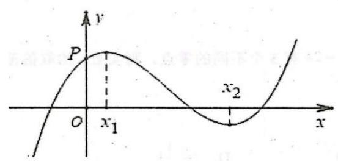

A. $a < 0, b < 0, c > 0, d > 0$

B. $a > 0, b < 0, c < 0, d > 0$

C. $a > 0, b < 0, c > 0, d > 0$

D. $a > 0, b > 0, c > 0, d < 0$

### 4-7-11

(2018江苏高考)若函数 $f\left( x\right)  = 2{x}^{3} - a{x}^{2} + 1\left( {a \in  \mathbf{R}}\right)$ 在 $\left( {0, + \infty }\right)$ 内有且只有一个零点，则 $f\left( x\right)$ 在 $\left\lbrack  {-1,1}\right\rbrack$ 上的最大值与最小值的和为___.

### 4-7-12

(2024 福建泉州一模)已知 ${x}_{1}$ ， ${x}_{2}$ 是函数 $f\left( x\right)  = {\left( x - 1\right) }^{3} - x$ 的两个极值点， 则( )

A. ${x}_{1} + {x}_{2} =  - 2$ B. ${x}_{1} + {x}_{2} = 1$

C. $f\left( {x}_{1}\right)  + f\left( {x}_{2}\right)  =  - 2$ D. $f\left( {x}_{1}\right)  + f\left( {x}_{2}\right)  = 2$

(方法提示: 对称中心)

### 4-7-13

(多选) (2023 广东深圳一模) 已知函数 $f\left( x\right)  = x{\left( x - 3\right) }^{2}$ ,若 $f\left( a\right)  = f\left( b\right)  = f\left( c\right)$ , 其中 $a > b > c$ ,则 ( )

A. $1 < c < 2$ B. $b + c > 2$

C. $a + b + c = 6$ D. ${abc}$ 的取值范围为 $\left( {0,4}\right)$

(方法提示: 韦达定理, 偏移)

### 4-7-14

(2014 江西高考)在同一直角坐标系中，函数 $y = a{x}^{2} - x + \frac{a}{2}$ 与 $y = {a}^{2}{x}^{3} - \; {2ax} + x + a\left( {a \in  \mathbf{R}}\right)$ 的图像不可能的是 ( )

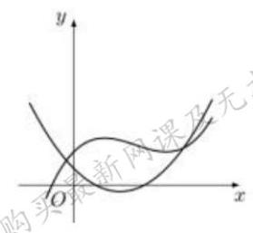

A

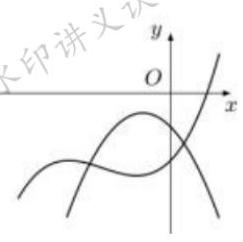

B

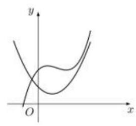

C

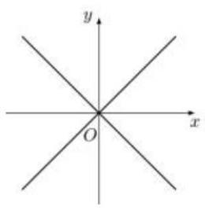

D

### 4-7-15

已知函数 $f\left( x\right)  = a{x}^{3} - {3a}{x}^{2} + b$ ，其中实数 $a > 0$ ， $b \in  \mathbf{R}$ ，点 $A\left( {2, a}\right)$ ，则下列结论正确的是( )

A. $f\left( x\right)$ 必有两个极值点

B. 当 $b = {2a}$ 时,点 $\left( {1,0}\right)$ 是曲线 $y = f\left( x\right)$ 的对称中心

C. 当 $b = {3a}$ 时,过点 $A$ 可以作曲线 $y = {f}^{\prime }\left( x\right)$ 的 2 条切线

D. 当 ${5a} < b < {6a}$ 时,过点 $A$ 可以作曲线 $y = f\left( x\right)$ 的 3 条切线

### 4-7-16

(2013 安徽高考)已知函数 $f\left( x\right)  = {x}^{3} + a{x}^{2} + {bx} + c$ 有两个极值点 ${x}_{1},{x}_{2}$ ，若 $f\left( {x}_{1}\right)  = {x}_{1} < {x}_{2}$ ,则关于 $x$ 的方程 $3{\left( f\left( x\right) \right) }^{2} + {2af}\left( x\right)  + b = 0$ 的不同实根个数为 ( )

A. 3 B. 4 C. 5 D. 6

### 4-7-17

已知函数 $f\left( x\right)  = {x}^{3} + {ax} + b$ 定义域为 $\left\lbrack  {-1,2}\right\rbrack$ ,记 $\left| {f\left( x\right) }\right|$ 的最大值为 $M$ ,则 $M$ 的最小值为( )

A. 4 B. 3 C. 2 D. $\sqrt{3}$

## 4-8 凹凸性

### 4-8-1

定义:对于函数 $f\left( x\right)$ ，如果 ${f}^{\prime \prime }\left( x\right)  \geq  0$ ，则 $f\left( x\right)$ 称为凸函数(下凸函数)；若 ${f}^{\prime \prime }\left( x\right)  \leq$

0,则 $f\left( x\right)$ 称为凹函数 (上凸函数).

判断下列函数是凸函数、凹函数, 还是都不是.

① $f\left( x\right)  = {x}^{2}$ :

② $f\left( x\right)  =  - {x}^{2}$ :

③ $f\left( x\right)  = {\mathrm{e}}^{x}$ :

④ $f\left( x\right)  = \ln x$ :

⑤ $f\left( x\right)  = {\mathrm{e}}^{x} + {x}^{2}$ :

理解: 凸函数的和, 仍是___.

⑥ $f\left( x\right)  = \ln x - {x}^{2}$ :

理解:凹函数的和，仍是___.

⑦ $f\left( x\right)  = {x}^{2}{\mathrm{e}}^{x}$ :

理解:凸函数的乘积，___凸函数.

⑧ $f\left( x\right)  = {x}^{3}$

### 4-8-2

(2012 福建高考)函数 $f\left( x\right)$ 在 $\left\lbrack  {a, b}\right\rbrack$ 上有定义，若对任意 ${x}_{1},{x}_{2} \in  \left\lbrack  {a, b}\right\rbrack$ ，都有 $f\left( \frac{{x}_{1} + {x}_{2}}{2}\right)  \leq  \frac{1}{2}\left\lbrack  {f\left( {x}_{1}\right)  + f\left( {x}_{2}\right) }\right\rbrack$ ,则称 $f\left( x\right)$ 在 $\left\lbrack  {a, b}\right\rbrack$ 上具有性质 $P$ . 设 $f\left( x\right)$ 在 $\left\lbrack  {1,3}\right\rbrack$ 上具有性质 $P$ ,现给出如下命题:

$\text{ ① }f\left( x\right)$ 在 $\left\lbrack  {1,3}\right\rbrack$ 上的图像是连续不断的;

② $f\left( {x}^{2}\right)$ 在 $\left\lbrack  {1,\sqrt{3}}\right\rbrack$ 上具有性质 $P$ ；

③若 $f\left( x\right)$ 在 $x = 2$ 处取得最大值 1,则 $f\left( x\right)  = 1\left( {x \in  \left\lbrack  {1,3}\right\rbrack  }\right)$ ;

④ 对任意的 ${x}_{1},{x}_{2},{x}_{3},{x}_{4} \in  \left\lbrack  {1,3}\right\rbrack$ ,有 $f\left( \frac{{x}_{1} + {x}_{2} + {x}_{3} + {x}_{4}}{4}\right)  \leq  \frac{1}{4}\left\lbrack  {f\left( {x}_{1}\right)  + f\left( {x}_{2}\right)  + f\left( {x}_{3}\right)  + }\right. \; \left. {f\left( {x}_{4}\right) }\right\rbrack$ .

其中真命题的序号是( )

A. ①② B. ①③ C. ②④ D. ③④

### 4-8-3

已知函数 $f\left( x\right)  = {\mathrm{e}}^{x} - {ax} - b$ ,若 $f\left( x\right)  \geq  0$ 恒成立,那么 ${2a} + b$ 的最大值为 ___.

### 4-8-4

(2023 浙江杭州二模)已知函数 $f\left( x\right)  = {\mathrm{e}}^{2x} - 2{\mathrm{e}}^{x} + {2x}$ 的图像在点 $P\left( {{x}_{0}, f\left( {x}_{0}\right) }\right)$ 处的切线方程为 $l : y = g\left( x\right)$ ,若对任意 $x \in  \mathbf{R}$ ,都有 $\left( {x - {x}_{0}}\right)  \cdot  \left\lbrack  {f\left( x\right)  - g\left( x\right) }\right\rbrack   \geq  0$ 成立,则 ${x}_{0} =$ ___.

### 4-8-5

(2024 北京高考) 已知 $\left( {{x}_{1},{y}_{1}}\right) ,\left( {{x}_{2},{y}_{2}}\right)$ 是函数 $y = {2}^{x}$ 的图像上两个不同的两点, 则下列正确的是 ( )

A. ${\log }_{2}\frac{{y}_{1} + {y}_{2}}{2} < \frac{{x}_{1} + {x}_{2}}{2}$ B. ${\log }_{2}\frac{{y}_{1} + {y}_{2}}{2} > \frac{{x}_{1} + {x}_{2}}{2}$

C. ${\log }_{2}\frac{{y}_{1} + {y}_{2}}{2} < {x}_{1} + {x}_{2}$ D. ${\log }_{2}\frac{{y}_{1} + {y}_{2}}{2} > {x}_{1} + {x}_{2}$

### 4-8-6

(2024 湖南邵阳三模) 下列函数对于任意 ${x}_{1},{x}_{2} \in  \left( {0, + \infty }\right)$ ,都有 $f\left( \frac{{x}_{1} + {x}_{2}}{2}\right)  \geq \; \frac{f\left( {x}_{1}\right)  + f\left( {x}_{2}\right) }{2}$ 成立的是( )

A. $f\left( x\right)  = \ln x$ B. $f\left( x\right)  = {x}^{2} + 1$ C. $f\left( x\right)  = {2}^{x}$ D. $f\left( x\right)  = {x}^{\frac{4}{3}}$

### 4-8-7

下列四个函数: $\text{ ① }f\left( x\right)  = {x}^{2} - {2x}$ ; ② $f\left( x\right)  = \sin x,0 \leq  x \leq  {2\pi }$ ; ③ $f\left( x\right)  = {2}^{x} + x$ ; ④ $f\left( x\right)  = {\log }_{2}\left( {{2x} - 1}\right) , x > \frac{1}{2}$ . 其中，能使 $f\left( \frac{{x}_{1} + {x}_{2}}{2}\right)  \leq  \frac{1}{2}\left\lbrack  {f\left( {x}_{1}\right)  + f\left( {x}_{2}\right) }\right\rbrack$ 恒成立的函数是___.

### 4-8-8

丹麦数学家琴生是 19 世纪对数学分析做出卓越贡献的巨人，特别是在函数的凹凸性与不等式方面留下了很多宝贵的成果. 定义: 函数 $f\left( x\right)$ 在 $\left( {a, b}\right)$ 上的导函数为 ${f}^{\prime }\left( x\right) ,{f}^{\prime }\left( x\right)$ 在 $\left( {a, b}\right)$ 上的导函数为 ${f}^{\prime \prime }\left( x\right)$ ,若在 $\left( {a, b}\right)$ 上 ${f}^{\prime \prime }\left( x\right)  < 0$ 恒成立,则称函数 $f\left( x\right)$ 是 $\left( {a, b}\right)$ 上的 “严格凸函数”，称区间 $\left( {a, b}\right)$ 为函数 $f\left( x\right)$ 的 “严格凸区间”. 则下列正确命题的序号为___.

①函数 $f\left( x\right)  =  - {x}^{3} + 3{x}^{2} + 2$ 在 $\left( {1, + \infty }\right)$ 上为 “严格凸函数”；

②函数 $f\left( x\right)  = \frac{\ln x}{x}$ 的 “严格凸区间” 为 $\left( {0,{\mathrm{e}}^{\frac{3}{2}}}\right)$ ；

③函数 $f\left( x\right)  = {\mathrm{e}}^{x} - x\ln x - \frac{m}{2}{x}^{2}$ 在 $\left( {1,4}\right)$ 为 “严格凸函数”，则 $m$ 的取值范围为 $\lbrack \mathrm{e} - 1, + \infty )$ .

## 4-9 新定义

### 4-9-1

(2024 新高考 I )已知函数 $f\left( x\right)$ 的定义域为 $\mathbf{R}$ ， $f\left( x\right)  > f\left( {x - 1}\right)  + f\left( {x - 2}\right)$ ， 且当 $x < 3$ 时 $f\left( x\right)  = x$ ，则下列结论中一定正确的是( )

A. $f\left( {10}\right)  > {100}$ B. $f\left( {20}\right)  > {1000}$

C. $f\left( {10}\right)  < {1000}$ D. $f\left( {20}\right)  < {10000}$

### 4-9-2

(2013 山东高考) 定义 “正对数”: $\mathop{\ln }\limits^{ + }x = \left\{  \begin{array}{l} 0,0 < x < 1, \\  \ln x, x \geq  1, \end{array}\right.$ 现有四个命题:

①若 $a > 0, b > 0$ ，则 $\mathop{\ln }\limits^{ + }\left( {a}^{b}\right)  = b\mathop{\ln }\limits^{ + }a$ ；

②若 $a > 0, b > 0$ ，则 $\mathop{\ln }\limits^{ + }\left( {ab}\right)  = \mathop{\ln }\limits^{ + }a + \mathop{\ln }\limits^{ + }b$ ；

③若 $a > 0, b > 0$ ，则 $\mathop{\ln }\limits^{ + }\left( \frac{a}{b}\right)  \geq  \mathop{\ln }\limits^{ + }a - \mathop{\ln }\limits^{ + }b$ ；

④若 $a > 0, b > 0$ ，则 ${\ln }^{ + }\left( {a + b}\right)  \leq  {\ln }^{ + }a + {\ln }^{ + }b + \ln 2.$

其中真命题有___. (写出所有真命题的编号)

### 4-9-3

(2024 浙江温州二模)已知定义在 $\left( {0,1}\right)$ 上的函数

$f\left( x\right)  = \left\{  {\begin{array}{ll} \frac{1}{n}, & x\text{ 是有理数 }\frac{m}{n}\left( {m, n\text{ 是互质的正整数 }}\right) , \\  1, & x\text{ 是无理数, } \end{array}\text{ 则下列结论正确的是 }\left( \;\right) }\right.$

A. $f\left( x\right)$ 的图像关于 $x = \frac{1}{2}$ 对称

B. $f\left( x\right)$ 的图像关于 $\left( {\frac{1}{2},\frac{1}{2}}\right)$ 对称

C. $f\left( x\right)$ 在 $\left( {0,1}\right)$ 单调递增

D. $f\left( x\right)$ 有最小值

### 4-9-4

(2024 上海高考) 现定义如下: 当 $x \in  \left( {n, n + 1}\right)$ 时 $\left( {n \in  \mathbf{N}}\right)$ ,若 $f\left( {x + 1}\right)  = \; {f}^{\prime }\left( x\right)$ ,则称 $f\left( x\right)$ 为延展函数. 已知当 $x \in  \left( {0,1}\right)$ 时, $g\left( x\right)  = {\mathrm{e}}^{x}$ 且 $h\left( x\right)  = {x}^{10}$ ,且 $g\left( x\right) , h\left( x\right)$ 均为延展函数，则以下结论( )

(1)存在 $y = {kx} + b\left( {k, b \in  \mathbf{R}, k, b \neq  0}\right)$ 与 $y = g\left( x\right)$ 有无穷个交点

(2)存在 $y = {kx} + b\left( {k, b \in  \mathbf{R}, k, b \neq  0}\right)$ 与 $y = h\left( x\right)$ 有无穷个交点

A. (1)(2)都成立

B. (1)(2)都不成立

C. (1)成立(2)不成立

D. (1)不成立 (2)成立

### 4-9-5

(多选) (2023 安徽马鞍山模拟) 对于函数 $f : \mathbf{R} \rightarrow  \mathbf{R}$ ,若 $\exists {x}_{0} \in  \mathbf{R}$ 使得 $f\left( {x}_{0}\right)  = {x}_{0}$ ,我们称 ${x}_{0}$ 为函数 $f\left( x\right)$ 的一个不动点. 则()

A. 若 $f\left( x\right)$ 有无数多个不动点,则 $f\left( x\right)  = x$

B. 若 $f\left( x\right)$ 为二次函数,且 $f\left( x\right)$ 无不动点,则 $f\left( {f\left( x\right) }\right)$ 无不动点

C. 若 $f\left( {f\left( x\right) }\right)$ 有唯一不动点,则 $f\left( x\right)$ 有唯一不动点

D. 若 $f\left( {f\left( x\right) }\right)$ 有且仅有两个不动点 $a, b\left( {a \neq  b}\right)$ ,则 $a, b$ 都是 $f\left( x\right)$ 的不动点

### 4-9-6

(多选)以罗尔中值定理、拉格朗日中值定理、柯西中值定理为主体的“中值定理”反映了函数与导数之间的重要联系, 是微积分学重要的理论基础, 其中拉格朗日中值定理是 “中值定理” 的核心内容, 其定理陈述如下: 如果函数 $f\left( x\right)$ 在闭区间 $\left\lbrack  {a, b}\right\rbrack$ 上连续,在开区间 $\left( {a, b}\right)$ 内可导,则在区间 $\left( {a, b}\right)$ 内至少存在一个点 ${x}_{0} \in  \left( {a, b}\right)$ ,使得 $f\left( b\right)  - f\left( a\right)  = {f}^{\prime }\left( {x}_{0}\right) \left( {b - a}\right) , x = {x}_{0}$ 称为函数 $y = f\left( x\right)$ 在闭区间 $\left\lbrack  {a, b}\right\rbrack$ 上的中值点,若关于函数 $f\left( x\right)  = \sin x + \sqrt{3}\cos x$ 在区间 $\left\lbrack  {0,\pi }\right\rbrack$ 上的 “中值点” 的个数为 $m$ ,函数 $g\left( x\right)  = {\mathrm{e}}^{x}$ 在区间 $\left\lbrack  {0,1}\right\rbrack$ 上的 “中值点” 的个数为 $n$ , 则有( )(参考数据: $\sqrt{2} \approx  {1.41}$ ， $\sqrt{3} \approx  {1.73}$ ， $\pi  \approx  {3.14}$ ， $\mathrm{e} \approx  {2.72}$ )

A. $m = 1$ B. $m = 2$

C. $n = 1$ D. $n = 2$

### 4-9-7

(多选) (2023 山东济南三模) 若 ${f}^{\prime }\left( x\right)$ 为函数 $f\left( x\right)$ 的导函数,数列 $\left\{  {x}_{n}\right\}$ 满足 ${x}_{n + 1} = {x}_{n} - \frac{f\left( {x}_{n}\right) }{{f}^{\prime }\left( {x}_{n}\right) }$ ,则称 $\left\{  {x}_{n}\right\}$ 为 “牛顿数列”. 已知函数 $f\left( x\right)  = {x}^{2} - 1$ ,数列 $\left\{  {x}_{n}\right\}$ 为 “牛顿数列”,其中 ${x}_{1} = 3$ ,则 ( )

A. ${x}_{n + 1} = \frac{{x}_{n}^{2} - 1}{2{x}_{n}}\left( {n \in  {\mathbf{N}}^{ * }}\right)$

B. 数列 $\left\{  {x}_{n}\right\}$ 是单调递减数列

C. ${x}_{1}{x}_{2}\cdots {x}_{n} \leq  {2}^{{2}^{n}} - 1$

D. 关于 $n$ 的不等式 $\left| {{x}_{n} - 1}\right|  < \frac{1}{{2}^{2023}}$ 的解有无限个

### 4-9-8

(2024 广东二模)如图，在平面直角坐标系 ${xOy}$ 中放置着一个边长为 1 的等边三角形PAB,且满足 ${PB}$ 与 $x$ 轴平行,点 $A$ 在 $x$ 轴上. 现将三角形PAB沿 $x$ 轴在平面直角坐标系 ${xOy}$ 内滚动,设顶点 $P\left( {x, y}\right)$ 的轨迹方程是 $y = f\left( x\right)$ ,则 $f\left( x\right)$ 的最小正周期为___； $y = f\left( x\right)$ 在其两个相邻零点间的图像与 $x$ 轴所围区域的面积为___.

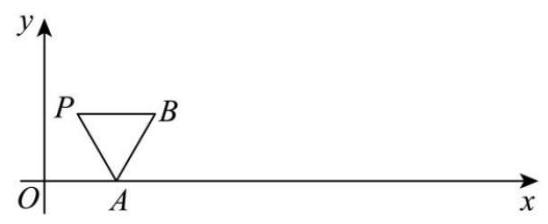

### 4-9-9

(2013 江西高考)如图，半径为 1 的半圆 $O$ 与等边三角形 ${ABC}$ 夹在两平行线 ${l}_{1},{l}_{2}$ 之间, $l//{l}_{1}, l$ 与半圆相交于 $F, G$ 两点,与三角形 ${ABC}$ 两边相交于 $E$ , $D$ 两点. 设弧 $\overset{\text{ ⏜ }}{FG}$ 的长为 $x\left( {0 < x < \pi }\right) , y = {EB} + {BC} + {CD}$ ,若 $l$ 从 ${l}_{1}$ 平行移动到 ${l}_{2}$ ,则函数 $y = f\left( x\right)$ 的图像大致是( )

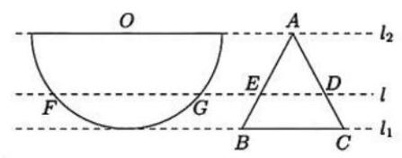

A.

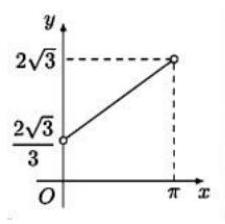

B.

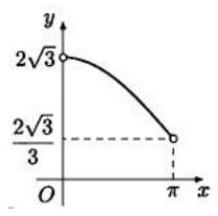

C.

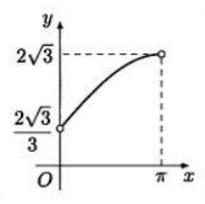

D.

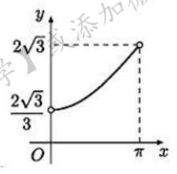

### 4-9-10

(多选) (2023 湖北襄阳模拟) 设 $x \in  \mathbf{R}$ ,当 $n - \frac{1}{2} \leq  x < n + \frac{1}{2}\left( {n \in  \mathbf{Z}}\right)$ 时,规定 $\langle x\rangle  = n$ ,如 $\langle {1.5}\rangle  = 2,\langle  - {0.2}\rangle  = 0$ . 则下列选项正确的是( )

A. $\langle a + b\rangle  \leq  \langle a\rangle  + \langle b\rangle \left( {a, b \in  \mathbf{R}}\right)$

B. $\left\langle  \sqrt{{n}^{2} + n + 1}\right\rangle   = n + 1\left( {n \in  {\mathbf{N}}^{ * }}\right)$

C. 设函数 $y = \langle 2\sin x\rangle  + \langle 2\cos x\rangle$ 的值域为 $M$ ,则 $M$ 的子集个数为 512

D. $\left\langle  {x - \frac{1}{2}}\right\rangle   + \left\langle  {x - \frac{1}{2} + \frac{1}{2023}}\right\rangle   + \left\langle  {x - \frac{1}{2} + \frac{2}{2023}}\right\rangle   + \cdots  + \left\langle  {x - \frac{1}{2} + \frac{2022}{2023}}\right\rangle   = \langle {2023x} - \frac{1}{2}\rangle$

### 4-9-11

(2013 湖南高考) 设函数 $f\left( x\right)  = {a}^{x} + {b}^{x} - {c}^{x}$ ,其中 $c > a > 0, c > b > 0$ .

(1)设集合 $M = \{ \left( {a, b, c}\right)  \mid  a, b, c$ 不能构成一个三角形的三条边,且 $a = b\}$ . 则 $\left( {a, b, c}\right)  \in  M$ 所对应的 $f\left( x\right)$ 的零点的取值集合为___

(2)若 $a, b, c$ 是三角形 ${ABC}$ 的三条边，则下列结论正确的是___.

① $\forall x \in  \left( {-\infty ,1}\right) , f\left( x\right)  > 0$ .

② $\exists x \in  \mathbf{R}$ ，使 ${a}^{x}$ ， ${b}^{x}$ ， ${c}^{x}$ 不能构成一个三角形的三条边长.

③若三角形 ${ABC}$ 是钝角三角形，则 $\exists x \in  \left( {1,2}\right)$ ，使 $f\left( x\right)  = 0$ .

### 4-9-12

(2024 上海高考)已知函数 $f\left( x\right)$ 的定义域为 $\mathbf{R}$ ，定义集合 $M = \left\{  {{x}_{0} \mid  {x}_{0} \in  }\right. \; \mathbf{R}, x \in  \left( {-\infty ,{x}_{0}}\right) , f\left( x\right)  < f\left( {x}_{0}\right) \}$ ,在使得 $M = \left\lbrack  {-1,1}\right\rbrack$ 的所有 $f\left( x\right)$ 中,下列成立的是( )

A. 存在 $f\left( x\right)$ 是偶函数

B. 存在 $f\left( x\right)$ 在 $x = 2$ 处取最大值

C. 存在 $f\left( x\right)$ 是严格增函数

D. 存在 $f\left( x\right)$ 在 $x =  - 1$ 处取到极小值

### 4-9-13

(多选)(2023 广东模拟)已知定义在 $\mathbf{R}$ 上的函数 $f\left( x\right)$ ，对于给定集合 $A$ ，若 $\forall {x}_{1},{x}_{2} \in  \mathbf{R}$ ,当 ${x}_{1} - {x}_{2} \in  A$ 时都有 $f\left( {x}_{1}\right)  - f\left( {x}_{2}\right)  \in  A$ ,则称 $f\left( x\right)$ 是 “ $A$ 封闭” 函数. 则下列命题正确的是( )

A. $f\left( x\right)  = {x}^{2}$ 是 “ $\left\lbrack  {-1,1}\right\rbrack$ 封闭” 函数

B. 定义在 $\mathbf{R}$ 上的函数 $f\left( x\right)$ 都是 “ $\{ 0\}$ 封闭” 函数

C. 若 $f\left( x\right)$ 是 “ $\{ 1\}$ 封闭” 函数,则 $f\left( x\right)$ 一定是 “ $\{ k\}$ 封闭” 函数 $\left( {k \in  {\mathbf{N}}^{ * }}\right)$

D. 若 $f\left( x\right)$ 是 “ $\left\lbrack  {a, b}\right\rbrack$ 封闭” 函数 $\left( {a, b \in  {\mathbf{N}}^{ * }}\right)$ ,则 $f\left( x\right)$ 不一定是 “ $\{ {ab}\}$ 封闭” 函数

### 4-9-14

(多选) (2023 河北石家庄一模) 定义:对于定义在区间 $I$ 上的函数 $f\left( x\right)$ 和正数 $\alpha \left( {0 < \alpha  \leq  1}\right)$ ,若存在正数 $M$ ,使得不等式 $\left| {f\left( {x}_{1}\right)  - f\left( {x}_{2}\right) }\right|  \leq  M{\left| {x}_{1} - {x}_{2}\right| }^{\alpha }$ 对任意 ${x}_{1},{x}_{2} \in  I$ 恒成立,则称函数 $f\left( x\right)$ 在区间 $I$ 上满足 $\alpha$ 阶李普希兹条件,则下列说法正确的有( )

A. 函数 $f\left( x\right)  = \sqrt{x}$ 在 $\lbrack 1, + \infty )$ 上满足 $\frac{1}{2}$ 阶李普希兹条件

B. 若函数 $f\left( x\right)  = x\ln x$ 在 $\left\lbrack  {1,\mathrm{e}}\right\rbrack$ 上满足一阶李普希兹条件,则 $M$ 的最小值为 2

C. 若函数 $f\left( x\right)$ 在 $\left\lbrack  {a, b}\right\rbrack$ 上满足 $M = k\left( {0 < k < 1}\right)$ 的一阶李普希兹条件,且方程 $f\left( x\right)  = x$ 在区间 $\left\lbrack  {a, b}\right\rbrack$ 上有解 ${x}_{0}$ ,则 ${x}_{0}$ 是方程 $f\left( x\right)  = x$ 在区间 $\left\lbrack  {a, b}\right\rbrack$ 上的唯一解

D. 若函数 $f\left( x\right)$ 在 $\left\lbrack  {0,1}\right\rbrack$ 上满足 $M = 1$ 的一阶李普希兹条件,且 $f\left( 0\right)  = f\left( 1\right)$ ,则存在满足条件的函数 $f\left( x\right)$ ,存在 ${x}_{1},{x}_{2} \in  \left\lbrack  {0,1}\right\rbrack$ ,使得 $\left| {f\left( {x}_{1}\right)  - f\left( {x}_{2}\right) }\right|  = \frac{2}{3}$

### 4-9-15

(多选)0203 湖南一模)英国著名物理学家牛顿用 “作切线” 的方法求函数零点. 如图,在横坐标为 ${x}_{1}$ 的点处作 $f\left( x\right)$ 的切线,切线与 $x$ 轴交点的横坐标为 ${x}_{2}$ ; 用 ${x}_{2}$ 代替 ${x}_{1}$ 重复上面的过程得到 ${x}_{3}$ ; 一直下去,得到数列 $\left\{  {x}_{n}\right\}$ ,叫作牛顿数列. 若函数 $f\left( x\right)  = {x}^{2} - x - 6,{a}_{n} = \ln \frac{{x}_{n} + 2}{{x}_{n} - 3}$ 且 ${a}_{1} = 1,{x}_{n} > 3$ ,数列 $\left\{  {a}_{n}\right\}$ 的前 $n$ 项和为 ${S}_{n}$ ,则下列说法正确的是 ( )

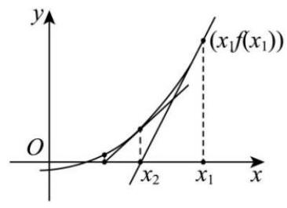

A. ${x}_{n + 1} = {x}_{n} - \frac{f\left( {x}_{n}\right) }{{f}^{\prime }\left( {x}_{n}\right) }$

B. 数列 $\left\{  {a}_{n}\right\}$ 是递减数列

C. 数列 $\left\{  {a}_{n}\right\}$ 是等比数列

D. ${S}_{2023} = {2}^{2023} - 1$

## 4-10 综合应用

### 4-10-1

(多选) (2022 河北唐山一模) 已知 $a > 1,{x}_{1},{x}_{2},{x}_{3}$ 为函数 $f\left( x\right)  = {a}^{x} - {x}^{2}$ 的零点, ${x}_{1} < {x}_{2} < {x}_{3}$ ,下列结论中正确的是 ( )

A. ${x}_{1} >  - 1$ B. $a$ 的取值范围是 $\left( {1,{\mathrm{e}}^{\frac{2}{\mathrm{e}}}}\right)$

C. 若 $2{x}_{2} = {x}_{1} + {x}_{3}$ ,则 $\frac{{x}_{3}}{{x}_{2}} = \sqrt{2} + 1$ D. ${x}_{1} + {x}_{2} < 0$

### 4-10-2

(2021浙江杭州二模) 已知函数 $f\left( x\right)  = a{\mathrm{e}}^{x} - \frac{a}{12}{x}^{3} - {ax} - 2\left( {a > 0}\right)$ . 若函数 $y = f\left( x\right)$ 与 $y = f\left( {f\left( x\right) }\right)$ 有相同的最小值，则 $a$ 的最大值为___.

### 4-10-3

(2024 北京海淀一模)已知函数 $f\left( x\right)  = \sqrt{{x}^{3} - x}$ ，给出下列四个结论:

①函数 $f\left( x\right)$ 是奇函数；

② $\forall k \in  \mathbf{R}$ ，且 $k \neq  0$ ，关于 $x$ 的方程 $f\left( x\right)  - {kx} = 0$ 恰有两个不相等的实数根；

③已知 $P$ 是曲线 $y = f\left( x\right)$ 上任意一点， $A\left( {-\frac{1}{2},0}\right)$ ，则 $\left| {AP}\right|  \geq  \frac{1}{2}$ ；

④ 设 $M\left( {{x}_{1},{y}_{1}}\right)$ 为曲线 $y = f\left( x\right)$ 上一点， $N\left( {{x}_{2},{y}_{2}}\right)$ 为曲线 $y =  - f\left( x\right)$ 上一点. 若 $\left| {{x}_{1} + {x}_{2}}\right|  = 1$ ,则 $\left| {MN}\right|  \geq  1$ .

其中所有正确结论的序号是___.

### 4-10-4

(2020 安徽阜阳模拟) 设函数 $f\left( x\right)  = \frac{{\mathrm{e}}^{x}}{x} - t\left( {\ln x + x + \frac{2}{x}}\right)$ 恰有两个极值点,则实数 $t$ 的取值范围是( )

A. $\left( {-\infty ,\frac{1}{2}}\right\rbrack$ B. $\left( {\frac{1}{2}, + \infty }\right)$

C. $\left( {\frac{1}{2},\frac{\mathrm{e}}{3}}\right)  \cup  \left( {\frac{\mathrm{e}}{3}, + \infty }\right)$ D. $\left( {-\infty ,\frac{1}{2}}\right\rbrack   \cup  \left( {\frac{\mathrm{e}}{3}, + \infty }\right)$

### 4-10-5

(2025 届湖南阶段练习) 已知函数 $f\left( x\right)  = {\mathrm{e}}^{2x} - {ax}\left| x\right| \left( {x \neq  0}\right)$ 有 3 个极值点 ${x}_{1}$ , ${x}_{2},{x}_{3}\left( {{x}_{1} < {x}_{2} < {x}_{3}}\right)$ ，则 $a$ 的取值范围是___；若存在 $i, j \in  \{ 1,2,3\}$ ， 使得 $\frac{{x}_{j}}{{x}_{i}} > 3$ ，则 ${x}_{i}$ 的取值范围是___.

### 4-10-6

(2024 全国模拟预测)已知函数 $f\left( x\right)  = \left\{  \begin{array}{ll} {x}^{2}, & x \leq  1, \\  \left| {\ln \left( {x - 1}\right) }\right| , & x > 1, \end{array}\right.$ 若方程 $f\left( x\right)  = \; m\left| {x - 1}\right|$ 有 5 个不同的实数根,且最小的两个实数根为 ${x}_{1},{x}_{2}$ ,则 ${x}_{1}^{2} + {x}_{2}^{2}$ 的取值范围为( )

A. $\left( {0,\frac{2\mathrm{e} - 1}{{\mathrm{e}}^{2}}}\right)$ B. $\left( {0,\frac{1 + 2\mathrm{e}}{{\mathrm{e}}^{2}}}\right)$ C. $\left( {\frac{1}{\mathrm{e}},\frac{1 + 2\mathrm{e}}{{\mathrm{e}}^{2}}}\right)$ D. $\left( {\frac{2\mathrm{e} - 1}{{\mathrm{e}}^{2}},\frac{2}{\mathrm{e}}}\right)$

### 4-10-7

(多选) (2023 山东聊城模拟) 已知函数 $f\left( x\right)  = \left| {\sin x}\right|  - {kx}$ 在区间 $\lbrack 0,{2\pi })$ 上有四个零点,分别为 ${x}_{1},{x}_{2},{x}_{3},{x}_{4}$ ,且 ${x}_{1} < {x}_{2} < {x}_{3} < {x}_{4}$ ,则 ( )

A. ${x}_{2} + {x}_{3} > {2\pi }$ B. ${x}_{4} - {x}_{2} > \pi$

C. ${x}_{3} + {x}_{4} < {3\pi }$ D. ${x}_{2} + {x}_{4} > 2{x}_{3}$

### 4-10-8

(2023 安徽合肥二模)设 $A, B, C, D$ 是曲线 $y = {x}^{3} - {mx}$ 上的四个动点， 若以这四个动点为顶点的正方形有且只有一个，则实数 $m$ 的值为( )

A. 4 B. $2\sqrt{3}$ C. 3 D. $2\sqrt{2}$
