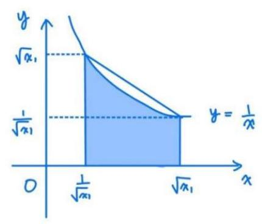
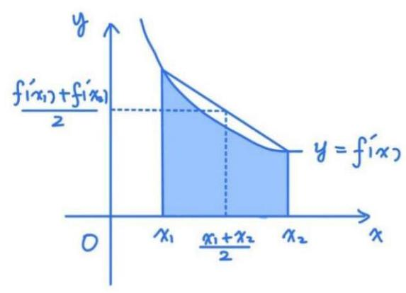
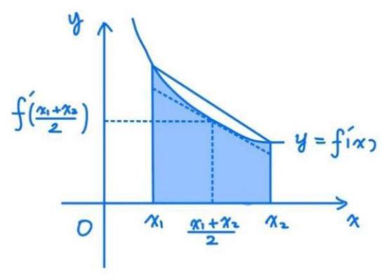
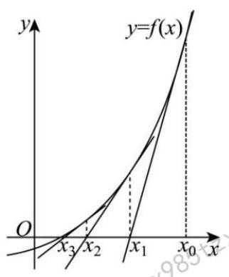

# 第5章 导数大题

## 5-1 基本方法1

### 5-1-1

(2020 新高考 I )已知函数 $f\left( x\right)  = a{\mathrm{e}}^{x - 1} - \ln x + \ln a$ .

(1)当 $a = \mathrm{e}$ 时，求曲线 $y = f\left( x\right)$ 在点 $\left( {1, f\left( 1\right) }\right)$ 处的切线与两坐标轴围成的三角形的面积;

(2)若 $f\left( x\right)  \geq  1$ ，求 $a$ 的取值范围.

### 5-1-2

(2017 全国Ⅱ理) 已知函数 $f\left( x\right)  = a{x}^{2} - {ax} - x\ln x$ ,且 $f\left( x\right)  \geq  0$ .

(1)求 $a$ ；

(2)证明: $f\left( x\right)$ 存在唯一的极大值点 ${x}_{0}$ ，且 ${\mathrm{e}}^{-2} < f\left( {x}_{0}\right)  < {2}^{-2}$ .

### 5-1-3

已知函数 $f\left( x\right)  = a{\mathrm{e}}^{x} - \frac{1}{x}$ .

(1)讨论 $f\left( x\right)$ 的零点个数;

(2)当 $a > 0$ 时， $\left| {f\left( x\right) }\right|  > 1 + \ln x$ ，求 $a$ 的取值范围.

### 5-1-4

(2022 全国乙理) 已知函数 $f\left( x\right)  = \ln \left( {1 + x}\right)  + {ax}{\mathrm{e}}^{-x}$ .

(1)当 $a = 1$ 时,求曲线 $y = f\left( x\right)$ 在点 $\left( {0, f\left( 0\right) }\right)$ 处的切线方程;

(2)若 $f\left( x\right)$ 在区间 $\left( {-1,0}\right) ,\left( {0, + \infty }\right)$ 各恰有一个零点，求 $a$ 的取值范围.

### 5-1-5

(2023 安徽合肥一模)已知函数 $f\left( x\right)  = \ln x + \frac{a - {x}^{2}}{2x}$ .

(1)讨论函数 $f\left( x\right)$ 的单调性;

(2)若关于 $x$ 的方程 $f\left( x\right)  = a$ 有两个实数解，求 $a$ 的最大整数值.

### 5-1-6

(2018 全国Ⅱ文) 已知函数 $f\left( x\right)  = \frac{a{x}^{2} + x - 1}{{\mathrm{e}}^{x}}$ .

(1)求曲线 $y = f\left( x\right)$ 在点 $\left( {0, - 1}\right)$ 处的切线方程；

(2)证明:当 $a \geq  1$ 时， $f\left( x\right)  + \mathrm{e} \geq  0$ .

### 5-1-7

(2020 全国 I 理) 设函数 $f\left( x\right)  = \ln \left( {a - x}\right)$ ,已知 $x = 0$ 是函数 $y = {xf}\left( x\right)$ 的极值点.

(1)求 $a$ ；

(2)设函数 $g\left( x\right)  = \frac{x + f\left( x\right) }{{xf}\left( x\right) }$ ,证明 $g\left( x\right)  < 1$ .

### 5-1-8

(2022 新高考 I )已知函数 $f\left( x\right)  = {\mathrm{e}}^{x} - {ax}$ 和 $g\left( x\right)  = {ax} - \ln x$ 有相同的最小值.

(1)求 $a$ ；

(2)证明:存在直线 $y = b$ ,其与两条曲线 $y = f\left( x\right)$ 和 $y = g\left( x\right)$ 共有三个不同的交点, 并且从左到右的三个交点的横坐标成等差数列.

### 5-1-9

(2021全国高考)设函数 $f\left( x\right)  = {a}^{2}{x}^{2} + {ax} - 3\ln x + 1$ . 其中 $a > 0$ .

(1)讨论 $f\left( x\right)$ 的单调性;

(2)若 $y = f\left( x\right)$ 的图像与 $x$ 轴没有公共点，求 $a$ 的取值范围.

### 5-1-10

(2024 江苏宿迁三模)已知函数 $f\left( x\right)  = \ln \left( {x - a}\right)  + \sqrt{{9a} - {4x}}\left( {a > 0}\right)$ .

(1)若曲线 $y = f\left( x\right)$ 在 $x = 2$ 处的切线的方程为 $x + y = b$ ,求实数 $b$ 的值；

(2)若函数 $f\left( x\right)  \leq  \ln a + {2a}$ 恒成立，求 $a$ 的取值范围.

### 5-1-11

(2022 山东济南二模) 已知函数 $f\left( x\right)  = {\mathrm{e}}^{ax} - a, a > 0$ .

(1)若曲线 $y = f\left( x\right)$ 在点 $\left( {1, f\left( 1\right) }\right)$ 处的切线在 $y$ 轴上的截距为 -1，求 $a$ 的值；

(2)是否存在实数 $t$ ，使得有且仅有一个实数 $a$ ，当 $x > 0$ 时，不等式 $f\left( x\right)  \geq  {tx}$ 恒成立? 若存在,求出 $t, a$ 的值; 若不存在,说明理由.

### 5-1-12

(2016全国Ⅱ理)(I)讨论函数 $f\left( x\right)  = \frac{x - 2}{x + 2}{\mathrm{e}}^{x}$ 的单调性，并证明当 $x > 0$ 时, $\left( {x - 2}\right) {\mathrm{e}}^{x} + x + 2 > 0$ ;

( II ) 证明: 当 $a \in  \lbrack 0,1)$ 时,函数 $g\left( x\right)  = \frac{{\mathrm{e}}^{x} - {ax} - a}{{x}^{2}}\left( {x > 0}\right)$ 有最小值,设 $g\left( x\right)$ 的最小值为 $h\left( a\right)$ ,求函数 $h\left( a\right)$ 的值域.

(方法提示: 隐零点)

### 5-1-13

(2024 东三省三校二模)已知 $a$ 为常数，函数 $f\left( x\right)  = x\ln x + a{x}^{2}$ .

(1)当 $a = 1$ 时，求 $f\left( x\right)$ 的图像在 $x = 1$ 处的切线方程；

(2)讨论函数 $f\left( x\right)$ 的零点个数；

(3)若函数 $f\left( x\right)$ 有两个极值点 ${x}_{1},{x}_{2}\left( {{x}_{1} < {x}_{2}}\right)$ ，求证 $- \frac{1}{2} < f\left( {x}_{1}\right)  < 0$ .

### 5-1-14

(2023 江苏南京二模)已知函数 $f\left( x\right)  = {a}^{x - 1} - {\log }_{a}x, a > 1$ .

(1)若 $a = \mathrm{e}$ ，求证: $f\left( x\right)  \geq  1$ ；

(2)若关于 $x$ 的不等式 $f\left( x\right)  < 1$ 的解集为集合 $B$ ，且 $B \subseteq  \left( {\frac{1}{a}, a}\right)$ ，求实数 $a$ 的取值范围.

(方法提示: 隐零点,分类讨论)

### 5-1-15

(2018全国Ⅱ文)已知函数 $f\left( x\right)  = a{\mathrm{e}}^{x} - \ln x - 1$ .

(1)设 $x = 2$ 是 $f\left( x\right)$ 的极值点，求 $a$ ，并求 $f\left( x\right)$ 的单调区间；

(2)证明:当时 $a \geq  \frac{1}{\mathrm{e}}$ ， $f\left( x\right)  \geq  0$ .

(方法提示: 放缩)

### 5-1-16

(2023 安徽蚌埠二模)已知函数 $f\left( x\right)  = \ln \left( {1 + {ax}}\right)  - x - \frac{1}{a}, g\left( x\right)  = x - {\mathrm{e}}^{x}$ .

(1)若不等式 $f\left( x\right)  \leq  \frac{1}{a} - 2$ 恒成立，求 $a$ 的取值范围；

(2)若 $a = 1$ 时，存在 4 个不同实数 ${x}_{1},{x}_{2},{x}_{3},{x}_{4}$ ，满足 $f\left( {x}_{1}\right)  = f\left( {x}_{2}\right)  = \; g\left( {x}_{3}\right)  = g\left( {x}_{4}\right)$ ,证明: $\left| {{x}_{2} - {x}_{1}}\right|  = \left| {{x}_{4} - {x}_{3}}\right|$ .

(方法提示: 仿 2022 新高考 I )

### 5-1-17

(2024 北京海淀二模)已知函数 $f\left( x\right)  = \ln \left( {x - a}\right)  + 2\sqrt{{3a} - x}\left( {a > 0}\right)$ .

(1)若 $a = 1$ ，

① 求曲线 $y = f\left( x\right)$ 在点 $\left( {2, f\left( 2\right) }\right)$ 处的切线方程；

② 求证:函数 $f\left( x\right)$ 恰有一个零点；

(2)若 $f\left( x\right)  \leq  \ln a + {2a}$ 对 $x \in  \left( {a,{3a}}\right)$ 恒成立，求 $a$ 的取值范围.

(方法提示: 换元)

### 5-1-18

(2023 山东日照一模)已知函数 $f\left( x\right)  = {\mathrm{e}}^{x - a}, g\left( x\right)  = \ln x + a\left( {a \in  \mathbf{R}}\right)$ .

(1)若直线 $y = x$ 是 $y = g\left( x\right)$ 的切线,函数 $F\left( x\right)  = \left\{  \begin{array}{ll} f\left( x\right) , & x \leq  1, \\  g\left( x\right) , & x > 1 \end{array}\right.$ 总存在 ${x}_{1} < \; {x}_{2}$ ,使得 $F\left( {x}_{1}\right)  + F\left( {x}_{2}\right)  = 2$ ,求 ${x}_{1} + F\left( {x}_{2}\right)$ 的取值范围;

(2)设 $G\left( x\right)  = f\left( x\right)  - g\left( x\right)$ ，若 $\left| {G\left( x\right) }\right|  = b$ 恰有三个不等实根，证明: $a - \frac{1}{a} < \; b < {2a} - 2.$

## 5-2 基本方法2

### 5-2-1

(2022 全国甲卷)已知函数 $f\left( x\right)  = {x}^{3} - x, g\left( x\right)  = {x}^{2} + a$ ，曲线 $y = f\left( x\right)$ 在点 $\left( {{x}_{1}, f\left( {x}_{1}\right) }\right)$ 处的切线也是曲线 $y = g\left( x\right)$ 的切线.

(1)若 ${x}_{1} =  - 1$ ，求 $a$ ；

(2)求 $a$ 的取值范围.

### 5-2-2

(2018新高考 II )已知函数 $f\left( x\right)  = {\mathrm{e}}^{x} - a{x}^{2}$ .

(1)若 $a = 1$ ，证明:当 $x \geq  0$ 时， $f\left( x\right)  \geq  1$ ；

(2)若 $f\left( x\right)$ 在 $\left( {0, + \infty }\right)$ 只有一个零点，求 $a$ .

### 5-2-3

(2020 新课标 I )已知函数 $f\left( x\right)  = {\mathrm{e}}^{x} - a\left( {x + 2}\right)$ .

(1)当 $a = 1$ 时，讨论 $f\left( x\right)$ 的单调性；

(2)若 $f\left( x\right)$ 有两个零点，求 $a$ 的取值范围.

### 5-2-4

(2013 福建高考)已知函数 $f\left( x\right)  = x - 1 + \frac{a}{{\mathrm{e}}^{x}}$ ( $a \in  \mathbf{R}$ ，e 为自然对数的底数).

(1)若曲线 $y = f\left( x\right)$ 在点 $\left( {1, f\left( x\right) }\right)$ 处的切线平行于 $x$ 轴,求 $a$ 的值;

(2)求函数 $f\left( x\right)$ 的极值;

(3)当 $a = 1$ 时,若直线 $l : y = {kx} - 1$ 与曲线 $y = f\left( x\right)$ 没有公共点,求 $k$ 的最大值.

### 5-2-5

(2024 北京海淀一模) 已知函数 $f\left( x\right)  = x{\mathrm{e}}^{a - \frac{1}{2}x}$ .

(1)求 $f\left( x\right)$ 的单调区间；

(2)若函数 $g\left( x\right)  = \left| {f\left( x\right)  + {\mathrm{e}}^{-2}a}\right| , x \in  \left( {0, + \infty }\right)$ 存在最大值，求 $a$ 的取值范围.

(方法提示: 绝对值的处理)

端

## 5-3 端点效应&内点效应

### 5-3-1

(2016 新课标 II)已知函数 $f\left( x\right)  = \left( {x + 1}\right) \ln x - a\left( {x - 1}\right)$ .

(1)当 $a = 4$ 时,求曲线 $y = f\left( x\right)$ 在 $\left( {1, f\left( 1\right) }\right)$ 处的切线方程；

(2)若当 $x \in  \left( {1, + \infty }\right)$ 时， $f\left( x\right)  > 0$ ，求 $a$ 的取值范围.

### 5-3-2

(2024 全国甲卷) 已知函数 $f\left( x\right)  = \left( {1 - {ax}}\right) \ln \left( {1 + x}\right)  - x$ .

(1)当 $a =  - 2$ 时，求 $f\left( x\right)$ 的极值;

(2)当 $x \geq  0$ 时, $f\left( x\right)  \geq  0$ ,求 $a$ 的取值范围.

### 5-3-3

(2024 新课标I) 已知函数 $f\left( x\right)  = \ln \frac{x}{2 - x} + {ax} + b{\left( x - 1\right) }^{3}$ .

(1)若 $b = 0$ ，且 ${f}^{\prime }\left( x\right)  \geq  0$ ，求 $a$ 的最小值；

(2)证明:曲线 $y = f\left( x\right)$ 是中心对称图形；

(3)若 $f\left( x\right)  >  - 2$ 当且仅当 $1 < x < 2$ ，求 $b$ 的取值范围.

### 5-3-4

设函数 $f\left( x\right)  = {ax} + \cos x, x \in  \left\lbrack  {0,\pi }\right\rbrack$ .

(1)讨论 $f\left( x\right)$ 的单调性;

(2)设 $f\left( x\right)  \leq  1 + \sin x$ ，求 $a$ 的取值范围.

### 5-3-5

(2016江苏高考)已知函数 $f\left( x\right)  = {a}^{x} + {b}^{x}\left( {a > 0, b > 0, a \neq  1, b \neq  1}\right)$ .

(1)设 $a = 2, b = \frac{1}{2}$ .

① 求方程 $f\left( x\right)  = 2$ 的根；

②若对于任意 $x \in  \mathbf{R}$ ，不等式 $f\left( {2x}\right)  \geq  {mf}\left( x\right)  - 6$ 恒成立，求实数 $m$ 的最大值；

(2)若 $0 < a < 1, b > 1$ ，函数 $g\left( x\right)  = f\left( x\right)  - 2$ 有且只有 1 个零点，求 ${ab}$ 的值.

### 5-3-6

(2018全国III)已知函数 $f\left( x\right)  = \left( {2 + x + a{x}^{2}}\right) \ln \left( {1 + x}\right)  - {2x}$ .

(1)若 $a = 0$ ，证明:当 $- 1 < x < 0$ 时， $f\left( x\right)  < 0$ ；当 $x > 0$ 时， $f\left( x\right)  > 0$ ；

(2)若 $x = 0$ 是 $f\left( x\right)$ 的极大值点，求 $a$ .

### 5-3-7

(2015 山东高考) 设函数 $f\left( x\right)  = \ln \left( {x + 1}\right)  + a\left( {{x}^{2} - x}\right)$ ,其中 $a \in  \mathbf{R}$ .

(1)讨论函数 $f\left( x\right)$ 极值点的个数，并说明理由；

(2)若 $\forall x > 0, f\left( x\right)  \geq  0$ 成立，求 $a$ 的取值范围.

### 5-3-8

(2017 新课标II) 已知函数 $f\left( x\right)  = \left( {1 - {x}^{2}}\right) {\mathrm{e}}^{x}$ ,且 $f\left( x\right)  \geq  0$ .

(1)讨论 $f\left( x\right)$ 的单调性;

(2)当 $x \geq  0$ 时， $f\left( x\right)  \leq  {ax} + 1$ ，求 $a$ 的取值范围.

### 5-3-9

(2024 湖北武汉模拟) 已知函数 $f\left( x\right)  = \frac{{\mathrm{e}}^{x} - 1}{x}$ .

(1)求曲线 $y = f\left( x\right)$ 在点 $\left( {1, f\left( 1\right) }\right)$ 处的切线方程；

(2)证明: $f\left( x\right)$ 是其定义域上的增函数；

(3)若 $f\left( x\right)  > {a}^{x}$ ，其中 $a > 0$ 且 $a \neq  1$ ，求实数 $a$ 的值.

### 5-3-10

(2023 全国乙卷) 已知函数 $f\left( x\right)  = \left( {\frac{1}{x} + a}\right) \ln \left( {1 + x}\right)$ .

(1)当 $a =  - 1$ 时，求曲线 $y = f\left( x\right)$ 在点 $\left( {1, f\left( 1\right) }\right)$ 处的切线方程；

(2)是否存在 $a, b$ ,使得曲线 $y = f\left( \frac{1}{x}\right)$ 关于直线 $x = b$ 对称,若存在,求 $a, b$ 的值, 若不存在, 说明理由.

(3)若 $f\left( x\right)$ 在 $\left( {0, + \infty }\right)$ 存在极值，求 $a$ 的取值范围.

### 5-3-11

已知函数 $f\left( x\right)  = \ln \left( {1 - x}\right)$ .

(1)求曲线 $y = f\left( x\right)$ 在点 $\left( {0, f\left( 0\right) }\right)$ 处的切线方程；

(2)求证:当 $x \in  \left( {-\infty ,0}\right)$ 时， $f\left( x\right)  >  - \frac{1}{2}{x}^{2} - x$ ；

(3)设实数 $k$ 使得 $f\left( x\right)  > k{x}^{2} - x$ 对 $x \in  \left( {-\infty ,0}\right)$ 恒成立，求 $k$ 的取值范围.

(方法提示: 高阶端点效应, 动态图像)

### 5-3-12

(2023 山东济南一模)已知函数 $f\left( x\right)  = {\mathrm{e}}^{x} - \frac{a}{3}{x}^{3} - \frac{{x}^{2}}{2} - {2a}x$ .

(1)当 $a = 0$ ，求曲线 $y = f\left( x\right)$ 在点 $\left( {1, f\left( 1\right) }\right)$ 处的切线方程；

(2)若 $f\left( x\right)$ 在 $\lbrack 0, + \infty )$ 上单调递增，求 $a$ 的取值范围；

(3)若 $f\left( x\right)$ 的最小值为 1，求 $a$ .

(方法提示:最小值为内点，导数为 0 )

### 5-3-13

(2023新高考II)(1)证明:当 $0 < x < 1$ 时， $x - {x}^{2} < \sin x < x$ ；

(2)已知函数 $f\left( x\right)  = \cos {ax} - \ln \left( {1 - {x}^{2}}\right)$ ，若 $x = 0$ 是 $f\left( x\right)$ 的极大值点，求 $a$ 的取值范围.

## 5-4 多变量多参数

### 5-4-1

(2010 辽宁高考)已知函数 $f\left( x\right)  = \left( {a + 1}\right) \ln x + a{x}^{2} + 1$ .

(1)讨论函数 $f\left( x\right)$ 的单调性;

(2)设 $a <  - 1$ ，如果对任意 ${x}_{1},{x}_{2} \in  \left( {0, + \infty }\right)$ ， $\left| {f\left( {x}_{1}\right)  - f\left( {x}_{2}\right) }\right|  \geq  4\left| {{x}_{1} - {x}_{2}}\right|$ ， 求 $a$ 的取值范围.

### 5-4-2

(2022 北京高考) 已知函数 $f\left( x\right)  = {\mathrm{e}}^{x}\ln \left( {1 + x}\right)$ .

(1)求曲线 $y = f\left( x\right)$ 在点 $\left( {0, f\left( 0\right) }\right)$ 处的切线方程；

(2)设 $g\left( x\right)  = {f}^{\prime }\left( x\right)$ ，讨论函数 $g\left( x\right)$ 在 $\lbrack 0, + \infty )$ 上的单调性；

(3)证明:对任意的 $s, t \in  \left( {0, + \infty }\right)$ ，有 $f\left( {s + t}\right)  > f\left( s\right)  + f\left( t\right)$ .

### 5-4-3

(2024 广东佛山一模) 已知 $f\left( x\right)  = {\mathrm{e}}^{2x} - {ax} - 1, g\left( x\right)  = {ax}\left( {{\mathrm{e}}^{x} - 1}\right)$ ,其中 $a \in  \mathbf{R}$ .

(1)求 $f\left( x\right)$ 的单调区间；

(2)若 $a > 2$ ，证明:当 $x \geq  \sqrt{{3a} - 6}$ 时， $f\left( x\right)  > g\left( x\right)$ .

### 5-4-4

(2021 新高考II) 已知函数 $f\left( x\right)  = \left( {x - 1}\right) {\mathrm{e}}^{x} - a{x}^{2} + b$ .

(1)讨论 $f\left( x\right)$ 的单调性;

(2)从下面两个条件中选一个，证明: $f\left( x\right)$ 只有一个零点.

① $\frac{1}{2} < a \leq  \frac{{\mathrm{e}}^{2}}{2}, b > {2a}$ ；

### 5-4-5

(2024 福建厦门一模) 已知函数 $f\left( x\right)  = a\ln x - \frac{x - 1}{x + 1}$ 有两个极值点 ${x}_{1},{x}_{2}$ .

(1)求实数 $a$ 的取值范围；

(2)证明: $\frac{f\left( {x}_{1}\right)  - f\left( {x}_{2}\right) }{{x}_{1} - {x}_{2}} > \frac{a - 2{a}^{2}}{a - 1}$ .

### 5-4-6

(2024 广东二模)已知 $f\left( x\right)  = \frac{1}{2}a{x}^{2} + \left( {1 - {2a}}\right) x - 2\ln x$ ， $a > 0$ .

(1)求 $f\left( x\right)$ 的单调区间；

(2)函数 $f\left( x\right)$ 的图像上是否存在两点 $A\left( {{x}_{1},{y}_{1}}\right) , B\left( {{x}_{2},{y}_{2}}\right)$ (其中 ${x}_{1} \neq  {x}_{2}$ )，使得直线 ${AB}$ 与函数 $f\left( x\right)$ 的图像在 ${x}_{0} = \frac{{x}_{1} + {x}_{2}}{2}$ 处的切线平行？若存在，请求出直线 ${AB}$ ；若不存在，请说明理由.

### 5-4-7

已知函数 $f\left( x\right)  = \frac{1}{3}{x}^{3} - {x}^{2} + \frac{1}{x} + 2\ln x - \frac{1}{3}$ .

(1)讨论 $f\left( x\right)$ 的单调性;

(2)设函数 $g\left( x\right)  = {x}^{3} - 3\ln x\left( {x \geq  1}\right) , P, Q$ 是曲线 $y = g\left( x\right)$ 上的不同两点，直线 ${PQ}$ 的斜率为 $k$ ,曲线 $y = g\left( x\right)$ 在点处 $P, Q$ 切线的斜率分别为 ${k}_{1},{k}_{2}$ ,证明: ${k}_{1} + {k}_{2} > {2k}$ .

### 5-4-8

(2012 全国高考)设函数 $f\left( x\right)  = \frac{1}{3}{x}^{3} + {x}^{2} + {ax}$ .

(I) 讨论 $f\left( x\right)$ 的单调性;

(II) 设 $f\left( x\right)$ 有两个极值点 ${x}_{1},{x}_{2}$ ,若过两点 $\left( {{x}_{1}, f\left( {x}_{1}\right) }\right) ,\left( {{x}_{2}, f\left( {x}_{2}\right) }\right)$ 的直线 $l$ 与 $x$ 轴的交点在曲线 $y = f\left( x\right)$ 上,求 $a$ 的值.

### 5-4-9

(2024 北京海淀期末)已知函数 $f\left( x\right)  = a{x}^{2} - x\sin x + b$ .

(1)当 $a = 1$ 时，求证:

①当 $x > 0$ 时， $f\left( x\right)  > b$ ；

②函数 $f\left( x\right)$ 有唯一极值点;

(2)若曲线 ${C}_{1}$ 与曲线 ${C}_{2}$ 在某公共点处的切线重合,则称该切线为 ${C}_{1}$ 和 ${C}_{2}$ 的 “优切线”. 若曲线 $y = f\left( x\right)$ 与曲线 $y =  - \cos x$ 存在两条互相垂直的 “优切线”,求 $a$ , $b$ 的值.

### 5-4-10

(2020 浙江高考) 已知 $1 < a \leq  2$ ,函数 $f\left( x\right)  = {\mathrm{e}}^{x} - x - a$ ,其中 $\mathrm{e} = {2.71828}\ldots$ 为自然对数的底数.

(I) 证明: 函数 $y = f\left( x\right)$ 在 $\left( {0, + \infty }\right)$ 上有唯一零点;

(II) 记 ${x}_{0}$ 为函数 $y = f\left( x\right)$ 在 $\left( {0, + \infty }\right)$ 上的零点,证明:

(i) $\sqrt{a - 1} \leq  {x}_{0} \leq  \sqrt{2\left( {a - 1}\right) }$ ;

(ii) ${x}_{0}f\left( {\mathrm{e}}^{{x}_{0}}\right)  \geq  \left( {\mathrm{e} - 1}\right) \left( {a - 1}\right) a$ .

### 5-4-11

(2023 江苏八市二模) 已知函数 $f\left( x\right)  = {ax} - \ln x - \frac{a}{x}$ .

(1)若 $x > 1$ ， $f\left( x\right)  > 0$ ，求实数 $a$ 的取值范围；

(2)设 ${x}_{1},{x}_{2}$ 是函数 $f\left( x\right)$ 的两个极值点，证明: $\left| {f\left( {x}_{1}\right)  - f\left( {x}_{2}\right) }\right|  < \frac{\sqrt{1 - 4{a}^{2}}}{a}$ .

### 5-4-12

已知函数 $f\left( x\right)  = x{\mathrm{e}}^{x} - \ln \left( {x + 1}\right) , g\left( x\right)  = 2\ln \left( {x + 1}\right)  - a\sin x$ .

(1)求 $f\left( x\right)$ 的单调区间；

(2)若 $a > 2$ ，函数 $h\left( x\right)  = f\left( x\right)  + g\left( x\right)$ .

(i) 证明: $h\left( x\right)$ 在区间 $\left( {0,\frac{\pi }{2}}\right)$ 上存在极值点;

(ii) 记 $h\left( x\right)$ 在区间 $\left( {0,\frac{\pi }{2}}\right)$ 上的极值点为 $m, h\left( x\right)$ 在区间 $\left\lbrack  {0,\pi }\right\rbrack$ 上的零点的和为 $n$ . 证明: ${2m} > n$ .

### 5-4-13

(2015天津高考)已知函数 $f\left( x\right)  = {nx} - {x}^{n}, x \in  \mathbf{R}$ ，其中 $n \in  {\mathbf{N}}^{ * }, n \geq  2$ .

(I) 讨论 $f\left( x\right)$ 的单调性;

(II) 设曲线 $y = f\left( x\right)$ 与 $x$ 轴正半轴的交点为 $P$ ,曲线在点 $P$ 处的切线方程为 $y = g\left( x\right)$ ,求证: 对于任意的正实数 $x$ ,都有 $f\left( x\right)  \leq  g\left( x\right)$ ;

(III) 若关于 $x$ 的方程 $f\left( x\right)  = \mathrm{a}$ ( $a$ 为实数) 有两个正实根 ${x}_{1},{x}_{2}$ ,求证: $\left| {{x}_{2} - {x}_{1}}\right|  < \frac{a}{1 - n} + 2.$

### 5-4-14

(2014 陕西高考)设函数 $f\left( x\right)  = \ln x + \frac{m}{x}, m \in  \mathbf{R}$ .

(1)当 $m = \mathrm{e}$ ( $\mathrm{e}$ 为自然对数的底数)时，求 $f\left( x\right)$ 的极小值;

(2)讨论函数 $g\left( x\right)  = {f}^{\prime }\left( x\right)  - \frac{x}{3}$ 零点的个数;

(3)若对任意 $b > a > 0$ ， $\frac{f\left( b\right)  - f\left( a\right) }{b - a} < 1$ 恒成立，求 $m$ 的取值范围.

### 5-4-15

(2020 全国高考) 已知函数 $f\left( x\right)  = 2\ln x + 1$ .

(1)若 $f\left( x\right)  \leq  {2x} + c$ ，求c的取值范围；

(2)设 $a > 0$ ，讨论 $g\left( x\right)  = \frac{f\left( x\right)  - f\left( a\right) }{x - a}$ 的单调性.

(方法提示: 放缩, 选主元)

### 5-4-16

(2012 全国高考)已知 $f\left( x\right)$ 满足: $f\left( x\right)  = {f}^{\prime }\left( 1\right) {\mathrm{e}}^{x - 1} - f\left( 0\right) x + \frac{1}{2}{x}^{2}$ .

(I) 求 $f\left( x\right)$ 的解析式及单调区间;

(II) 若 $f\left( x\right)  \geq  \frac{1}{2}{x}^{2} + {ax} + b$ ,求 $\left( {a + 1}\right) b$ 的最大值.

### 5-4-17

已知 $f\left( x\right)  =  - \frac{1}{2}{\mathrm{e}}^{2x} + 4{\mathrm{e}}^{x} - {ax} - 5$ .

(1)当 $a = 3$ 时,求 $f\left( x\right)$ 的单调区间;

(2)若 $f\left( x\right)$ 有两个极值点 ${x}_{1},{x}_{2}$ ，证明: $f\left( {x}_{1}\right)  + f\left( {x}_{2}\right)  + {x}_{1} + {x}_{2} < 0$ .

### 5-4-18

已知常数 $m \in  \mathbf{R}$ ,设 $f\left( x\right)  = \ln x + \frac{m}{x}$ .

(1)若 $m = 1$ ，求函数 $y = f\left( x\right)$ 在 $\left( {1,1}\right)$ 处的切线方程.

(2)是否存在 $0 < {x}_{1} < {x}_{2} < {x}_{3}$ ,且 ${x}_{1},{x}_{2},{x}_{3}$ 依次成等比数列,使得 $f\left( {x}_{1}\right)$ , $f\left( {x}_{2}\right) , f\left( {x}_{3}\right)$ 依次成等差数列? 请说明理由.

(3)求证:当 $m \leq  0$ 时，对任意 ${x}_{1},{x}_{2} \in  \left( {0, + \infty }\right) ,{x}_{1} < {x}_{2}$ ，都有 $\frac{{f}^{\prime }\left( {x}_{1}\right)  + {f}^{\prime }\left( {x}_{2}\right) }{2} > \frac{f\left( {x}_{1}\right)  - f\left( {x}_{2}\right) }{{x}_{1} - {x}_{2}}.$

### 5-4-19

(2015 广东高考)设 $a > 1$ ，函数 $f\left( x\right)  = \left( {1 + {x}^{2}}\right) {\mathrm{e}}^{x} - a$ .

(1)求 $f\left( x\right)$ 的单调区间；

(2)证明 $f\left( x\right)$ 在 $\left( {-\infty , + \infty }\right)$ 上仅有一个零点；

(3)若曲线 $y = f\left( x\right)$ 在点 $P$ 处的切线与 $x$ 轴平行，且在点 $M\left( {m, n}\right)$ 处的切线与直线 ${OP}$ 平行 ( $O$ 是坐标原点),证明: $m \leq  \sqrt[3]{a - \frac{2}{\mathrm{e}}} - 1$ .

### 5-4-20

(2024 福建福州质量检测) 已知函数 $f\left( x\right)  = x\ln x - {x}^{2} - 1$ .

(1)讨论 $f\left( x\right)$ 的单调性;

(2)求证: $f\left( x\right)  < {\mathrm{e}}^{-x} + \frac{1}{{x}^{2}} - \frac{2}{x} - 1$ ;

(3)若 $p > 0, q > 0$ 且 ${pq} > 1$ ，求证: $f\left( p\right)  + f\left( q\right)  <  - 4$ .

### 5-4-21

(2024 黑龙江齐齐哈尔一模)已知函数 $f\left( x\right)  = \ln x + \frac{2a}{x + 1}$ .

(1)设函数 $g\left( x\right)  = \frac{x + 1}{x} \cdot  f\left( x\right)  - \frac{\ln x}{x}$ ，讨论 $g\left( x\right)$ 的单调性；

(2)设 ${x}_{1}$ ， ${x}_{2}$ 分别为 $f\left( x\right)$ 的极大值点和极小值点，证明: $\left| {f\left( {x}_{2}\right)  - f\left( {x}_{1}\right) }\right|  < \; \frac{2\left( {a - 2}\right) \sqrt{{a}^{2} - {2a}}}{a - 1}$

### 5-4-22

(2023 辽宁沈阳三模) 已知函数 $f\left( x\right)  = \left( {x + b}\right) \left( {{\mathrm{e}}^{2x} - a}\right) \left( {b > 0}\right)$ 在点 $\left( {-\frac{1}{2}, f\left( {-\frac{1}{2}}\right) }\right)$ 处的切线方程为 $\left( {\mathrm{e} - 1}\right) x + \mathrm{e}y + \frac{\mathrm{e} - 1}{2} = 0$ .

(1)求 $a, b$ ；

(2)函数 $f\left( x\right)$ 图像与 $x$ 轴负半轴的交点为 $P$ ，且在点 $P$ 处的切线方程为 $y = h\left( x\right)$ ， 函数 $F\left( x\right)  = f\left( x\right)  - h\left( x\right) , x \in  \mathbf{R}$ ,求 $F\left( x\right)$ 的最小值;

(3)关于 $x$ 的方程 $f\left( x\right)  = m$ 有两个实数根 ${x}_{1},{x}_{2}$ ,且 ${x}_{1} < {x}_{2}$ ,证明: ${x}_{2} - {x}_{1} \leq \; \frac{1 + {2m}}{2} - \frac{m\mathrm{e}}{1 - \mathrm{e}}$

### 5-4-23

(2023 江苏苏锡常镇一模)已知定义在 $\left( {0, + \infty }\right)$ 上的两个函数 $f\left( x\right)  = {x}^{2} + \frac{1}{4}$ , $g\left( x\right)  = \ln x.$

(1)求函数 $h\left( x\right)  = f\left( x\right)  - g\left( x\right)$ 的最小值；

(2)设直线 $y =  - x + t\left( {t \in  \mathbf{R}}\right)$ 与曲线 $y = f\left( x\right) , y = g\left( x\right)$ 分别交于 $A, B$ 两点， 求 $\left| {AB}\right|$ 的最小值.

(方法提示: 不是切线, 但是消元思路相同, 三元, 二方程, 自由度=1, 消元; 也可以用动态图像)

### 5-4-24

(2023 广东佛山二模)已知函数 $f\left( x\right)  = \frac{1}{a}{\mathrm{e}}^{x} - {3x}$ ，其中 $a \neq  0$ .

(1)若 $f\left( x\right)$ 有两个零点，求 $a$ 的取值范围；

(2)若 $f\left( x\right)  \geq  a\left( {1 - 2\sin x}\right)$ ，求 $a$ 的取值范围.

## 5-5 凹凸性

### 5-5-1

割线下方: $f\left( \frac{{x}_{1} + {x}_{2}}{2}\right)  \leq  \frac{f\left( {x}_{1}\right)  + f\left( {x}_{2}\right) }{2}$ ;

① 不妨设 ${x}_{1} \leq  {x}_{2}$ . 选 ${x}_{1}$ 为主元,记 $F\left( {x}_{1}\right)  = f\left( \frac{{x}_{1} + {x}_{2}}{2}\right)  - \frac{f\left( {x}_{1}\right)  + f\left( {x}_{2}\right) }{2}$ . 原式等价于 $F\left( {x}_{1}\right)  \leq  0$ . 注意到 $F\left( {x}_{2}\right)  = 0$ ,故只需证 $F\left( {x}_{1}\right)  \leq  F\left( {x}_{2}\right)$ .

② 求导: ${F}^{\prime }\left( {x}_{1}\right)  =$ ___. (完成后续证明)

### 5-5-2

对 $\alpha  \in  \left\lbrack  {0,1}\right\rbrack$ ,有 $f\left( {\alpha {x}_{1} + \left( {1 - \alpha }\right) {x}_{2}}\right)  \leq  {\alpha f}\left( {x}_{1}\right)  + \left( {1 - \alpha }\right) f\left( {x}_{2}\right)$ ;

① 不妨设 ${x}_{1} \leq  {x}_{2}$ . 选 ${x}_{1}$ 为主元,记 $F\left( {x}_{1}\right)  = f\left( {\alpha {x}_{1} + \left( {1 - \alpha }\right) {x}_{2}}\right)  - {\alpha f}\left( {x}_{1}\right)  - \; \left( {1 - \alpha }\right) f\left( {x}_{2}\right)$ . 原式等价于 $F\left( {x}_{1}\right)  \leq  0$ . 注意到 $F\left( {x}_{2}\right)  = 0$ ,故只需证 $F\left( {x}_{1}\right)  \leq \; F\left( {x}_{2}\right)$ .

② 求导: ${F}^{\prime }\left( {x}_{1}\right)  =$ ___.(完成后续证明)

### 5-5-3

切线上方 (支撑性质): $f\left( x\right)  \geq  {f}^{\prime }\left( {x}_{0}\right) \left( {x - {x}_{0}}\right)  + f\left( {x}_{0}\right)$ ;

① 记 $F\left( x\right)  = f\left( x\right)  - \left\lbrack  {{f}^{\prime }\left( {x}_{0}\right) \left( {x - {x}_{0}}\right)  + f\left( {x}_{0}\right) }\right\rbrack$ . 原式等价于 $F\left( x\right)  \geq  0$ . 注意到 $F\left( {x}_{0}\right)  = 0$ ,故只需证明 $F\left( x\right)  \geq  F\left( {x}_{0}\right)$ .

② 求导: ${F}^{\prime }\left( x\right)  =$ ___. (完成后续证明)

(二)对数均值不等式

### 5-5-4

${f}^{\prime }\left( x\right)  = \frac{1}{x}$ ,是凸函数. 当 ${x}_{1} > 1$ 时,画出 $f\left( x\right)$ 在 $\left\lbrack  {\frac{1}{\sqrt{{x}_{1}}},\sqrt{{x}_{1}}}\right\rbrack$ 内的图像,如下图所示. 则:

① ${S}_{\text{ 阴 }} = \ln \sqrt{{x}_{1}} - \ln \frac{1}{\sqrt{{x}_{1}}} =$ ___. (微积分基本定理)

② ${S}_{\text{ 梯 }} =$ ___.

由于 ${f}^{\prime }\left( x\right)$ 是凸函数，所以 ${S}_{\text{ 梯 }} > {S}_{\text{ 阴 }}$ . 故___ 均值不等式)

因此,对数均值不等式体现的是 $y = \frac{1}{x}$ 的凹凸性.

### 5-5-5

(选学)仿照上面的思路，画图像证明:

(1)假设 ${f}^{\prime }\left( x\right)$ 是凸函数(注意，是导数 ${f}^{\prime }\left( x\right)$ )，则 $\frac{f\left( {x}_{2}\right)  - f\left( {x}_{1}\right) }{{x}_{2} - {x}_{1}} < \frac{{f}^{\prime }\left( {x}_{1}\right)  + {f}^{\prime }\left( {x}_{2}\right) }{2}$ ；

① ${S}_{\text{ 阴 }} = f\left( {x}_{2}\right)  - f\left( {x}_{1}\right)$ ；(微积分基本定理)

② ${S}_{\text{ 梯 }} =$ ___.

由于 ${f}^{\prime }\left( x\right)$ 是凸函数，所以 ${S}_{\text{ 阴 }} < {S}_{\text{ 梯 }}$ ，故___。

(2)假设 ${f}^{\prime }\left( x\right)$ 是凸函数(注意，是导数 ${f}^{\prime }\left( x\right)$ )，则 $\frac{f\left( {x}_{2}\right)  - f\left( {x}_{1}\right) }{{x}_{2} - {x}_{1}} > {f}^{\prime }\left( \frac{{x}_{1} + {x}_{2}}{2}\right)$ ；

① ${S}_{\text{ 阴 }} = f\left( {x}_{2}\right)  - f\left( {x}_{1}\right)$ ；(微积分基本定理)

② ${S}_{\text{ 小梯 }} =$ ___.

由于 ${f}^{\prime }\left( x\right)$ 是凸函数，所以 ${S}_{\text{ 小梯 }} < {S}_{\text{ 阴 }}$ ，故___

### 5-5-6

(2010 陕西高考) 已知函数 $f\left( x\right)  = \sqrt{x}, g\left( x\right)  = a\ln x, a \in  \mathbf{R}$ .

(1)若曲线 $y = f\left( x\right)$ 与曲线 $y = g\left( x\right)$ 相交，且在交点处有共同的切线，求 $a$ 的值及该切线方程;

(2)设函数 $h\left( x\right)  = f\left( x\right)  - g\left( x\right)$ ，当 $h\left( x\right)$ 存在最小值时，求其最小值 $\varphi \left( a\right)$ 的解析式;

(3) 对 (2) 中的 $\varphi \left( a\right)$ 和任意的 $a > 0, b > 0$ ,证明: ${\varphi }^{\prime }\left( \frac{a + b}{2}\right)  \leq  \frac{{\varphi }^{\prime }\left( a\right)  + {\varphi }^{\prime }\left( b\right) }{2} \leq \; {\varphi }^{\prime }\left( \frac{2ab}{a + b}\right) .$

### 5-5-7

(2024 广东珠海一模) 设函数 $f\left( x\right)  = \ln \left( {x + \frac{1}{x}}\right) , x \in  \left( {0,1}\right)$ .

(1)试判断 ${f}^{\prime }\left( x\right)$ 的单调性;

(2)证明:对任一 ${x}_{0} \in  \left( {0,1}\right)$ ，有 $f\left( x\right)  \geq  {f}^{\prime }\left( {x}_{0}\right) \left( {x - {x}_{0}}\right)  + f\left( {x}_{0}\right)$ ，当且仅当 $x = \; {x}_{0}$ 时等号成立.

### 5-5-8

已知函数 $f\left( x\right)  = {\mathrm{e}}^{x} - a{x}^{3} - x - 2$ .

(1)当 $a = 0$ 时，求 $f\left( x\right)$ 的单调区间与极值；

(2)若 $a \leq  \frac{1}{6}$ ，证明:当 ${x}_{1},{x}_{2} \in  \lbrack 0, + \infty )$ ，且 ${x}_{1} > {x}_{2}$ 时， $\frac{{f}^{\prime }\left( {x}_{1}\right)  + {f}^{\prime }\left( {x}_{2}\right) }{2} > \; \frac{f\left( {x}_{1}\right)  - f\left( {x}_{2}\right) }{{x}_{1} - {x}_{2}}$ 恒成立.

### 5-5-9

(2016 全国III) 已知函数 $f\left( x\right)  = \left( {x + 1}\right) \ln x - a\left( {x - 1}\right)$ .

(1)当 $a = 4$ 时,求曲线 $y = f\left( x\right)$ 在 $\left( {1, f\left( 1\right) }\right)$ 处的切线方程;

(2)若当 $x \in  \left( {1, + \infty }\right)$ 时, $f\left( x\right)  > 0$ ,求 $a$ 的取值范围.

### 5-5-10

(2018 全国I) 已知函数 $f\left( x\right)  = \frac{1}{x} - x + a\ln x$ .

(1)讨论 $f\left( x\right)$ 的单调性;

(2)若 $f\left( x\right)$ 存在两个极值点 ${x}_{1},{x}_{2}$ ，证明: $\frac{f\left( {x}_{1}\right)  - f\left( {x}_{2}\right) }{{x}_{1} - {x}_{2}} < a - 2$ .

### 5-5-11

(2024 河北石家庄一模) 已知函数 $f\left( x\right)  = {\mathrm{e}}^{x} - a{x}^{2}\left( {a > 0}\right)$ .

(1)若函数 $f\left( x\right)$ 有 3 个不同的零点，求 $a$ 的取值范围；

(2)已知 ${f}^{\prime }\left( x\right)$ 为函数 $f\left( x\right)$ 的导函数， ${f}^{\prime }\left( x\right)$ 在 $\mathbf{R}$ 上有极小值 0，对于某点 $P\left( {{x}_{0}, f\left( {x}_{0}\right) }\right) , f\left( x\right)$ 在 $P$ 点处的切线方程为 $y = g\left( x\right)$ ,若对于 $\forall x \in  \mathbf{R}$ ,都有 $(x - \; \left. {x}_{0}\right)  \cdot  \left\lbrack  {f\left( x\right)  - g\left( x\right) }\right\rbrack   \geq  0$ ,则称 $P$ 为好点.

① 求 $a$ 的值；

②求所有的好点.

### 5-5-12

已知函数 $f\left( x\right)  = \frac{\sqrt{x} + a}{{x}^{2} + b}$ ，且 $f\left( 1\right)  = \frac{1}{4}$ ， $f\left( 4\right)  = \frac{2}{19}$ .

(1)求 $a$ ， $b$ 的值；

(2)求 $f\left( x\right)$ 的单调区间；

(3)设实数 $m$ 满足:存在 $k \in  \mathbf{R}$ ,使直线 $y = {kx} + m$ 是曲线 $y = f\left( x\right)$ 的切线,且 ${kx} + m \geq  f\left( x\right)$ 对 $x \in  \lbrack 0, + \infty )$ 恒成立,求 $m$ 的最大值.

## 5-6 导数与三角函数

### 5-6-1

已知函数 $f\left( x\right)  = a{\mathrm{e}}^{-x} + \sin x - x$ .

(1)若 $f\left( x\right)$ 在 $\left( {0,{2\pi }}\right)$ 单调递减，求实数 $a$ 的取值范围；

(2)证明:对任意整数 $a, f\left( x\right)$ 至多 1 个零点.

### 5-6-2

已知函数 $f\left( x\right)  = \ln \left( {1 + x}\right)  - \frac{1}{\sqrt{1 + x}}$ .

(1)求曲线 $y = f\left( x\right)$ 在 $\left( {0, f\left( 0\right) }\right)$ 处的切线方程；

(2)若 $x \in  \left( {-1,\pi }\right)$ ，讨论曲线 $y = f\left( x\right)$ 与曲线 $y =  - 2\cos x$ 的交点个数.

### 5-6-3

(2019 全国高考) 已知函数 $f\left( x\right)  = \sin x - \ln \left( {1 + x}\right) ,{f}^{\prime }\left( x\right)$ 为 $f\left( x\right)$ 的导数. 证明:

(1) ${f}^{\prime }\left( x\right)$ 在区间 $\left( {-1,\frac{\pi }{2}}\right)$ 存在唯一极大值点;

(2) $f\left( x\right)$ 有且仅有 2 个零点.

### 5-6-4

(2005 天津高考) 设函数 $f\left( x\right)  = x\sin x\left( {x \in  \mathrm{R}}\right)$ .

(1)证明 $f\left( {x + {2k\pi }}\right)  - f\left( x\right)  = {2k\pi }\sin x$ ，其中 $k$ 为整数；

(2)设 ${x}_{0}$ 为 $f\left( x\right)$ 的一个极值点，证明: ${\left\lbrack  f\left( {x}_{0}\right) \right\rbrack  }^{2} = \frac{{x}_{0}^{4}}{1 + {x}_{0}^{2}}$ ；

(3)设 $f\left( x\right)$ 在 $\left( {0, + \infty }\right)$ 内的全部极值点按从小到大的顺序排列为 ${a}_{1},{a}_{2},\cdots$ ， ${a}_{n},\cdots$ . 证明: $\frac{\pi }{2} < {a}_{n + 1} - {a}_{n} < \pi \left( {n = 1,2,\cdots }\right)$ .

### 5-6-5

(2023 江苏南京、盐城一模)已知 $k \in  \mathbf{R}$ ，函数 $f\left( x\right)  = 3\ln \left( {x + 1}\right)  + \; \frac{2}{\pi }\sin \frac{\pi }{2}x + {kx}, x \in  \left( {-1,2}\right) .$

(1)若 $k = 0$ ，求证: $f\left( x\right)$ 仅有 1 个零点；

(2)若 $f\left( x\right)$ 有两个零点，求实数 $k$ 的取值范围.

### 5-6-6

(2024 河北唐山一模) 已知函数 $f\left( x\right)  = \tan x, g\left( x\right)  = \sin \left( {{2x} + 1}\right)  - \; 2\ln \left( {\cos x}\right)$ .

(1)求曲线 $y = f\left( x\right)$ 在点 $\left( {\frac{\pi }{4},1}\right)$ 处的切线方程:

(2)当 $x \in  \left( {0,\frac{\pi }{2}}\right)$ 时，求 $g\left( x\right)$ 的值域.

(方法提示: 分段分析, 找点)

### 5-6-7

(2015 湖南高考)已知 $a > 0$ ，函数 $f\left( x\right)  = {\mathrm{e}}^{ax}\sin x\left( {x \in  \lbrack 0, + \infty )}\right)$ ，记 ${x}_{n}$ 为 $f\left( x\right)$ 的从小到大的第 $n\left( {n \in  {\mathbf{N}}^{ * }}\right)$ 个极值点. 证明:

(1)数列 $\left\{  {f\left( {x}_{n}\right) }\right\}$ 是等比数列;

(2)若 $a \geq  \frac{1}{\sqrt{{\mathrm{e}}^{2} - 1}}$ ，则对一切 $n \in  {\mathbf{N}}^{ * }$ ， ${x}_{n} < \left| {f\left( {x}_{n}\right) }\right|$ 恒成立.

### 5-6-8

(2019 天津高考) 设函数 $f\left( x\right)  = {\mathrm{e}}^{x}\cos x, g\left( x\right)$ 为 $f\left( x\right)$ 的导函数.

(I) 求 $f\left( x\right)$ 的单调区间;

(II) 当 $x \in  \left\lbrack  {\frac{\pi }{4},\frac{\pi }{2}}\right\rbrack$ 时,证明 $f\left( x\right)  + g\left( x\right) \left( {\frac{\pi }{2} - x}\right)  \geq  0$ ;

(III) 设 ${x}_{n}$ 为函数 $u\left( x\right)  = f\left( x\right)  - 1$ 在区间 $\left( {{2n\pi } + \frac{\pi }{4},{2n\pi } + \frac{\pi }{2}}\right)$ 内的零点,其中 $n \in  \mathbf{N}$ ,证明 ${2n\pi } + \frac{\pi }{2} - {x}_{n} < \frac{{\mathrm{e}}^{-{2n\pi }}}{\sin {x}_{0} - \cos {x}_{0}}$ .

## 5-7 导数与数列

### 5-7-1

构造&加强证明

(1)(求和型) $\ln \left( {n + 1}\right)  < 1 + \frac{1}{2} + \ldots  + \frac{1}{n} < 1 + \ln n$ :

① 左侧:要证明 ${T}_{n} < {a}_{1} + {a}_{2} + \ldots  + {a}_{n}$ ，可尝试证明 ${T}_{n} - {T}_{n - 1} < {a}_{n}$ ，累加即得. ${T}_{n} = \ln \left( {n + 1}\right)$ ，那么 ${T}_{n} - {T}_{n - 1} =$ ___，故只需证:___.

【证明】

注: 等价于 $x > \ln \left( {1 + x}\right)$ ,令 $x = \frac{1}{n}$ .

不等式的完整证明:

② 右侧: 要证明 ${a}_{1} + {a}_{2} + \ldots  + {a}_{n} < {S}_{n}$ ,可尝试证明 ${a}_{n} < {S}_{n} - {S}_{n - 1}$ ,累加即得. ${S}_{n} = \ln n + 1$ ,那么 ${S}_{n} - {S}_{n - 1} =$ ___，故只需证:___.

【证明】

不等式完整证明:

注: 等价于 $x > \ln \left( {1 + x}\right)$ ,令 $x =  - \frac{1}{n}$ .

(2)(求积型) $\frac{1 \times  3 \times  5 \times  \ldots  \times  \left( {{2n} - 1}\right) }{2 \times  4 \times  6 \times  \ldots  \times  \left( {2n}\right) } < \frac{1}{\sqrt{{2n} + 1}}$ .

怎么思考? 仿照加强证明的方法.

要证明: ${a}_{1} \cdot  {a}_{2} \cdot  \ldots  \cdot  {a}_{n} < {T}_{n}$ ,只需证明 ${a}_{n} < \frac{{T}_{n}}{{T}_{n - 1}}$ . 此时, $\frac{{T}_{n}}{{T}_{n - 1}} =$ ___. 故只需证:___

【证明】

不等式的完整证明:

### 5-7-2

(2017浙江高考)已知数列 $\left\{  {x}_{n}\right\}$ 满足: ${x}_{1} = 1,{x}_{n} = {x}_{n + 1} + \ln \left( {1 + {x}_{n + 1}}\right) (n \in \; {\mathbf{N}}^{ * }$ ). 证明: 当 $n \in  {\mathbf{N}}^{ * }$ 时,

(I) $0 < {x}_{n + 1} < {x}_{n}$ ;

(II) $2{x}_{n + 1} - {x}_{n} \leq  \frac{{x}_{n}{x}_{n + 1}}{2}$ ;

(III) $\frac{1}{{2}^{n - 1}} \leq  {x}_{n} \leq  \frac{1}{{2}^{n - 2}}$ .

### 5-7-3

(2022 新高考 II) 已知函数 $f\left( x\right)  = x{\mathrm{e}}^{ax} - {\mathrm{e}}^{x}$ .

(1)当 $a = 1$ 时，讨论 $f\left( x\right)$ 的单调性；

(2)当 $x > 0$ 时, $f\left( x\right)  <  - 1$ ,求 $a$ 的取值范围;

(3)设 $n \in  {\mathbf{N}}^{ * }$ ，证明: $\frac{1}{\sqrt{{1}^{2} + 1}} + \frac{1}{\sqrt{{2}^{2} + 2}} + \cdots  + \frac{1}{\sqrt{{n}^{2} + n}} > \ln \left( {n + 1}\right)$ .

### 5-7-4

(2022 四川宜宾模拟) 已知函数 $f\left( x\right)  = \frac{1}{x} + \ln x, g\left( x\right)  = \frac{x - 1}{\sqrt{x}}$ .

(1)求证: $f\left( x\right)  \geq  1$ ；

(2)证明:当 $n \geq  2$ ， $n \in  {\mathbf{N}}^{ * }$ 时， $\frac{1}{2} + \frac{1}{3} + \ldots  + \frac{1}{n} < g\left( n\right)$ .

### 5-7-5

(2020 全国高考) 已知函数 $f\left( x\right)  = {\sin }^{2}x\sin {2x}$ .

(1)讨论 $f\left( x\right)$ 在区间 $\left( {0,\pi }\right)$ 的单调性;

(2)证明: $\left| {f\left( x\right) }\right|  \leq  \frac{3\sqrt{3}}{8}$ ；

(3)设 $n \in  {\mathbf{N}}^{ * }$ ，证明: ${\sin }^{2}x{\sin }^{2}{2x}{\sin }^{2}{4x}\ldots {\sin }^{2}{2}^{n}x \leq  \frac{{3}^{n}}{{4}^{n}}$ .

### 5-7-6

(2010 四川高考)设 $f\left( x\right)  = \frac{1 + {a}^{x}}{1 - {a}^{x}}\left( {a > 0\text{ 且 }a \neq  1}\right)$ ， $g\left( x\right)$ 是 $f\left( x\right)$ 的反函数.

(1)设关于 $x$ 的方程 ${\log }_{a}\frac{t}{\left( {{x}^{2} - 1}\right) \left( {7 - x}\right) } = g\left( x\right)$ 在区间 $\left\lbrack  {2,6}\right\rbrack$ 上有实数解,求 $t$ 的取值范围;

(2)当 $a = \mathrm{e}$ ( $\mathrm{e}$ 为自然对数的底数)时，证明: $\mathop{\sum }\limits_{{k = 2}}^{n}g\left( k\right)  > \frac{2 - n - {n}^{2}}{\sqrt{{2n}\left( {n + 1}\right) }}$ ;

(3)当 $0 < a \leq  \frac{1}{2}$ 时，试比较 $\left| {\mathop{\sum }\limits_{{k = 1}}^{n}f\left( k\right)  - n}\right|$ 与 4 的大小，并说明理由.

### 5-7-7

(2011 四川高考)已知函数 $f\left( x\right)  = \frac{2}{3}x + \frac{1}{2}, h\left( x\right)  = \sqrt{x}$ .

(I) 设函数 $F\left( x\right)  = f\left( x\right)  - h\left( x\right)$ ,求 $F\left( x\right)$ 的单调区间与极值;

( II ) 设 $a \in  \mathbf{R}$ ,解关于 $x$ 的方程 ${\log }_{4}\left\lbrack  {\frac{3}{2}f\left( {x - 1}\right)  - \frac{3}{4}}\right\rbrack   = {\log }_{2}h\left( {a - x}\right)  - \; {\log }_{2}h\left( {4 - x}\right)$ ;

(III) 试比较 $f\left( {100}\right) h\left( {100}\right)  - \mathop{\sum }\limits_{{k = 1}}^{{100}}h\left( k\right)$ 与 $\frac{1}{6}$ 的大小.

### 5-7-8

(2017 全国高考) 已知函数 $f\left( x\right)  = x - 1 - a\ln x$ .

(I) 若 $f\left( x\right)  \geq  0$ ,求 $a$ 的值;

(II) 设 $m$ 为整数,且对于任意正整数 $n,\left( {1 + \frac{1}{2}}\right) \left( {1 + \frac{1}{{2}^{2}}}\right) \ldots \left( {1 + \frac{1}{{2}^{n}}}\right)  < m$ ,求 $m$ 的最小值.

### 5-7-9

(2010 湖北高考) 已知函数 $f\left( x\right)  = {ax} + \frac{b}{x} + c\left( {a > 0}\right)$ 的图像在点 $\left( {1, f\left( 1\right) }\right)$ 处的切线方程为 $y = x - 1$ .

(1)用 $a$ 表示出 $b$ ， $c$ ；

(2)若 $f\left( x\right)  \geq  \ln x$ 在 $\lbrack 1, + \infty )$ 上恒成立，求 $a$ 的取值范围；

(3)证明: $1 + \frac{1}{2} + \frac{1}{3} + \ldots  + \frac{1}{n} > \ln \left( {n + 1}\right)  + \frac{n}{2\left( {n + 1}\right) }\left( {n \geq  1}\right)$ .

### 5-7-10

(2024 广东广州三模)已知函数 $f\left( x\right)  = a{\mathrm{e}}^{-x} + x - a$ .

(1)求 $f\left( x\right)$ 的极值;

(2)已知 $n \in  {\mathbf{N}}^{ * }$ ，证明: $\sin \frac{1}{n + 1} + \sin \frac{1}{n + 2} + \cdots  + \sin \frac{1}{2n} < \ln 2$ .

(方法提示: 还用了 ${\mathrm{e}}^{x} \leq  \frac{1}{1 - x}, x \in  \left( {0,1}\right)$ )

### 5-7-11

(2015 陕西高考) 设 ${f}_{n}\left( x\right)  = x + {x}^{2} + \cdots  + {x}^{n} - 1, n \in  \mathbf{N}, n \geq  2$ .

(I) 求 ${f}_{n}^{\prime }\left( 2\right)$ ;

(II) 证明: ${f}_{n}\left( x\right)$ 在 $\left( {0,\frac{2}{3}}\right)$ 内有且仅有一个零点 (记为 ${a}_{n}$ ),且 $0 < {a}_{n} - \frac{1}{2} < \; \frac{1}{3}{\left( \frac{2}{3}\right) }^{n}$

### 5-7-12

(2023 天津高考) 已知函数 $f\left( x\right)  = \left( {\frac{1}{x} + \frac{1}{2}}\right) \ln \left( {x + 1}\right)$ .

(1)求曲线 $y = f\left( x\right)$ 在 $x = 2$ 处的切线斜率；

(2)求证:当 $x > 0$ 时， $f\left( x\right)  > 1$ ；

(3)证明: $\frac{5}{6} < \ln \left( {n!}\right)  - \left( {n + \frac{1}{2}}\right) \ln n + n \leq  1\left( {n \in  {\mathbf{N}}^{ * }}\right)$ .

## 5-8 高等背景

### 5-8-1

常见函数的泰勒展开(在 $x = 0$ 处的泰勒展开，也称为麦克劳林级数)

(1) ${\mathrm{e}}^{x} = 1 + x + \frac{{x}^{2}}{2} + \ldots  + \frac{{x}^{n}}{n!} + \ldots$ ;

【理解】

① 对 ${\mathrm{e}}^{x}$ 的泰勒展开逐项求导，得___. 发现:和 ${\mathrm{e}}^{x}$ 的泰勒展开相同,这 “印证” 了 ${\left( {\mathrm{e}}^{x}\right) }^{\prime } = {\mathrm{e}}^{x}$ . 可用来检查;

② 保留前两项，得到 ${\mathrm{e}}^{x} \geq$ ___，之所以是 “ $\geq$ ”，是因为被舍弃的第一项 ___ $\geq  0$ .

③ 保留前三项，得到 ${\mathrm{e}}^{x} \geq$ ___，但这只对 $x \geq  0$ 成立. 因为被舍弃的仅在 $x \geq  0$ 时,才有第一项___ $\geq  0$ .

这说明: 保留泰勒展开的前几项, 不一定得到的是大于 (非常易错!).

(2) $\sin x = x - \frac{{x}^{3}}{3!} + \frac{{x}^{5}}{5!} - \frac{{x}^{7}}{7!} + \ldots$ ;

【理解】

① $y = \sin x$ 是___函数(填“奇”或“偶”)，所以泰勒展开只含奇数次项；

② 对 $\sin x$ 的泰勒展开逐项求导，得___. 发现: 和 $\cos x$ 的泰勒展开相同,这 “印证” 了 ${\left( \sin x\right) }^{\prime } = \cos x$ . 可用来检查；

③ 保留第一项，得 $\sin x \leq$ ___，这只在 $x \geq  0$ 时成立. 之所以是 “ $\geq$ ”，因为当 $x \geq  0$ 时，被舍弃的第一项___ $\leq  0$ ；

④ 保留前两项，得 $\sin x \geq$ ___，同理，这也只在 $x \geq  0$ 时成立.

(3) $\cos x = 1 - \frac{{x}^{2}}{2!} + \frac{{x}^{4}}{4!} - \frac{{x}^{6}}{6!} + \ldots$ ;

【理解】

① $y = \cos x$ 是___函数 (填 “奇” 或 “偶”)，所以泰勒展开只含奇数次项；

② 对 $\cos x$ 的泰勒展开逐项求导，得___. 发现: 和 $- \sin x$ 的泰勒展开相同,这 “印证” 了 ${\left( \cos x\right) }^{\prime } =  - \sin x$ . 可用来检查;

③ 保留前两项，得 $\cos x \geq$ ___. 之所以是 “ $\geq$ ”，因为被舍弃的第一项 $= 0$ .

(4) $\ln \left( {1 + x}\right)  = x - \frac{{x}^{2}}{2} + \frac{{x}^{3}}{3} - \frac{{x}^{4}}{4} + \ldots \left( {-1 < x \leq  1}\right)$ ;

【理解】

① 对 $\ln \left( {1 + x}\right)$ 的泰勒展开逐项求导，得___.

发现，这是首项为___，公比为___的无穷等比数列. 当 $\left| x\right|  < 1$ 时，和为___，刚好就是___. 这印证了 ${\left( \ln \left( 1 + x\right) \right) }^{\prime } =$ ___.

② 保留第一项，得 $\ln \left( {1 + x}\right)  \leq$ ___. 之所以是 “ $\leq$ ”，是因为被舍弃的第一项___≤0.

### 5-8-2

$x = 0$ 处的洛必达法则

若 $\mathop{\lim }\limits_{{x \rightarrow  0}}f\left( x\right)  = \mathop{\lim }\limits_{{x \rightarrow  0}}g\left( x\right)  = 0$ ,且 $\mathop{\lim }\limits_{{x \rightarrow  0}}\frac{{f}^{\prime }\left( x\right) }{{g}^{\prime }\left( x\right) } = L$ ,则 $\mathop{\lim }\limits_{{x \rightarrow  0}}\frac{f\left( x\right) }{g\left( x\right) } = L$ .

【易错点】

① 条件是 “导数极限” 存在, 结论是 “函数极限” 存在, 不可颠倒;

② “导数极限”先存在，才有“函数极限”和它相等. 而不是 “导数极限” 和 “函数极限” 相等;

③ 可能出现“导数极限”不存在，“函数极限”存在的情况，这与定理不矛盾 (因为不符合定理条件).

### 5-8-3

理解: 当初始位置都是 0 的时候,非常小的时间内的位移比 $\left( {\mathop{\lim }\limits_{{x \rightarrow  0}}\frac{f\left( x\right) }{g\left( x\right) }}\right)$ ,就是初始速度的比 $\left( {\mathop{\lim }\limits_{{x \rightarrow  0}}\frac{{f}^{\prime }\left( x\right) }{{g}^{\prime }\left( x\right) }}\right)$ ; 前提是,初始速度的比存在.

### 5-8-4

已知 $f\left( x\right)  = {\mathrm{e}}^{x} - 1 - x - a{x}^{2}$ ,当 $x \geq  0$ 时, $f\left( x\right)  \geq  0$ 恒成立,求 $a$ 的取值范围.

### 5-8-5

(2016 全国II) 已知函数 $f\left( x\right)  = \left( {x + 1}\right) \ln x - a\left( {x - 1}\right)$ .

(1)当 $a = 4$ 时，求曲线 $y = f\left( x\right)$ 在 $\left( {1, f\left( 1\right) }\right)$ 处的切线方程；

(2)若当 $x \in  \left( {1, + \infty }\right)$ 时， $f\left( x\right)  > 0$ ，求 $a$ 的取值范围.

### 5-8-6

(2019 全国I) 已知函数 $f\left( x\right)  = 2\sin x - x\cos x - x,{f}^{\prime }\left( x\right)$ 为 $f\left( x\right)$ 的导数.

(1)证明: ${f}^{\prime }\left( x\right)$ 在区间 $(0,\pi )$ 存在唯一零点；

(2)若 $x \in  \left\lbrack  {0,\pi }\right\rbrack$ 时， $f\left( x\right)  \geq  {ax}$ ，求 $a$ 的取值范围.

### 5-8-7

(2023 新高考 II) (1) 证明: 当 $0 < x < 1$ 时, $x - {x}^{2} < \sin x < x$ ;

(2)已知函数 $f\left( x\right)  = \cos {ax} - \ln \left( {1 - {x}^{2}}\right)$ ，若 $x = 0$ 是 $f\left( x\right)$ 的极大值点，求 $a$ 的取值范围.

### 5-8-8

(2018 全国III)已知函数 $f\left( x\right)  = \left( {2 + x + a{x}^{2}}\right) \ln \left( {1 + x}\right)  - {2x}$ .

(1)若 $a = 0$ ，证明:当 $- 1 < x < 0$ 时， $f\left( x\right)  < 0$ ；当 $x > 0$ 时， $f\left( x\right)  > 0$ ；

(2)若 $x = 0$ 是 $f\left( x\right)$ 的极大值点，求 $a$ .

## 5-9 极值点偏移

### 5-9-1

严格证明

假设 ${x}_{1} < {x}_{0} < {x}_{2}, f\left( x\right)  = \frac{x}{{\mathrm{e}}^{x}}$ ，那么 ${x}_{0} =$ ___.

单调性: $f\left( x\right)$ 在 $\left( {-\infty ,{x}_{0}}\right)$ 上___，在 $\left( {{x}_{0}, + \infty }\right)$ 上___.

偏移: 若 $f\left( {x}_{1}\right)  = f\left( {x}_{2}\right)$ ,求证: ${x}_{1} + {x}_{2} > 2{x}_{0}$ .

(1)方法一:对称构造

思路: 选 ${x}_{1}$ (或 ${x}_{2}$ ) 为自由变量,用函数定义消元 (见专题 2).

① 恒等变形: ${x}_{1} + {x}_{2} > {2{x}_{0}} \Leftrightarrow  {x}_{1} >$ ___；

② 判断区间:由于 ${x}_{2} > {x}_{0}$ ，所以 $2{x}_{0} - {x}_{2}$ ___ ${x}_{0}$ (填 “>” 或 “<”)；

③ 转化:因此， ${x}_{1}$ ， $2{x}_{0} - {x}_{2} \in  \left( {-\infty ,{x}_{0}}\right)$ ，是 $f\left( x\right)$ 的单调递___区间(填 “增” 或 “减). 故 ${x}_{1} > 2{x}_{0} - {x}_{2} \Leftrightarrow  f\left( {x}_{1}\right)$ ___ $f\left( {2{x}_{0} - {x}_{2}}\right)$ (填 “ $>$ ” 或 “ $<$ ”);

④ 用函数定义消元: 由于 $f\left( {x}_{1}\right)  = f\left( {x}_{2}\right)$ ,所以 $f\left( {x}_{1}\right)  > f\left( {2{x}_{0} - {x}_{2}}\right)  \Leftrightarrow  f\left( {x}_{2}\right)  - \; f\left( {2{x}_{0} - {x}_{2}}\right)  > 0.$

⑤ 对称构造: 令 $F\left( x\right)  = f\left( {x}_{2}\right)  - f\left( {2{x}_{0} - {x}_{2}}\right)$ ,只需证 $F\left( {x}_{2}\right)  > 0 = F\left( {x}_{0}\right)$ 即可.

⑥ 完成后续证明:

(2)方法二:比例换元

思路: 选 $t = \frac{{x}_{2}}{{x}_{1}}$ 为自由变量,用 $t$ 表示所求.

①比例换元:令 $t = \frac{{x}_{2}}{{x}_{1}}$ ，那么 $f\left( {x}_{1}\right)  = f\left( {x}_{2}\right)  \Rightarrow  \frac{{x}_{1}}{{\mathrm{e}}^{{x}_{1}}} = \frac{{x}_{2}}{{\mathrm{e}}^{{x}_{2}}} \Rightarrow  \frac{{x}_{2}}{{x}_{1}} =$ ___ $\Rightarrow  {x}_{2} = \; {x}_{1} =$ ___(填 $t$ 的表达式)；

② 消元: ${x}_{1} + {x}_{2} > 2{x}_{0} \Rightarrow$ ___) 0 (写成关于 $t$ 的函数 $g\left( t\right)$ )；

③ 完成后续证明:

### 5-9-2

已知 $f\left( x\right)  = \ln x - {ax}$ 有两个零点 ${x}_{1},{x}_{2}$ ,其中 $a \in  \mathbf{R}$ . 求证:

(1) $0 < a < \frac{1}{\mathrm{e}}$

(2) ${x}_{1} + {x}_{2} > \frac{2}{a}$ ；

(3) ${x}_{1}{x}_{2} > {\mathrm{e}}^{2}$ .

### 5-9-3

用第 1 题的 (2) (3) 问,完成下列题目.

(1)已知 $a$ 为实数， $f\left( x\right)  = \ln x - {ax} + 1$ . 若 $f\left( x\right)$ 有两个不同的零点 ${x}_{1}$ ， ${x}_{2}$ ， 且 ${x}_{1} < {x}_{2}$ .

① 求 $a$ 的取值范围;

② 求证: $\frac{1}{\mathrm{e}} < {x}_{1} < 1$ ,且 ${x}_{1} + {x}_{2} > 2$ .

(2)(2021 山西一模)已知 $f\left( x\right)  = x\ln x - \frac{1}{2}k{x}^{2} - x$ . 若 $f\left( x\right)$ 有两个极值点 ${x}_{1}$ ， ${x}_{2}$ ,求证: $\frac{f\left( {x}_{1}\right) }{{x}_{1}} + \frac{f\left( {x}_{2}\right) }{{x}_{2}} >  - 1$ .

(3)(2022 山东聊城一模)已知函数 $f\left( x\right)  = {ax} - \ln x, g\left( x\right)  = {x}^{2} - {nx} + m$ . 当 $0 < a < \frac{1}{4}$ 时,对任意 $x > 0$ ,都有 $f\left( x\right) g\left( x\right)  \geq  0$ ,求证: $2 < \ln m < \frac{n}{4}$ .

(4)(2024 广东湛江一模)已知函数 $f\left( x\right)  = \left( {1 + \ln x}\right) {\mathrm{e}}^{\ln \frac{1}{ax}}$ .

① 讨论 $f\left( x\right)$ 的单调性;

② 若方程 $f\left( x\right)  = 1$ 有两个根 ${x}_{1},{x}_{2}$ ，求实数 $a$ 的取值范围，并证明: ${x}_{1}{x}_{2} > 1$ .

(5)(2024 吉林二模)已知函数 $g\left( x\right)  = \frac{{\mathrm{e}}^{a{x}^{2}} - \mathrm{e}x + a{x}^{2} - 1}{x}$ ，关于 $x$ 的方程 $f\left( x\right)  = g\left( x\right)$ 有两个不等实根 ${x}_{1},{x}_{2}\left( {{x}_{1} < {x}_{2}}\right)$ .

① 求实数 $a$ 的取值范围；

② 证明: ${x}_{1}^{2} + {x}_{2}^{2} > \frac{2}{\mathrm{e}}$ .

(6)(2023 安徽马鞍山一模)已知方程 $\frac{\ln \left( {x - 1}\right) }{x - 1} = \frac{1}{3\mathrm{e}}$ 有两个不同的根 ${x}_{1},{x}_{2}$ ，求证: ${x}_{1} + {x}_{2} > 6\mathrm{e} + 2$ ,其中 $\mathrm{e} = {2.71828}\cdots$ 为自然对数的底数.

(7)已知函数 $f\left( x\right)  = a{x}^{2} - {\left( \ln x\right) }^{2}\left( {a \in  \mathbf{R}}\right)$ . 若 $f\left( x\right)$ 有两个极值点 ${x}_{1},{x}_{2}$ .

① 求实数 $a$ 的取值范围；

② 求证: ${x}_{1}{x}_{2} > \mathrm{e}$ .

### 5-9-4

(2011 辽宁高考) 已知函数 $f\left( x\right)  = \ln x - a{x}^{2} + \left( {2 - a}\right) x$ . 若函数 $y = f\left( x\right)$ 的图像与 $x$ 轴交于 $A, B$ 两点,线段 ${AB}$ 的中点的横坐标为 ${x}_{0}$ ,求证: ${f}^{\prime }\left( {x}_{0}\right)  < 0$ .

### 5-9-5

(2022 全国甲) 已知函数 $f\left( x\right)  = \frac{{\mathrm{e}}^{x}}{x} - \ln x + x - a$ .

(1)若 $f\left( x\right)  \geq  0$ ，求 $a$ 的取值范围；

(2)证明:若 $f\left( x\right)$ 有两个零点 ${x}_{1}$ ， ${x}_{2}$ ，则 ${x}_{1}{x}_{2} < 1$ .

### 5-9-6

(2021 新高考 I )已知函数 $f\left( x\right)  = x\left( {1 - \ln x}\right)$ . 设 $a, b$ 为两个不相等的正数， 且 $b\ln a - a\ln b = a - b$ . 求证: $2 < \frac{1}{a} + \frac{1}{b} < \mathrm{e}$ .

### 5-9-7

已知函数 $f\left( x\right)  = x - \ln x + m$ 有两个零点 ${x}_{1},{x}_{2},{x}_{1} < {x}_{2}$ .

(1)求实数 $m$ 的取值范围；

(2)如果 ${x}_{2} \leq  2{x}_{1}$ ，求此时 $m$ 的取值范围；

(3)求证: ${x}_{1} + 2{x}_{2} \geq  3$ ；

(4)若对任意满足(1)的 $m,{x}_{1} + \lambda {x}_{2} \geq  \left( {\lambda  + 1}\right)$ 总成立，求 $\lambda$ 的最小值.

### 5-9-8

(2021 广东广州一模)已知函数 $f\left( x\right)  = x\ln x - a{x}^{2} + x\left( {a \in  \mathbf{R}}\right)$ . 若 $f\left( x\right)$ 有两个零点 ${x}_{1},{x}_{2}$ ,且 ${x}_{2} > 2{x}_{1}$ ,求证: $\sqrt{{x}_{1}^{2} + {x}_{2}^{2}} > \frac{4}{\mathrm{e}}$ .

### 5-9-9

(2014 天津高考) 已知函数 $f\left( x\right)  = x - a{\mathrm{e}}^{x}\left( {a \in  \mathbf{R}}\right) , x \in  \mathbf{R}$ . 已知函数 $y = \; f\left( x\right)$ 有两个零点 ${x}_{1},{x}_{2}$ ,且 ${x}_{1} < {x}_{2}$ .

(1)求 $a$ 的取值范围；

(2)证明: $\frac{{x}_{2}}{{x}_{1}}$ 随着 $a$ 的减小而增大；

(3)证明: ${x}_{1} + {x}_{2}$ 随着 $a$ 的减小而增大.

### 5-9-10

(2010 天津高考) 已知函数 $f\left( x\right)  = x{\mathrm{e}}^{-x}\left( {x \in  \mathbf{R}}\right)$ .

(1)求函数 $f\left( x\right)$ 的单调区间和极值;

(2)已知函数 $y = g\left( x\right)$ 的图像与函数 $y = f\left( x\right)$ 的图像关于直线 $x = 1$ 对称,证明: 当 $x > 1$ 时, $f\left( x\right)  > g\left( x\right)$ ;

(3)如果 ${x}_{1} \neq  {x}_{2}$ ,且 $f\left( {x}_{1}\right)  = f\left( {x}_{2}\right)$ ,证明: ${x}_{1} + {x}_{2} > 2$ .

### 5-9-11

(2023 浙江宁波二模) 已知函数 $f\left( x\right)  = \ln x - a{x}^{2}$ . 若 ${x}_{1},{x}_{2}$ 是方程 $f\left( x\right)  =$ 0 的两个不等实根, 求证:

(1) ${x}_{1}^{2} + {x}_{2}^{2} > {2e}$ ；

(2) ${x}_{1}{x}_{2} > \sqrt{\frac{\mathrm{e}}{2a}}$ .

### 5-9-12

(2023 山东威海一模) 已知函数 $f\left( x\right)  = {\mathrm{e}}^{x} - {ax}$ 有两个零点.

(1)求实数 $a$ 的取值范围；

(2)设 ${x}_{1},{x}_{2}$ 是 $f\left( x\right)$ 的两个零点，求证: ${f}^{\prime }\left( \sqrt{{x}_{1}{x}_{2}}\right)  < 0$ .

### 5-9-13

已知函数 $f\left( x\right)  = a{\mathrm{e}}^{2x} + b{\mathrm{e}}^{x}, g\left( x\right)  = x$ . 当 $a > 0$ 时, $y = f\left( x\right)$ 的图像和 $y = \; g\left( x\right)$ 的图像交于两点 $P, Q$ . 记 ${x}_{0} = \frac{{x}_{1} + {x}_{2}}{2}$ ,求证: ${f}^{\prime }\left( {x}_{0}\right)  < {g}^{\prime }\left( {x}_{0}\right)$ .

若把 $f\left( x\right) , g\left( x\right)$ 改为 $f\left( x\right)  = a{x}^{2} + {bx}, g\left( x\right)  = \ln x$ ,结论会如何变化? 证明你的结论.

## 5-10 新定义

### 5-10-1

(2005 上海高考) 对定义域是 ${D}_{f},{D}_{g}$ 的函数 $y = f\left( x\right) , y = g\left( x\right)$ ,规定:

函数 $h\left( x\right)  = \left\{  \begin{array}{ll} f\left( x\right) g\left( x\right) , & x \in  {D}_{f} \cap  {D}_{g}, \\  f\left( x\right) , & x \in  {D}_{f} \cap  \left( {{\mathrm{C}}_{\mathrm{R}}{D}_{g}}\right) , \\  g\left( x\right) , & x \in  \left( {{\mathrm{C}}_{\mathrm{R}}{D}_{f}}\right)  \cap  {D}_{g}. \end{array}\right.$

(1)若函数 $f\left( x\right)  =  - {2x} + 3, x \geq  1, g\left( x\right)  = x - 2, x \in  \mathbf{R}$ ，写出函数 $h\left( x\right)$ 的解析式;

(2)求问题(1)中函数 $h\left( x\right)$ 的值域；

(3)若 $g\left( x\right)  = f\left( {x + \alpha }\right)$ ，其中 $\alpha$ 是常数，且 $\alpha  \in  \left\lbrack  {0,\pi }\right\rbrack$ ，请设计一个定义域为 $\mathbf{R}$ 的函数 $y = f\left( x\right)$ 及一个 $\alpha$ 的值,使得 $h\left( x\right)  = \cos {4x}$ ,并予以证明.

### 5-10-2

已知函数 $f\left( x\right)  = x\ln x + {ax} + 1$ 的定义域为区间 ${D}_{1}$ ,值域为区间 ${D}_{2}$ ,若 ${D}_{2} \subseteq \; {D}_{1}$ ,则称 $f\left( x\right)$ 是 ${D}_{1}$ 的缩域函数.

(1)若 $f\left( x\right)$ 是区间 $\left\lbrack  {\frac{1}{\mathrm{e}},\mathrm{e}}\right\rbrack$ 的缩域函数，求 $a$ 的取值范围；

(2)设 $\alpha ,\beta$ 为正数，且 $\alpha  < \beta$ ，若 $f\left( x\right)$ 是区间 $\left\lbrack  {\alpha ,\beta }\right\rbrack$ 的缩域函数，证明:

①当 $\beta  < \frac{1}{2}$ 时， $f\left( x\right)$ 在 $\left\lbrack  {\alpha ,\beta }\right\rbrack$ 单调递减；

② $\frac{2}{\alpha } + \frac{1}{\beta } > 3$ .

### 5-10-3

(2024浙江 Z20 三模) 在平面直角坐标系中,如果将函数 $y = f\left( x\right)$ 的图像绕坐标原点逆时针旋转 $\alpha \left( {0 < \alpha  \leq  \frac{\pi }{2}}\right)$ 后,所得曲线仍然是某个函数的图像,则称 $f\left( x\right)$ 为 “ $\alpha$ 旋转函数”.

(1)判断函数 $y = \sqrt{3}x$ 是否为 “ $\frac{\pi }{6}$ 旋转函数”，并说明理由;

(2)已知函数 $f\left( x\right)  = \ln \left( {{2x} + 1}\right) \left( {x > 0}\right)$ 是 “ $\alpha$ 旋转函数”，求 $\tan \alpha$ 的最大值；

(3)若函数 $g\left( x\right)  = m\left( {x - 1}\right) {\mathrm{e}}^{x} - x\ln x - \frac{{x}^{2}}{2}$ 是 “ $\frac{\pi }{4}$ 旋转函数”，求 $m$ 的取值范围.

### 5-10-4

(2003 北京高考) 设 $y = f\left( x\right)$ 是定义在区间 $\left\lbrack  {-1,1}\right\rbrack$ 上的函数,且满足条件:

① $f\left( {-1}\right)  = f\left( 1\right)  = 0$ ；

②对任意的 $u, v \in  \left\lbrack  {-1,1}\right\rbrack$ ，都有 $\left| {f\left( u\right)  - f\left( v\right) }\right|  \leq  \left| {u - v}\right|$ .

(1)证明:对任意的 $x \in  \left\lbrack  {-1,1}\right\rbrack$ ，都有 $x - 1 \leq  f\left( x\right)  \leq  1 - x$ ；

(2)证明:对任意的 $u, v \in  \left\lbrack  {-1,1}\right\rbrack$ ，都有 $\left| {f\left( u\right)  - f\left( v\right) }\right|  \leq  1$ ；

(3)在区间 $\left\lbrack  {-1,1}\right\rbrack$ 上是否存在满足题设条件的奇函数 $y = f\left( x\right)$ ，且使得 $\left\{  {\begin{array}{ll} \left| {f\left( u\right)  - f\left( v\right) }\right|  < \left| {u - v}\right| , & u, v \in  \left\lbrack  {0,\frac{1}{2}}\right\rbrack  , \\  \left| {f\left( u\right)  - f\left( v\right) }\right|  = \left| {u - v}\right| , & u, v \in  \left\lbrack  {\frac{1}{2},1}\right\rbrack  , \end{array}\text{ 若存在,请举一例; 若不存在,请说 }}\right.$ 明理由.

### 5-10-5

(2024 浙江二模) ①在微积分中, 求极限有一种重要的数学工具一一洛必达法则,法则中有一结论: 若函数 $f\left( x\right) , g\left( x\right)$ 的导函数分别为 ${f}^{\prime }\left( x\right) ,{g}^{\prime }\left( x\right)$ ,且 $\mathop{\lim }\limits_{{x \rightarrow  a}}f\left( x\right)  = \mathop{\lim }\limits_{{x \rightarrow  a}}g\left( x\right)  = 0$ ,则 $\mathop{\lim }\limits_{{x \rightarrow  a}}\frac{f\left( x\right) }{g\left( x\right) } = \mathop{\lim }\limits_{{x \rightarrow  a}}\frac{{f}^{\prime }\left( x\right) }{{g}^{\prime }\left( x\right) }$ .

② 设 $a > 0$ ， $k$ 是大于 1 的正整数，若函数 $f\left( x\right)$ 满足:对任意 $x \in  \left\lbrack  {0, a}\right\rbrack$ ，均有 $f\left( x\right)  \geq  f\left( \frac{x}{k}\right)$ 成立,且 $\mathop{\lim }\limits_{{x \rightarrow  0}}f\left( x\right)  = 0$ ,则称函数 $f\left( x\right)$ 为区间 $\left\lbrack  {0, a}\right\rbrack$ 上的 $k$ 阶无穷递降函数.

结合以上两个信息，回答下列问题:

(1)试判断 $f\left( x\right)  = {x}^{3} - {3x}$ 是否为区间 $\left\lbrack  {0,3}\right\rbrack$ 上的 2 阶无穷递降函数；

(2)计算: $\mathop{\lim }\limits_{{x \rightarrow  0}}{\left( 1 + x\right) }^{\frac{1}{x}}$ ;

(3)证明: ${\left( \frac{\sin x}{x - \pi }\right) }^{3} < \cos x, x \in  \left( {\pi ,\frac{3}{2}\pi }\right)$ .

### 5-10-6

(2024 广东二模) 拉格朗日中值定理是微分学的基本定理之一, 其内容为: 如果函数 $f\left( x\right)$ 在闭区间 $\left\lbrack  {a, b}\right\rbrack$ 上的图像连续不断,在开区间 $\left( {a, b}\right)$ 内的导数为 ${f}^{\prime }\left( x\right)$ , 那么在区间 $\left( {a, b}\right)$ 内存在点 $c$ ,使得 $f\left( b\right)  - f\left( a\right)  = {f}^{\prime }\left( c\right) \left( {b - a}\right)$ 成立. 设 $f\left( x\right)  = \; {\mathrm{e}}^{x} + x - 4$ ,其中 $\mathrm{e}$ 为自然对数的底数, $\mathrm{e} \approx  {2.71828}$ . 易知, $f\left( x\right)$ 在实数集 $\mathrm{R}$ 上有唯一零点 $r$ ,且 $r \in  \left( {1,\frac{3}{2}}\right)$ .

(1)证明:当 $x \in  \left( {r, r + \frac{1}{9}}\right)$ 时， $0 < f\left( x\right)  < 1$ ；

(2)从图形上看，函数 $f\left( x\right)  = {\mathrm{e}}^{x} + x - 4$ 的零点就是函数 $f\left( x\right)$ 的图像与 $x$ 轴交点的横坐标. 直接求解 $f\left( x\right)  = {\mathrm{e}}^{x} + \; x - 4$ 的零点 $r$ 是困难的,运用牛顿法,我们可以得到 $f\left( x\right)$ 零点的近似解: 先用二分法,可在 $\left( {1,\frac{3}{2}}\right)$ 中选定一个 ${x}_{0}$ 作为 $r$ 的初始近似值,使得 $0 < f\left( {x}_{0}\right)  < \frac{1}{2}$ ,然后在点 $\left( {{x}_{0}, f\left( {x}_{0}\right) }\right)$ 处作曲线 $y = \; f\left( x\right)$ 的切线,切线与 $x$ 轴的交点的横坐标为 ${x}_{1}$ ,称 ${x}_{1}$ 是 $r$ 的一次近似值; 在点 $\left( {{x}_{1}, f\left( {x}_{1}\right) }\right)$ 处作曲线 $y = f\left( x\right)$ 的切线,切线与 $x$ 轴的交点的横坐标为 ${x}_{2}$ ,称 ${x}_{2}$ 是 $r$ 的二次近似值; 重复以上过程,得 $r$ 的近似值序列 ${x}_{0},{x}_{1},{x}_{2},\ldots ,{x}_{n},\ldots$

① 当 ${x}_{n} > r$ 时,证明: ${x}_{n} > {x}_{n + 1} > r$ ;

②根据①的结论，运用数学归纳法可以证得: $\left\{  {x}_{n}\right\}$ 为递减数列，且 $\forall n \in  \mathbf{N}$ ， ${x}_{n} > r$ . 请以此为前提条件,证明: $0 < {x}_{n} - r < \frac{1}{2 \cdot  {8}^{n}}$ .

### 5-10-7

(2024 福建厦门三模) 帕德近似是法国数学家亨利·帕德发明的用有理多项式近似特定函数的方法,在计算机数学中有着广泛的应用. 已知函数 $f\left( x\right)$ 在 $x = 0$ 处的 $\left\lbrack  {m, n}\right\rbrack$ 阶帕德近似定义为: $R\left( x\right)  = \frac{{a}_{0} + {a}_{1}x + \cdots  + {a}_{m}{x}^{m}}{1 + {b}_{1}x + \cdots  + {b}_{n}{x}^{n}}$ ,且满足: $f\left( 0\right)  = R\left( 0\right)$ , ${f}^{\prime }\left( 0\right)  = {R}^{\prime }\left( 0\right) ,{f}^{\left( 2\right) }\left( 0\right)  = {R}^{\left( 2\right) }\left( 0\right) ,\ldots ,{f}^{\left( m + n\right) }\left( 0\right)  = {R}^{\left( m + n\right) }\left( 0\right)$ . 其中 ${f}^{\left( 2\right) }\left( x\right)  = \; {\left\lbrack  {f}^{\prime }\left( x\right) \right\rbrack  }^{\prime },{f}^{\left( 3\right) }\left( x\right)  = {\left\lbrack  {f}^{\left( 2\right) }\left( x\right) \right\rbrack  }^{\prime },\ldots ,{f}^{\left( m + n\right) }\left( x\right)  = {\left\lbrack  {f}^{\left( m + n - 1\right) }\left( x\right) \right\rbrack  }^{\prime }$ . 已知 $f\left( x\right)  = \; \ln \left( {x + 1}\right)$ 在 $x = 0$ 处的 $\left\lbrack  {2,2}\right\rbrack$ 阶帕德近似为 $R\left( x\right)  = \frac{a + {bx} + \frac{1}{2}{x}^{2}}{1 + x + \frac{1}{6}{x}^{2}}$ .

(1)求实数 $a$ ， $b$ 的值；

(2)设 $h\left( x\right)  = f\left( x\right)  - R\left( x\right)$ ，证明: ${xh}\left( x\right)  \geq  0$ ；

(3)已知 ${x}_{1},{x}_{2},{x}_{3}$ 是方程 $\ln x = \lambda \left( {x - \frac{1}{x}}\right)$ 的三个不等的实数根，求实数 $\lambda$ 的取值范围,并证明: $\frac{{x}_{1} + {x}_{2} + {x}_{3}}{3} > \frac{1}{\lambda } - 1$ .

### 5-10-8

(2005 北京高考 )设 $f\left( x\right)$ 是定义在 $\left\lbrack  {0,1}\right\rbrack$ 上的函数，若存在 ${x}^{ * } \in  \left( {0,1}\right)$ ，使得 $f\left( x\right)$ 在 $\left\lbrack  {0,{x}^{ * }}\right\rbrack$ 上单调递增,在 $\left\lbrack  {{x}^{ * },1}\right\rbrack$ 上单调递减,则称 $f\left( x\right)$ 为 $\left\lbrack  {0,1}\right\rbrack$ 上的单峰函数, ${x}^{ * }$ 为峰点,包含峰点的区间为含峰区间. 对任意的 $\left\lbrack  {0,1}\right\rbrack$ 上的单峰函数 $f\left( x\right)$ ,下面研究缩短其含峰区间长度的方法.

(1)证明:对任意的 ${x}_{1},{x}_{2} \in  \left( {0,1}\right) ,{x}_{1} < {x}_{2}$ ，若 $f\left( {x}_{1}\right)  \geq  f\left( {x}_{2}\right)$ ，则(0, 见( 3 )， 含峰区间; 若 $f\left( {x}_{1}\right)  \leq  f\left( {x}_{2}\right)$ ,则 $\left( {{x}_{1},1}\right)$ 为含峰区间;

(2)对给定的 $r\left( {0 < r < {0.5}}\right)$ ,证明: 存在 ${x}_{1},{x}_{2} \in  \left( {0,1}\right)$ ,满足 ${x}_{2} - {x}_{1} \geq  {2r}$ , 使得由 (1) 所确定的含峰区间的长度不大于 ${0.5} + r$ ;

(3)选取 ${x}_{1},{x}_{2} \in  \left( {0,1}\right) ,{x}_{1} < {x}_{2}$ ，由(1)可确定含峰区间为 $\left( {0,{x}_{2}}\right)$ 或 $\left( {{x}_{1},1}\right)$ ， 在所得的含峰区间内选取 ${x}_{3}$ ,由 ${x}_{3}$ 与 ${x}_{1}$ 或 ${x}_{3}$ 与 ${x}_{2}$ 类似地可确定一个新的含峰区间. 在第一次确定的含峰区间为 $\left( {0,{x}_{2}}\right)$ 的情况下,试确定 ${x}_{1},{x}_{2},{x}_{3}$ 的值,满足两两之差的绝对值不小于 0.02 , 且使得新的含峰区间的长度缩短到 0.34 .

(注:区间长度等于区间的右端点与左端点之差)

### 5-10-9

(2011 广东高考)在平面直角坐标系 ${xOy}$ 中，给定抛物线 $L : y = \frac{1}{4}{x}^{2}$ ,实数 $p, q$ 满足 ${p}^{2} - {4q} \geq  0,{x}_{1},{x}_{2}$ 是方程 ${x}^{2} - {px} + q = 0$ 的两根,记 $\phi \left( {p, q}\right)  = \; \max \left\{  {\left| {x}_{1}\right| ,\left| {x}_{2}\right| }\right\}$ .

(1)过点 $A\left( {{P}_{0},\frac{1}{4}{P}_{0}^{2}}\right) \left( {{P}_{0} \neq  0}\right)$ 作 $L$ 的切线交 $y$ 轴于点 $B$ ，证明:对线段 ${AB}$ 上的任一点 $Q\left( {p, q}\right)$ ,均有 $\phi \left( {p, q}\right)  = \frac{\left| {P}_{0}\right| }{2}$ ;

(2)设 $M\left( {a, b}\right)$ 是定点，其中 $a, b$ 满足 ${a}^{2} - {4b} > 0, a \neq  0$ ，过 $M\left( {a, b}\right)$ 作 $L$ 的两条切线 ${l}_{1},{l}_{2}$ ,切点分别为 $E\left( {{P}_{1},\frac{1}{4}{P}_{1}^{2}}\right) ,{E}^{\prime }\left( {{P}_{2},\frac{1}{4}{P}_{2}^{2}}\right) ,{l}_{1},{l}_{2}$ 与 $y$ 轴分别交于 $F,{F}^{\prime }$ ,线段 ${EF}$ 上异于两端点的点集记为 $X$ ,证明: $M\left( {a, b}\right)  \in  X \Leftrightarrow  \left| {P}_{1}\right|  > \; \left| {P}_{2}\right|  \Leftrightarrow  \phi \left( {a, b}\right)  = \frac{\left| {P}_{1}\right| }{2}$

(3)设 $D = \left\{  {\left( {x, y}\right)  \mid  y \leq  x - 1, y \geq  \frac{1}{4}{\left( x + 1\right) }^{2} - \frac{5}{4}}\right\}$ ，当点 $\left( {p, q}\right)$ 取遍 $D$ 时，求 $\phi \left( {p, q}\right)$ 的最小值(记为 ${\varphi }_{\min }$ )和最大值(记为 ${\varphi }_{\max }$ ).

### 5-10-10

(2015 上海高考) 对于定义域为 $\mathbf{R}$ 的函数 $g\left( x\right)$ ,若存在正常数 $T$ ,使得 $\cos g\left( x\right)$ 是以 $T$ 为周期的函数,则称 $g\left( x\right)$ 为余弦周期函数,且称 $T$ 为其余弦周期. 已知 $f\left( x\right)$ 是以 $T$ 为余弦周期的余弦周期函数,其值域为 $\mathbf{R}$ . 设 $f\left( x\right)$ 单调递增, $f\left( 0\right)  = 0, f\left( T\right)  = {4\pi }.$

(1)验证 $h\left( x\right)  = x + \sin \frac{x}{3}$ 是以 ${6\pi }$ 为周期的余弦周期函数;

(2)设 $a < b$ ，证明对任意 $c \in  \left\lbrack  {f\left( a\right) , f\left( b\right) }\right\rbrack$ ，存在 ${x}_{0} \in  \left\lbrack  {a, b}\right\rbrack$ ，使得 $f\left( {x}_{0}\right)  = c$ ；

(3)证明: “ ${u}_{0}$ 为方程 $\cos f\left( x\right)  = 1$ 在 $\left\lbrack  {0, T}\right\rbrack$ 上的解” 的充要条件是 “ ${u}_{0} + T$ 为方程 $\cos f\left( x\right)  = 1$ 在 $\left\lbrack  {T,{2T}}\right\rbrack$ 上的解”,并证明对任意 $x \in  \left\lbrack  {0, T}\right\rbrack$ 都有 $f\left( {x + T}\right)  = \; f\left( x\right)  + f\left( T\right)$ .

## 5-11 综合应用

### 5-11-1

(2023 湖北武汉模拟) 已知函数 $f\left( x\right)  = x\ln x - \frac{k}{x}$ ,其中 $k > 0$ .

(1)证明: $f\left( x\right)$ 恒有唯一零点;

(2)记(1)中的零点为 ${x}_{0}$ ，当 $0 < k < \frac{\mathrm{e}}{2}$ 时，证明: $f\left( x\right)$ 图像上存在关于点 $\left( {{x}_{0},0}\right)$ 对称的两点.

### 5-11-2

(2014 湖北高考)已知 $\pi$ 为圆周率， $\mathrm{e} = {2.71828}\ldots$ 为自然对数的底数.

(1)求函数 $f\left( x\right)  = \frac{\ln x}{x}$ 的单调区间；

(2)求 ${\mathrm{e}}^{3}$ ， ${3}^{\mathrm{e}}$ ， ${\mathrm{e}}^{\pi }$ ， ${\pi }^{\mathrm{e}}$ ， ${3}^{\pi }$ ， ${\pi }^{3}$ 这 6 个数中的最大数与最小数；

(3)将 ${\mathrm{e}}^{3}$ ， ${3}^{\mathrm{e}}$ ， ${\mathrm{e}}^{\pi }$ ， ${\pi }^{\mathrm{e}}$ ， ${3}^{\pi }$ ， ${\pi }^{3}$ 这 6 个数按从小到大的顺序排列，并证明你的结论.

### 5-11-3

(2010浙江高考)已知 $a$ 是给定的实常数，设函数 $f\left( x\right)  = {\left( x - a\right) }^{2}\left( {x + b}\right) {\mathrm{e}}^{x}$ ， $b \in  \mathbf{R}, x = a$ 是 $f\left( x\right)$ 的一个极大值点.

(1)求 $b$ 的取值范围；

(2)设 ${x}_{1},{x}_{2},{x}_{3}$ 是 $f\left( x\right)$ 的 3 个极值点，问是否存在实数 $b$ ，可找到 ${x}_{4} \in  \mathbf{R}$ ， 使得 ${x}_{1},{x}_{2},{x}_{3},{x}_{4}$ 的某种排列 ${x}_{{i}_{1}},{x}_{{i}_{2}},{x}_{{i}_{3}},{x}_{{i}_{4}}$ (其中 $\left\{  {{i}_{1},{i}_{2},{i}_{3},{i}_{4}}\right\}   = \{ 1,2,3,4\}$ ) 依次成等差数列? 若存在,求所有的 $b$ 及相应的 ${x}_{4}$ ; 若不存在,说明理由.

### 5-11-4

(2014全国高考)已知函数 $f\left( x\right)  = {\mathrm{e}}^{x} - {\mathrm{e}}^{-x} - {2x}$ .

(1)讨论 $f\left( x\right)$ 的单调性;

(2)设 $g\left( x\right)  = f\left( {2x}\right)  - {4bf}\left( x\right)$ ，当 $x > 0$ 时， $g\left( x\right)  > 0$ ，求 $b$ 的最大值；

(3)已知 ${1.4142} < \sqrt{2} < {1.4143}$ ，估计 $\ln 2$ 的近似值(精确到 0.001 ).

### 5-11-5

(2024 山东青岛二模) 已知函数 $f\left( x\right)  = {\mathrm{e}}^{x} - a{x}^{2} - x,{f}^{\prime }\left( x\right)$ 为 $f\left( x\right)$ 的导数.

(1)讨论 ${f}^{\prime }\left( x\right)$ 的单调性;

(2)若 $x = 0$ 是 $f\left( x\right)$ 的极大值点，求 $a$ 的取值范围；

(3)若 $\theta  \in  \left( {0,\frac{\pi }{2}}\right)$ ，证明: ${\mathrm{e}}^{\sin \theta  - 1} + {\mathrm{e}}^{\cos \theta  - 1} + \ln \left( {\sin \theta \cos \theta }\right)  < 1$ .

### 5-11-6

(2024 安徽江淮十校模拟)对于函数 $y = f\left( x\right)$ 的导函数 $y = {f}^{\prime }\left( x\right)$ ，若在其定义域内存在实数 ${x}_{0}$ 和 $t$ ,使得 $f\left( {t{x}_{0}}\right)  = t{f}^{\prime }\left( {x}_{0}\right)$ 成立,则称 $y = f\left( x\right)$ 是 “跃然” 函数,并称 $t$ 是函数 $y = f\left( x\right)$ 的 “跃然值”.

(1)证明:当 $t = 1$ 时，函数 $f\left( x\right)  = \frac{\ln x + a}{{\mathrm{e}}^{x}}$ 是 “跃然” 函数；

(2)证明: $g\left( x\right)  = {\mathrm{e}}^{x} + x\left( {x \in  \mathbf{R}}\right)$ 为“跃然”函数，并求出该函数 “跃然值” 的取值范围.

### 5-11-7

(2015 福建高考) 已知函数 $f\left( x\right)  = \ln \left( {1 + x}\right) , g\left( x\right)  = {kx}\left( {k \in  \mathbf{R}}\right)$ .

(1)证明:当 $x > 0$ 时， $f\left( x\right)  < x$ ；

(2)证明:当 $k < 1$ 时，存在 ${x}_{0} > 0$ ，使得对任意的 $x \in  \left( {0,{x}_{0}}\right)$ ，恒有 $f\left( x\right)  > \; g\left( x\right)$ ;

(3)确定 $k$ 的所有可能取值,使得存在 $t > 0$ ,对任意的 $x \in  \left( {0, t}\right)$ ,恒有 $\left| {f\left( x\right)  - g\left( x\right) }\right|  < {x}^{2}.$

### 5-11-8

(2015 山东高考) 设函数 $f\left( x\right)  = \left( {x + a}\right) \ln x, g\left( x\right)  = \frac{{x}^{2}}{{\mathrm{e}}^{x}}$ . 已知曲线 $y = f\left( x\right)$ 在点 $\left( {1, f\left( 1\right) }\right)$ 处的切线与直线 ${2x} - y = 0$ 平行.

(I) 求 $a$ 的值;

(II) 是否存在自然数 $k$ ,使得方程 $f\left( x\right)  = g\left( x\right)$ 在 $\left( {k, k + 1}\right)$ 内存在唯一的根? 如果存在, 求出 $k$ ; 如果不存在,请说明理由;

(III) 设函数 $m\left( x\right)  = \min \{ f\left( x\right) , g\left( x\right) \}$ ( $\min \{ p, q\}$ 表示 $p, q$ 中的较小值),求 $m\left( x\right)$ 的最大值.

### 5-11-9

(2024 辽宁抚顺模拟) 已知函数 $f\left( x\right)  = x{\mathrm{e}}^{x + 1} - a{x}^{2} - {2ax}$ .

(1)当 $a = \frac{1}{2}$ 时，判断 $f\left( x\right)$ 的单调性；

(2)若 $x \in  \left( {0, + \infty }\right)$ 时， ${f}^{\prime }\left( {x - 1}\right)  \geq  1 + \ln x - x$ 恒成立，求实数 $a$ 的取值范围.

(方法提示: 同构, ${x}_{0}^{2}{\mathrm{e}}^{{x}_{0}} + \ln {x}_{0} \Leftrightarrow  {x}_{0}{\mathrm{e}}^{{x}_{0}} = \ln \frac{1}{{x}_{0}} \cdot  \frac{1}{{x}_{0}} \Leftrightarrow  {x}_{0} = \ln \frac{1}{{x}_{0}} \Leftrightarrow  {x}_{0} + \; \ln {x}_{0} = 0 \Leftrightarrow  {x}_{0}{\mathrm{e}}^{{x}_{0}} = 1$ .)

### 5-11-10

(2023 湖北七市联考) 已知函数 $f\left( x\right)  = a\ln x - \frac{x - 1}{x + 1}$ .

(1)当 $a = 1$ 时，求函数 $f\left( x\right)$ 的单调区间；

(2)若 $g\left( x\right)  = a\left( {{x}^{2} - 1}\right) \ln x - {\left( x - 1\right) }^{2}\left( {a \neq  0}\right)$ 有 3 个零点 ${x}_{1},{x}_{2},{x}_{3}$ ，其中 ${x}_{1} < {x}_{2} < {x}_{3}.$

(i) 求实数 $a$ 的取值范围;

(ii) 求证: $\left( {{3a} - 1}\right) \left( {{x}_{1} + {x}_{3} + 2}\right)  < 2$ .

### 5-11-11

(2023 湖北武汉模拟) 已知关于 $x$ 的方程 ${ax} - \ln x = 0$ 有两个不相等的正实根 ${x}_{1}$ 和 ${x}_{2}$ ,且 ${x}_{1} < {x}_{2}$ .

(1)求实数 $a$ 的取值范围；

(2)设 $k$ 为常数，当 $a$ 变化时，若 ${x}_{1}^{k}{x}_{2}$ 有最小值 ${\mathrm{e}}^{\mathrm{e}}$ ，求常数 $k$ 的值.

(方法提示: 比例换元, 动态图像)

### 5-11-12

(2017 天津高考) 设 $a \in  \mathbf{Z}$ ,已知定义在 $\mathbf{R}$ 上的函数 $f\left( x\right)  = 2{x}^{4} + 3{x}^{3} - 3{x}^{2} - \; {6x} + a$ 在区间 $\left( {1,2}\right)$ 内有一个零点 ${x}_{0}, g\left( x\right)$ 为 $f\left( x\right)$ 的导函数.

(1)求 $g\left( x\right)$ 的单调区间；

(2)设 $m \in  \left\lbrack  {1,{x}_{0})\cup ({x}_{0},2}\right\rbrack$ ，函数 $h\left( x\right)  = g\left( x\right) \left( {m - {x}_{0}}\right)  - f\left( m\right)$ ，求证: $h\left( m\right) h\left( {x}_{0}\right)  < 0;$

(3)求证:存在大于 0 的常数 $A$ ,使得对于任意的正整数 $p, q$ ，且 $\frac{p}{q} \in \; \left\lbrack  {1,{x}_{0}}\right)  \cup  \left( {{x}_{0},2}\right\rbrack$ ,满足 $\left| {\frac{p}{q} - {x}_{0}}\right|  \geq  \frac{1}{A{q}^{4}}$ .

模块六 三角函数

专题一、图像

最值:对称轴、

翻译方法 $f\left( {x}_{1}\right)  + f\left( {x}_{2}\right)  = {2A},$

$f\left( {x}_{1}\right)  \cdot  f\left( {x}_{2}\right)  =  - {A}^{2},$

实验

$f\left( {x}_{1}\right)  + f\left( {x}_{2}\right)  =  - {2A}$

破题

图像

$f\left( {x}_{1}\right)  + g\left( {x}_{1}\right)  = A + B,$

零点: 对称 $P$

参数含义.性质 $\left\{  \begin{matrix} A : y\text{ 轴作偏 } \\  \varphi  : x\text{ 轴补给面 } \\  \varphi  : x\text{ 轮换分组平移 } \\  \varphi  : y\text{ 轴各向同样多 } \\   \end{matrix}\right. \varphi  : y = {15}$

#方法:算比例

改图. 作图 ① $f\left( {x}_{1}\right)  = 0$ . $f\left( {x}_{2}\right)  = A,{x}_{2} - {x}_{1} =  \pm  \frac{T}{4} + {kT}, k \in  \mathbb{Z}$ .

① 定义域、值域 ④ 函数性质 $= \sin x : \ln {x}_{1} = 0.{x}_{2} - \frac{\pi }{2} \cdot  {x}_{2} - {x}_{1} = \frac{\pi }{2} - \frac{1}{4}$

${x}_{1} = \pi ,{x}_{2} = \frac{\pi }{2},{x}_{2} - {x}_{1} =  - \frac{\pi }{3} =  - \frac{\pi }{4}$

② ${f}_{x}\left( 1\right)  = \frac{1}{2}A,{f}_{x}\left( 2\right)  = A,{x}_{2} - {x}_{1} =  \pm  \frac{7}{6} + {kT}.k = {2\;}$

${6m}{x}_{1} : {x}_{1} = \frac{\pi }{6},{x}_{2} = \frac{\pi }{2},{x}_{2} - {x}_{1} = \frac{\pi }{3} = \frac{1}{6}$

${x}_{1} = \frac{\pi }{6},{x}_{2} = \frac{\pi }{2},{x}_{2} - {x}_{1} =  - \frac{\pi }{3} =  - \frac{T}{6}$
