# 第6章 三角函数

## 6-1 图像

### 6-1-1

完成下列各题

(1)(1999 全国高考)函数 $f\left( x\right)  = A\sin \left( {{\omega x} + \varphi }\right) \left( {A > 0,\omega  > 0}\right)$ 在区间 $\left\lbrack  {m, n}\right\rbrack$ 上是增函数,且 $f\left( m\right)  =  - A, f\left( n\right)  = A$ ,则函数 $g\left( x\right)  = A\cos \left( {{\omega x} + \varphi }\right) (A > 0,\omega  >$ 0)在区间 $\left\lbrack  {m, n}\right\rbrack$ 上( )

A. 是增函数 B. 是减函数

C. 可以取到最大值 $A$ D. 可以取到最小值 $- A$

(2)(2017上海高考)设 ${a}_{1},{a}_{2} \in  \mathbf{R}$ ，且 $\frac{1}{2 + \sin {\alpha }_{1}} + \frac{1}{2 + \sin \left( {2{\alpha }_{2}}\right) } = 2$ ，则 $\mid  {10\pi } - {\alpha }_{1} - \; {\alpha }_{2} \mid$ 的最小值等于___.

(3)(2020 北京高考 )若函数 $f\left( x\right)  = \sin \left( {x + \varphi }\right)  + \cos x$ 的最大值为 2，则常数 $\varphi$ 的一个取值为___.

(4)(2015 上海高考)已知函数 $f\left( x\right)  = \sin x$ ，若存在 ${x}_{1},{x}_{2},\cdots ,{x}_{m}$ 满足 $0 \leq  {x}_{1} < \; {x}_{2} < \cdots  < {x}_{m} \leq  {6\pi }$ ,且 $\left| {f\left( {x}_{1}\right)  - f\left( {x}_{2}\right) }\right|  + \left| {f\left( {x}_{2}\right)  - f\left( {x}_{3}\right) }\right|  + \cdots  +  \mid  f\left( {x}_{m - 1}\right)  - \; f\left( {x}_{m}\right)  \mid   = {12}\left( {m \geq  2, m \in  {\mathbf{N}}^{ * }}\right)$ ，则 $m$ 的最小值为___.

### 6-1-2

(2015 湖南高考)已知 $\omega  > 0$ ，在函数 $y = 2\sin {\omega x}$ 与 $y = 2\cos {\omega x}$ 的图像的交点中， 距离最短的两个交点的距离为 $2\sqrt{3}$ ，则 $\omega  =$ ___.

### 6-1-3

(2003江苏高考)已知函数 $f\left( x\right)  = \sin \left( {{\omega x} + \varphi }\right) \left( {\omega  > 0,0 \leq  \varphi  < \pi }\right)$ 是 $\mathbf{R}$ 上的偶函数,其图像关于点 $M\left( {\frac{3\pi }{4},0}\right)$ 对称,且在区间 $\left\lbrack  {0,\frac{\pi }{2}}\right\rbrack$ 上是单调函数,求 $\varphi$ 和 $\omega$ 的值.

### 6-1-4

(2024 四川南充一模) 如图 1 是函数 $f\left( x\right)  = \cos \left( {\frac{\pi }{2}x}\right)$ 的部分图像,经过适当的平移和伸缩变换后，得到图 2 中 $g\left( x\right)$ 的部分图像，则( )

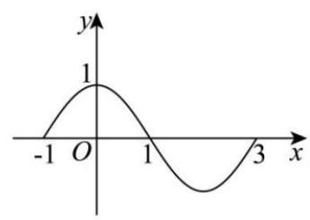

图1

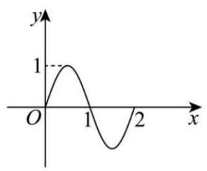

图2

A. $g\left( x\right)  = f\left( {{2x} - \frac{1}{2}}\right)$

B. $g\left( \frac{2023}{3}\right)  =  - \frac{\sqrt{3}}{2}$

C. 方程 $g\left( x\right)  = {\log }_{\frac{1}{4}}x$ 有 4 个不相等的实数解

D. $g\left( x\right)  > \frac{1}{2}$ 的解集为 $\left( {\frac{1}{6} + {2k},\frac{5}{6} + {2k}}\right) , k \in  \mathbf{Z}$

### 6-1-5

(2016上海高考)设 $a, b \in  \mathbf{R}, c \in  \lbrack 0,{2\pi })$ . 若对任意实数 $x$ 都有 $2\sin ({3x} - \; \left. \frac{\pi }{3}\right)  = a\sin \left( {{bx} + c}\right)$ ,则满足条件的有序实数组 $\left( {a, b, c}\right)$ 的组数为___.

### 6-1-6

(2023 新高考 II)已知函数 $f\left( x\right)  = \sin \left( {{\omega x} + \varphi }\right)$ ，如图 $A, B$ 是直线 $y = \frac{1}{2}$ 与曲线 $y = f\left( x\right)$ 的两个交点，若 $\left| {AB}\right|  = \frac{\pi }{6}$ ，则 $f\left( \pi \right)  =$ ___.

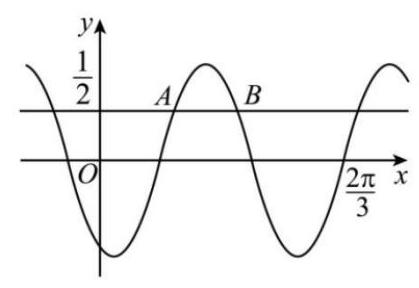

### 6-1-7

(2021 全国甲卷)已知函数 $f\left( x\right)  = 2\cos \left( {{\omega x} + \varphi }\right)$ 的部分图像如图所示，则满足条件 $\left( {f\left( x\right)  - f\left( {-\frac{7\pi }{4}}\right) }\right) \left( {f\left( x\right)  - f\left( \frac{4\pi }{3}\right) }\right)  > 0$ 的最小正整数 $x$ 为___.

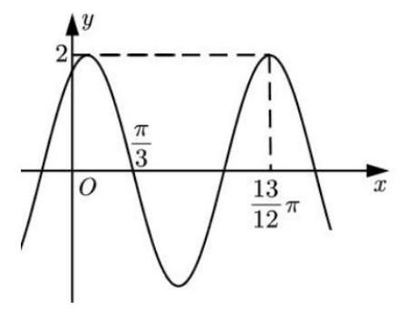

### 6-1-8

(2024 湖北黄冈九调)已知函数 $f\left( x\right)  = 2\sin \left( {{\omega x} + \varphi }\right) \left( {\omega  > 0,\left| \varphi \right|  < \frac{\pi }{2}}\right)$ 的图像过点 $A\left( {0,1}\right)$ 和 $B\left( {{x}_{0}, - 2}\right) \left( {{x}_{0} > 0}\right)$ ,且满足 ${\left| AB\right| }_{\min } = \sqrt{13}$ ,则下列结论正确的是 ( )

A. $\varphi  = \frac{\pi }{6}$ B. $\omega  = \frac{\pi }{3}$

C. 当 $x \in  \left\lbrack  {-\frac{1}{4},1}\right\rbrack$ 时，函数 $f\left( x\right)$ 值域为 $\left\lbrack  {0,1}\right\rbrack$ D. 函数 $y = x - f\left( x\right)$ 有三个零点

### 6-1-9

(2014北京高考)设函数 $f\left( x\right)  = A\sin \left( {{\omega x} + \varphi }\right)$ ( $A$ ， $\omega$ ， $\varphi$ 是常数， $A > 0$ ， $\omega  >$

0). 若 $f\left( x\right)$ 在区间 $\left\lbrack  {\frac{\pi }{6},\frac{\pi }{2}}\right\rbrack$ 上具有单调性,且 $f\left( \frac{\pi }{2}\right)  = f\left( \frac{2\pi }{3}\right)  =  - f\left( \frac{\pi }{6}\right)$ ,则 $f\left( x\right)$ 的最小正周期为___.

### 6-1-10

(2024 湖北武汉二调)如图，在函数 $f\left( x\right)  = \sin \left( {{\omega x} + \varphi }\right)$ 的部分图像中，若 $\overrightarrow{TA} = \overrightarrow{AB}$ ，则点 $A$ 的纵坐标为( )

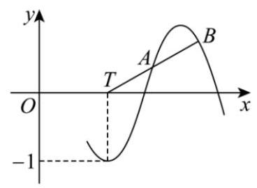

A. $\frac{2 - \sqrt{2}}{2}$ B. $\frac{\sqrt{3} - 1}{2}$ C. $3\sqrt{3} - \sqrt{2}$ D. $2 - \sqrt{3}$

### 6-1-11

(2024 上海奉贤二模) 函数 $y = \sin \left( {{\omega x} + \varphi }\right) \left( {\omega  > 0,\left| \varphi \right|  < \frac{\pi }{2}}\right)$ 的图像记为曲线 $F$ ,如图所示. $A, B, C$ 是曲线 $F$ 与坐标轴相交的三个点,直线 ${BC}$ 与曲线 $F$ 的图像交于点 $M$ ,若直线 ${AM}$ 的斜率为 ${k}_{1}$ ,直线 ${BM}$ 的斜率为 ${k}_{2},{k}_{2} \neq  2{k}_{1}$ ,则直线 ${AB}$ 的斜率为___. (用 ${k}_{1},{k}_{2}$ 表示)

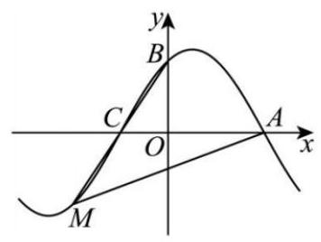

### 6-1-12

函数 $f\left( x\right)  = {\log }_{\frac{2}{5\pi }}x - \sin x$ 零点个数为( )

A. 4 B. 3 C. 2 D. 1

### 6-1-13

(2013新课标 I 卷)函数 $f\left( x\right)  = \left( {1 - \cos x}\right) \sin x$ 在 $\left\lbrack  {-\pi ,\pi }\right\rbrack$ 的图像大致为 ( )

A.

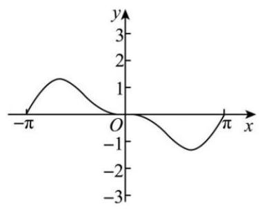

B.

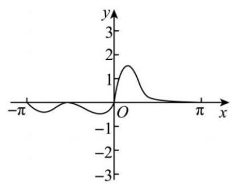

C.

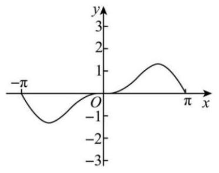

D.

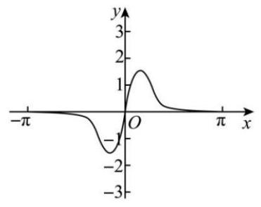

### 6-1-14

(2024 广州一模)已知函数 $f\left( x\right)$ 的部分图像如图所示，则 $f\left( x\right)$ 的解析式可能是( )

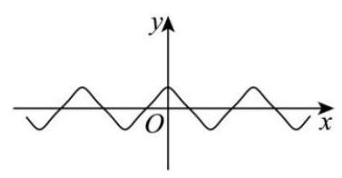

A. $f\left( x\right)  = \sin \left( {\tan x}\right)$ B. $f\left( x\right)  = \tan \left( {\sin x}\right)$

C. $f\left( x\right)  = \cos \left( {\tan x}\right)$ D. $f\left( x\right)  = \tan \left( {\cos x}\right)$

### 6-1-15

(多选) 已知函数 $f\left( x\right)  = A\tan \left( {{\omega x} + \varphi }\right) \left( {\omega  > 0,0 < \varphi  < \pi }\right)$ 的部分图像如图所示，则( )

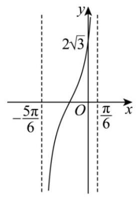

A. $\omega  \cdot  \varphi  \cdot  A = \frac{\pi }{6}$

B. $f\left( x\right)$ 的图像过点 $\left( {\frac{11\pi }{6},\frac{2\sqrt{3}}{3}}\right)$

C. 函数 $y = \left| {f\left( x\right) }\right|$ 的图像关于直线 $x = \frac{5\pi }{3}$ 对称

D. 若函数 $y = \left| {f\left( x\right) }\right|  + {\lambda f}\left( x\right)$ 在区间 $\left( {-\frac{5\pi }{6},\frac{\pi }{6}}\right)$ 上不单调, 则实数 $\lambda$ 的取值范围是 $\left\lbrack  {-1,1}\right\rbrack$

### 6-1-16

(2024 广东广州一模)已知 $\alpha ,\beta$ 是函数 $f\left( x\right)  = 3\sin \left( {{2x} + \frac{\pi }{6}}\right)  - 2$ 在 $\left( {0,\frac{\pi }{2}}\right)$ 上的两个零点,则 $\cos \left( {\alpha  - \beta }\right)  =$ (   )

A. $\frac{2}{3}$ B. $\frac{\sqrt{5}}{3}$ C. $\frac{\sqrt{15} - 2}{6}$ D. $\frac{2\sqrt{3} + \sqrt{5}}{6}$

## 6-2 w的取值范围

### 6-2-1

设函数 $f\left( x\right)  = \sin \left( {{\omega x} + \frac{\pi }{3}}\right)$ 在区间 $\left( {0,\pi }\right)$ 恰有三个极值点、两个零点,则 $\omega$ 的取值范围是( )

A. $\left\lbrack  {\frac{5}{3},\frac{13}{6}}\right)$ B. $\left\lbrack  {\frac{5}{3},\frac{19}{6}}\right)$ C. $\left( {\frac{13}{6},\frac{8}{3}}\right\rbrack$ D. $\left( {\frac{13}{6},\frac{19}{6}}\right\rbrack$

### 6-2-2

已知函数 $f\left( x\right)  = \sin {\omega x}\left( {\omega  > 0}\right)$ ,若 $\exists {x}_{1},{x}_{2} \in  \left\lbrack  {\frac{\pi }{3},\pi }\right\rbrack  , f\left( {x}_{1}\right)  =  - 1, f\left( {x}_{2}\right)  = 1$ , 则实数 $\omega$ 的取值范围是___.

### 6-2-3

已知函数 $f\left( x\right)  = {\sin }^{2}\frac{\omega x}{2} + \frac{1}{2}\sin {\omega x} - \frac{1}{2}\left( {\omega  > 0}\right) , x \in  \mathbf{R}$ . 若 $f\left( x\right)$ 在区间 $\left( {\pi ,{2\pi }}\right)$ 内没有零点,则 $\omega$ 的取值范围是( )

A. $\left( {0,\frac{1}{8}}\right\rbrack$ B. $\left( {0,\frac{1}{4}}\right\rbrack   \cup  \left\lbrack  {\frac{5}{8},1}\right)$

C. $\left( {0,\frac{5}{8}}\right\rbrack$ D. $\left( {0,\frac{1}{8}}\right\rbrack   \cup  \left\lbrack  {\frac{1}{4},\frac{5}{8}}\right\rbrack$

### 6-2-4

已知函数 $f\left( x\right)  = \sin \left( {{\omega x} + \frac{2\pi }{3}}\right) \left( {\omega  > 0}\right)$ 在区间 $\left( {\frac{\pi }{12},\frac{\pi }{6}}\right)$ 上单调递增,则 $\omega$ 的取值范围是( )

A. $\left\lbrack  {2,5}\right\rbrack$ B. $\left\lbrack  {1,{14}}\right\rbrack$ C. $\left\lbrack  {9,{10}}\right\rbrack$ D. $\left\lbrack  {{10},{11}}\right\rbrack$

### 6-2-5

函数 $f\left( x\right)  = 2\sin {\omega x}\left( {\sqrt{3}\sin {\omega x} + \cos {\omega x}}\right) \left( {\omega  > 0}\right)$ 在 $\left( {0,\frac{\pi }{3}}\right)$ 上单调递增,且对任意的实数 $a, f\left( x\right)$ 在 $\left( {a, a + \pi }\right)$ 上不单调,则 $\omega$ 的取值范围为( )

A. $\left( {1,\frac{5}{2}}\right\rbrack$ B. $\left( {1,\frac{5}{4}}\right\rbrack$ C. $\left( {\frac{1}{2},\frac{5}{2}}\right\rbrack$ D. $\left( {\frac{1}{2},\frac{5}{4}}\right\rbrack$

### 6-2-6

已知函数 $f\left( x\right)  = 2\sin \left( {{\omega x} - \frac{\pi }{6}}\right) \left( {\omega  > 0}\right)$ 在 $\left\lbrack  {0,\frac{\pi }{2}}\right\rbrack$ 上的值域为 $\left\lbrack  {-1,2}\right\rbrack$ ,则 $\omega$ 的取值范围为( )

A. $\left\lbrack  {\frac{4}{3},2}\right\rbrack$ B. $\left\lbrack  {\frac{4}{3},\frac{8}{3}}\right\rbrack$ C. $\left\lbrack  {\frac{2}{3},\frac{4}{3}}\right\rbrack$ D. $\left\lbrack  {\frac{2}{3},\frac{8}{3}}\right\rbrack$

### 6-2-7

已知 $f\left( x\right)  = \sin \left( {{\omega x} + \varphi }\right) \left( {\omega  > 0}\right)$ 满足 $f\left( \frac{\pi }{4}\right)  = 1, f\left( {\frac{5}{3}\pi }\right)  = 0$ 且 $f\left( x\right)$ 在 $\left( {\frac{\pi }{4},\frac{5\pi }{6}}\right)$ 上单调，则 $\omega$ 的最大值为( )

A. $\frac{12}{7}$ B. $\frac{18}{17}$ C. $\frac{6}{17}$ D. $\frac{30}{17}$

## 6-3 三角恒等变换

### 6-3-1

(2024 广东茂名一模)若 $\alpha  \in  \left( {\frac{\pi }{4},\frac{3\pi }{4}}\right) ,6\tan \left( {\frac{\pi }{4} + \alpha }\right)  + 4\cos \left( {\frac{\pi }{4} - \alpha }\right)  = 5\cos {2\alpha }$ ， 则 $\sin {2\alpha } =$ (   )

A. $\frac{24}{25}$ B. $\frac{12}{25}$ C. $\frac{7}{25}$ D. $\frac{1}{5}$

### 6-3-2

(2024 福建厦门二检)已知 $\cos \left( {{140}^{ \circ  } - \alpha }\right)  + \sin \left( {{110}^{ \circ  } + \alpha }\right)  = \sin \left( {{130}^{ \circ  } - \alpha }\right)$ , 求 $\tan \alpha  =$ ( )

A. $\frac{\sqrt{3}}{3}$ B. $- \frac{\sqrt{3}}{3}$ C. $\sqrt{3}$ D. $- \sqrt{3}$

### 6-3-3

(2024 江苏南京、盐城一模)已知 $\alpha ,\beta  \in  \left( {0,\frac{\pi }{2}}\right)$ ，且 $\sin \alpha  - \sin \beta  =  - \frac{1}{2}$ ， $\cos \alpha  - \cos \beta  = \frac{1}{2}$ ，则 $\tan \alpha  + \tan \beta  =$ ___.

### 6-3-4

完成下列各题

(1)(1990 全国高考)函数 $y = \sin x\cos x + \sin x + \cos x$ 的最大值是___.

(2)已知函数 $f\left( x\right)  = a\left( {\sin x - \cos x}\right)  + \frac{1}{2}\cos {2x} + x$ ，若 $f\left( x\right)$ 在 $\left\lbrack  {-\frac{\pi }{2},\pi }\right\rbrack$ 上单调递增，则 $a$ 的范围是( )

A. $\left\lbrack  {1,2}\right\rbrack$ B. $\lbrack 0, + \infty )$ C. $\left\lbrack  {0,2}\right\rbrack$ D. $\left\lbrack  {0,1}\right\rbrack$

### 6-3-5

(2024 湖北武汉五调)已知 $\frac{1 + \tan \alpha }{1 - \tan \alpha } = \sqrt{3}$ ，则 ${\sin }^{4}\alpha  + {\cos }^{4}\alpha  =$ ___.

### 6-3-6

(2024 山西晋城二模) 已知 $\tan \alpha  = 2\tan \beta ,\sin \left( {\alpha  + \beta }\right)  = \frac{1}{4}$ ,则 $\sin \left( {\beta  - \alpha }\right)  =$

### 6-3-7

(2024 辽宁沈阳一模) 已知 $\sin \left( {\frac{\pi }{2} - \theta }\right)  + \cos \left( {\frac{\pi }{3} - \theta }\right)  = 1$ ,则 $\cos \left( {{2\theta } - \frac{\pi }{3}}\right)  =$ ( )

A. $\frac{1}{3}$ B. $- \frac{1}{3}$ C. $\frac{\sqrt{3}}{3}$ D. $- \frac{\sqrt{3}}{3}$

### 6-3-8

1796 年, 年仅 19 岁的高斯发现了正十七边形的尺规作图法. 要用尺规作出正十七边形, 就要将圆十七等分. 高斯墓碑上刻着如图所示的图案. 设将圆十七等分后每等份圆弧所对的圆心角为 $\alpha$ ,则 $\mathop{\sum }\limits_{{k = 1}}^{{16}}\frac{2}{1 + {\tan }^{2}\frac{k\alpha }{2}} =$ ___.

### 6-3-9

(2015江苏高考)设向量 $\overrightarrow{{a}_{k}} = \left( {\cos \frac{k\pi }{6},\sin \frac{k\pi }{6} + \cos \frac{k\pi }{6}}\right) \left( {k = 0,1,2,\cdots ,{12}}\right)$ ,则 $\mathop{\sum }\limits_{{k = 0}}^{{11}}\left( {\overline{{a}_{k}} \cdot  \overline{{a}_{k + 1}}}\right)$ 的值为___.

### 6-3-10

(2024 广东深圳三模)设函数 $f\left( x\right)  = \sin x + \sqrt{3}\cos x + 1$ . 若实数 $a, b,\varphi$ 使得 ${af}\left( x\right)  + {bf}\left( {x - \varphi }\right)  = 1$ 对任意 $x \in  \mathbf{R}$ 恒成立，则 $a - b\cos \varphi  =$ (   )

A. -1 B. 0 C. 1 D. $\pm  1$

## 6-4 综合应用

### 6-4-1

(2008 重庆高考)函数 $f\left( x\right)  = \frac{\sin x}{\sqrt{5 + 4\cos x}}\left( {0 \leq  x \leq  {2\pi }}\right)$ 的值域是( )

A. $\left\lbrack  {-\frac{1}{4},\frac{1}{4}}\right\rbrack$ B. $\left\lbrack  {-\frac{1}{3},\frac{1}{3}}\right\rbrack$

C. $\left\lbrack  {-\frac{1}{2},\frac{1}{2}}\right\rbrack$ D. $\left\lbrack  {-\frac{2}{3},\frac{2}{3}}\right\rbrack$

### 6-4-2

(2006 北京高考) 已知向量 $\overrightarrow{a} = \left( {\cos \alpha ,\sin \alpha }\right) ,\overrightarrow{b} = \left( {\cos \beta ,\sin \beta }\right)$ ，且 $\overrightarrow{a} \neq   \pm  \overrightarrow{b}$ ， 那么 $\overrightarrow{a} + \overrightarrow{b}$ 与 $\overrightarrow{a} - \overrightarrow{b}$ 的夹角的大小是___.

### 6-4-3

(多选) (2020 新高考 I) 已知 $O$ 为坐标原点，点 ${P}_{1}\left( {\cos \alpha ,\sin \alpha }\right)$ ， ${P}_{2}\left( {\cos \beta , - }\right. \; \sin \beta ),{P}_{3}\left( {\cos \left( {\alpha  + \beta }\right) ,\sin \left( {\alpha  + \beta }\right) }\right) , A\left( {1,0}\right)$ ,则 ( )

A. $\left| \overrightarrow{O{P}_{1}}\right|  = \left| \overrightarrow{O{P}_{2}}\right|$ B. $\left| \overrightarrow{A{P}_{1}}\right|  = \left| \overrightarrow{A{P}_{2}}\right|$

C. $\overrightarrow{OA} \cdot  \overrightarrow{O{P}_{3}} = \overrightarrow{O{P}_{1}} \cdot  \overrightarrow{O{P}_{2}}$ D. $\overrightarrow{OA} \cdot  \overrightarrow{O{P}_{1}} = \overrightarrow{O{P}_{2}} \cdot  \overrightarrow{O{P}_{3}}$

### 6-4-4

(2016浙江高考) 设函数 $f\left( x\right)  = {\sin }^{2}x + b\sin x + c$ ,则 $f\left( x\right)$ 的最小正周期 ( )

A. 与 $b$ 有关,且与 $c$ 有关

B. 与 $b$ 有关,但与 $c$ 无关

C. 与 $b$ 无关,且与 $c$ 无关

D. 与 $b$ 无关,但与 $c$ 有关

### 6-4-5

(2005 辽宁高考) $\omega$ 是正实数,设 ${S}_{\omega } = \left\{  {\theta  \mid  f\left( x\right)  = \cos \left\lbrack  {\omega \left( {x + \theta }\right) }\right\rbrack  }\right.$ 是奇函数 $\}$ , 若对每个实数 $a,{S}_{\omega } \cap  \left( {a, a + 1}\right)$ 的元素不超过 2 个,且有 $a$ 使 ${S}_{\omega } \cap  \left( {a, a + 1}\right)$ 含 2 个元素，则ω的取值范围是___.

### 6-4-6

(2014 安徽高考)在平面直角坐标系 ${xOy}$ 中，已知向量 $\overrightarrow{a},\overrightarrow{b},\left| \overrightarrow{a}\right|  = \left| \overrightarrow{b}\right|  = 1$ ， $\overrightarrow{a} \cdot  \overrightarrow{b} = 0$ ,点 $Q$ 满足 $\overrightarrow{OQ} = \sqrt{2}\left( {\overrightarrow{a} + \overrightarrow{b}}\right)$ . 曲线 $C = \left\{  {P \mid  \overrightarrow{OP} = \overrightarrow{a}\cos \theta  + \overrightarrow{b}\sin \theta ,0 \leq  }\right. \; \theta  \leq  {2\pi }\}$ ,区域 $\Omega  = \left\{  {P\left| {0 < r \leq  }\right| \overrightarrow{PQ} \mid   \leq  R, r < R}\right\}$ . 若 $C \cap  \Omega$ 为两段分离的曲线, 则( )

A. $1 < r < R < 3$ B. $1 < r < 3 \leq  R$

C. $r \leq  1 < R < 3$ D. $1 < r < 3 < R$

### 6-4-7

(2014浙江高考)设函数 ${f}_{1}\left( x\right)  = {x}^{2},{f}_{2}\left( x\right)  = 2\left( {x - {x}^{2}}\right) ,{f}_{3}\left( x\right)  = \frac{1}{3}\left| {\sin {2\pi x}}\right|$ ， ${a}_{i} = \frac{i}{99}\left( {i = 0,1,2,\ldots ,{99}}\right)$ ,记 ${I}_{k} = \left| {{f}_{k}\left( {a}_{1}\right)  - {f}_{k}\left( {a}_{0}\right) }\right|  + \left| {{f}_{k}\left( {a}_{2}\right)  - {f}_{k}\left( {a}_{1}\right) }\right|  + \ldots  + \; \left| {{f}_{k}\left( {a}_{99}\right)  - {f}_{k}\left( {a}_{98}\right) }\right| , k = 1,2,3$ . 则( )

A. ${I}_{1} < {I}_{2} < {I}_{3}$ B. ${I}_{2} < {I}_{1} < {I}_{3}$

C. ${I}_{1} < {I}_{3} < {I}_{2}$ D. ${I}_{3} < {I}_{2} < {I}_{1}$

### 6-4-8

作单位圆的外切和内接正 $3 \times  {2}^{n}$ 边形 $\left( {n = 1,2,\cdots }\right)$ ,记外切正 $3 \times  {2}^{n}$ 边形周长的一半为 ${a}_{n}$ ,内接正 $3 \times  {2}^{n}$ 边形周长的一半为 ${b}_{n}$ . 计算可得 ${a}_{n} = 3 \times  {2}^{n}\tan {\theta }_{n}$ , 其中 ${\theta }_{n}$ 是正 $3 \times  {2}^{n}$ 边形的一条边所对圆心角的一半.

给出下列四个结论:

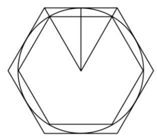

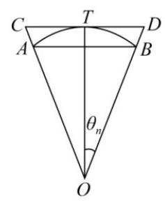

① ${b}_{n} = 3 \times  {2}^{n}\sin {\theta }_{n}$ ;

② $\frac{1}{{a}_{n + 1}} = \frac{1}{{a}_{n}} + \frac{1}{{b}_{n}}$ ;

③ ${b}_{n + 1}^{2} = {a}_{n + 1}{b}_{n}$ ；

④ 记 ${c}_{n} = {a}_{n} - {b}_{n}$ ，则 $\forall n \in  {\mathbf{N}}_{ + }$ ， $\frac{{c}_{n + 1}}{{c}_{n}} < \frac{1}{4}$ . 其中正确结论的序号是___.

### 6-4-9

(2015福建高考)已知函数 $f\left( x\right)  = {10}\sqrt{3}\sin \frac{x}{2}\cos \frac{x}{2} + {10}{\cos }^{2}\frac{x}{2}$ .

(1)求函数 $f\left( x\right)$ 的最小正周期；

(2)将函数 $f\left( x\right)$ 的图像向右平移 $\frac{\pi }{6}$ 个单位长度，再向下平移 $a\left( {a > 0}\right)$ 个单位长度后得到函数 $g\left( x\right)$ 的图像,且函数 $g\left( x\right)$ 的最大值为 2 .

(i) 求函数 $g\left( x\right)$ 的解析式;

(ii) 证明: 存在无穷多个互不相同的正整数 ${x}_{0}$ ,使得 $g\left( {x}_{0}\right)  > 0$ .

### 6-4-10

(2025 广东二调)已知集合 $M = \left\{  {{\theta }_{1},{\theta }_{2},\cdots ,{\theta }_{n}}\right\}  , n \in  {\mathbf{N}}^{ * }$ ，设函数 ${f}_{n}\left( x\right)  = \; {\sin }^{2}\left( {x - {\theta }_{1}}\right)  + {\sin }^{2}\left( {x - {\theta }_{2}}\right)  + \cdots  + {\sin }^{2}\left( {x - {\theta }_{n}}\right) .$

(1)当 $M = \left\{  {0,\frac{\pi }{2}}\right\}$ 和 $\left\{  {\frac{\pi }{4},\frac{\pi }{2}}\right\}$ 时，分别判断函数 ${f}_{2}\left( x\right)$ 是否是常数函数？说明理由；

(2)已知 $M \subseteq  \left\{  {\theta \left| {\;\theta  = \frac{k\pi }{12}}\right. , k \in  \mathbf{N}, k \leq  {12}}\right\}$ ，求函数 ${f}_{3}\left( x\right)$ 是常数函数的概率；

(3)写出函数 ${f}_{n}\left( x\right) \left( {n \geq  2}\right)$ 是常数函数的一个充分条件，并说明理由.
