# 第8章 向量

## 8-1 向量

### 8-1-1

> 原PDF：[打开学生版PDF](<file:///C:/Users/lucky12345/Documents/%E9%AB%98%E4%B8%AD%E6%95%B0%E5%AD%A6%E5%A4%8D%E4%B9%A0/%E5%88%86%E7%B1%BB%E7%89%88/01_%E5%AD%A6%E7%94%9F%E7%89%88-%E8%AE%B2%E4%B9%89/8-1%E5%90%91%E9%87%8F-%E8%AE%B2%E4%B9%89.pdf>)

$\lambda  + \mu$ 为定值 $\Leftrightarrow  C$ 的轨迹是直线:

(1)C在直线 ${AB}$ 上 $\Leftrightarrow  \lambda  + \mu  =$ ___；

证明:

(2)C在 $\bigtriangleup  {OAB}$ 边 ${AB}$ 的中位线上 $\Leftrightarrow  \lambda  + \mu  =$ ___， 证明:

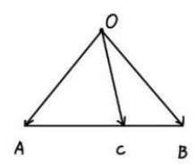

(3)画出 $\lambda  + \mu  = 2$ 时， $C$ 的轨迹；

(4)画出 $\lambda  + \mu  =  - 1$ 时， $C$ 的轨迹；

(5)画出 $\lambda  + \mu  =  - 2$ 时， $C$ 的轨迹；

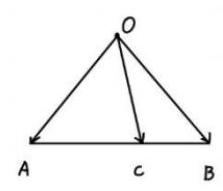

(3)

(4)

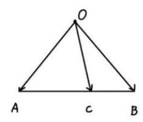

(5)

### 8-1-2

> 原PDF：[打开学生版PDF](<file:///C:/Users/lucky12345/Documents/%E9%AB%98%E4%B8%AD%E6%95%B0%E5%AD%A6%E5%A4%8D%E4%B9%A0/%E5%88%86%E7%B1%BB%E7%89%88/01_%E5%AD%A6%E7%94%9F%E7%89%88-%E8%AE%B2%E4%B9%89/8-1%E5%90%91%E9%87%8F-%E8%AE%B2%E4%B9%89.pdf>)

${a\lambda } + {b\mu } =$ 定值 $\Leftrightarrow  C$ 的轨迹是直线:

对于 $\lambda ,\mu$ 系数不为 1 的情况，可以化归.

(1) ${2\lambda } + \mu  = 1$ 时， $\overrightarrow{OC} = \lambda \overrightarrow{OA} + \mu \overrightarrow{OB} = {2\lambda } \cdot  \frac{\overrightarrow{OA}}{2} + \mu \overrightarrow{OB}$ . 画出 $\overrightarrow{O{A}^{\prime }} = \frac{\overrightarrow{OA}}{2}$ ,那么 $C$ 点轨迹就是___；

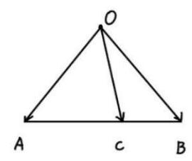

(2) $\lambda  - \mu  = 1$ 时， $\overrightarrow{OC} = \lambda \overrightarrow{OA} + \mu \overrightarrow{OB} = \lambda \overrightarrow{OA} + \left( {-\mu }\right)  \cdot  \left( {-\overrightarrow{OB}}\right)$ . 画出 $\overrightarrow{O{B}^{\prime }} =  - \overrightarrow{OB}$ ， 那么 $C$ 点轨迹就是___；

(3) $\frac{1}{2}\lambda  - {3\mu } = 1$ 时， $\overrightarrow{OC} = \lambda \overrightarrow{OA} + \mu \overrightarrow{OB} = \frac{1}{2}\lambda  \cdot  \left( {2\overrightarrow{OA}}\right)  + \left( {-{3\mu }}\right)  \cdot  \left( {-\frac{1}{3}\overrightarrow{OB}}\right)$ . 画出 $\overrightarrow{O{A}^{\prime }} = 2\overrightarrow{OA},\overrightarrow{O{B}^{\prime }} =  - \frac{1}{3}\overrightarrow{OB}$ ，那么 $C$ 点轨迹就是___.

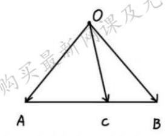

### 8-1-3

> 原PDF：[打开学生版PDF](<file:///C:/Users/lucky12345/Documents/%E9%AB%98%E4%B8%AD%E6%95%B0%E5%AD%A6%E5%A4%8D%E4%B9%A0/%E5%88%86%E7%B1%BB%E7%89%88/01_%E5%AD%A6%E7%94%9F%E7%89%88-%E8%AE%B2%E4%B9%89/8-1%E5%90%91%E9%87%8F-%E8%AE%B2%E4%B9%89.pdf>)

直线

(1)等值线: $\overrightarrow{OC} = \lambda \overrightarrow{OA} + \mu \overrightarrow{OB}$ ，其中 $\lambda  + \mu  = 1$ ，则 $C$ 点轨迹是___；

(2) $\overrightarrow{OC} = \overrightarrow{OA} - t\overrightarrow{OB}$ ，其中 $t \in  \mathbf{R}$ . 画出 $C$ 点轨迹:

### 8-1-4

> 原PDF：[打开学生版PDF](<file:///C:/Users/lucky12345/Documents/%E9%AB%98%E4%B8%AD%E6%95%B0%E5%AD%A6%E5%A4%8D%E4%B9%A0/%E5%88%86%E7%B1%BB%E7%89%88/01_%E5%AD%A6%E7%94%9F%E7%89%88-%E8%AE%B2%E4%B9%89/8-1%E5%90%91%E9%87%8F-%E8%AE%B2%E4%B9%89.pdf>)

圆

(1)到定点距离固定: $O$ 是定点， $\left| \overrightarrow{OC}\right|  = 1$ ，则 $C$ 点轨迹为___；

(2)直径所对圆周角是直角: $A, B$ 是两定点，若 $\overrightarrow{CA} \cdot  \overrightarrow{CB} = 0$ ，则 $C$ 点轨迹是 ___；

(3)同弧所对圆周角相等: $A, B$ 是两定点，若 $\langle \overrightarrow{CA},\overrightarrow{CB}\rangle  = \frac{\pi }{3}$ ，画出 $C$ 点轨迹；

(注:其他角度轨迹也是圆)

(4)阿波罗尼斯圆:设 $A\left( {0,0}\right)$ ， $B\left( {3,0}\right)$ ，若 $\left| {AC}\right|  = 2\left| {BC}\right|$ ，则 $C$ 点轨迹方程为 ___.

若不用勾股定理算, 如何找圆? 取特殊点.

① 线段 ${AB}$ 上的点 ${C}_{1}$ ___在这个圆上；

② 射线 ${AB}$ 上的点 ${C}_{2}$ ___在这个圆上;

③ 根据对称性，以 ${C}_{1}{C}_{2}$ 为直径的圆，就是所求的阿氏圆.

证明:

### 8-1-5

> 原PDF：[打开学生版PDF](<file:///C:/Users/lucky12345/Documents/%E9%AB%98%E4%B8%AD%E6%95%B0%E5%AD%A6%E5%A4%8D%E4%B9%A0/%E5%88%86%E7%B1%BB%E7%89%88/01_%E5%AD%A6%E7%94%9F%E7%89%88-%E8%AE%B2%E4%B9%89/8-1%E5%90%91%E9%87%8F-%E8%AE%B2%E4%B9%89.pdf>)

重心: $G$ 是三条中线交点. 设 $A\left( {{x}_{1},{y}_{1}}\right) , B\left( {{x}_{2},{y}_{2}}\right) , C\left( {{x}_{3},{y}_{3}}\right)$ .

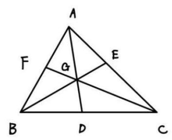

(1) ${AG}$ 交 ${BC}$ 于 ${BC}$ 中点， ${BG}$ 交 ${AC}$ 于 ${AC}$ 中点， ${CG}$ 交 ${AB}$ 于 ${AB}$ 中点；

(2) $\overrightarrow{AG} =$ ___ $\overrightarrow{AD}$ ；

(3) $\overrightarrow{AG} = \overrightarrow{AB} + \overrightarrow{AC}$ ；

(4) $\overrightarrow{GA} + \overrightarrow{GB} + \overrightarrow{GC} = \mathbf{0}$ .

(5)G点坐标为

(6) ${S}_{\bigtriangleup {ABG}} = {S}_{\bigtriangleup {ACG}} = {S}_{\bigtriangleup {BCG}} = \frac{1}{3}{S}_{\bigtriangleup {ABC}}$ ;

证明 (利用“奔驰”定理):

(7)设 $O$ 是平面 ${ABC}$ 内一点， ${\left| \overrightarrow{AO}\right| }^{2} + {\left| \overrightarrow{BO}\right| }^{2} + {\left| \overrightarrow{CO}\right| }^{2} = 3{\left| \overrightarrow{OG}\right| }^{2} + {\left| \overrightarrow{AG}\right| }^{2} + {\left| \overrightarrow{BG}\right| }^{2} + \; {\left| \overrightarrow{CG}\right| }^{2}$ .

证明:

### 8-1-6

> 原PDF：[打开学生版PDF](<file:///C:/Users/lucky12345/Documents/%E9%AB%98%E4%B8%AD%E6%95%B0%E5%AD%A6%E5%A4%8D%E4%B9%A0/%E5%88%86%E7%B1%BB%E7%89%88/01_%E5%AD%A6%E7%94%9F%E7%89%88-%E8%AE%B2%E4%B9%89/8-1%E5%90%91%E9%87%8F-%E8%AE%B2%E4%B9%89.pdf>)

外心: $O$ 是三角形 ${ABC}$ 外接圆圆心;

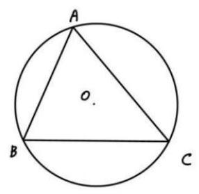

(1) ${AO} = {BO} = {CO}$ ；

(2)圆心角是圆周角的 2 倍: $\angle {AOB} = 2\angle {ACB}$ ， $\angle {AOC} = 2\angle {ABC}$ ；

(3) $\overrightarrow{AO} \cdot  \overrightarrow{AB} = {\left| \overrightarrow{AB}\right| }^{2}$ ；

证明:

(4) ${S}_{\Delta AOB} : {S}_{\Delta BOC} : {S}_{\Delta AOC} = \sin {2C} : \sin {2A} : \sin {2B}$ ；

(5) $\sin {2A} \cdot  \overrightarrow{OA} + \sin {2B} \cdot  \overrightarrow{OB} + \sin {2C} \cdot  \overrightarrow{OC} = \mathbf{0}$ .

(4)(5)证明(“奔驰”定理):

### 8-1-7

> 原PDF：[打开学生版PDF](<file:///C:/Users/lucky12345/Documents/%E9%AB%98%E4%B8%AD%E6%95%B0%E5%AD%A6%E5%A4%8D%E4%B9%A0/%E5%88%86%E7%B1%BB%E7%89%88/01_%E5%AD%A6%E7%94%9F%E7%89%88-%E8%AE%B2%E4%B9%89/8-1%E5%90%91%E9%87%8F-%E8%AE%B2%E4%B9%89.pdf>)

内心: 在三角形 ${ABC}$ 中, $I$ 是三角形 ${ABC}$ 的三条角平分线交点,也是内切圆圆心.

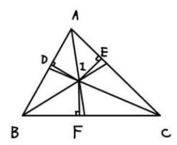

过 $I$ 作 ${AB},{AC},{BC}$ 垂线,垂足分别为 $D, E, F$ . 记 ${BC} = a,{AC} = b,{AB} = \; c, A\left( {{x}_{1},{y}_{1}}\right) , B\left( {{x}_{2},{y}_{2}}\right) , C\left( {{x}_{3},{y}_{3}}\right)$ . 有如下命题:

(1) ${AD} = {AE} =$ ___， ${BD} = {BF} =$ ___， ${CD} = {CE} =$ ___；(用 $a$ ，

$b, c$ 表示)

证明:

(2) $r = {ID} = {IE} = {IF} =$ ___.(用面积 $S$ 和 $a$ ， $b$ ， $c$ 表示)

证明:

(3) ${S}_{\bigtriangleup {AIB}} : {S}_{\bigtriangleup {AIC}} : {S}_{\bigtriangleup {BIC}} = c : b : a$ ；

(4) $a\overrightarrow{IA} + b\overrightarrow{IB} + c\overrightarrow{IC} = 0$ ；

(3)(4)证明:

(5) $\overrightarrow{AI} = \frac{b}{a + b + c}\overrightarrow{AB} + \frac{c}{a + b + c}\overrightarrow{AC}$ ;

证明:

(6) $I\left( {\frac{a{x}_{1} + b{x}_{2} + c{x}_{3}}{a + b + c},\frac{a{y}_{1} + b{y}_{2} + c{y}_{3}}{a + b + c}}\right)$ .

证明:

### 8-1-8

> 原PDF：[打开学生版PDF](<file:///C:/Users/lucky12345/Documents/%E9%AB%98%E4%B8%AD%E6%95%B0%E5%AD%A6%E5%A4%8D%E4%B9%A0/%E5%88%86%E7%B1%BB%E7%89%88/01_%E5%AD%A6%E7%94%9F%E7%89%88-%E8%AE%B2%E4%B9%89/8-1%E5%90%91%E9%87%8F-%E8%AE%B2%E4%B9%89.pdf>)

垂心: $H$ 是三角形三条高的交点.

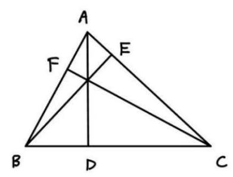

(1) $\overrightarrow{AH} \cdot  \overrightarrow{AB} = \overrightarrow{AC} \cdot  \overrightarrow{AB},\overrightarrow{AH} \cdot  \overrightarrow{AC} = \overrightarrow{AB} \cdot  \overrightarrow{AC}$ ; 证明:

(2) $\tan A \cdot  \overrightarrow{OA} + \tan B \cdot  \overrightarrow{OB} + \tan C \cdot  \overrightarrow{OC} = \mathbf{0}$ . 证明:

### 8-1-9

> 原PDF：[打开学生版PDF](<file:///C:/Users/lucky12345/Documents/%E9%AB%98%E4%B8%AD%E6%95%B0%E5%AD%A6%E5%A4%8D%E4%B9%A0/%E5%88%86%E7%B1%BB%E7%89%88/01_%E5%AD%A6%E7%94%9F%E7%89%88-%E8%AE%B2%E4%B9%89/8-1%E5%90%91%E9%87%8F-%E8%AE%B2%E4%B9%89.pdf>)

(2024 四川一模)如图，在 $\bigtriangleup  {ABC}$ 中，点 $D$ ， $E$ 分别在 ${AB},{AC}$ 边上，且 $\overrightarrow{BD} = \overrightarrow{DA}$ ， $\overrightarrow{AE} = 3\overrightarrow{EC}$ ，点 $F$ 为 ${DE}$ 中点，则 $\overrightarrow{BF} =$ ()

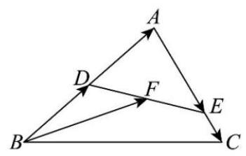

A. $- \frac{1}{8}\overrightarrow{BA} + \frac{3}{8}\overrightarrow{BC}$ B. $\frac{3}{4}\overrightarrow{BA} + \frac{1}{2}\overrightarrow{BC}$

C. $\frac{3}{8}\overrightarrow{BA} + \frac{3}{8}\overrightarrow{BC}$ D. $\frac{3}{8}\overrightarrow{BA} + \frac{3}{4}\overrightarrow{BC}$

### 8-1-10

> 原PDF：[打开学生版PDF](<file:///C:/Users/lucky12345/Documents/%E9%AB%98%E4%B8%AD%E6%95%B0%E5%AD%A6%E5%A4%8D%E4%B9%A0/%E5%88%86%E7%B1%BB%E7%89%88/01_%E5%AD%A6%E7%94%9F%E7%89%88-%E8%AE%B2%E4%B9%89/8-1%E5%90%91%E9%87%8F-%E8%AE%B2%E4%B9%89.pdf>)

(2016江苏高考)如图，在 $\bigtriangleup  {ABC}$ 中， $D$ 是 ${BC}$ 的中点， $E$ ， $F$ 是 ${AD}$ 上的两个三等分点, $\overrightarrow{BA} \cdot  \overrightarrow{CA} = 4,\overrightarrow{BF} \cdot  \overrightarrow{CF} =  - 1$ ,则 $\overrightarrow{BE} \cdot  \overrightarrow{CE}$ 的值是___.

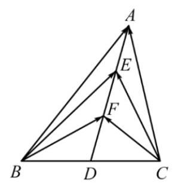

### 8-1-11

> 原PDF：[打开学生版PDF](<file:///C:/Users/lucky12345/Documents/%E9%AB%98%E4%B8%AD%E6%95%B0%E5%AD%A6%E5%A4%8D%E4%B9%A0/%E5%88%86%E7%B1%BB%E7%89%88/01_%E5%AD%A6%E7%94%9F%E7%89%88-%E8%AE%B2%E4%B9%89/8-1%E5%90%91%E9%87%8F-%E8%AE%B2%E4%B9%89.pdf>)

(2023四川乐山一模)已知正六边形 ${ABCDEF}$ 边长为 2， ${MN}$ 是正六边形 ${ABCDEF}$ 的外接圆的一条动弦， ${MN} = 2, P$ 为正六边形 ${ABCDEF}$ 边上的动点，则 $\overrightarrow{PM} \cdot  \overrightarrow{PN}$ 的最小值为___.

### 8-1-12

> 原PDF：[打开学生版PDF](<file:///C:/Users/lucky12345/Documents/%E9%AB%98%E4%B8%AD%E6%95%B0%E5%AD%A6%E5%A4%8D%E4%B9%A0/%E5%88%86%E7%B1%BB%E7%89%88/01_%E5%AD%A6%E7%94%9F%E7%89%88-%E8%AE%B2%E4%B9%89/8-1%E5%90%91%E9%87%8F-%E8%AE%B2%E4%B9%89.pdf>)

(多选)(2023 山东阶段练习)“奔驰定理”因其几何表示酷似奔驰的标志得来, 是平面向量中一个非常优美的结论. 奔驰定理与三角形四心 (重心、内心、 外心、垂心) 有着神秘的关联. 它的具体内容是: 已知 $M$ 是 $\bigtriangleup {ABC}$ 内一点, $\bigtriangleup {BMC}$ , $\bigtriangleup {AMC},\bigtriangleup {AMB}$ 的面积分别为 ${S}_{A},{S}_{B},{S}_{C}$ ,且 ${S}_{A} \cdot  \overrightarrow{MA} + {S}_{B} \cdot  \overrightarrow{MB} + {S}_{C} \cdot  \overrightarrow{MC} = \overrightarrow{0}$ . 以下命题正确的有( )

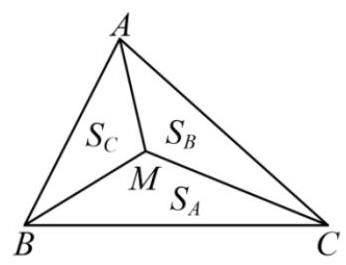

A. 若 ${S}_{A} : {S}_{B} : {S}_{C} = 1 : 1 : 1$ ,则 $M$ 为 $\bigtriangleup {AMC}$ 的重心

B. 若 $M$ 为 $\bigtriangleup {ABC}$ 的内心，则 ${BC} \cdot  \overrightarrow{MA} + {AC} \cdot  \overrightarrow{MB} + {AB} \cdot  \overrightarrow{MC} = \overrightarrow{0}$

C. 若 $\angle {BAC} = {45}^{ \circ  }$ ， $\angle {ABC} = {60}^{ \circ  }$ ， $M$ 为 $\bigtriangleup {ABC}$ 的外心，则 ${S}_{A}$ : ${S}_{B}$ : ${S}_{C} = \sqrt{3}$ : $2 : 1$

D. 若 $M$ 为 $\bigtriangleup {ABC}$ 的垂心， $3\overrightarrow{MA} + 4\overrightarrow{MB} + 5\overrightarrow{MC} = \overrightarrow{0}$ ，则 $\cos \angle {AMB} =  - \frac{\sqrt{6}}{6}$

### 8-1-13

> 原PDF：[打开学生版PDF](<file:///C:/Users/lucky12345/Documents/%E9%AB%98%E4%B8%AD%E6%95%B0%E5%AD%A6%E5%A4%8D%E4%B9%A0/%E5%88%86%E7%B1%BB%E7%89%88/01_%E5%AD%A6%E7%94%9F%E7%89%88-%E8%AE%B2%E4%B9%89/8-1%E5%90%91%E9%87%8F-%E8%AE%B2%E4%B9%89.pdf>)

已知 $O$ 是 $\bigtriangleup {ABC}$ 的外心， ${AB} = 6,{AC} = {10}$ ，若 $\overrightarrow{AO} = x\overrightarrow{AB} + y\overrightarrow{AC}$ ，且 ${2x} + {10y} = \; 5\left( {x \neq  0}\right)$ ，则 $\bigtriangleup  {ABC}$ 的面积为___.

### 8-1-14

> 原PDF：[打开学生版PDF](<file:///C:/Users/lucky12345/Documents/%E9%AB%98%E4%B8%AD%E6%95%B0%E5%AD%A6%E5%A4%8D%E4%B9%A0/%E5%88%86%E7%B1%BB%E7%89%88/01_%E5%AD%A6%E7%94%9F%E7%89%88-%E8%AE%B2%E4%B9%89/8-1%E5%90%91%E9%87%8F-%E8%AE%B2%E4%B9%89.pdf>)

(1)(2013 江苏高考)设 $D$ ， $E$ 分别是 $\bigtriangleup  {ABC}$ 的边 ${AB}$ ， ${BC}$ 上的点， ${AD} = \frac{1}{2}{AB}$ ， ${BE} = \frac{2}{3}{BC}$ . 若 $\overrightarrow{DE} = {\lambda }_{1}\overrightarrow{AB} + {\lambda }_{2}\overrightarrow{AC}\left( {{\lambda }_{1},{\lambda }_{2}\text{ 为实数 }}\right)$ ，则 ${\lambda }_{1} + {\lambda }_{2}$ 的值是___.

(2)(2009 安徽高考)给定两个长度为 1 的平面向量 $\overrightarrow{OA}$ 和 $\overrightarrow{OB}$ ，它们的夹角为 ${120}^{ \circ  }$ . 如图所示,点 $C$ 在以 $O$ 为圆心的圆弧 $\overset{\text{ ⏜ }}{AB}$ 上变动. 若 $\overrightarrow{OC} = x\overrightarrow{OA} + y\overrightarrow{OB}$ , 其中 $x, y \in  \mathbf{R}$ ,则 $x + y$ 的最大值是___.

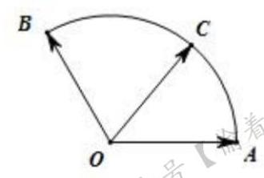

(3)(2017全国高考)在矩形 ${ABCD}$ 中， ${AB} = 1,{AD} = 2$ ，动点 $P$ 在以点 $C$ 为圆心且与 ${BD}$ 相切的圆上. 若 $\overrightarrow{AP} = \lambda \overrightarrow{AB} + \mu \overrightarrow{AD}$ ,则 $\lambda  + \mu$ 的最大值为( )

A. 3 B. $2\sqrt{2}$ C. $\sqrt{5}$ D. 2

(4)(2017 江苏高考)如图，在同一个平面内，向量 $\overrightarrow{OA}$ ， $\overrightarrow{OB}$ ， $\overrightarrow{OC}$ 的模分别为 $1,1,\sqrt{2},\overrightarrow{OA}$ 与 $\overrightarrow{OC}$ 的夹角为 $\alpha$ ,且 $\tan \alpha  = 7,\overrightarrow{OB}$ 与 $\overrightarrow{OC}$ 的夹角为 ${45}^{ \circ  }$ ,若 $\overrightarrow{OC} = \; m\overrightarrow{OA} + n\overrightarrow{OB}\left( {m, n \in  \mathbf{R}}\right)$ ,则 $m + n =$ ___.

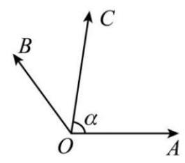

### 8-1-15

> 原PDF：[打开学生版PDF](<file:///C:/Users/lucky12345/Documents/%E9%AB%98%E4%B8%AD%E6%95%B0%E5%AD%A6%E5%A4%8D%E4%B9%A0/%E5%88%86%E7%B1%BB%E7%89%88/01_%E5%AD%A6%E7%94%9F%E7%89%88-%E8%AE%B2%E4%B9%89/8-1%E5%90%91%E9%87%8F-%E8%AE%B2%E4%B9%89.pdf>)

(2023 天津高考)在 $\bigtriangleup {ABC}$ 中， ${BC} = 1$ ， $\angle A = {60}^{ \circ  }$ ， $\overrightarrow{AD} = \frac{1}{2}\overrightarrow{AB}$ ， $\overrightarrow{CE} = \frac{1}{2}\overrightarrow{CD}$ . 记 $\overrightarrow{AB} = \mathbf{a},\overrightarrow{AC} = \mathbf{b}$ ，用 $\mathbf{a},\mathbf{b}$ 表示 $\overrightarrow{AE} =$ ___；若 $\overrightarrow{BF} = \frac{1}{3}\overrightarrow{BC}$ ，则 $\overrightarrow{AE} \cdot  \overrightarrow{AF}$ 的最大值为___.

### 8-1-16

> 原PDF：[打开学生版PDF](<file:///C:/Users/lucky12345/Documents/%E9%AB%98%E4%B8%AD%E6%95%B0%E5%AD%A6%E5%A4%8D%E4%B9%A0/%E5%88%86%E7%B1%BB%E7%89%88/01_%E5%AD%A6%E7%94%9F%E7%89%88-%E8%AE%B2%E4%B9%89/8-1%E5%90%91%E9%87%8F-%E8%AE%B2%E4%B9%89.pdf>)

(2016 四川高考)已知正三角形 ${ABC}$ 的边长为 $2\sqrt{3}$ ，平面 ${ABC}$ 内的动点 $P$ ， $M$ 满足 $\left| \overrightarrow{AP}\right|  = 1$ ， $\overrightarrow{PM} = \overrightarrow{MC}$ ，则 ${\left| \overrightarrow{BM}\right| }^{2}$ 的最大值是( )

A. $\frac{13}{4}$ B. $\frac{49}{4}$ C. $\frac{{37} + 6\sqrt{3}}{4}$ D. $\frac{{37} + 2\sqrt{33}}{4}$

### 8-1-17

> 原PDF：[打开学生版PDF](<file:///C:/Users/lucky12345/Documents/%E9%AB%98%E4%B8%AD%E6%95%B0%E5%AD%A6%E5%A4%8D%E4%B9%A0/%E5%88%86%E7%B1%BB%E7%89%88/01_%E5%AD%A6%E7%94%9F%E7%89%88-%E8%AE%B2%E4%B9%89/8-1%E5%90%91%E9%87%8F-%E8%AE%B2%E4%B9%89.pdf>)

(2013 湖南高考)已知 $\mathbf{a},\mathbf{b}$ 是单位向量， $\mathbf{a} \cdot  \mathbf{b} = 0$ . 若向量 $\mathbf{c}$ 满足 $\left| {\mathbf{c} - \mathbf{a} - \mathbf{b}}\right|  =$

1,则 $\left| \mathbf{c}\right|$ 的取值范围是( )

A. $\left\lbrack  {\sqrt{2} - 1,\sqrt{2} + 1}\right\rbrack$ B. $\left\lbrack  {\sqrt{2} - 1,\sqrt{2} + 2}\right\rbrack$

C. $\left\lbrack  {1,\sqrt{2} + 1}\right\rbrack$ D. $\left\lbrack  {1,\sqrt{2} + 2}\right\rbrack$

### 8-1-18

> 原PDF：[打开学生版PDF](<file:///C:/Users/lucky12345/Documents/%E9%AB%98%E4%B8%AD%E6%95%B0%E5%AD%A6%E5%A4%8D%E4%B9%A0/%E5%88%86%E7%B1%BB%E7%89%88/01_%E5%AD%A6%E7%94%9F%E7%89%88-%E8%AE%B2%E4%B9%89/8-1%E5%90%91%E9%87%8F-%E8%AE%B2%E4%B9%89.pdf>)

(2011全国高考)设向量 $\mathbf{a},\mathbf{b},\mathbf{c}$ 满足 $\left| \mathbf{a}\right|  = \left| \mathbf{b}\right|  = 2,\mathbf{a} \cdot  \mathbf{b} =  - 2,\langle \mathbf{a} - \mathbf{c},\mathbf{b} - \mathbf{c}\rangle  = \; {60}^{ \circ  }$ ,则 $\left| \mathbf{c}\right|$ 的最大值等于( )

A. 4 B. 2 C. $\sqrt{2}$ D. 1

### 8-1-19

> 原PDF：[打开学生版PDF](<file:///C:/Users/lucky12345/Documents/%E9%AB%98%E4%B8%AD%E6%95%B0%E5%AD%A6%E5%A4%8D%E4%B9%A0/%E5%88%86%E7%B1%BB%E7%89%88/01_%E5%AD%A6%E7%94%9F%E7%89%88-%E8%AE%B2%E4%B9%89/8-1%E5%90%91%E9%87%8F-%E8%AE%B2%E4%B9%89.pdf>)

(2024 上海徐汇二模)如图所示，已知 $\bigtriangleup  {ABC}$ 满足 ${BC} = 8,{AC} = {3AB}, P$ 为 $\bigtriangleup {ABC}$ 所在平面内一点. 定义点集 $D = \left\{  {P\left| {\;\overrightarrow{AP} = {3\lambda }\overrightarrow{AB} + \frac{1 - \lambda }{3}\overrightarrow{AC}}\right. ,\lambda  \in  \mathbf{R}}\right\}$ . 若存在点 ${P}_{0} \in  D$ ,使得对任意 $P \in  D$ ,满足 $\left| \overrightarrow{AP}\right|  \geq  \left| \overrightarrow{A{P}_{0}}\right|$ 恒成立,则 $\left| \overrightarrow{A{P}_{0}}\right|$ 的最大值为___.

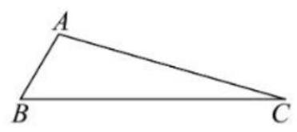

### 8-1-20

> 原PDF：[打开学生版PDF](<file:///C:/Users/lucky12345/Documents/%E9%AB%98%E4%B8%AD%E6%95%B0%E5%AD%A6%E5%A4%8D%E4%B9%A0/%E5%88%86%E7%B1%BB%E7%89%88/01_%E5%AD%A6%E7%94%9F%E7%89%88-%E8%AE%B2%E4%B9%89/8-1%E5%90%91%E9%87%8F-%E8%AE%B2%E4%B9%89.pdf>)

(2024 湖北模拟预测)向量 $\mathbf{a},\mathbf{b}$ 满足 $\langle \mathbf{a},\mathbf{b}\rangle  = \frac{\pi }{6},\left| \mathbf{b}\right|  = \frac{4}{3}\sqrt{3}$ ，且 $\forall t \in  \mathbf{R}$ ，不等式 $\left| {\mathbf{b} + t\mathbf{a}}\right|  \geq  \left| {\mathbf{b} - \mathbf{a}}\right|$ 恒成立. 函数 $f\left( x\right)  = \left| {x\mathbf{b} - \mathbf{a}}\right|  + \left| {x\mathbf{b} - \frac{1}{2}\mathbf{a}}\right| \left( {x \in  \mathbf{R}}\right)$ 的最小值为( )

A. $\frac{1}{2}$ B. 1 C. $\sqrt{3}$ D. $\sqrt{5}$

### 8-1-21

> 原PDF：[打开学生版PDF](<file:///C:/Users/lucky12345/Documents/%E9%AB%98%E4%B8%AD%E6%95%B0%E5%AD%A6%E5%A4%8D%E4%B9%A0/%E5%88%86%E7%B1%BB%E7%89%88/01_%E5%AD%A6%E7%94%9F%E7%89%88-%E8%AE%B2%E4%B9%89/8-1%E5%90%91%E9%87%8F-%E8%AE%B2%E4%B9%89.pdf>)

(2023 山东济宁二模)已知向量 $\mathbf{a}$ ， $\mathbf{b}$ 不共线，夹角为 $\theta$ ，且 $\left| \mathbf{a}\right|  = 2$ ， $\left| \mathbf{b}\right|  = 1$ ， $\left| {\mathbf{a} + \lambda \mathbf{b}}\right|  + \left| {\mathbf{a} - \lambda \mathbf{b}}\right|  = 4\sqrt{2}$ ，若 $\frac{4\sqrt{3}}{3} \leq  \lambda  < 2\sqrt{2}$ ，则 $\left| {\cos \theta }\right|$ 的最小值为___.
