# 第9章 立体几何

## 9-1 轨迹与最值

### 9-1-1

> 原PDF：[打开学生版PDF](<file:///C:/Users/lucky12345/Documents/%E9%AB%98%E4%B8%AD%E6%95%B0%E5%AD%A6%E5%A4%8D%E4%B9%A0/%E5%88%86%E7%B1%BB%E7%89%88/01_%E5%AD%A6%E7%94%9F%E7%89%88-%E8%AE%B2%E4%B9%89/9-1%E7%AB%8B%E4%BD%93%E5%87%A0%E4%BD%95%EF%BC%9A%E8%BD%A8%E8%BF%B9%E4%B8%8E%E6%9C%80%E5%80%BC-%E8%AE%B2%E4%B9%89.pdf>)

$M$ 是 $A{A}_{1}$ 中点, $P$ 是正方体 ${ABCD} - {A}_{1}{B}_{1}{C}_{1}{D}_{1}$ 内部或表面上的动点,满足 ${MP}//$ 平面 ${AD}{C}_{1}$ .

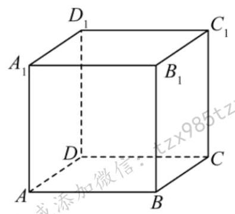

### 9-1-2

> 原PDF：[打开学生版PDF](<file:///C:/Users/lucky12345/Documents/%E9%AB%98%E4%B8%AD%E6%95%B0%E5%AD%A6%E5%A4%8D%E4%B9%A0/%E5%88%86%E7%B1%BB%E7%89%88/01_%E5%AD%A6%E7%94%9F%E7%89%88-%E8%AE%B2%E4%B9%89/9-1%E7%AB%8B%E4%BD%93%E5%87%A0%E4%BD%95%EF%BC%9A%E8%BD%A8%E8%BF%B9%E4%B8%8E%E6%9C%80%E5%80%BC-%E8%AE%B2%E4%B9%89.pdf>)

$M$ 是 $A{A}_{1}$ 中点, $P$ 是正方体 ${ABCD} - {A}_{1}{B}_{1}{C}_{1}{D}_{1}$ 表面上的动点,满足 ${MP} \bot  B{C}_{1}$ .

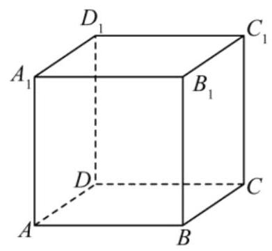

### 9-1-3

> 原PDF：[打开学生版PDF](<file:///C:/Users/lucky12345/Documents/%E9%AB%98%E4%B8%AD%E6%95%B0%E5%AD%A6%E5%A4%8D%E4%B9%A0/%E5%88%86%E7%B1%BB%E7%89%88/01_%E5%AD%A6%E7%94%9F%E7%89%88-%E8%AE%B2%E4%B9%89/9-1%E7%AB%8B%E4%BD%93%E5%87%A0%E4%BD%95%EF%BC%9A%E8%BD%A8%E8%BF%B9%E4%B8%8E%E6%9C%80%E5%80%BC-%E8%AE%B2%E4%B9%89.pdf>)

$P$ 是正方体 ${ABCD} - {A}_{1}{B}_{1}{C}_{1}{D}_{1}$ 表面上的动点,满足 $\angle {A}_{1}{AP} = \frac{\pi }{4}$ .

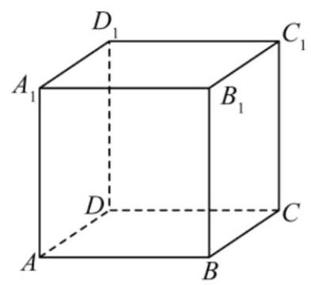

### 9-1-4

> 原PDF：[打开学生版PDF](<file:///C:/Users/lucky12345/Documents/%E9%AB%98%E4%B8%AD%E6%95%B0%E5%AD%A6%E5%A4%8D%E4%B9%A0/%E5%88%86%E7%B1%BB%E7%89%88/01_%E5%AD%A6%E7%94%9F%E7%89%88-%E8%AE%B2%E4%B9%89/9-1%E7%AB%8B%E4%BD%93%E5%87%A0%E4%BD%95%EF%BC%9A%E8%BD%A8%E8%BF%B9%E4%B8%8E%E6%9C%80%E5%80%BC-%E8%AE%B2%E4%B9%89.pdf>)

$P$ 是正方体 ${ABCD} - {A}_{1}{B}_{1}{C}_{1}{D}_{1}$ 表面上的动点,满足 $\angle {APC} = \frac{\pi }{2}$ .

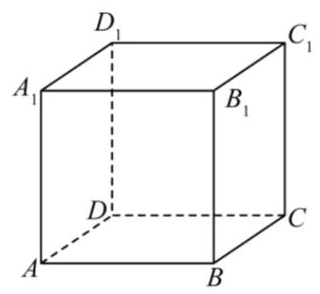

### 9-1-5

> 原PDF：[打开学生版PDF](<file:///C:/Users/lucky12345/Documents/%E9%AB%98%E4%B8%AD%E6%95%B0%E5%AD%A6%E5%A4%8D%E4%B9%A0/%E5%88%86%E7%B1%BB%E7%89%88/01_%E5%AD%A6%E7%94%9F%E7%89%88-%E8%AE%B2%E4%B9%89/9-1%E7%AB%8B%E4%BD%93%E5%87%A0%E4%BD%95%EF%BC%9A%E8%BD%A8%E8%BF%B9%E4%B8%8E%E6%9C%80%E5%80%BC-%E8%AE%B2%E4%B9%89.pdf>)

$P$ 是三角形 ${A}_{1}B{C}_{1}$ 内一点,满足 ${PD} = \frac{\sqrt{15}}{3}$ .

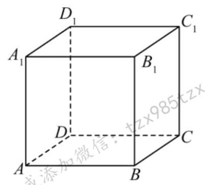

### 9-1-6

> 原PDF：[打开学生版PDF](<file:///C:/Users/lucky12345/Documents/%E9%AB%98%E4%B8%AD%E6%95%B0%E5%AD%A6%E5%A4%8D%E4%B9%A0/%E5%88%86%E7%B1%BB%E7%89%88/01_%E5%AD%A6%E7%94%9F%E7%89%88-%E8%AE%B2%E4%B9%89/9-1%E7%AB%8B%E4%BD%93%E5%87%A0%E4%BD%95%EF%BC%9A%E8%BD%A8%E8%BF%B9%E4%B8%8E%E6%9C%80%E5%80%BC-%E8%AE%B2%E4%B9%89.pdf>)

$P$ 是三角形 ${ABC}$ 内一点,将三角形 ${ABC}$ 沿 ${BC}$ 翻折,得到的 $P$ 点轨迹.

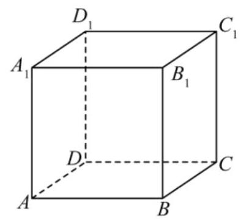

### 9-1-7

> 原PDF：[打开学生版PDF](<file:///C:/Users/lucky12345/Documents/%E9%AB%98%E4%B8%AD%E6%95%B0%E5%AD%A6%E5%A4%8D%E4%B9%A0/%E5%88%86%E7%B1%BB%E7%89%88/01_%E5%AD%A6%E7%94%9F%E7%89%88-%E8%AE%B2%E4%B9%89/9-1%E7%AB%8B%E4%BD%93%E5%87%A0%E4%BD%95%EF%BC%9A%E8%BD%A8%E8%BF%B9%E4%B8%8E%E6%9C%80%E5%80%BC-%E8%AE%B2%E4%B9%89.pdf>)

$P$ 是正方形 ${ABCD}$ 上的动点,满足 $\angle A{A}_{1}P = \frac{\pi }{6}$ .

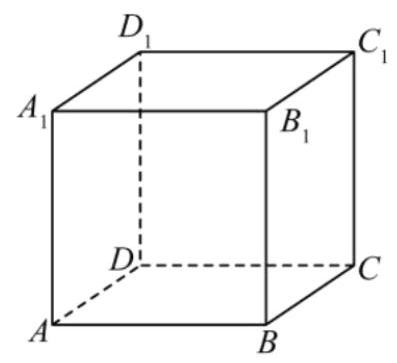

### 9-1-8

> 原PDF：[打开学生版PDF](<file:///C:/Users/lucky12345/Documents/%E9%AB%98%E4%B8%AD%E6%95%B0%E5%AD%A6%E5%A4%8D%E4%B9%A0/%E5%88%86%E7%B1%BB%E7%89%88/01_%E5%AD%A6%E7%94%9F%E7%89%88-%E8%AE%B2%E4%B9%89/9-1%E7%AB%8B%E4%BD%93%E5%87%A0%E4%BD%95%EF%BC%9A%E8%BD%A8%E8%BF%B9%E4%B8%8E%E6%9C%80%E5%80%BC-%E8%AE%B2%E4%B9%89.pdf>)

(多选) (2024 湖北七市调研) 如图,棱长为 2 的正方体 ${ABCD} - {A}_{1}{B}_{1}{C}_{1}{D}_{1}$ 中, $E$ 为棱 $D{D}_{1}$ 的中点, $F$ 为正方形 ${C}_{1}{CD}{D}_{1}$ 内一个动点 (包括边界),且 ${B}_{1}F\parallel$ 平面 ${A}_{1}{BE}$ ,则下列说法正确的有( )

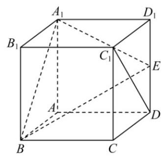

A. 动点 $F$ 轨迹的长度为 $\sqrt{2}$

B. 三棱锥 ${B}_{1} - {D}_{1}{EF}$ 体积的最小值为 $\frac{1}{3}$

C. ${B}_{1}F$ 与 ${A}_{1}B$ 不可能垂直

D. 当三棱锥 ${B}_{1} - {D}_{1}{DF}$ 的体积最大时,其外接球的表面积为 $\frac{25}{2}\pi$

### 9-1-9

> 原PDF：[打开学生版PDF](<file:///C:/Users/lucky12345/Documents/%E9%AB%98%E4%B8%AD%E6%95%B0%E5%AD%A6%E5%A4%8D%E4%B9%A0/%E5%88%86%E7%B1%BB%E7%89%88/01_%E5%AD%A6%E7%94%9F%E7%89%88-%E8%AE%B2%E4%B9%89/9-1%E7%AB%8B%E4%BD%93%E5%87%A0%E4%BD%95%EF%BC%9A%E8%BD%A8%E8%BF%B9%E4%B8%8E%E6%9C%80%E5%80%BC-%E8%AE%B2%E4%B9%89.pdf>)

(2023 湖南长沙四校联考)在四棱锥 $P - {ABCD}$ 中，底面 ${ABCD}$ 是矩形， ${AD} = \sqrt{2}$ ， ${AB} = {AP} = {PD} = 1$ ，平面 ${PAD}\bot$ 平面 ${ABCD}$ ，点 $M$ 在线段 ${PC}$ 上运动(不含端点). 判断: 是否存在点 $M$ ,使得 ${BD} \bot  {AM}$ ,并说明理由.

### 9-1-10

> 原PDF：[打开学生版PDF](<file:///C:/Users/lucky12345/Documents/%E9%AB%98%E4%B8%AD%E6%95%B0%E5%AD%A6%E5%A4%8D%E4%B9%A0/%E5%88%86%E7%B1%BB%E7%89%88/01_%E5%AD%A6%E7%94%9F%E7%89%88-%E8%AE%B2%E4%B9%89/9-1%E7%AB%8B%E4%BD%93%E5%87%A0%E4%BD%95%EF%BC%9A%E8%BD%A8%E8%BF%B9%E4%B8%8E%E6%9C%80%E5%80%BC-%E8%AE%B2%E4%B9%89.pdf>)

(多选) (2023 广东深圳调研) 如图,已知正三棱台 ${ABC} - {A}_{1}{B}_{1}{C}_{1}$ 的上、下底面边长分别为 2 和 3,侧棱长为 1,点 $P$ 在侧面 ${BC}{C}_{1}{B}_{1}$ 内运动(包含边界)，且 ${AP}$ 与平面 ${BC}{C}_{1}{B}_{1}$ 所成角的正切值为 $\sqrt{6}$ ，则()

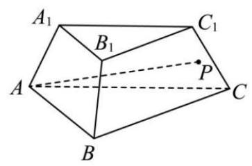

A. ${CP}$ 长度的最小值为 $\sqrt{3} - 1$

B. 存在点 $P$ ,使得 ${AP} \bot  {BC}$

C. 存在点 $P$ ,存在点 $Q \in  {B}_{1}{C}_{1}$ ,使得 ${AP}//{A}_{1}Q$

D. 所有满足条件的动线段 ${AP}$ 形成的曲面面积为 $\frac{\sqrt{7}\pi }{3}$

### 9-1-11

> 原PDF：[打开学生版PDF](<file:///C:/Users/lucky12345/Documents/%E9%AB%98%E4%B8%AD%E6%95%B0%E5%AD%A6%E5%A4%8D%E4%B9%A0/%E5%88%86%E7%B1%BB%E7%89%88/01_%E5%AD%A6%E7%94%9F%E7%89%88-%E8%AE%B2%E4%B9%89/9-1%E7%AB%8B%E4%BD%93%E5%87%A0%E4%BD%95%EF%BC%9A%E8%BD%A8%E8%BF%B9%E4%B8%8E%E6%9C%80%E5%80%BC-%E8%AE%B2%E4%B9%89.pdf>)

(多选) (2023 山东淄博一模) 如图,在正方体 ${ABCD} - {A}_{1}{B}_{1}{C}_{1}{D}_{1}$ 中, ${AB} = 2$ , $P$ 是正方形 ${ABCD}$ 内部(含边界)的一个动点，则( )

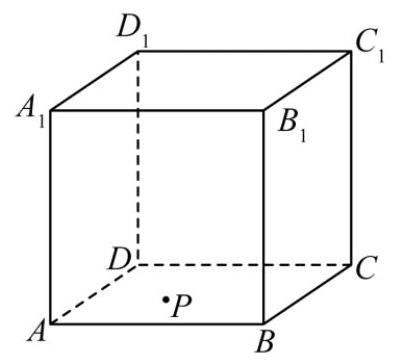

A. 存在唯一点 $P$ ,使得 ${D}_{1}P \bot  {B}_{1}C$

B. 存在唯一点 $P$ ,使得直线 ${D}_{1}P$ 与平面 ${ABCD}$ 所成的角取到最小值

C. 若 $\overrightarrow{DP} = \frac{1}{2}\overrightarrow{DB}$ ,则三棱锥 $P - B{B}_{1}C$ 外接球的表面积为 ${8\pi }$

D. 若异面直线 ${D}_{1}P$ 与 ${A}_{1}B$ 所成的角为 $\frac{\pi }{4}$ ，则动点 $P$ 的轨迹是抛物线的一部分

### 9-1-12

> 原PDF：[打开学生版PDF](<file:///C:/Users/lucky12345/Documents/%E9%AB%98%E4%B8%AD%E6%95%B0%E5%AD%A6%E5%A4%8D%E4%B9%A0/%E5%88%86%E7%B1%BB%E7%89%88/01_%E5%AD%A6%E7%94%9F%E7%89%88-%E8%AE%B2%E4%B9%89/9-1%E7%AB%8B%E4%BD%93%E5%87%A0%E4%BD%95%EF%BC%9A%E8%BD%A8%E8%BF%B9%E4%B8%8E%E6%9C%80%E5%80%BC-%E8%AE%B2%E4%B9%89.pdf>)

(2024 北京海淀二模)如图，在正方体 ${ABCD} - {A}_{1}{B}_{1}{C}_{1}{D}_{1}$ 中， $P$ 为棱 ${AB}$ 上的动点, ${DQ} \bot$ 平面 ${D}_{1}{PC}, Q$ 为垂足. 给出下列四个结论:

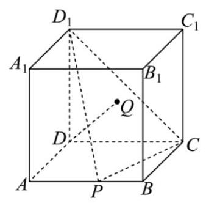

① ${D}_{1}Q = {CQ}$ ；

②线段 ${DQ}$ 的长随线段 ${AP}$ 的长增大而增大；

③存在点 $P$ ，使得 ${AQ}\bot {BQ}$ ；

④存在点 $P$ ，使得 ${PQ}//$ 平面 ${D}_{1}{DA}$ .

其中所有正确结论的序号是___.

### 9-1-13

> 原PDF：[打开学生版PDF](<file:///C:/Users/lucky12345/Documents/%E9%AB%98%E4%B8%AD%E6%95%B0%E5%AD%A6%E5%A4%8D%E4%B9%A0/%E5%88%86%E7%B1%BB%E7%89%88/01_%E5%AD%A6%E7%94%9F%E7%89%88-%E8%AE%B2%E4%B9%89/9-1%E7%AB%8B%E4%BD%93%E5%87%A0%E4%BD%95%EF%BC%9A%E8%BD%A8%E8%BF%B9%E4%B8%8E%E6%9C%80%E5%80%BC-%E8%AE%B2%E4%B9%89.pdf>)

(2023 安徽淮南一模)在三棱锥 $S - {ABC}$ 中，底面 $\bigtriangleup  {ABC}$ 为等腰直角三角形， $\angle {SAB} = \angle {SCB} = \angle {ABC} = {90}^{ \circ  }$ .

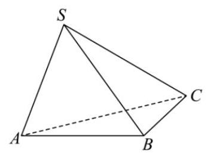

(1)求证: ${AC} \bot  {SB}$ ；

(2)若 ${AB} = 2,{SC} = 2\sqrt{2}$ ，求平面 ${SAC}$ 与平面 ${SBC}$ 夹角的余弦值.

### 9-1-14

> 原PDF：[打开学生版PDF](<file:///C:/Users/lucky12345/Documents/%E9%AB%98%E4%B8%AD%E6%95%B0%E5%AD%A6%E5%A4%8D%E4%B9%A0/%E5%88%86%E7%B1%BB%E7%89%88/01_%E5%AD%A6%E7%94%9F%E7%89%88-%E8%AE%B2%E4%B9%89/9-1%E7%AB%8B%E4%BD%93%E5%87%A0%E4%BD%95%EF%BC%9A%E8%BD%A8%E8%BF%B9%E4%B8%8E%E6%9C%80%E5%80%BC-%E8%AE%B2%E4%B9%89.pdf>)

(2024 山东青岛适应考)已知球 $O$ 的表面积为 ${12\pi }$ ，正四面体 ${ABCD}$ 的顶点 $B$ ，

$C, D$ 均在球 $O$ 的表面上,球心 $O$ 为 $\bigtriangleup {BCD}$ 的外心,棱 ${AB}$ 与球面交于点 $P$ . 若 $A \in$ 平面 ${\alpha }_{1}, B \in$ 平面 ${\alpha }_{2}, C \in$ 平面 ${\alpha }_{3}, D \in$ 平面 ${\alpha }_{4},{\alpha }_{i}//{\alpha }_{i + 1}\left( {i = 1,2,3}\right)$ 且 ${\alpha }_{i}$ 与 ${\alpha }_{i + 1}(i =$

$1,2,3)$ 之间的距离为同一定值,棱 ${AC},{AD}$ 分别与 ${\alpha }_{2}$ 交于点 $Q, R$ ,则 $\bigtriangleup {PQR}$ 的周长为___.

### 9-1-15

> 原PDF：[打开学生版PDF](<file:///C:/Users/lucky12345/Documents/%E9%AB%98%E4%B8%AD%E6%95%B0%E5%AD%A6%E5%A4%8D%E4%B9%A0/%E5%88%86%E7%B1%BB%E7%89%88/01_%E5%AD%A6%E7%94%9F%E7%89%88-%E8%AE%B2%E4%B9%89/9-1%E7%AB%8B%E4%BD%93%E5%87%A0%E4%BD%95%EF%BC%9A%E8%BD%A8%E8%BF%B9%E4%B8%8E%E6%9C%80%E5%80%BC-%E8%AE%B2%E4%B9%89.pdf>)

(2018 新课标 III 文)设 $A, B, C, D$ 是同一个半径为 4 的球的球面上四点， $\bigtriangleup  {ABC}$ 为等边三角形且其面积为 $9\sqrt{3}$ ，则三棱锥 $D - {ABC}$ 体积的最大值为( )

A. ${12}\sqrt{3}$ B. ${18}\sqrt{3}$ C. ${24}\sqrt{3}$ D. ${54}\sqrt{3}$

### 9-1-16

> 原PDF：[打开学生版PDF](<file:///C:/Users/lucky12345/Documents/%E9%AB%98%E4%B8%AD%E6%95%B0%E5%AD%A6%E5%A4%8D%E4%B9%A0/%E5%88%86%E7%B1%BB%E7%89%88/01_%E5%AD%A6%E7%94%9F%E7%89%88-%E8%AE%B2%E4%B9%89/9-1%E7%AB%8B%E4%BD%93%E5%87%A0%E4%BD%95%EF%BC%9A%E8%BD%A8%E8%BF%B9%E4%B8%8E%E6%9C%80%E5%80%BC-%E8%AE%B2%E4%B9%89.pdf>)

(多选) (2023 安徽合肥质检) 已知圆锥 ${SO}$ ( $O$ 是底面圆的圆心, $S$ 是圆锥的顶点) 的母线长为 $\sqrt{7}$ ,高为 $\sqrt{3}$ . 若 $P, Q$ 为底面圆周上任意两点,则下列结论正确的是 ( )

A. 三角形SPQ面积的最大值为 $2\sqrt{3}$

B. 三棱锥 $O - {SPQ}$ 体积的最大值为 $\frac{2\sqrt{3}}{3}$

C. 四面体 ${SOPQ}$ 外接球表面积的最小值为 ${11\pi }$

D. 直线 ${SP}$ 与平面 ${SOQ}$ 所成角的余弦值的最小值为 $\frac{\sqrt{21}}{7}$

### 9-1-17

> 原PDF：[打开学生版PDF](<file:///C:/Users/lucky12345/Documents/%E9%AB%98%E4%B8%AD%E6%95%B0%E5%AD%A6%E5%A4%8D%E4%B9%A0/%E5%88%86%E7%B1%BB%E7%89%88/01_%E5%AD%A6%E7%94%9F%E7%89%88-%E8%AE%B2%E4%B9%89/9-1%E7%AB%8B%E4%BD%93%E5%87%A0%E4%BD%95%EF%BC%9A%E8%BD%A8%E8%BF%B9%E4%B8%8E%E6%9C%80%E5%80%BC-%E8%AE%B2%E4%B9%89.pdf>)

(2024 湖北武汉调研)在三棱锥 $P - {ABC}$ 中， ${AB} = {2\sqrt{2}},{PC} = 1,{PA} + {PB} = 4$ ， ${CA} - {CB} = 2$ ，且 ${PC}\bot {AB}$ ，则二面角 $P - {AB} - C$ 的余弦值的最小值为( )

A. $\frac{\sqrt{2}}{3}$ B. $\frac{3}{4}$ C. $\frac{1}{2}$ D. $\frac{\sqrt{10}}{5}$

### 9-1-18

> 原PDF：[打开学生版PDF](<file:///C:/Users/lucky12345/Documents/%E9%AB%98%E4%B8%AD%E6%95%B0%E5%AD%A6%E5%A4%8D%E4%B9%A0/%E5%88%86%E7%B1%BB%E7%89%88/01_%E5%AD%A6%E7%94%9F%E7%89%88-%E8%AE%B2%E4%B9%89/9-1%E7%AB%8B%E4%BD%93%E5%87%A0%E4%BD%95%EF%BC%9A%E8%BD%A8%E8%BF%B9%E4%B8%8E%E6%9C%80%E5%80%BC-%E8%AE%B2%E4%B9%89.pdf>)

(多选)(2023 浙江杭州二模)如图圆柱内有一个内切球，这个球的直径恰好与圆柱的高相等, ${O}_{1},{O}_{2}$ 为圆柱上下底面的圆心, $O$ 为球心, ${EF}$ 为底面圆 ${O}_{1}$ 的一条直径,若球的半径 $r = 2$ ,则 ( )

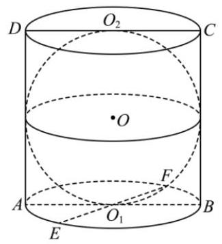

A. 球与圆柱的体积之比为 $2 : 3$

B. 四面体 ${CDEF}$ 的体积的取值范围为 $(0,{32}\rbrack$

C. 平面 ${DEF}$ 截得球的截面面积最小值为 $\frac{4\pi }{5}$

D. 若 $P$ 为球面和圆柱侧面的交线上一点,则 ${PE} + {PF}$ 的取值范围为

$$
\left\lbrack  {2 + 2\sqrt{5},4\sqrt{3}}\right\rbrack
$$

## 9-2 翻折

### 9-2-1

> 原PDF：[打开学生版PDF](<file:///C:/Users/lucky12345/Documents/%E9%AB%98%E4%B8%AD%E6%95%B0%E5%AD%A6%E5%A4%8D%E4%B9%A0/%E5%88%86%E7%B1%BB%E7%89%88/01_%E5%AD%A6%E7%94%9F%E7%89%88-%E8%AE%B2%E4%B9%89/9-2%E7%AB%8B%E4%BD%93%E5%87%A0%E4%BD%95%EF%BC%9A%E7%BF%BB%E6%8A%98-%E8%AE%B2%E4%B9%89.pdf>)

(2024 湖北武汉模拟)已知菱形 ${ABCD},\angle {DAB} = \frac{\pi }{3}$ ，将 $\bigtriangleup  {DAC}$ 沿对角线 ${AC}$ 折起,使以 $A, B, C, D$ 四点为顶点的三棱锥体积最大,则异面直线 ${AB}$ 与 ${CD}$ 所成角的余弦值为( )

A. $\frac{3}{5}$ B. $\frac{\sqrt{3}}{2}$ C. $\frac{3}{4}$ D. $\frac{\sqrt{3}}{4}$

### 9-2-2

> 原PDF：[打开学生版PDF](<file:///C:/Users/lucky12345/Documents/%E9%AB%98%E4%B8%AD%E6%95%B0%E5%AD%A6%E5%A4%8D%E4%B9%A0/%E5%88%86%E7%B1%BB%E7%89%88/01_%E5%AD%A6%E7%94%9F%E7%89%88-%E8%AE%B2%E4%B9%89/9-2%E7%AB%8B%E4%BD%93%E5%87%A0%E4%BD%95%EF%BC%9A%E7%BF%BB%E6%8A%98-%E8%AE%B2%E4%B9%89.pdf>)

(2022浙江衢温“51”联盟期末联考)如图，已知矩形 ${ABCD}$ ， ${AB} = 1$ ， ${BC} = \sqrt{3}$ ， 沿对角线 ${AC}$ 将 $\bigtriangleup  {ABC}$ 折起，当二面角 $B - {AC} - D$ 的余弦值为 $- \frac{1}{3}$ 时，则 $B$ 与 $D$ 之间距离为( )

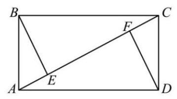

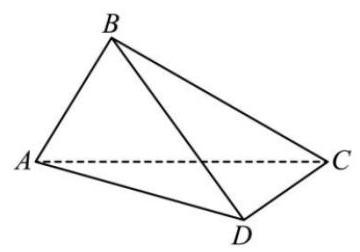

A. 1 B. $\sqrt{2}$ C. $\sqrt{3}$ D. $\frac{\sqrt{10}}{2}$

### 9-2-3

> 原PDF：[打开学生版PDF](<file:///C:/Users/lucky12345/Documents/%E9%AB%98%E4%B8%AD%E6%95%B0%E5%AD%A6%E5%A4%8D%E4%B9%A0/%E5%88%86%E7%B1%BB%E7%89%88/01_%E5%AD%A6%E7%94%9F%E7%89%88-%E8%AE%B2%E4%B9%89/9-2%E7%AB%8B%E4%BD%93%E5%87%A0%E4%BD%95%EF%BC%9A%E7%BF%BB%E6%8A%98-%E8%AE%B2%E4%B9%89.pdf>)

(多选) (2023 广东深圳二模) 如图,在矩形 ${AEFC}$ 中, ${AE} = 2\sqrt{3},{EF} = 4$ , $B$ 为EF中点，现分别沿 ${AB}$ ， ${BC}$ 将 $\bigtriangleup  {ABE}$ ， $\bigtriangleup  {BCF}$ 翻折，使点 $E$ ， $F$ 重合，记为点 $P$ ， 翻折后得到三棱锥 $P - {ABC}$ ，则()

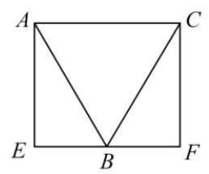

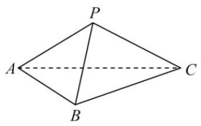

A. 三棱锥 $P - {ABC}$ 的体积为 $\frac{4\sqrt{2}}{3}$

B. 直线 ${PA}$ 与直线 ${BC}$ 所成角的余弦值为 $\frac{\sqrt{3}}{6}$

C. 直线 ${PA}$ 与平面 ${PBC}$ 所成角的正弦值为 $\frac{1}{3}$

D. 三棱锥 $P - {ABC}$ 外接球的半径为 $\frac{\sqrt{22}}{2}$

### 9-2-4

> 原PDF：[打开学生版PDF](<file:///C:/Users/lucky12345/Documents/%E9%AB%98%E4%B8%AD%E6%95%B0%E5%AD%A6%E5%A4%8D%E4%B9%A0/%E5%88%86%E7%B1%BB%E7%89%88/01_%E5%AD%A6%E7%94%9F%E7%89%88-%E8%AE%B2%E4%B9%89/9-2%E7%AB%8B%E4%BD%93%E5%87%A0%E4%BD%95%EF%BC%9A%E7%BF%BB%E6%8A%98-%E8%AE%B2%E4%B9%89.pdf>)

(2024 浙江温州适应性考试)如图，在等腰梯形 ${ABCD}$ 中， ${AB} = {BC} = {CD} = \frac{1}{2}{AD}$ ， 点 $E$ 是 ${AD}$ 的中点. 现将 $\bigtriangleup {ABE}$ 沿 ${BE}$ 翻折到 $\bigtriangleup {A}^{\prime }{BE}$ ,将 $\bigtriangleup {DCE}$ 沿 ${CE}$ 翻折到 $\bigtriangleup {D}^{\prime }{CE}$ , 使得二面角 ${A}^{\prime } - {BE} - C$ 等于 ${60}^{ \circ  },{D}^{\prime } - {CE} - B$ 等于 ${90}^{ \circ  }$ ,则直线 ${A}^{\prime }B$ 与平面 ${D}^{\prime }{CE}$ 所成角的余弦值等于___.

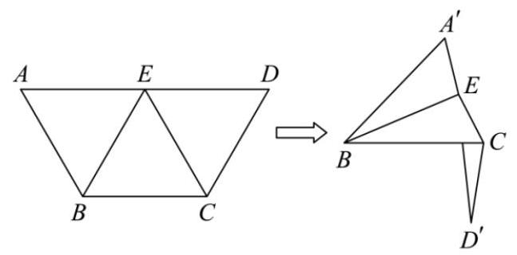

### 9-2-5

> 原PDF：[打开学生版PDF](<file:///C:/Users/lucky12345/Documents/%E9%AB%98%E4%B8%AD%E6%95%B0%E5%AD%A6%E5%A4%8D%E4%B9%A0/%E5%88%86%E7%B1%BB%E7%89%88/01_%E5%AD%A6%E7%94%9F%E7%89%88-%E8%AE%B2%E4%B9%89/9-2%E7%AB%8B%E4%BD%93%E5%87%A0%E4%BD%95%EF%BC%9A%E7%BF%BB%E6%8A%98-%E8%AE%B2%E4%B9%89.pdf>)

(多选) (2024 浙江嘉兴基础测试) 如图，在 $\bigtriangleup  {ABC}$ 中， ${\angle B} = \frac{\pi }{2},{AB} = \sqrt{3},{BC} = 1$ ， 过 ${AC}$ 中点 $M$ 的直线 $l$ 与线段 ${AB}$ 交于点 $N$ . 将 $\bigtriangleup {AMN}$ 沿直线 $l$ 翻折至 $\bigtriangleup {A}^{\prime }{MN}$ ，且点 ${A}^{\prime }$ 在平面 ${BCMN}$ 内的射影 $H$ 在线段 ${BC}$ 上,连接 ${AH}$ 交 $l$ 于点 $O, D$ 是直线 $l$ 上异于 $O$ 的任意一点, 则 ( )

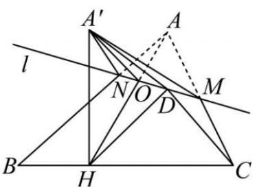

A. $\angle {A}^{\prime }{DH} \geq  \angle {A}^{\prime }{DC}$

B. $\angle {A}^{\prime }{DH} \leq  \angle {A}^{\prime }{OH}$

C. 点 $O$ 的轨迹的长度为 $\frac{\pi }{6}$

D. 直线 ${A}^{\prime }O$ 与平面 ${BCMN}$ 所成角的余弦值的最小值为 $l \; 8\sqrt{3} - {13}$

### 9-2-6

> 原PDF：[打开学生版PDF](<file:///C:/Users/lucky12345/Documents/%E9%AB%98%E4%B8%AD%E6%95%B0%E5%AD%A6%E5%A4%8D%E4%B9%A0/%E5%88%86%E7%B1%BB%E7%89%88/01_%E5%AD%A6%E7%94%9F%E7%89%88-%E8%AE%B2%E4%B9%89/9-2%E7%AB%8B%E4%BD%93%E5%87%A0%E4%BD%95%EF%BC%9A%E7%BF%BB%E6%8A%98-%E8%AE%B2%E4%B9%89.pdf>)

(2023 北京东城一模)已知函数 $f\left( x\right)  = \lambda \sin \left( {\frac{\pi }{2}x + \varphi }\right) \left( {\lambda  > 0,0 < \varphi  < \pi }\right)$ 的部分图像如图 1 所示, $A, B$ 分别为图像的最高点和最低点,过 $A$ 作 $x$ 轴的垂线,交 $x$ 轴于点 ${A}^{\prime }$ ，点 $C$ 为该部分图像与 $x$ 轴的交点.将绘有该图像的纸片沿 $x$ 轴折成直二面角，如图 2 所示，此时 $\left| {AB}\right|  = \sqrt{10}$ ，则 $\lambda  =$ ___.

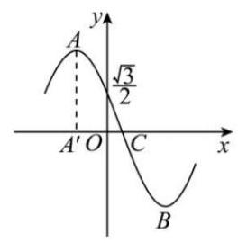

图1

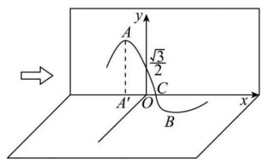

图2

给出下列四个结论:

① $\varphi  = \frac{\pi }{3}$ ；

②图 2 中, $\overrightarrow{AB} \cdot  \overrightarrow{AC} = 5$ ;

③图 2 中,过线段 ${AB}$ 的中点且与 ${AB}$ 垂直的平面与 $x$ 轴交于点 $C$ ;

④图 2 中, $S$ 是 $\bigtriangleup {A}^{\prime }{BC}$ 及其内部的点构成的集合. 设集合 $T = \{ Q \in  S\left| \right| {AQ} \mid   \leq  2\}$ , 则 $T$ 表示的区域的面积大于 $\frac{\pi }{4}$ .

其中所有正确结论的序号是___.

## 9-3 外接球

### 9-3-1

> 原PDF：[打开学生版PDF](<file:///C:/Users/lucky12345/Documents/%E9%AB%98%E4%B8%AD%E6%95%B0%E5%AD%A6%E5%A4%8D%E4%B9%A0/%E5%88%86%E7%B1%BB%E7%89%88/01_%E5%AD%A6%E7%94%9F%E7%89%88-%E8%AE%B2%E4%B9%89/9-3%E7%AB%8B%E4%BD%93%E5%87%A0%E4%BD%95%EF%BC%9A%E5%A4%96%E6%8E%A5%E7%90%83-%E8%AE%B2%E4%B9%89.pdf>)

用动态图像求解

【第 1 步】满足 ${OA} = {OB} = {OC}$ 的所有 $O$ 的轨迹为___.

设 $O$ 在底面上的投影为 ${O}^{\prime }$ ，根据勾股定理:

$O{A}^{2} =$ ___， $O{B}^{2} =$ ___. $O{C}^{2} =$ ___.

故 ${OA} = {OB} = {OC} \Leftrightarrow$ ___. 换言之， ${O}^{\prime }$ 是三角形 ${ABC}$ 的___.

因此， $O$ 在过 ${O}^{\prime }$ ,且垂直于平面 ${ABC}$ 的直线上.

第1步，我们利用了___个等式。因此，现在0仍有___个自由度(在直线上运动). 因此，需要最后一个限制条件，确定 $\mathbf{O}$ 的位置.

【第 2 步】

方法 1 : 照猫画 虎. 满足 ${OA} = {OB} = {OP}$ 的所有 0 的轨迹为 ___. 它和 1 中直线的交点，即为 $O$ ；

【注】这里选择了三角形 ${ABP}$ ,也可以选择 ${ACP},{BCP}$ 等。只要在四个面中,选择两个即可。大原则:利用对称性 (见 3 ).

方法 2: 单独利用 ${OA} = {OP}$ . 过 $P$ 作平面 ${ABC}$ 的垂线,垂足为 $P$ . 显然, $O$ 在平面 $O{O}^{\prime }{P}^{\prime }P$ 中；在这个平面中，满足 ${OA} = {OP}$ 的点，即为球心 $O$ .

确定方法: 根据勾股定理, $O{A}^{2} = {O}^{\prime }{A}^{2} +$ ___，其中 ${O}^{\prime }A = r$ ，是三角形 ${ABC}$ 的外接圆半径.

因此, ${OA} = {OP} \Leftrightarrow  O{A}^{2} = O{P}^{2} \Leftrightarrow  O{P}^{2} -$ ___ $= {r}^{2}$ ,为定值. 利用勾股定理求解即可.

【注】若 ${P}^{\prime }$ 位置很好,此方法简单.

### 9-3-2

> 原PDF：[打开学生版PDF](<file:///C:/Users/lucky12345/Documents/%E9%AB%98%E4%B8%AD%E6%95%B0%E5%AD%A6%E5%A4%8D%E4%B9%A0/%E5%88%86%E7%B1%BB%E7%89%88/01_%E5%AD%A6%E7%94%9F%E7%89%88-%E8%AE%B2%E4%B9%89/9-3%E7%AB%8B%E4%BD%93%E5%87%A0%E4%BD%95%EF%BC%9A%E5%A4%96%E6%8E%A5%E7%90%83-%E8%AE%B2%E4%B9%89.pdf>)

求解技巧

(1)无论是使用方法 1，还是方法 2，都应选择好的底面. 什么是好的底面？

①正方形:设其边长为 $a$ ，那么它的外接圆半径为 $r =$ ___. 它的外接圆圆心是___；

②正三角形:设其边长为 $a$ ，那么它的外接圆半径为 $r =$ ___. 它的外接圆圆心是___；

③直角三角形:设其斜边长为 $c$ ，那么它的外接圆半径为 $r =$ ___. 它的外接圆圆心是___.

④矩形: 看作两个直角三角形. 设其对角线长为 $c$ ,它的外接圆半径为 $r =$ ___. 它的外接圆圆心是___.

⑤等腰三角形:设 ${AB} = {AC}$ . 那么三角形 ${ABC}$ 的外接圆圆心在___.

【例】 ${AB} = {AC} = 5,{BC} = 8$ ，试确定三角形 ${ABC}$ 外接圆圆心的位置，即半径 $r$ .

⑥等腰梯形:

【例】设 ${ABCD}$ 是等腰梯形, ${AB}//{CD},{AB} = {BC} = {AD} = 1,{CD} = 2$ . 求它的外接圆半径.

(2)不好的底面:

①非特殊三角形:不好确定外心位置；

②一般的四边形:不一定有外接圆，因此，整个几何体不一定有外接球；甚至， 一般的平行四边形、菱形, 都可能没有外接圆.

(3) 根据正弦定理，外接圆半径 $r =$ ___。 时, 都可能利用正弦定理求解.

【例】直三棱柱 ${ABC} - {A}_{1}{B}_{1}{C}_{1}$ 满足 ${AB} = 3,{AC} = 5,{BC} = 7, A{A}_{1} = 2$ .

(1) 求 $A$ ；

(2)求外接球半径 $R$ .

### 9-3-3

> 原PDF：[打开学生版PDF](<file:///C:/Users/lucky12345/Documents/%E9%AB%98%E4%B8%AD%E6%95%B0%E5%AD%A6%E5%A4%8D%E4%B9%A0/%E5%88%86%E7%B1%BB%E7%89%88/01_%E5%AD%A6%E7%94%9F%E7%89%88-%E8%AE%B2%E4%B9%89/9-3%E7%AB%8B%E4%BD%93%E5%87%A0%E4%BD%95%EF%BC%9A%E5%A4%96%E6%8E%A5%E7%90%83-%E8%AE%B2%E4%B9%89.pdf>)

已知正四棱锥 $P - {ABCD}$ 各顶点都在同一球面上，且正四棱锥底面边长为 4， 体积为 $\frac{64}{3}$ ，则该球表面积为( )

A. ${9\pi }$ B. ${36\pi }$ C. ${4\pi }$ D. $\frac{4\pi }{3}$

### 9-3-4

> 原PDF：[打开学生版PDF](<file:///C:/Users/lucky12345/Documents/%E9%AB%98%E4%B8%AD%E6%95%B0%E5%AD%A6%E5%A4%8D%E4%B9%A0/%E5%88%86%E7%B1%BB%E7%89%88/01_%E5%AD%A6%E7%94%9F%E7%89%88-%E8%AE%B2%E4%B9%89/9-3%E7%AB%8B%E4%BD%93%E5%87%A0%E4%BD%95%EF%BC%9A%E5%A4%96%E6%8E%A5%E7%90%83-%E8%AE%B2%E4%B9%89.pdf>)

(2022 云南联考)已知 $A$ ， $B$ ， $C$ 是表面积为 ${16\pi }$ 的球 $O$ 的球面上的三个点，且 ${AC} = {AB} = 1,\angle {ABC} = {30}^{ \circ  }$ ，则三棱锥 $O - {ABC}$ 的体积为( )

A. $\frac{1}{12}$ B. $\frac{\sqrt{3}}{12}$ C. $\frac{1}{4}$ D. $\frac{\sqrt{3}}{4}$

### 9-3-5

> 原PDF：[打开学生版PDF](<file:///C:/Users/lucky12345/Documents/%E9%AB%98%E4%B8%AD%E6%95%B0%E5%AD%A6%E5%A4%8D%E4%B9%A0/%E5%88%86%E7%B1%BB%E7%89%88/01_%E5%AD%A6%E7%94%9F%E7%89%88-%E8%AE%B2%E4%B9%89/9-3%E7%AB%8B%E4%BD%93%E5%87%A0%E4%BD%95%EF%BC%9A%E5%A4%96%E6%8E%A5%E7%90%83-%E8%AE%B2%E4%B9%89.pdf>)

(2022 新高考 II)已知正三棱台的高为 1 ，上、下底面边长分别为 $3\sqrt{3}$ 和 $4\sqrt{3}$ ， 其顶点都在同一球面上, 则该球的表面积为 ( )

A. ${100\pi }$ B. ${128\pi }$ C. ${144\pi }$ D. ${192\pi }$

### 9-3-6

> 原PDF：[打开学生版PDF](<file:///C:/Users/lucky12345/Documents/%E9%AB%98%E4%B8%AD%E6%95%B0%E5%AD%A6%E5%A4%8D%E4%B9%A0/%E5%88%86%E7%B1%BB%E7%89%88/01_%E5%AD%A6%E7%94%9F%E7%89%88-%E8%AE%B2%E4%B9%89/9-3%E7%AB%8B%E4%BD%93%E5%87%A0%E4%BD%95%EF%BC%9A%E5%A4%96%E6%8E%A5%E7%90%83-%E8%AE%B2%E4%B9%89.pdf>)

(2023 华大新高考联盟联考)在三棱锥 $D - {ABC}$ 中， $\bigtriangleup  {ABC}$ 是以 ${AC}$ 为底边的等腰直角三角形， $\bigtriangleup  {DAC}$ 是等边三角形， ${AC} = 2\sqrt{2}$ ，又 ${BD}$ 与平面 ${ADC}$ 所成角的正切值为 $\frac{\sqrt{2}}{2}$ ,则三棱锥 $D - {ABC}$ 外接球的表面积是( )

A. ${8\pi }$ B. ${12\pi }$ C. ${14\pi }$ D. ${16\pi }$

### 9-3-7

> 原PDF：[打开学生版PDF](<file:///C:/Users/lucky12345/Documents/%E9%AB%98%E4%B8%AD%E6%95%B0%E5%AD%A6%E5%A4%8D%E4%B9%A0/%E5%88%86%E7%B1%BB%E7%89%88/01_%E5%AD%A6%E7%94%9F%E7%89%88-%E8%AE%B2%E4%B9%89/9-3%E7%AB%8B%E4%BD%93%E5%87%A0%E4%BD%95%EF%BC%9A%E5%A4%96%E6%8E%A5%E7%90%83-%E8%AE%B2%E4%B9%89.pdf>)

已知三棱锥 $P - {ABC}$ 的四个顶点都在球 $O$ 的球面上， ${PA} = {PB} = {PC} = 4,{AB} = \; {BC} = 2,{AC} = {2\sqrt{3}}$ ，则球 $O$ 的表面积为( )

A. $\frac{64\pi }{3}$ B. $\frac{40\pi }{3}$ C. $\frac{27\pi }{4}$ D. $\frac{21\pi }{2}$

### 9-3-8

> 原PDF：[打开学生版PDF](<file:///C:/Users/lucky12345/Documents/%E9%AB%98%E4%B8%AD%E6%95%B0%E5%AD%A6%E5%A4%8D%E4%B9%A0/%E5%88%86%E7%B1%BB%E7%89%88/01_%E5%AD%A6%E7%94%9F%E7%89%88-%E8%AE%B2%E4%B9%89/9-3%E7%AB%8B%E4%BD%93%E5%87%A0%E4%BD%95%EF%BC%9A%E5%A4%96%E6%8E%A5%E7%90%83-%E8%AE%B2%E4%B9%89.pdf>)

已知三棱锥 $P - {ABC}$ 的四个顶点都在球 $O$ 的球面上 ${PB} = {PC} = {2\sqrt{5}},{AB} = \; {AC} = 4,{PA} = {BC} = 2$ ，则球 $O$ 的表面积为( )

A. $\frac{316}{15}\pi$ B. $\frac{79}{15}\pi$ C. $\frac{158}{5}\pi$ D. $\frac{79}{5}\pi$

### 9-3-9

> 原PDF：[打开学生版PDF](<file:///C:/Users/lucky12345/Documents/%E9%AB%98%E4%B8%AD%E6%95%B0%E5%AD%A6%E5%A4%8D%E4%B9%A0/%E5%88%86%E7%B1%BB%E7%89%88/01_%E5%AD%A6%E7%94%9F%E7%89%88-%E8%AE%B2%E4%B9%89/9-3%E7%AB%8B%E4%BD%93%E5%87%A0%E4%BD%95%EF%BC%9A%E5%A4%96%E6%8E%A5%E7%90%83-%E8%AE%B2%E4%B9%89.pdf>)

(2019新课标I)已知三棱锥 $P - {ABC}$ 的四个顶点在球 $O$ 的球面上， ${PA} = {PB} = \; {PC},\bigtriangleup {ABC}$ 是边长为 2 的正三角形, $E, F$ 分别是 ${PA},{AB}$ 的中点, $\angle {CEF} = {90}^{ \circ  }$ , 则球 $O$ 的体积为( )

A. $8\sqrt{6}\pi$ B. $4\sqrt{6}\pi$ C. $2\sqrt{6}\pi$ D. $\sqrt{6}\pi$

### 9-3-10

> 原PDF：[打开学生版PDF](<file:///C:/Users/lucky12345/Documents/%E9%AB%98%E4%B8%AD%E6%95%B0%E5%AD%A6%E5%A4%8D%E4%B9%A0/%E5%88%86%E7%B1%BB%E7%89%88/01_%E5%AD%A6%E7%94%9F%E7%89%88-%E8%AE%B2%E4%B9%89/9-3%E7%AB%8B%E4%BD%93%E5%87%A0%E4%BD%95%EF%BC%9A%E5%A4%96%E6%8E%A5%E7%90%83-%E8%AE%B2%E4%B9%89.pdf>)

(2022新高考 I)已知正四棱锥的侧棱长为 $l$ ，其各顶点都在同一球面上. 若该球的体积为 ${36\pi }$ ,且 $3 \leq  l \leq  3\sqrt{3}$ ,则该正四棱锥体积的取值范围是( )

A. $\left\lbrack  {{18},\frac{81}{4}}\right\rbrack$ B. $\left\lbrack  {\frac{27}{4},\frac{81}{4}}\right\rbrack$ C. $\left\lbrack  {\frac{27}{4},\frac{64}{3}}\right\rbrack$ D. $\left\lbrack  {{18},{27}}\right\rbrack$

### 9-3-11

> 原PDF：[打开学生版PDF](<file:///C:/Users/lucky12345/Documents/%E9%AB%98%E4%B8%AD%E6%95%B0%E5%AD%A6%E5%A4%8D%E4%B9%A0/%E5%88%86%E7%B1%BB%E7%89%88/01_%E5%AD%A6%E7%94%9F%E7%89%88-%E8%AE%B2%E4%B9%89/9-3%E7%AB%8B%E4%BD%93%E5%87%A0%E4%BD%95%EF%BC%9A%E5%A4%96%E6%8E%A5%E7%90%83-%E8%AE%B2%E4%B9%89.pdf>)

已知空间四面体 ${ABCD}$ 满足 ${AB} = {AC} = {DB} = {DC},{AD} = {2BC} = 6$ ，则该四面体外接球体积的最小值为___.

### 9-3-12

> 原PDF：[打开学生版PDF](<file:///C:/Users/lucky12345/Documents/%E9%AB%98%E4%B8%AD%E6%95%B0%E5%AD%A6%E5%A4%8D%E4%B9%A0/%E5%88%86%E7%B1%BB%E7%89%88/01_%E5%AD%A6%E7%94%9F%E7%89%88-%E8%AE%B2%E4%B9%89/9-3%E7%AB%8B%E4%BD%93%E5%87%A0%E4%BD%95%EF%BC%9A%E5%A4%96%E6%8E%A5%E7%90%83-%E8%AE%B2%E4%B9%89.pdf>)

在 $\bigtriangleup {ABC}$ 中, $A = \frac{\pi }{6}, B = \frac{\pi }{2},{BC} = 1, D$ 为 ${AC}$ 中点,若将 $\bigtriangleup {BCD}$ 沿着直线 ${BD}$ 翻折至 $\bigtriangleup {BCD}$ ,使得四面体 ${C}^{\prime } - {ABD}$ 的外接球半径为 1,则直线 $B{C}^{\prime }$ 与平面 ${ABD}$ 所成角的正弦值是( )

A. $\frac{\sqrt{3}}{3}$ B. $\frac{2}{3}$ C. $\frac{\sqrt{5}}{3}$ D. $\frac{\sqrt{6}}{3}$

### 9-3-13

> 原PDF：[打开学生版PDF](<file:///C:/Users/lucky12345/Documents/%E9%AB%98%E4%B8%AD%E6%95%B0%E5%AD%A6%E5%A4%8D%E4%B9%A0/%E5%88%86%E7%B1%BB%E7%89%88/01_%E5%AD%A6%E7%94%9F%E7%89%88-%E8%AE%B2%E4%B9%89/9-3%E7%AB%8B%E4%BD%93%E5%87%A0%E4%BD%95%EF%BC%9A%E5%A4%96%E6%8E%A5%E7%90%83-%E8%AE%B2%E4%B9%89.pdf>)

(2023 浙江省杭州一模)空间中四个点 $A, B, C, M$ 满足 ${AB} = {BC} = {AC} = 3$ ， ${CM} = {2\sqrt{3}}$ ，且直线 ${CM}$ 与平面 ${ABC}$ 所成的角为 $\frac{\pi }{3}$ ，则三棱锥 $A - {MBC}$ 的外接球体积最大为( )

A. ${36\pi }$ B. ${48\pi }$ C. ${32}\sqrt{3}\pi$ D. ${48}\sqrt{3}\pi$

### 9-3-14

> 原PDF：[打开学生版PDF](<file:///C:/Users/lucky12345/Documents/%E9%AB%98%E4%B8%AD%E6%95%B0%E5%AD%A6%E5%A4%8D%E4%B9%A0/%E5%88%86%E7%B1%BB%E7%89%88/01_%E5%AD%A6%E7%94%9F%E7%89%88-%E8%AE%B2%E4%B9%89/9-3%E7%AB%8B%E4%BD%93%E5%87%A0%E4%BD%95%EF%BC%9A%E5%A4%96%E6%8E%A5%E7%90%83-%E8%AE%B2%E4%B9%89.pdf>)

已知四棱锥 $P - {ABCD}$ ，底面 ${ABCD}$ 是正方形， ${PA} \bot$ 平面 ${ABCD}$ ， ${AD} = 1$ ， ${PC}$ 与底面 ${ABCD}$ 所成角的正切值为 $\frac{\sqrt{2}}{2}$ ，点 $M$ 为平面 ${ABCD}$ 内一点，且 ${AM} = {\lambda AD}(0 < \; \lambda  < 1)$ ,点 $N$ 为平面 ${PAB}$ 内一点, ${NC} = \sqrt{5}$ ,则三棱锥 $N - {ACD}$ 外接球体积最小值为___.

### 9-3-15

> 原PDF：[打开学生版PDF](<file:///C:/Users/lucky12345/Documents/%E9%AB%98%E4%B8%AD%E6%95%B0%E5%AD%A6%E5%A4%8D%E4%B9%A0/%E5%88%86%E7%B1%BB%E7%89%88/01_%E5%AD%A6%E7%94%9F%E7%89%88-%E8%AE%B2%E4%B9%89/9-3%E7%AB%8B%E4%BD%93%E5%87%A0%E4%BD%95%EF%BC%9A%E5%A4%96%E6%8E%A5%E7%90%83-%E8%AE%B2%E4%B9%89.pdf>)

在边长为 4 的正三角形 ${ABC}$ 中, $E, F$ 分别是 ${AB},{AC}$ 的中点,将 $\bigtriangleup {AEF}$ 沿着 ${EF}$ 翻折至 $\bigtriangleup {A}^{\prime }{EF}$ ,使得 ${A}^{\prime }B \bot  {FC}$ ,则四棱锥 ${A}^{\prime } - {BCFE}$ 的外接球的表面积是( )

A. ${8\pi }$ B. ${12\pi }$ C. ${16\pi }$ D. ${32\pi }$

## 9-4 内切球

### 9-4-1

> 原PDF：[打开学生版PDF](<file:///C:/Users/lucky12345/Documents/%E9%AB%98%E4%B8%AD%E6%95%B0%E5%AD%A6%E5%A4%8D%E4%B9%A0/%E5%88%86%E7%B1%BB%E7%89%88/01_%E5%AD%A6%E7%94%9F%E7%89%88-%E8%AE%B2%E4%B9%89/9-4%E7%AB%8B%E4%BD%93%E5%87%A0%E4%BD%95%EF%BC%9A%E5%86%85%E5%88%87%E7%90%83-%E8%AE%B2%E4%B9%89.pdf>)

找切点, 确定截面, 把立体几何问题化为平面几何问题.

【例】已知圆锥顶点为 $P$ ,轴截面 ${PAB}$ 是边长为 6 的等边三角形. 若球 $O$ 与圆锥的底面、侧面均相切，则 $O$ 的半径为___.

### 9-4-2

> 原PDF：[打开学生版PDF](<file:///C:/Users/lucky12345/Documents/%E9%AB%98%E4%B8%AD%E6%95%B0%E5%AD%A6%E5%A4%8D%E4%B9%A0/%E5%88%86%E7%B1%BB%E7%89%88/01_%E5%AD%A6%E7%94%9F%E7%89%88-%E8%AE%B2%E4%B9%89/9-4%E7%AB%8B%E4%BD%93%E5%87%A0%E4%BD%95%EF%BC%9A%E5%86%85%E5%88%87%E7%90%83-%E8%AE%B2%E4%B9%89.pdf>)

利用体积，求半径:设某几何体体积为 $V$ ，表面积为 $S$ ，其存在和各个面都相切的内切球 $\odot  O$ . 则其半径 $r = r$ ___.

【例】在三棱锥 $S - {ABC}$ 中, ${SA} \bot$ 平面 ${ABC},\angle {ABC} = {90}^{ \circ  }$ ,且 ${SA} = 3,{AB} = 4$ , ${AC} = 5$ ，若球O在三棱锥 $S - {ABC}$ 的内部且与四个面都相切(称球O为三棱锥 $S - \; {ABC}$ 的内切球)，则球 $O$ 的半径为___.

### 9-4-3

> 原PDF：[打开学生版PDF](<file:///C:/Users/lucky12345/Documents/%E9%AB%98%E4%B8%AD%E6%95%B0%E5%AD%A6%E5%A4%8D%E4%B9%A0/%E5%88%86%E7%B1%BB%E7%89%88/01_%E5%AD%A6%E7%94%9F%E7%89%88-%E8%AE%B2%E4%B9%89/9-4%E7%AB%8B%E4%BD%93%E5%87%A0%E4%BD%95%EF%BC%9A%E5%86%85%E5%88%87%E7%90%83-%E8%AE%B2%E4%B9%89.pdf>)

(多选)圆锥内半径最大的球称为该圆锥的内切球，若圆锥的顶点和底面的圆周都在同一个球面上,则称该球为圆锥的外接球. 如图,圆锥 ${PO}$ 的内切球和外接球的球心重合,且圆锥 ${PO}$ 的底面直径为 ${2a}$ ,则()

A. 设内切球的半径为 ${r}_{1}$ ,外接球的半径为 ${r}_{2}$ ,则 ${r}_{2} = 2{r}_{1}$

B. 设内切球的表面积为 ${S}_{1}$ ,外接球的表面积为 ${S}_{2}$ ,则 ${S}_{1} = 4{S}_{2}$

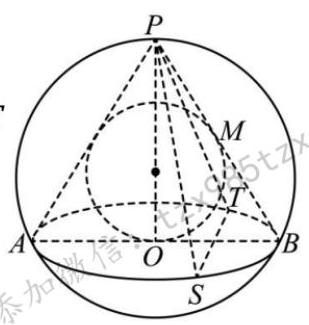

C. 设圆锥的体积为 ${V}_{1}$ ,内切球的体积为 ${V}_{2}$ ,则 $\frac{{V}_{1}}{{V}_{2}} = \frac{9}{4}$

D. 设 $S, T$ 是圆锥底面圆上的两点,且 ${ST} = a$ ,则平面 ${PST}$ 截内切球所得截面的面积为 $\frac{\pi {a}^{2}}{15}$

### 9-4-4

> 原PDF：[打开学生版PDF](<file:///C:/Users/lucky12345/Documents/%E9%AB%98%E4%B8%AD%E6%95%B0%E5%AD%A6%E5%A4%8D%E4%B9%A0/%E5%88%86%E7%B1%BB%E7%89%88/01_%E5%AD%A6%E7%94%9F%E7%89%88-%E8%AE%B2%E4%B9%89/9-4%E7%AB%8B%E4%BD%93%E5%87%A0%E4%BD%95%EF%BC%9A%E5%86%85%E5%88%87%E7%90%83-%E8%AE%B2%E4%B9%89.pdf>)

表面积为 ${4\pi }$ 的球内切于圆锥,则该圆锥的表面积的最小值为( )

A. ${4\pi }$ B. ${8\pi }$ C. ${12\pi }$ D. ${16\pi }$

### 9-4-5

> 原PDF：[打开学生版PDF](<file:///C:/Users/lucky12345/Documents/%E9%AB%98%E4%B8%AD%E6%95%B0%E5%AD%A6%E5%A4%8D%E4%B9%A0/%E5%88%86%E7%B1%BB%E7%89%88/01_%E5%AD%A6%E7%94%9F%E7%89%88-%E8%AE%B2%E4%B9%89/9-4%E7%AB%8B%E4%BD%93%E5%87%A0%E4%BD%95%EF%BC%9A%E5%86%85%E5%88%87%E7%90%83-%E8%AE%B2%E4%B9%89.pdf>)

(2024 温州一模) 与圆台的上、下底面及侧面都相切的球, 称为圆台的内切球,若圆台的上、下底面半径为 ${r}_{1},{r}_{2}$ ,且 ${r}_{1} \cdot  {r}_{2} = 1$ ,则它的内切球的体积为___.

### 9-4-6

> 原PDF：[打开学生版PDF](<file:///C:/Users/lucky12345/Documents/%E9%AB%98%E4%B8%AD%E6%95%B0%E5%AD%A6%E5%A4%8D%E4%B9%A0/%E5%88%86%E7%B1%BB%E7%89%88/01_%E5%AD%A6%E7%94%9F%E7%89%88-%E8%AE%B2%E4%B9%89/9-4%E7%AB%8B%E4%BD%93%E5%87%A0%E4%BD%95%EF%BC%9A%E5%86%85%E5%88%87%E7%90%83-%E8%AE%B2%E4%B9%89.pdf>)

在正四棱台 ${ABCD} - {A}_{1}{B}_{1}{C}_{1}{D}_{1}$ 中， ${AB} = 4,{A}_{1}{B}_{1} = 2,{A{A}_{1}} = \sqrt{3}$ ，若球 $O$ 与上底面 ${A}_{1}{B}_{1}{C}_{1}{D}_{1}$ 以及棱 ${AB},{BC},{CD},{DA}$ 均相切，则球 $O$ 的表面积为( )

A. ${9\pi }$ B. ${16\pi }$ C. ${25\pi }$ D. ${36\pi }$

### 9-4-7

> 原PDF：[打开学生版PDF](<file:///C:/Users/lucky12345/Documents/%E9%AB%98%E4%B8%AD%E6%95%B0%E5%AD%A6%E5%A4%8D%E4%B9%A0/%E5%88%86%E7%B1%BB%E7%89%88/01_%E5%AD%A6%E7%94%9F%E7%89%88-%E8%AE%B2%E4%B9%89/9-4%E7%AB%8B%E4%BD%93%E5%87%A0%E4%BD%95%EF%BC%9A%E5%86%85%E5%88%87%E7%90%83-%E8%AE%B2%E4%B9%89.pdf>)

以半径为 1 的球的球心0 为原点建立空间直角坐标系,与球 $O$ 相切的平面 $\alpha$ 分别与 $x, y, z$ 轴交于 $A, B, C$ 三点， $\left| {OC}\right|  = \sqrt{2}$ ，则 ${\left| OA\right| }^{2} + 4{\left| OB\right| }^{2}$ 的最小值为( )

A. ${16}\sqrt{2}$ B. ${12}\sqrt{3}$ C. 18 D. $8\sqrt{6}$

### 9-4-8

> 原PDF：[打开学生版PDF](<file:///C:/Users/lucky12345/Documents/%E9%AB%98%E4%B8%AD%E6%95%B0%E5%AD%A6%E5%A4%8D%E4%B9%A0/%E5%88%86%E7%B1%BB%E7%89%88/01_%E5%AD%A6%E7%94%9F%E7%89%88-%E8%AE%B2%E4%B9%89/9-4%E7%AB%8B%E4%BD%93%E5%87%A0%E4%BD%95%EF%BC%9A%E5%86%85%E5%88%87%E7%90%83-%E8%AE%B2%E4%B9%89.pdf>)

如图, 经过棱长为 1 的正方体的三个顶点的平面截正方体得到一个正三角形, 将这个截面上方部分去掉, 得到一个七面体, 则这个七面体内部能容纳的最大的球半径是___.

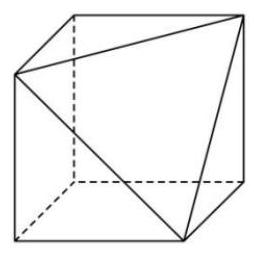

### 9-4-9

> 原PDF：[打开学生版PDF](<file:///C:/Users/lucky12345/Documents/%E9%AB%98%E4%B8%AD%E6%95%B0%E5%AD%A6%E5%A4%8D%E4%B9%A0/%E5%88%86%E7%B1%BB%E7%89%88/01_%E5%AD%A6%E7%94%9F%E7%89%88-%E8%AE%B2%E4%B9%89/9-4%E7%AB%8B%E4%BD%93%E5%87%A0%E4%BD%95%EF%BC%9A%E5%86%85%E5%88%87%E7%90%83-%E8%AE%B2%E4%B9%89.pdf>)

水平桌面上放置了 4 个半径为 2 的小球, 4 个小球的球心构成正方形, 且相邻的两个小球相切. 若用一个半球形的容器罩住四个小球, 则半球形容器内壁的半径的最小值为( )

A. 4 B. $2\sqrt{2} + 2$ C. $2\sqrt{3} + 2$ D. 6

### 9-4-10

> 原PDF：[打开学生版PDF](<file:///C:/Users/lucky12345/Documents/%E9%AB%98%E4%B8%AD%E6%95%B0%E5%AD%A6%E5%A4%8D%E4%B9%A0/%E5%88%86%E7%B1%BB%E7%89%88/01_%E5%AD%A6%E7%94%9F%E7%89%88-%E8%AE%B2%E4%B9%89/9-4%E7%AB%8B%E4%BD%93%E5%87%A0%E4%BD%95%EF%BC%9A%E5%86%85%E5%88%87%E7%90%83-%E8%AE%B2%E4%B9%89.pdf>)

如图所示，有一个棱长为4的正四面体 $P - {ABC}$ 容器， $D$ 是 ${PB}$ 的中点， $E$ 是 ${CD}$ 上的动点，回答下列问题:

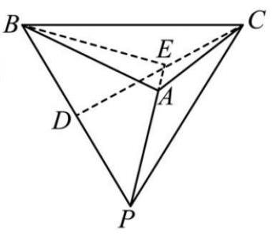

(1)如果在这个容器中放入 1 个小球(全部进入)，则小球半径的最大值为___；

(2)如果在这个容器中放入 4 个完全相同的小球(全部进入)，则小球半径的最大值为___.

### 9-4-11

> 原PDF：[打开学生版PDF](<file:///C:/Users/lucky12345/Documents/%E9%AB%98%E4%B8%AD%E6%95%B0%E5%AD%A6%E5%A4%8D%E4%B9%A0/%E5%88%86%E7%B1%BB%E7%89%88/01_%E5%AD%A6%E7%94%9F%E7%89%88-%E8%AE%B2%E4%B9%89/9-4%E7%AB%8B%E4%BD%93%E5%87%A0%E4%BD%95%EF%BC%9A%E5%86%85%E5%88%87%E7%90%83-%E8%AE%B2%E4%B9%89.pdf>)

如今中国被誉为 “基建狂魔”，可谓是逢山开路，遇水架桥. 公路里程、高铁里程双双都是世界第一. 建设过程中研制出用于基建的大型龙门吊、平衡盾构机等国之重器更是世界领先. 如图是某重器上一零件结构模型, 中间最大球为正四面体 ${ABCD}$ 的内切球,中等球与最大球和正四面体三个面均相切,最小球与中等球和正四面体三个面均相切,已知正四面体 ${ABCD}$ 棱长为 $2\sqrt{6}$ ,则模型中九个球的表面积和为( )

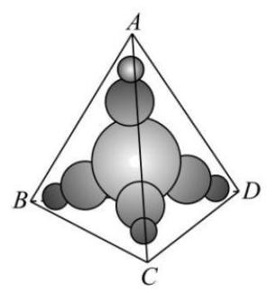

A. ${6\pi }$ B. ${9\pi }$ C. $\frac{31\pi }{4}$ D. ${21\pi }$

## 9-5 截面问题

### 9-5-1

> 原PDF：[打开学生版PDF](<file:///C:/Users/lucky12345/Documents/%E9%AB%98%E4%B8%AD%E6%95%B0%E5%AD%A6%E5%A4%8D%E4%B9%A0/%E5%88%86%E7%B1%BB%E7%89%88/01_%E5%AD%A6%E7%94%9F%E7%89%88-%E8%AE%B2%E4%B9%89/9-5%E7%AB%8B%E4%BD%93%E5%87%A0%E4%BD%95%EF%BC%9A%E6%88%AA%E9%9D%A2%E9%97%AE%E9%A2%98-%E8%AE%B2%E4%B9%89.pdf>)

球截几何体,得到的是圆面 (或一部分)

原理: 用一个平面 $\alpha$ 截球,得到一个圆. 设球的半径为 $R$ ,球心到平面 $\alpha$ 的距离为 $d$ , 那么该圆半径为___.

【例】设球 ${O}_{1}$ 、球 ${O}_{2}$ 的半径分别为 $1,2,\left| {{O}_{1}{O}_{2}}\right|  = 2$ ,求两个球的截面的圆的半径.

### 9-5-2

> 原PDF：[打开学生版PDF](<file:///C:/Users/lucky12345/Documents/%E9%AB%98%E4%B8%AD%E6%95%B0%E5%AD%A6%E5%A4%8D%E4%B9%A0/%E5%88%86%E7%B1%BB%E7%89%88/01_%E5%AD%A6%E7%94%9F%E7%89%88-%E8%AE%B2%E4%B9%89/9-5%E7%AB%8B%E4%BD%93%E5%87%A0%E4%BD%95%EF%BC%9A%E6%88%AA%E9%9D%A2%E9%97%AE%E9%A2%98-%E8%AE%B2%E4%B9%89.pdf>)

(多选)已知在棱长为 2 的正方体 ${ABCD} - {A}_{1}{B}_{1}{C}_{1}{D}_{1}$ 中，过棱 ${BC}$ ， ${CD}$ 的中点 $E$ ， $F$ 作正方体的截面多边形，则下列说法正确的有( )

A. 截面多边形可能是五边形

B. 若截面与直线 $A{C}_{1}$ 垂直,则该截面多边形为正六边形

C. 若截面过 $A{B}_{1}$ 的中点，则该截面不可能与直线 ${A}_{1}C$ 平行

D. 若截面过点 ${A}_{1}$ ,则该截面多边形的面积为 $\frac{7\sqrt{17}}{6}$

### 9-5-3

> 原PDF：[打开学生版PDF](<file:///C:/Users/lucky12345/Documents/%E9%AB%98%E4%B8%AD%E6%95%B0%E5%AD%A6%E5%A4%8D%E4%B9%A0/%E5%88%86%E7%B1%BB%E7%89%88/01_%E5%AD%A6%E7%94%9F%E7%89%88-%E8%AE%B2%E4%B9%89/9-5%E7%AB%8B%E4%BD%93%E5%87%A0%E4%BD%95%EF%BC%9A%E6%88%AA%E9%9D%A2%E9%97%AE%E9%A2%98-%E8%AE%B2%E4%B9%89.pdf>)

(2018 新课标I)已知正方体的棱长为 1，每条棱所在直线与平面 $\alpha$ 所成的角都相等，则 $\alpha$ 截此正方体所得截面面积的最大值为( )

A. $\frac{3\sqrt{3}}{4}$ B. $\frac{2\sqrt{3}}{3}$ C. $\frac{3\sqrt{2}}{4}$ D. $\frac{\sqrt{3}}{2}$

### 9-5-4

> 原PDF：[打开学生版PDF](<file:///C:/Users/lucky12345/Documents/%E9%AB%98%E4%B8%AD%E6%95%B0%E5%AD%A6%E5%A4%8D%E4%B9%A0/%E5%88%86%E7%B1%BB%E7%89%88/01_%E5%AD%A6%E7%94%9F%E7%89%88-%E8%AE%B2%E4%B9%89/9-5%E7%AB%8B%E4%BD%93%E5%87%A0%E4%BD%95%EF%BC%9A%E6%88%AA%E9%9D%A2%E9%97%AE%E9%A2%98-%E8%AE%B2%E4%B9%89.pdf>)

已知正四棱锥 $O - {ABCD}$ 的底面边长为 $\sqrt{6}$ ，高为 3. 以点 $O$ 为球心， $\sqrt{2}$ 为半径的球 $O$ 与过点 $A, B, C, D$ 的球 ${O}_{1}$ 相交，相交圆的面积为 $\pi$ ，则球 ${O}_{1}$ 的半径为( )

A. $\frac{\sqrt{13}}{2}$ 或 $\sqrt{6}$ B. $\frac{\sqrt{13}}{2}$ 或 $\frac{\sqrt{97}}{4}$

C. $\sqrt{3}$ 或 $\frac{\sqrt{97}}{4}$ D. $\sqrt{3}$ 或 $\sqrt{6}$

### 9-5-5

> 原PDF：[打开学生版PDF](<file:///C:/Users/lucky12345/Documents/%E9%AB%98%E4%B8%AD%E6%95%B0%E5%AD%A6%E5%A4%8D%E4%B9%A0/%E5%88%86%E7%B1%BB%E7%89%88/01_%E5%AD%A6%E7%94%9F%E7%89%88-%E8%AE%B2%E4%B9%89/9-5%E7%AB%8B%E4%BD%93%E5%87%A0%E4%BD%95%EF%BC%9A%E6%88%AA%E9%9D%A2%E9%97%AE%E9%A2%98-%E8%AE%B2%E4%B9%89.pdf>)

三棱锥 $D - {ABC}$ 中, $E, F, G, H$ 分别是棱 ${DA},{DB},{BC},{AC}$ 的中点,截面 ${EFGH}$ 将三棱锥分成两个几何体: ${AB} - {EFGH},{CD} - {EFGH}$ ，其体积分别为 ${V}_{1}$ ， ${V}_{2}$ ， 则 ${V}_{1} : {V}_{2} =$ (   )

A. $1 : 1$ B. 1 : 2 C. $1 : 3$ D. $1 : 2$

### 9-5-6

> 原PDF：[打开学生版PDF](<file:///C:/Users/lucky12345/Documents/%E9%AB%98%E4%B8%AD%E6%95%B0%E5%AD%A6%E5%A4%8D%E4%B9%A0/%E5%88%86%E7%B1%BB%E7%89%88/01_%E5%AD%A6%E7%94%9F%E7%89%88-%E8%AE%B2%E4%B9%89/9-5%E7%AB%8B%E4%BD%93%E5%87%A0%E4%BD%95%EF%BC%9A%E6%88%AA%E9%9D%A2%E9%97%AE%E9%A2%98-%E8%AE%B2%E4%B9%89.pdf>)

古希腊数学家阿波罗尼采用平面切割圆锥的方法来研究曲线, 如图①, 用一个不垂直于圆锥的轴的平面截圆锥, 当圆锥与截面所成的角不同时, 可以得到不同的截口曲线, 它们分别是椭圆、抛物线和双曲线. 图②, 在底面半径和高均为 1 的圆锥中, ${AB},{CD}$ 是底面圆 $O$ 的两条互相垂直的直径, $E$ 是母线 ${PB}$ 的中点, $F$ 是线段 ${EO}$ 的中点,已知过 ${CD}$ 与 $E$ 的平面与圆锥侧面的交线是以 $E$ 为顶点的圆锥曲线的一部分，则该曲线为___， $M$ ， $N$ 是该曲线上的两点且 ${MN}//{CD}$ ，若 ${MN}$ 经过点 $F$ ，则 $\left| {MN}\right|  =$ ___.

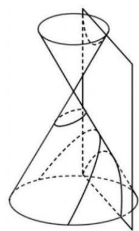

图1

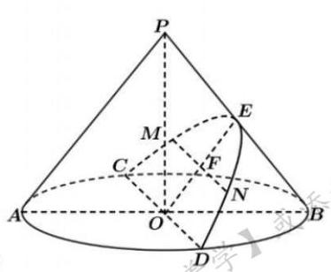

图2

### 9-5-7

> 原PDF：[打开学生版PDF](<file:///C:/Users/lucky12345/Documents/%E9%AB%98%E4%B8%AD%E6%95%B0%E5%AD%A6%E5%A4%8D%E4%B9%A0/%E5%88%86%E7%B1%BB%E7%89%88/01_%E5%AD%A6%E7%94%9F%E7%89%88-%E8%AE%B2%E4%B9%89/9-5%E7%AB%8B%E4%BD%93%E5%87%A0%E4%BD%95%EF%BC%9A%E6%88%AA%E9%9D%A2%E9%97%AE%E9%A2%98-%E8%AE%B2%E4%B9%89.pdf>)

如图,一个底面半径为 $R$ 的圆柱被与其底面所成角为 $\theta \left( {{0}^{ \circ  } < \theta  < {90}^{ \circ  }}\right)$ 的平面所截，截面是一个椭圆，当 $\theta$ 为 ${30}^{ \circ  }$ 时，这个椭圆的离心率为( )

A. $\frac{1}{2}$ B. $\frac{\sqrt{3}}{2}$ C. $\frac{1}{3}$ D. $\frac{\sqrt{3}}{3}$

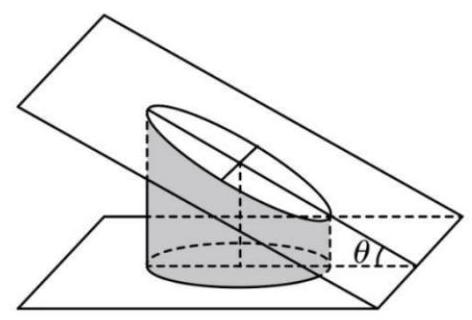

### 9-5-8

> 原PDF：[打开学生版PDF](<file:///C:/Users/lucky12345/Documents/%E9%AB%98%E4%B8%AD%E6%95%B0%E5%AD%A6%E5%A4%8D%E4%B9%A0/%E5%88%86%E7%B1%BB%E7%89%88/01_%E5%AD%A6%E7%94%9F%E7%89%88-%E8%AE%B2%E4%B9%89/9-5%E7%AB%8B%E4%BD%93%E5%87%A0%E4%BD%95%EF%BC%9A%E6%88%AA%E9%9D%A2%E9%97%AE%E9%A2%98-%E8%AE%B2%E4%B9%89.pdf>)

如图所示,正方体 ${ABCD} - {A}_{1}{B}_{1}{C}_{1}{D}_{1}$ 棱长为 $2, N$ 为 $C{C}_{1}$ 的中点, $M$ 为线段 ${BC}$ 上的动点 (不含端点),若过点 $A, M, N$ 的平面截该正方体所得截面为四边形,则线段 ${BM}$ 长度的取值范围是 ( )

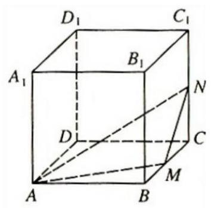

A. $\left( {0,1}\right)$ B. $\left\lbrack  {1,2}\right\rbrack$

C. $\left( {0,\frac{3}{2}}\right\rbrack$ D. $\left\lbrack  {\frac{3}{2},2}\right)$

### 9-5-9

> 原PDF：[打开学生版PDF](<file:///C:/Users/lucky12345/Documents/%E9%AB%98%E4%B8%AD%E6%95%B0%E5%AD%A6%E5%A4%8D%E4%B9%A0/%E5%88%86%E7%B1%BB%E7%89%88/01_%E5%AD%A6%E7%94%9F%E7%89%88-%E8%AE%B2%E4%B9%89/9-5%E7%AB%8B%E4%BD%93%E5%87%A0%E4%BD%95%EF%BC%9A%E6%88%AA%E9%9D%A2%E9%97%AE%E9%A2%98-%E8%AE%B2%E4%B9%89.pdf>)

已知正三棱柱 ${ABC} - {A}_{1}{B}_{1}{C}_{1}$ 的体积为 $6\sqrt{3},{AB} = {2\sqrt{3}}, D$ 是 ${B}_{1}{C}_{1}$ 的中点， 点 $P$ 是线段 ${A}_{1}D$ 上的动点,过 ${BC}$ 且与 ${AP}$ 垂直的截面 $\alpha$ 与 ${AP}$ 交于点 $E$ ,则三棱锥 $P - {BCE}$ 的体积的最小值为( )

A. $\frac{\sqrt{3}}{2}$ B. $\frac{3}{2}$ C. 2 D. $\frac{5}{2}$

### 9-5-10

> 原PDF：[打开学生版PDF](<file:///C:/Users/lucky12345/Documents/%E9%AB%98%E4%B8%AD%E6%95%B0%E5%AD%A6%E5%A4%8D%E4%B9%A0/%E5%88%86%E7%B1%BB%E7%89%88/01_%E5%AD%A6%E7%94%9F%E7%89%88-%E8%AE%B2%E4%B9%89/9-5%E7%AB%8B%E4%BD%93%E5%87%A0%E4%BD%95%EF%BC%9A%E6%88%AA%E9%9D%A2%E9%97%AE%E9%A2%98-%E8%AE%B2%E4%B9%89.pdf>)

如图,在正方体 ${ABCD} - {A}_{1}{B}_{1}{C}_{1}{D}_{1}$ 中,点 $P$ 为线段 ${A}_{1}{C}_{1}$ 上的动点 (点 $P$ 与 ${A}_{1},{C}_{1}$ 不重合),则下列说法不正确的是 ( )

A. ${BD} \bot  {CP}$

B. 三棱锥 $C - {BPD}$ 的体积为定值

C. 过 $P, C,{D}_{1}$ 三点作正方体的截面,截面图形为三角形或梯形

D. ${DP}$ 与平面 ${A}_{1}{B}_{1}{C}_{1}{D}_{1}$ 所成角的正弦值最大为 $\frac{1}{3}$

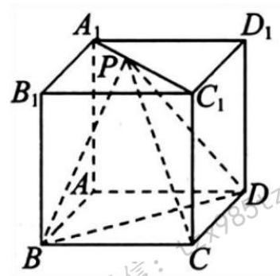

## 9-6 综合应用

### 9-6-1

> 原PDF：[打开学生版PDF](<file:///C:/Users/lucky12345/Documents/%E9%AB%98%E4%B8%AD%E6%95%B0%E5%AD%A6%E5%A4%8D%E4%B9%A0/%E5%88%86%E7%B1%BB%E7%89%88/01_%E5%AD%A6%E7%94%9F%E7%89%88-%E8%AE%B2%E4%B9%89/9-6%E7%AB%8B%E4%BD%93%E5%87%A0%E4%BD%95%EF%BC%9A%E7%BB%BC%E5%90%88%E5%BA%94%E7%94%A8-%E8%AE%B2%E4%B9%89.pdf>)

(2023 深圳一模)如图，一个棱长 1 分米的正方体形封闭容器中盛有 $V$ 升的水，若将该容器任意放置均不能使水平面呈三角形，则 $V$ 的取值范围是( )

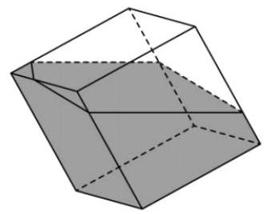

A. $\left( {\frac{1}{6},\frac{5}{6}}\right)$ B. $\left( {\frac{1}{3},\frac{2}{3}}\right)$ C. $\left( {\frac{1}{2},\frac{2}{3}}\right)$ D. $\left( {\frac{1}{6},\frac{1}{2}}\right)$

### 9-6-2

> 原PDF：[打开学生版PDF](<file:///C:/Users/lucky12345/Documents/%E9%AB%98%E4%B8%AD%E6%95%B0%E5%AD%A6%E5%A4%8D%E4%B9%A0/%E5%88%86%E7%B1%BB%E7%89%88/01_%E5%AD%A6%E7%94%9F%E7%89%88-%E8%AE%B2%E4%B9%89/9-6%E7%AB%8B%E4%BD%93%E5%87%A0%E4%BD%95%EF%BC%9A%E7%BB%BC%E5%90%88%E5%BA%94%E7%94%A8-%E8%AE%B2%E4%B9%89.pdf>)

如图, 已知圆柱的斜截面是一个椭圆, 该椭圆的长轴 ${AC}$ 为圆柱的轴截面对角线, 短轴长等于圆柱的底面直径. 将圆柱侧面沿母线 ${AB}$ 展开, 则椭圆曲线在展开图中恰好为一个周期的正弦曲线. 若该段正弦曲线是函数 $y = \sqrt{3}\sin {\omega x}(\omega  >$ 0)图像的一部分，且其对应的椭圆曲线的离心率为 $\frac{\sqrt{3}}{2}$ ，则 $\omega$ 的值为( )

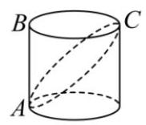

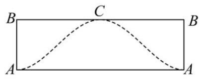

A. $\frac{\sqrt{3}}{2}$ B. 1 C. $\sqrt{3}$ D. 2

### 9-6-3

> 原PDF：[打开学生版PDF](<file:///C:/Users/lucky12345/Documents/%E9%AB%98%E4%B8%AD%E6%95%B0%E5%AD%A6%E5%A4%8D%E4%B9%A0/%E5%88%86%E7%B1%BB%E7%89%88/01_%E5%AD%A6%E7%94%9F%E7%89%88-%E8%AE%B2%E4%B9%89/9-6%E7%AB%8B%E4%BD%93%E5%87%A0%E4%BD%95%EF%BC%9A%E7%BB%BC%E5%90%88%E5%BA%94%E7%94%A8-%E8%AE%B2%E4%B9%89.pdf>)

(多选) (2024 江西重点中学协作体) 已知正方体 ${ABCD} - {A}_{1}{B}_{1}{C}_{1}{D}_{1}$ 边长为 2, 动点 $M$ 满足 $\overrightarrow{AM} = x\overrightarrow{AB} + y\overrightarrow{AD} + z\overrightarrow{A{A}_{1}}\left( {x \geq  0, y \geq  0, z \geq  0}\right)$ ,则下列说法正确的是( )

A. 当 $x = y = 1, z = \frac{1}{2}$ 时,直线 ${AM} \bot$ 平面 ${A}_{1}{BD}$

B. 当 $x = \frac{1}{4}, z = 0, y \in  \left\lbrack  {0,1}\right\rbrack$ 时, ${B}_{1}M + {MD}$ 的最小值为 $\sqrt{13}$

C. 当 $x + y = 1, z \in  \left\lbrack  {0,1}\right\rbrack$ 时, ${AM}$ 的取值范围为 $\left\lbrack  {\sqrt{2},2\sqrt{2}}\right\rbrack$

D. 当 $x + y + z = 1$ ,且 ${AM} = \frac{2\sqrt{5}}{3}$ 时,则点 $M$ 的轨迹长度为 $\frac{4\sqrt{2}}{3}\pi$

### 9-6-4

> 原PDF：[打开学生版PDF](<file:///C:/Users/lucky12345/Documents/%E9%AB%98%E4%B8%AD%E6%95%B0%E5%AD%A6%E5%A4%8D%E4%B9%A0/%E5%88%86%E7%B1%BB%E7%89%88/01_%E5%AD%A6%E7%94%9F%E7%89%88-%E8%AE%B2%E4%B9%89/9-6%E7%AB%8B%E4%BD%93%E5%87%A0%E4%BD%95%EF%BC%9A%E7%BB%BC%E5%90%88%E5%BA%94%E7%94%A8-%E8%AE%B2%E4%B9%89.pdf>)

由空间一点 $O$ 出发不共面的三条射线 ${OA},{OB},{OC}$ 及相邻两射线所在平面构成的几何图形叫三面角,记为 $O - {ABC}$ . 其中 $O$ 叫做三面角的顶点,面 ${AOB},{BOC}$ , ${COA}$ 叫做三面角的面， $\angle {AOB},\angle {BOC},\angle {AOC}$ 叫做三面角的三个面角，分别记为 $\alpha ,\beta ,\gamma$ ,二面角 $A - {OB} - C, B - {OA} - C, A - {OC} - B$ 叫做三面角的二面角, 设二面角 $A - {OC} - B$ 的平面角大小为 $x$ ,则一定成立的是( )

A. $\cos x = \frac{\cos \alpha  - \cos \beta \cos \gamma }{\sin \beta \sin \gamma }$ B. $\cos x = \frac{\cos \alpha  + \cos \beta \cos \gamma }{\sin \beta \sin \gamma }$

C. $\cos x = \frac{\sin \alpha  - \sin \beta \sin \gamma }{\cos \beta \cos \gamma }$ D. $\cos x = \frac{\sin \alpha  + \sin \beta \sin \gamma }{\cos \beta \cos \gamma }$

### 9-6-5

> 原PDF：[打开学生版PDF](<file:///C:/Users/lucky12345/Documents/%E9%AB%98%E4%B8%AD%E6%95%B0%E5%AD%A6%E5%A4%8D%E4%B9%A0/%E5%88%86%E7%B1%BB%E7%89%88/01_%E5%AD%A6%E7%94%9F%E7%89%88-%E8%AE%B2%E4%B9%89/9-6%E7%AB%8B%E4%BD%93%E5%87%A0%E4%BD%95%EF%BC%9A%E7%BB%BC%E5%90%88%E5%BA%94%E7%94%A8-%E8%AE%B2%E4%B9%89.pdf>)

(2023 湖北圆创)如图，在棱长为 2 的正方体 ${ABCD} - {EFGH}$ 中，点 $M$ 是正方体的中心，将四棱锥 $M - {BCGF}$ 绕直线 ${CG}$ 逆时针旋转 $\alpha \left( {0 < \alpha  < \pi }\right)$ 后，得到四棱锥 ${M}^{\prime } - {B}^{\prime }{CG}{F}^{\prime }$ .

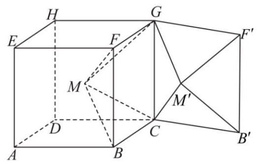

(1)若 $\alpha  = \frac{\pi }{2}$ ，求证:平面 ${MCG}//$ 平面 ${M}^{\prime }{B}^{\prime }{F}^{\prime }$ ；

(2)是否存在 $\alpha$ ，使得直线 ${M}^{\prime }{F}^{\prime }\bot$ 平面 ${MBC}$ ？若存在，求出 $\alpha$ 的值；若不存在， 请说明理由.

### 9-6-6

> 原PDF：[打开学生版PDF](<file:///C:/Users/lucky12345/Documents/%E9%AB%98%E4%B8%AD%E6%95%B0%E5%AD%A6%E5%A4%8D%E4%B9%A0/%E5%88%86%E7%B1%BB%E7%89%88/01_%E5%AD%A6%E7%94%9F%E7%89%88-%E8%AE%B2%E4%B9%89/9-6%E7%AB%8B%E4%BD%93%E5%87%A0%E4%BD%95%EF%BC%9A%E7%BB%BC%E5%90%88%E5%BA%94%E7%94%A8-%E8%AE%B2%E4%B9%89.pdf>)

(2023 东三省三校一模)“阿基米德多面体”这称为半正多面体，是由边数不全相同的正多边形为面围成的多面体, 它体现了数学的对称美. 如图所示, 将正方体沿交于一顶点的三条棱的中点截去一个三棱锥, 共可截去八个三棱锥, 得到八个面为正三角形、六个面为正方形的一种半正多面体. 已知 ${AB} = \frac{3\sqrt{2}}{2}$ ，则该半正多面体外接球的表面积为( )

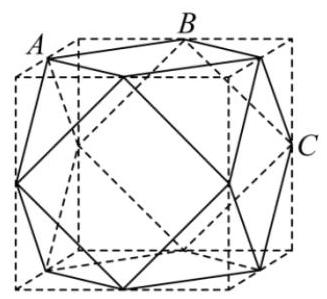

A. ${18\pi }$ B. ${16\pi }$ C. ${14\pi }$ D. ${12\pi }$

### 9-6-7

> 原PDF：[打开学生版PDF](<file:///C:/Users/lucky12345/Documents/%E9%AB%98%E4%B8%AD%E6%95%B0%E5%AD%A6%E5%A4%8D%E4%B9%A0/%E5%88%86%E7%B1%BB%E7%89%88/01_%E5%AD%A6%E7%94%9F%E7%89%88-%E8%AE%B2%E4%B9%89/9-6%E7%AB%8B%E4%BD%93%E5%87%A0%E4%BD%95%EF%BC%9A%E7%BB%BC%E5%90%88%E5%BA%94%E7%94%A8-%E8%AE%B2%E4%B9%89.pdf>)

(多选)(2023 江门一模)勒洛，德国机械工程专家，机构运动学的创始人. 他所著的《理论运动学》对机械元件的运动过程进行了系统的分析，成为机械工程方面的名著. 勒洛四面体是一个非常神奇的 “四面体”，它能在两个平行平面间自由转动, 并且始终保持与两平面都接触, 因此它能像球一样来回滚动. 勒洛四面体是以正四面体的四个顶点为球心, 以正四面体的棱长为半径的四个球的相交部分围成的几何体. 如图所示,设正四面体 ${ABCD}$ 的棱长为 2,则下列说法正确的是( )

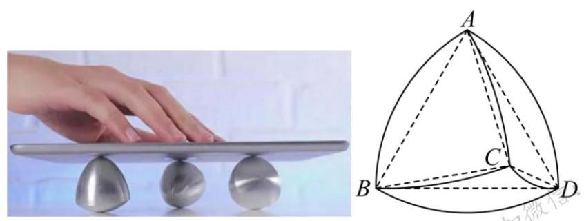

A. 勒洛四面体能够容纳的最大球的半径为 $2 - \frac{\sqrt{6}}{2}$

B. 勒洛四面体被平面 ${ABC}$ 截得的截面面积是 $2\left( {\pi  - \sqrt{3}}\right)$

C. 勒洛四面体表面上交线 ${AC}$ 的长度为 $\frac{2\pi }{3}$

D. 勒洛四面体表面上任意两点间的距离可能大于 2

### 9-6-8

> 原PDF：[打开学生版PDF](<file:///C:/Users/lucky12345/Documents/%E9%AB%98%E4%B8%AD%E6%95%B0%E5%AD%A6%E5%A4%8D%E4%B9%A0/%E5%88%86%E7%B1%BB%E7%89%88/01_%E5%AD%A6%E7%94%9F%E7%89%88-%E8%AE%B2%E4%B9%89/9-6%E7%AB%8B%E4%BD%93%E5%87%A0%E4%BD%95%EF%BC%9A%E7%BB%BC%E5%90%88%E5%BA%94%E7%94%A8-%E8%AE%B2%E4%B9%89.pdf>)

(多选)“牟合方盖”是由我国古代数学家刘徽首先发现并采用的一种用于计算球体体积的方法, 当一个正方体用圆柱从纵横两侧面作内切圆柱体时, 两圆柱体的公共部分即为 “牟合方盖”，他提出 “牟合方盖” 的内切球的体积与 “牟合方盖”的体积比为定值. 南北朝时期祖暅提出理论:“缘幂势既同，则积不容异”， 即 “在等高处的截面面积总是相等的几何体，它们的体积也相等”，并算出了 “牟合方盖” 和球的体积. 其大体思想可表示如图,其中图 1 为棱长为 ${2r}$ 的正方体截得的 “牟合方盖” 的八分之一,图 2 为棱长为 ${2r}$ 的正方体的八分之一,图 3 是以底面边长为 $r$ 的正方体的一个底面和底面以外的一个顶点作的四棱锥,则根据祖暅原理，下列结论正确的是 ( )

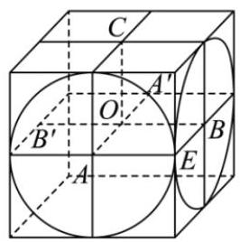

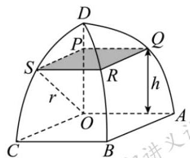

图1

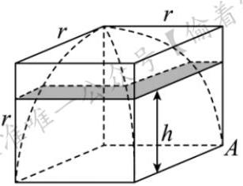

图2

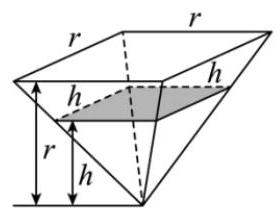

图3

A. 若以一个平行于正方体上下底面的平面，截 “牟合方盖”，截面是一个圆形

B. 图 2 中阴影部分的面积为 ${h}^{2}$

C. “牟合方盖” 的内切球的体积与 “牟合方盖” 的体积比为 $\pi  : 4$

D. 由棱长为 ${2r}$ 的正方体截得的 “牟合方盖” 体积为 $\frac{16}{3}{r}^{3}$

### 9-6-9

> 原PDF：[打开学生版PDF](<file:///C:/Users/lucky12345/Documents/%E9%AB%98%E4%B8%AD%E6%95%B0%E5%AD%A6%E5%A4%8D%E4%B9%A0/%E5%88%86%E7%B1%BB%E7%89%88/01_%E5%AD%A6%E7%94%9F%E7%89%88-%E8%AE%B2%E4%B9%89/9-6%E7%AB%8B%E4%BD%93%E5%87%A0%E4%BD%95%EF%BC%9A%E7%BB%BC%E5%90%88%E5%BA%94%E7%94%A8-%E8%AE%B2%E4%B9%89.pdf>)

我们把平面内与直线垂直的非零向量称为直线的法向量, 在平面直角坐标系中,过点 $A\left( {-3,4}\right)$ 的直线 $l$ 的一个法向量为 $\left( {1, - 2}\right)$ ,则直线 $l$ 的点法式方程为: $1 \times \; \left( {x + 3}\right)  + \left( {-2}\right)  \times  \left( {y - 4}\right)  = 0$ ,化简得 $x - {2y} + {11} = 0$ . 类比以上做法,在空间直角坐标系中,经过点 $M\left( {1,2,3}\right)$ 的平面的一个法向量为 $\overrightarrow{m} = \left( {1, - 4,2}\right)$ ,则该平面的方程为 ( )

A. $x - {4y} + {2z} + 1 = 0$ B. $x - {4y} - {2z} + 1 = 0$

C. $x + {4y} - {2z} + 1 = 0$ D. $x + {4y} - {2z} - 1 = 0$

### 9-6-10

> 原PDF：[打开学生版PDF](<file:///C:/Users/lucky12345/Documents/%E9%AB%98%E4%B8%AD%E6%95%B0%E5%AD%A6%E5%A4%8D%E4%B9%A0/%E5%88%86%E7%B1%BB%E7%89%88/01_%E5%AD%A6%E7%94%9F%E7%89%88-%E8%AE%B2%E4%B9%89/9-6%E7%AB%8B%E4%BD%93%E5%87%A0%E4%BD%95%EF%BC%9A%E7%BB%BC%E5%90%88%E5%BA%94%E7%94%A8-%E8%AE%B2%E4%B9%89.pdf>)

蜂房是自然界最神奇的 “建筑” 之一, 如图 1 所示. 蜂房结构是由正六棱柱截去三个相等的三棱锥 $H - {ABC}, J - {CDE}, K - {EFA}$ ,再分别以 ${AC},{CE},{EA}$ 为轴将 $\bigtriangleup {ACH}$ , $\bigtriangleup {CEJ}$ , $\bigtriangleup {EAK}$ 分别向上翻转 ${180}^{ \circ  }$ ,使 $H, J, K$ 三点重合为点 $S$ 所围成的曲顶多面体 (下底面开口), 如图 2 所示. 蜂房曲顶空间的弯曲度可用曲率来刻画, 定义其度量值等于蜂房顶端三个菱形的各个顶点的曲率之和, 而每一顶点的曲率规定等于 ${2\pi }$ 减去蜂房多面体在该点的各个面角之和(多面体的面角是多面体的面的内角, 用弧度制表示). 例如: 正四面体在每个顶点有 3 个面角,每个面角是 $\frac{\pi }{3}$ ,所以正四面体在各顶点的曲率为 ${2\pi } - 3 \times  \frac{\pi }{3} = \pi$ .

图1

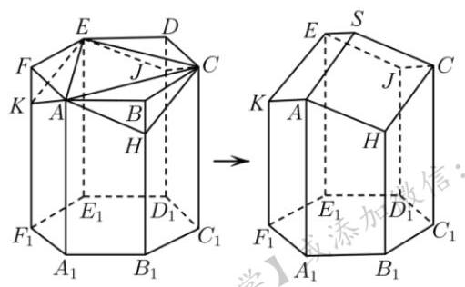

图2

(1)求蜂房曲顶空间的弯曲度；

(2)若正六棱柱底面边长为 1,侧棱长为 2,设 ${BH} = x$ .

(i)用 $x$ 表示蜂房(图 2 右侧多面体)的表面积 $S\left( x\right)$ ；

(ii) 当蜂房表面积最小时,求其顶点 $S$ 的曲率的余弦值.
