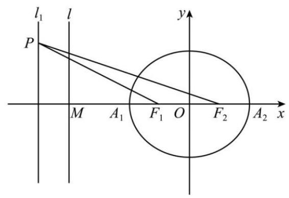

# 第12章 直线和圆

## 12-1 特殊的圆

### 12-1-1

请写出下述直线的方程, 并指出该直线方程不包含平面中哪种直线.

(1)点斜式

(2)两点式

(3)斜截式

(4)截距式

(5)一般式

### 12-1-2

直线 ${l}_{1}$ 的斜率为 ${k}_{1}$ ,直线 ${l}_{2}$ 的斜率为 ${k}_{2}$ ,且两个直线不垂直.

(1)写出直线 ${l}_{1},{l}_{2}$ 的夹角公式；

(2)写出直线 ${l}_{1}$ 到 ${l}_{2}$ 的到角公式.

### 12-1-3

完成下述点线对称和线线对称问题.

(1)求点 $\left( {4,0}\right)$ 关于直线 ${5x} + {4y} + {21} = 0$ 的对称点;

(2)求点 $\left( {4,0}\right)$ 关于直线 $x - y - 5 = 0$ 的对称点;

(3)已知直线 ${l}_{1} : x - {2y} + 5 = 0$ 与 ${l}_{2}$ 关于直线 ${3x} - {2y} + 7 = 0$ 对称,求直线 ${l}_{2}$ 的方程;

(4)已知直线 ${l}_{1} : {2x} + {2y} + 3 = 0$ 与 ${l}_{2}$ 关于直线 $y =  - x$ 对称，求直线 ${l}_{2}$ 的方程.

### 12-1-4

求下列直线经过的定点, 并请阐述问题背后的含义.

(1) $\left( {m - 1}\right) x + \left( {{2m} - 1}\right) y = {3m} - 5$

(2) $\left( {k + m}\right) x + \left( {{2k} - m}\right) y + {3k} - {4m} = 0$

(3) $\left( {2{m}^{2} + {8m} + 3}\right) x - \left( {3{m}^{2} + m - 4}\right) y + 4{m}^{2} - {6m} - {11} = 0$

### 12-1-5

完成下列问题, 并请阐述问题背后的含义.

(1)已知两圆 ${C}_{1} : {x}^{2} + {y}^{2} + {6x} - 4 = 0$ 和 ${C}_{2} : {x}^{2} + {y}^{2} + {6y} - {28} = 0$ ，求经过两圆交点的直线方程.

(2)已知两圆 ${C}_{1} : {x}^{2} + {y}^{2} = 1$ 和 ${C}_{2} : {x}^{2} + {y}^{2} - {2x} - {2y} + 1 = 0$ ，求经过两圆交点且经过点 $\left( {3,1}\right)$ 的圆的方程.

(3)已知圆 $C : {x}^{2} + {y}^{2} = 1$ 和 $l : y = {2x} + 1$ ，求经过圆和直线交点且经过点 $\left( {2,0}\right)$ 的圆的方程.

### 12-1-6

(2024 福建莆田三模)古希腊著名数学家阿波罗尼斯发现:若动点 $M$ 与两个定点 $A, B$ 的距离之比为常数 $\lambda \left( {\lambda  > 0,\lambda  \neq  1}\right)$ ,则点 $M$ 的轨迹是圆. 后来,人们将这个圆以他的名字命名,称为阿波罗尼斯圆,简称阿氏圆. 已知 $A\left( {-1,0}\right) , B\left( {0,1}\right)$ , $M$ 是平面内一动点,且 $\frac{\left| MA\right| }{\left| MB\right| } = \sqrt{2}$ ,则点 $M$ 的轨迹方程为___. 若点 $P$ 在圆 $C : {\left( x - 2\right) }^{2} + {y}^{2} = {36}$ 上，则 $2\left| {PA}\right|  + \left| {PB}\right|$ 的最小值是___.

### 12-1-7

(2024 重庆九龙坡三模) 古希腊几何学家阿波罗尼斯证明过这样一个命题: 平面内到两定点的距离之比为定值 $\lambda \left( {\lambda  > 0,\lambda  \neq  1}\right)$ 的点的轨迹是圆. 后来,人们将这个圆以他的名字命名，称为阿波罗尼斯圆，简称阿氏圆. 已知在平面直角坐标系 ${xOy}$ 中, $A\left( {-4,1}\right) , B\left( {-4,4}\right)$ ,若点 $P$ 是满足 $\frac{\left| PA\right| }{\left| PB\right| } = \frac{1}{2}$ 的阿氏圆上的任意一点, 点 $Q$ 为抛物线 $C : {y}^{2} = {16x}$ 上的动点， $Q$ 在直线 $x =  - 4$ 上的射影为 $R$ ，则 $\left| {PB}\right|  + \; 2\left| {PQ}\right|  + 2\left| {QR}\right|$ 的最小值为___.

### 12-1-8

(2022 江西南昌一模)已知 $A\left( {-1,0}\right) , B\left( {3,0}\right) , P$ 是圆 $O : {x}^{2} + {y}^{2} = {45}$ 上的一个动点,则 $\sin \angle {APB}$ 的最大值为 ( )

A. $\frac{\sqrt{3}}{3}$ B. $\frac{\sqrt{5}}{3}$ C. $\frac{\sqrt{3}}{4}$ D. $\frac{\sqrt{5}}{4}$

### 12-1-9

(2005 浙江高考)如图，已知椭圆的中心在坐标原点，焦点 ${F}_{1}$ ， ${F}_{2}$ 在 $x$ 轴上， 长轴 ${A}_{1}{A}_{2}$ 的长为 4,左准线 $l$ 与 $x$ 轴的交点为 $M,\left| {M{A}_{1}}\right|  : \left| {{A}_{1}{F}_{1}}\right|  = 2 : 1$ .

(1)求椭圆的方程；

(2)若直线 ${l}_{1} : x = m\left( {\left| m\right|  > 1}\right)$ ， $P$ 为 ${l}_{1}$ 上的动点，使 $\angle {F}_{1}P{F}_{2}$ 最大的点 $P$ 记为 $Q$ ， 求点 $Q$ 的坐标 (用 $m$ 表示).

## 12-2 数形结合

### 12-2-1

(2023 江西上饶模拟)已知 $a + b - 7 = 0, c + d - 5 = 0$ ，则 $\sqrt{{\left( a + c\right) }^{2} + {\left( b + d\right) }^{2}}$ 的最小值等于( )

A. $\sqrt{3}$ B. 6 C. $4\sqrt{2}$ D. $6\sqrt{2}$

### 12-2-2

(2024 辽宁葫芦岛一模) 已知 $Q$ 为圆 $A : {\left( x - 1\right) }^{2} + {y}^{2} = 1$ 上动点,直线 ${l}_{1} : {mx} - \; {ny} + {3m} + {2n} = 0$ 和直线 ${l}_{2} : {nx} + {my} - {6m} + n = 0\left( {m, n \in  \mathbf{R},{m}^{2} + {n}^{2} \neq  0}\right.$ ) 的交点为 $P$ ，则 $\left| {PQ}\right|$ 的最大值是( )

A. $6 + \sqrt{5}$ B. $4 - \sqrt{5}$ C. $5 + \sqrt{5}$ D. $1 + \sqrt{5}$

### 12-2-3

(2024 山东威海一模)已知 $F$ 为椭圆 $C : \frac{{y}^{2}}{9} + \frac{{x}^{2}}{5} = 1$ 的上焦点， $P$ 为 $C$ 上一点， $Q$ 为圆 $M : {x}^{2} + {y}^{2} - {8x} + {15} = 0$ 上一点，则 $\left| {PQ}\right|  + \left| {PF}\right|$ 的最大值为( )

A. $1 + 2\sqrt{5}$ B. $3 + 2\sqrt{5}$ C. $5 + 2\sqrt{5}$ D. $7 + 2\sqrt{5}$

### 12-2-4

(2024 上海三模) 已知圆 ${C}_{1} : {\left( x - 1\right) }^{2} + {\left( y - 1\right) }^{2} = 1$ ,圆 ${C}_{2} : {\left( x - 4\right) }^{2} + (y - \; 5{)}^{2} = 9$ ,点 $M, N$ 分别是圆 ${C}_{1}$ 、圆 ${C}_{2}$ 上的动点,点 $P$ 为直线 $y =  - x$ 上的动点,则 $\left| {PM}\right|  + \left| {PN}\right|$ 的最小值是___.

### 12-2-5

(2024 陕西模拟)若点 $P\left( {x, y}\right)$ 在平面区域 $\left\{  \begin{array}{l} {2x} - y + 2 \geq  0 \\  x - {2y} + 1 \leq  0 \\  x + y - 2 \leq  0 \end{array}\right.$ 上，则 ${x}^{2} + {y}^{2} - {2x} +$ 2 的最小值是( )

A. $\frac{4}{5}$ B. $\frac{9}{5}$ C. 1 D. 2

### 12-2-6

(2024上海一模)已知实数 $m, n$ 满足 ${m}^{2} + {n}^{2} \leq  1$ ，则 $\left| {{2m} + n - 2}\right|  +  \mid  6 - m - \; {3n} \mid$ 的取值范围是___.

## 12-3 直线系和圆系

### 12-3-1

已知两圆 ${C}_{1} : {x}^{2} + {y}^{2} + {6x} - 4 = 0$ 和 ${C}_{2} : {x}^{2} + {y}^{2} + {6y} - {28} = 0$ ,求经过两圆交点的直线方程.

### 12-3-2

已知两圆 ${C}_{1} : {x}^{2} + {y}^{2} = 1$ 和 ${C}_{2} : {x}^{2} + {y}^{2} - {2x} - {2y} + 1 = 0$ ,求经过两圆交点且经过点 $\left( {3,1}\right)$ 的圆的方程.

### 12-3-3

已知圆 $C : {x}^{2} + {y}^{2} = 1$ 和 $l : y = {{2x} + 1}$ ，求经过圆和直线交点且经过点 $\left( {2,0}\right)$ 的圆的方程.

### 12-3-4

(2024 江西赣州二模) 已知直线 $l : \left( {m + n}\right) x + \left( {m - n}\right) y - {2m} = 0\left( {{mn} \neq  0}\right)$ . 圆

$C : {\left( x - 2\right) }^{2} + {\left( y - 2\right) }^{2} = 8$ ,则 ( )

A. $l$ 过定点 $\left( {1, - 1}\right)$ B. $l$ 与 $C$ 一定相交

C. 若 $l$ 平分 $C$ 的周长,则 $m = 1$ D. $l$ 被 $C$ 截得的最短弦的长度为 4

### 12-3-5

求过圆: ${x}^{2} + {y}^{2} - {2x} + {2y} + 1 = 0$ 与圆: ${x}^{2} + {y}^{2} + {4x} - {2y} - 4 = 0$ 的交点, 圆心在直线: $x - {2y} - 5 = 0$ 的圆的方程.

### 12-3-6

(2024 湖北模拟) 已知抛物线 $C : {x}^{2} = {12y}$ 和圆 $M : {x}^{2} + {y}^{2} - {4x} - {4y} + 4 = 0$ , 点 $F$ 是抛物线 $C$ 的焦点,圆 $M$ 上的两点 $A, B$ 满足 ${AO} = {2AF},{BO} = {2BF}$ ，其中 $O$ 是坐标原点,动点 $P$ 在圆 $M$ 上运动,则 $P$ 到直线 ${AB}$ 的最大距离为( )

A. $2 + \sqrt{2}$ B. $\sqrt{2}$ C. $4 + \sqrt{2}$ D. $2\sqrt{2}$

## 12-4 综合应用

### 12-4-1

(2022 全国高考) 写出与圆 ${x}^{2} + {y}^{2} = 1$ 和 ${\left( x - 3\right) }^{2} + {\left( y - 4\right) }^{2} = {16}$ 都相切的一条直线的方程___.

### 12-4-2

(多选) (2024 浙江绍兴三模) 已知 $M, N$ 为圆 ${x}^{2} + {y}^{2} = 4$ 上的两个动点,点 $P\left( {-1,1}\right)$ ,且 ${PM} \bot  {PN}$ ,则(   )

A. ${\left| PM\right| }_{\max } = 2 + \sqrt{2}$

B. ${\left| MN\right| }_{\max } = 2\sqrt{2 + \sqrt{3}}$

C. $\bigtriangleup {PMN}$ 外接圆圆心的轨迹方程为 ${\left( x + \frac{1}{2}\right) }^{2} + {\left( y - \frac{1}{2}\right) }^{2} = \frac{3}{2}$

D. $\bigtriangleup {PMN}$ 重心的轨迹方程为 ${\left( x + \frac{5}{6}\right) }^{2} + {\left( y - \frac{5}{6}\right) }^{2} = \frac{1}{6}$

### 12-4-3

(2024 广东模拟预测) 已知圆 $M : {x}^{2} + {y}^{2} - {6y} = 0$ 与圆 $N : {\left( x - \cos \theta \right) }^{2} + (y - \; \sin \theta {)}^{2} = 1\left( {0 \leq  \theta  \leq  {2\pi }}\right)$ 交于 $A, B$ 两点,则 $\bigtriangleup {ABM}$ ( $M$ 为圆 $M$ 的圆心) 面积的最大值为( )

A. $\sqrt{2}$ B. $\frac{9}{4}$ C. $2\sqrt{2}$ D. $\frac{9}{2}$
