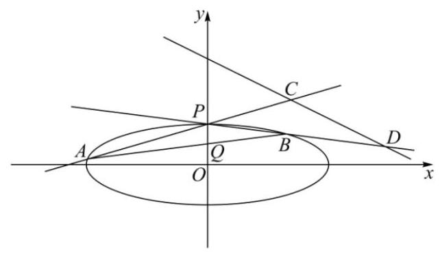
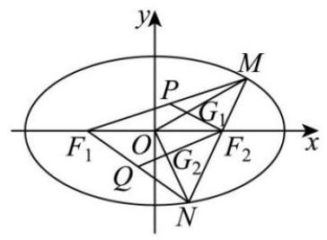
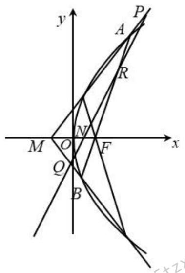

# 第13章 圆锥曲线(难点)

## 13-1 定值定点问题

### 13-1-1

> 原PDF：[打开学生版PDF](<file:///C:/Users/lucky12345/Documents/%E9%AB%98%E4%B8%AD%E6%95%B0%E5%AD%A6%E5%A4%8D%E4%B9%A0/%E5%88%86%E7%B1%BB%E7%89%88/01_%E5%AD%A6%E7%94%9F%E7%89%88-%E8%AE%B2%E4%B9%89/13-1%E5%9C%86%E9%94%A5%E6%9B%B2%E7%BA%BF%EF%BC%88%E9%9A%BE%E7%82%B9%EF%BC%89%EF%BC%9A%E5%AE%9A%E5%80%BC%E5%AE%9A%E7%82%B9%E9%97%AE%E9%A2%98-%E8%AE%B2%E4%B9%89.pdf>)

(2024 广东江苏高考)已知 $A\left( {0,3}\right)$ 和 $P\left( {3,\frac{3}{2}}\right)$ 为椭圆 $C : \frac{{x}^{2}}{{a}^{2}} + \frac{{y}^{2}}{{b}^{2}} = 1\left( {a > b > 0}\right)$ 上两点.

(1)求 $C$ 的离心率；

(2)若过 $P$ 的直线 $l$ 交 $C$ 于另一点 $B$ ,且 $\bigtriangleup {ABP}$ 的面积为 9，求 $l$ 的方程.

### 13-1-2

> 原PDF：[打开学生版PDF](<file:///C:/Users/lucky12345/Documents/%E9%AB%98%E4%B8%AD%E6%95%B0%E5%AD%A6%E5%A4%8D%E4%B9%A0/%E5%88%86%E7%B1%BB%E7%89%88/01_%E5%AD%A6%E7%94%9F%E7%89%88-%E8%AE%B2%E4%B9%89/13-1%E5%9C%86%E9%94%A5%E6%9B%B2%E7%BA%BF%EF%BC%88%E9%9A%BE%E7%82%B9%EF%BC%89%EF%BC%9A%E5%AE%9A%E5%80%BC%E5%AE%9A%E7%82%B9%E9%97%AE%E9%A2%98-%E8%AE%B2%E4%B9%89.pdf>)

(2017 全国高考)已知椭圆 $C : \frac{{x}^{2}}{{a}^{2}} + \frac{{y}^{2}}{{b}^{2}} = 1\left( {a > b > 0}\right)$ ，四点 ${P}_{1}\left( {1,1}\right) ,{P}_{2}\left( {0,1}\right)$ ， ${P}_{3}\left( {-1,\frac{\sqrt{3}}{2}}\right) ,{P}_{4}\left( {1,\frac{\sqrt{3}}{2}}\right)$ 中恰有三点在椭圆 $C$ 上.

(1)求 $C$ 的方程；

(2)设直线 $l$ 不经过 ${P}_{2}$ 点且与 $C$ 相交于 $A, B$ 两点. 若直线 ${P}_{2}A$ 与直线 ${P}_{2}B$ 的斜率的和为-1 , 证明: $l$ 过定点.

### 13-1-3

> 原PDF：[打开学生版PDF](<file:///C:/Users/lucky12345/Documents/%E9%AB%98%E4%B8%AD%E6%95%B0%E5%AD%A6%E5%A4%8D%E4%B9%A0/%E5%88%86%E7%B1%BB%E7%89%88/01_%E5%AD%A6%E7%94%9F%E7%89%88-%E8%AE%B2%E4%B9%89/13-1%E5%9C%86%E9%94%A5%E6%9B%B2%E7%BA%BF%EF%BC%88%E9%9A%BE%E7%82%B9%EF%BC%89%EF%BC%9A%E5%AE%9A%E5%80%BC%E5%AE%9A%E7%82%B9%E9%97%AE%E9%A2%98-%E8%AE%B2%E4%B9%89.pdf>)

(2024 重庆渝中模拟)已知椭圆 $C : \frac{{x}^{2}}{{a}^{2}} + \frac{{y}^{2}}{{b}^{2}} = 1\left( {a > b > 0}\right)$ 的离心率为 $\frac{1}{2}$ ，点 $A\left( {1,\frac{3}{2}}\right)$ 在 $C$ 上.

(1)求椭圆 $C$ 的方程；

(2)过点 $T\left( {4,0}\right)$ 的直线 $l$ 交椭圆 $C$ 于 $P, Q$ 两点(异于点 $A$ ),过点 $P$ 作 $x$ 轴的垂线与直线 ${AQ}$ 交于点 $M$ ,设直线 ${AP},{AQ}$ 的斜率分别为 ${k}_{1},{k}_{2}$ . 证明:

(i) ${k}_{1} + {k}_{2}$ 为定值;

(ii) 直线 ${AT}$ 过线段 ${PM}$ 的中点.

### 13-1-4

> 原PDF：[打开学生版PDF](<file:///C:/Users/lucky12345/Documents/%E9%AB%98%E4%B8%AD%E6%95%B0%E5%AD%A6%E5%A4%8D%E4%B9%A0/%E5%88%86%E7%B1%BB%E7%89%88/01_%E5%AD%A6%E7%94%9F%E7%89%88-%E8%AE%B2%E4%B9%89/13-1%E5%9C%86%E9%94%A5%E6%9B%B2%E7%BA%BF%EF%BC%88%E9%9A%BE%E7%82%B9%EF%BC%89%EF%BC%9A%E5%AE%9A%E5%80%BC%E5%AE%9A%E7%82%B9%E9%97%AE%E9%A2%98-%E8%AE%B2%E4%B9%89.pdf>)

(2022 全国高考)已知椭圆 $E$ 的中心为坐标原点，对称轴为 $x$ 轴、 $y$ 轴,且过 $A\left( {0, - 2}\right) , B\left( {\frac{3}{2}, - 1}\right)$ 两点.

(1)求 $E$ 的方程；

(2)设过点 $P\left( {1, - 2}\right)$ 的直线交 $E$ 于 $M, N$ 两点，过 $M$ 且平行于 $x$ 轴的直线与线段 ${AB}$ 交于点 $T$ ，点 $H$ 满足 $\overrightarrow{MT} = \overrightarrow{TH}$ . 证明:直线 ${HN}$ 过定点.

## 13-2 最值问题

### 13-2-1

> 原PDF：[打开学生版PDF](<file:///C:/Users/lucky12345/Documents/%E9%AB%98%E4%B8%AD%E6%95%B0%E5%AD%A6%E5%A4%8D%E4%B9%A0/%E5%88%86%E7%B1%BB%E7%89%88/01_%E5%AD%A6%E7%94%9F%E7%89%88-%E8%AE%B2%E4%B9%89/13-2%E5%9C%86%E9%94%A5%E6%9B%B2%E7%BA%BF%EF%BC%88%E9%9A%BE%E7%82%B9%EF%BC%89%EF%BC%9A%E6%9C%80%E5%80%BC%E9%97%AE%E9%A2%98-%E8%AE%B2%E4%B9%89.pdf>)

(2023 全国高考) 已知直线 $x - {2y} + 1 = 0$ 与抛物线 $C : {y}^{2} = {2px}\left( {p > 0}\right)$ 交于 $A, B$ 两点，且 $\left| {AB}\right|  = 4\sqrt{15}$ .

(1)求 $p$ ；

(2)设 $F$ 为 $C$ 的焦点， $M$ ， $N$ 为 $C$ 上两点， $\overrightarrow{FM} \cdot  \overrightarrow{FN} = 0$ ，求 $\bigtriangleup  {MFN}$ 面积的最小值.

### 13-2-2

> 原PDF：[打开学生版PDF](<file:///C:/Users/lucky12345/Documents/%E9%AB%98%E4%B8%AD%E6%95%B0%E5%AD%A6%E5%A4%8D%E4%B9%A0/%E5%88%86%E7%B1%BB%E7%89%88/01_%E5%AD%A6%E7%94%9F%E7%89%88-%E8%AE%B2%E4%B9%89/13-2%E5%9C%86%E9%94%A5%E6%9B%B2%E7%BA%BF%EF%BC%88%E9%9A%BE%E7%82%B9%EF%BC%89%EF%BC%9A%E6%9C%80%E5%80%BC%E9%97%AE%E9%A2%98-%E8%AE%B2%E4%B9%89.pdf>)

(2024 河南模拟)已知抛物线 $C : {y}^{2} = {4x}$ 的焦点为 $F$ ，过 $F$ 的直线 $l$ 交 $C$ 于 $A$ ， $B$ 两点，过 $F$ 与 $l$ 垂直的直线交 $C$ 于 $D$ ， $E$ 两点，其中 $B$ ， $D$ 在 $x$ 轴上方， $M$ ， $N$ 分别为 ${AB}$ ， ${DE}$ 的中点.

(1)证明:直线 ${MN}$ 过定点；

(2)设 $G$ 为直线 ${AE}$ 与直线 ${BD}$ 的交点，求 $\bigtriangleup  {GMN}$ 面积的最小值.

### 13-2-3

> 原PDF：[打开学生版PDF](<file:///C:/Users/lucky12345/Documents/%E9%AB%98%E4%B8%AD%E6%95%B0%E5%AD%A6%E5%A4%8D%E4%B9%A0/%E5%88%86%E7%B1%BB%E7%89%88/01_%E5%AD%A6%E7%94%9F%E7%89%88-%E8%AE%B2%E4%B9%89/13-2%E5%9C%86%E9%94%A5%E6%9B%B2%E7%BA%BF%EF%BC%88%E9%9A%BE%E7%82%B9%EF%BC%89%EF%BC%9A%E6%9C%80%E5%80%BC%E9%97%AE%E9%A2%98-%E8%AE%B2%E4%B9%89.pdf>)

(2022 浙江高考) 如图,已知椭圆 $\frac{{x}^{2}}{12} + {y}^{2} = 1$ . 设 $A, B$ 是椭圆上异于 $P\left( {0,1}\right)$ 的两点,且点 $Q\left( {0,\frac{1}{2}}\right)$ 在线段 ${AB}$ 上,直线 ${PA},{PB}$ 分别交直线 $y =  - \frac{1}{2}x + 3$ 于 $C, D$ 两点.

(1)求点 $P$ 到椭圆上点的距离的最大值；

(2)求 $\left| {CD}\right|$ 的最小值.

### 13-2-4

> 原PDF：[打开学生版PDF](<file:///C:/Users/lucky12345/Documents/%E9%AB%98%E4%B8%AD%E6%95%B0%E5%AD%A6%E5%A4%8D%E4%B9%A0/%E5%88%86%E7%B1%BB%E7%89%88/01_%E5%AD%A6%E7%94%9F%E7%89%88-%E8%AE%B2%E4%B9%89/13-2%E5%9C%86%E9%94%A5%E6%9B%B2%E7%BA%BF%EF%BC%88%E9%9A%BE%E7%82%B9%EF%BC%89%EF%BC%9A%E6%9C%80%E5%80%BC%E9%97%AE%E9%A2%98-%E8%AE%B2%E4%B9%89.pdf>)

(2022 全国高考) 设抛物线 $C : {y}^{2} = {2px}\left( {p > 0}\right)$ 的焦点为 $F$ ，点 $D\left( {p,0}\right)$ ，过 $F$ 的直线交 $C$ 于 $M, N$ 两点. 当直线 ${MD}$ 垂直于 $x$ 轴时, $\left| {MF}\right|  = 3$ .

(1)求 $C$ 的方程；

(2)设直线 ${MD},{ND}$ 与 $C$ 的另一个交点分别为 $A, B$ ,记直线 ${MN},{AB}$ 的倾斜角分别为 $\alpha ,\beta$ . 当 $\alpha  - \beta$ 取得最大值时,求直线 ${AB}$ 的方程.

### 13-2-5

> 原PDF：[打开学生版PDF](<file:///C:/Users/lucky12345/Documents/%E9%AB%98%E4%B8%AD%E6%95%B0%E5%AD%A6%E5%A4%8D%E4%B9%A0/%E5%88%86%E7%B1%BB%E7%89%88/01_%E5%AD%A6%E7%94%9F%E7%89%88-%E8%AE%B2%E4%B9%89/13-2%E5%9C%86%E9%94%A5%E6%9B%B2%E7%BA%BF%EF%BC%88%E9%9A%BE%E7%82%B9%EF%BC%89%EF%BC%9A%E6%9C%80%E5%80%BC%E9%97%AE%E9%A2%98-%E8%AE%B2%E4%B9%89.pdf>)

(2024 山东济南二模)在平面直角坐标系 ${xOy}$ 中，直线 $l$ 与抛物线 $W : {x}^{2} = {2y}$ 相切于点 $P$ ,且与椭圆 $C : \frac{{x}^{2}}{2} + {y}^{2} = 1$ 交于 $A, B$ 两点.

(1)当 $P$ 的坐标为 $\left( {2,2}\right)$ 时，求 $\left| {AB}\right|$ ；

(2)若点 $G$ 满足 $\overrightarrow{GO} + \overrightarrow{GA} + \overrightarrow{GB} = \mathbf{0}$ ，求 $\bigtriangleup  {GAB}$ 面积的最大值.

## 13-3 仿射变换

### 13-3-1

> 原PDF：[打开学生版PDF](<file:///C:/Users/lucky12345/Documents/%E9%AB%98%E4%B8%AD%E6%95%B0%E5%AD%A6%E5%A4%8D%E4%B9%A0/%E5%88%86%E7%B1%BB%E7%89%88/01_%E5%AD%A6%E7%94%9F%E7%89%88-%E8%AE%B2%E4%B9%89/13-3%E5%9C%86%E9%94%A5%E6%9B%B2%E7%BA%BF%EF%BC%88%E9%9A%BE%E7%82%B9%EF%BC%89%EF%BC%9A%E4%BB%BF%E5%B0%84%E5%8F%98%E6%8D%A2-%E8%AE%B2%E4%B9%89.pdf>)

(2020 江西抚州阶段练习) 已知椭圆 $\frac{{x}^{2}}{{a}^{2}} + \frac{{y}^{2}}{{b}^{2}} = 1\left( {a > b > 0}\right)$ 的离心率为 $\frac{\sqrt{3}}{2}$ ，一个长轴顶点在直线 $y = x + 2$ 上,若直线 $l$ 与椭圆交于 $P, Q$ 两点, $O$ 为坐标原点, 直线 ${OP}$ 的斜率为 ${k}_{1}$ ,直线 ${OQ}$ 的斜率为 ${k}_{2}$ .

(1)求该椭圆的方程.

(2)若 ${k}_{1} \cdot  {k}_{2} =  - \frac{1}{4}$ ，试问 $\bigtriangleup  {OPQ}$ 的面积是否为定值？若是，求出这个定值；若不是, 请说明理由.

### 13-3-2

> 原PDF：[打开学生版PDF](<file:///C:/Users/lucky12345/Documents/%E9%AB%98%E4%B8%AD%E6%95%B0%E5%AD%A6%E5%A4%8D%E4%B9%A0/%E5%88%86%E7%B1%BB%E7%89%88/01_%E5%AD%A6%E7%94%9F%E7%89%88-%E8%AE%B2%E4%B9%89/13-3%E5%9C%86%E9%94%A5%E6%9B%B2%E7%BA%BF%EF%BC%88%E9%9A%BE%E7%82%B9%EF%BC%89%EF%BC%9A%E4%BB%BF%E5%B0%84%E5%8F%98%E6%8D%A2-%E8%AE%B2%E4%B9%89.pdf>)

(2020 四川成都一模)已知椭圆 $C : \frac{{x}^{2}}{{a}^{2}} + \frac{{y}^{2}}{{b}^{2}} = 1\left( {a > b > 0}\right)$ 的离心率为 $\frac{\sqrt{2}}{2}$ ，且直线 $\frac{x}{a} + \frac{y}{b} = 1$ 与圆 ${x}^{2} + {y}^{2} = 2$ 相切.

(1)求椭圆 $C$ 的方程；

(2)设直线 $l$ 与椭圆 $C$ 相交于不同的两点 $A, B, M$ 为线段 ${AB}$ 的中点， $O$ 为坐标原点,射线 ${OM}$ 与椭圆 $C$ 相交于点 $P$ ,且 $O$ 点在以 ${AB}$ 为直径的圆上. 记 $\bigtriangleup {AOM},\bigtriangleup {BOP}$ 的面积分别为 ${S}_{1},{S}_{2}$ ,求 $\frac{{S}_{1}}{{S}_{2}}$ 的取值范围.

## 13-4 极点极线

### 13-4-1

> 原PDF：[打开学生版PDF](<file:///C:/Users/lucky12345/Documents/%E9%AB%98%E4%B8%AD%E6%95%B0%E5%AD%A6%E5%A4%8D%E4%B9%A0/%E5%88%86%E7%B1%BB%E7%89%88/01_%E5%AD%A6%E7%94%9F%E7%89%88-%E8%AE%B2%E4%B9%89/13-4%E5%9C%86%E9%94%A5%E6%9B%B2%E7%BA%BF%EF%BC%88%E9%9A%BE%E7%82%B9%EF%BC%89%EF%BC%9A%E6%9E%81%E7%82%B9%E6%9E%81%E7%BA%BF-%E8%AE%B2%E4%B9%89.pdf>)

请列出圆锥曲线中特殊的极点极线.

(1)椭圆: $\frac{{x}^{2}}{{a}^{2}} + \frac{{y}^{2}}{{b}^{2}} = 1$ .

① $P\left( {{x}_{0},0}\right)$ 关于椭圆的极线为:___.

性质: 若 ${AC},{BD}$ 交于点 $P$ ,则 ${AB},{CD}\left( {{AD},{BC}}\right)$ 交点在极线上.

② $P\left( {0,{y}_{0}}\right)$ 关于椭圆的极线为:___.

性质: 若 ${AC},{BD}$ 交于点 $P$ ,则 ${AB},{CD}\left( {{AD},{BC}}\right)$ 交点在极线上.

(2)双曲线: $\frac{{x}^{2}}{{a}^{2}} - \frac{{y}^{2}}{{b}^{2}} = 1$ .

① $P\left( {{x}_{0},0}\right)$ 关于双曲线的极线为___.

性质: 若 ${AC},{BD}$ 交于点 $P$ ,则 ${AB},{CD}\left( {{AD},{BC}}\right)$ 的交点在极线上.

② $P\left( {0,{y}_{0}}\right)$ 关于双曲线的极线为___.

性质: 若 ${AC},{BD}$ 交于点 $P$ ，则 ${AB},{CD}\left( {{AD},{BC}}\right)$ 的交点在极线上.

(3)抛物线: ${y}^{2} = {2px}$ .

① $P\left( {{x}_{0},0}\right)$ 关于抛物线的极线为___.

性质: 若 ${AC},{BD}$ 交于点 $P$ ,则 ${AB},{CD}\left( {{AD},{BC}}\right)$ 的交点在极线上.

### 13-4-2

> 原PDF：[打开学生版PDF](<file:///C:/Users/lucky12345/Documents/%E9%AB%98%E4%B8%AD%E6%95%B0%E5%AD%A6%E5%A4%8D%E4%B9%A0/%E5%88%86%E7%B1%BB%E7%89%88/01_%E5%AD%A6%E7%94%9F%E7%89%88-%E8%AE%B2%E4%B9%89/13-4%E5%9C%86%E9%94%A5%E6%9B%B2%E7%BA%BF%EF%BC%88%E9%9A%BE%E7%82%B9%EF%BC%89%EF%BC%9A%E6%9E%81%E7%82%B9%E6%9E%81%E7%BA%BF-%E8%AE%B2%E4%B9%89.pdf>)

(多选) (2024 浙江金华模拟) 已知椭圆 $\frac{{x}^{2}}{2} + {y}^{2} = 1,0$ 为原点，过第一象限内椭圆外一点 $P\left( {{x}_{0},{y}_{0}}\right)$ 作椭圆的两条切线,切点分别为 $A, B$ . 记直线 ${OA},{OB}$ , ${PA},{PB}$ 的斜率分别为 ${k}_{1},{k}_{2},{k}_{3},{k}_{4}$ ,若 ${k}_{1} \cdot  {k}_{2} = \frac{1}{4}$ ,则(   )

A. 直线 ${AB}$ 过定点 B. $\left( {{k}_{1} + {k}_{4}}\right)  \cdot  \left( {{k}_{2} + {k}_{3}}\right)$ 为定值

C. ${x}_{0} - {y}_{0}$ 的最大值为 2 D. $5{x}_{0} - 3{y}_{0}$ 的最小值为 4

### 13-4-3

> 原PDF：[打开学生版PDF](<file:///C:/Users/lucky12345/Documents/%E9%AB%98%E4%B8%AD%E6%95%B0%E5%AD%A6%E5%A4%8D%E4%B9%A0/%E5%88%86%E7%B1%BB%E7%89%88/01_%E5%AD%A6%E7%94%9F%E7%89%88-%E8%AE%B2%E4%B9%89/13-4%E5%9C%86%E9%94%A5%E6%9B%B2%E7%BA%BF%EF%BC%88%E9%9A%BE%E7%82%B9%EF%BC%89%EF%BC%9A%E6%9E%81%E7%82%B9%E6%9E%81%E7%BA%BF-%E8%AE%B2%E4%B9%89.pdf>)

(2020 全国高考) 已知 $A, B$ 分别为椭圆 $E : \frac{{x}^{2}}{{a}^{2}} + {y}^{2} = 1\left( {a > 1}\right)$ 的左、右顶点， $G$ 为 $E$ 的上顶点， $\overline{AG} \cdot  \overline{GB} = 8$ . $P$ 为直线 $x = 6$ 上的动点， ${PA}$ 与 $E$ 的另一交点为 $C,{PB}$ 与 $E$ 的另一交点为 $D$ .

(1)求 $E$ 的方程；

(2)证明:直线 ${CD}$ 过定点.

### 13-4-4

> 原PDF：[打开学生版PDF](<file:///C:/Users/lucky12345/Documents/%E9%AB%98%E4%B8%AD%E6%95%B0%E5%AD%A6%E5%A4%8D%E4%B9%A0/%E5%88%86%E7%B1%BB%E7%89%88/01_%E5%AD%A6%E7%94%9F%E7%89%88-%E8%AE%B2%E4%B9%89/13-4%E5%9C%86%E9%94%A5%E6%9B%B2%E7%BA%BF%EF%BC%88%E9%9A%BE%E7%82%B9%EF%BC%89%EF%BC%9A%E6%9E%81%E7%82%B9%E6%9E%81%E7%BA%BF-%E8%AE%B2%E4%B9%89.pdf>)

(2023 全国高考)已知双曲线 $C$ 的中心为坐标原点，左焦点为 $\left( {-2\sqrt{5},0}\right)$ ，离心率为 √5 .

(1)求 $C$ 的方程；

(2)记 $C$ 的左、右顶点分别为 ${A}_{1},{A}_{2}$ ，过点 $\left( {-4,0}\right)$ 的直线与 $C$ 的左支交于 $M$ ， $N$ 两点, $M$ 在第二象限,直线 $M{A}_{1}$ 与 $N{A}_{2}$ 交于点 $P$ . 证明: 点 $P$ 在定直线上.

### 13-4-5

> 原PDF：[打开学生版PDF](<file:///C:/Users/lucky12345/Documents/%E9%AB%98%E4%B8%AD%E6%95%B0%E5%AD%A6%E5%A4%8D%E4%B9%A0/%E5%88%86%E7%B1%BB%E7%89%88/01_%E5%AD%A6%E7%94%9F%E7%89%88-%E8%AE%B2%E4%B9%89/13-4%E5%9C%86%E9%94%A5%E6%9B%B2%E7%BA%BF%EF%BC%88%E9%9A%BE%E7%82%B9%EF%BC%89%EF%BC%9A%E6%9E%81%E7%82%B9%E6%9E%81%E7%BA%BF-%E8%AE%B2%E4%B9%89.pdf>)

(2021 全国高考)抛物线 $C$ 的顶点为坐标原点 $O$ ，焦点在 $x$ 轴上，直线 $l : x = 1$ 交 $C$ 于 $P, Q$ 两点,且 ${OP} \bot  {OQ}$ . 已知点 $M\left( {2,0}\right)$ ,且 $\odot  M$ 与 $l$ 相切.

(1)求 $C$ ， $\odot  M$ 的方程；

(2)设 ${A}_{1},{A}_{2},{A}_{3}$ 是 $C$ 上的三个点，直线 ${A}_{1}{A}_{2},{A}_{1}{A}_{3}$ 均与 $\odot  M$ 相切. 判断直线 ${A}_{2}{A}_{3}$ 与 $\odot  M$ 的位置关系,并说明理由.

## 13-5 非对称

### 13-5-1

> 原PDF：[打开学生版PDF](<file:///C:/Users/lucky12345/Documents/%E9%AB%98%E4%B8%AD%E6%95%B0%E5%AD%A6%E5%A4%8D%E4%B9%A0/%E5%88%86%E7%B1%BB%E7%89%88/01_%E5%AD%A6%E7%94%9F%E7%89%88-%E8%AE%B2%E4%B9%89/13-5%E5%9C%86%E9%94%A5%E6%9B%B2%E7%BA%BF%EF%BC%88%E9%9A%BE%E7%82%B9%EF%BC%89%EF%BC%9A%E9%9D%9E%E5%AF%B9%E7%A7%B0-%E8%AE%B2%E4%B9%89.pdf>)

已知椭圆 $\frac{{x}^{2}}{4} + {y}^{2} = 1$ ,直线 $l$ 过 $P\left( {1,0}\right)$ ,交椭圆于 $A, B$ 两点. $C, D$ 分别为左顶点、 右顶点.

(1)求证: $\frac{{k}_{AC}}{{k}_{BD}}$ 为定值.

(2)一般地，当 $P$ 坐标为 $\left( {t,0}\right) \left( {t \neq   \pm  2}\right)$ 时，结论如何变化？证明你的结论.

### 13-5-2

> 原PDF：[打开学生版PDF](<file:///C:/Users/lucky12345/Documents/%E9%AB%98%E4%B8%AD%E6%95%B0%E5%AD%A6%E5%A4%8D%E4%B9%A0/%E5%88%86%E7%B1%BB%E7%89%88/01_%E5%AD%A6%E7%94%9F%E7%89%88-%E8%AE%B2%E4%B9%89/13-5%E5%9C%86%E9%94%A5%E6%9B%B2%E7%BA%BF%EF%BC%88%E9%9A%BE%E7%82%B9%EF%BC%89%EF%BC%9A%E9%9D%9E%E5%AF%B9%E7%A7%B0-%E8%AE%B2%E4%B9%89.pdf>)

已知双曲线 $\frac{{x}^{2}}{4} - {y}^{2} = 1$ ,直线 $l$ 过 $P\left( {1,0}\right)$ ,交双曲线于 $A, B$ 两点. $C, D$ 分别为左顶点、右顶点.

(1)求证: $\frac{{k}_{AC}}{{k}_{BD}}$ 为定值.

(2)一般地，当 $P$ 坐标为 $\left( {t,0}\right) \left( {t \neq   \pm  2}\right)$ 时，结论如何变化？证明你的结论.

### 13-5-3

> 原PDF：[打开学生版PDF](<file:///C:/Users/lucky12345/Documents/%E9%AB%98%E4%B8%AD%E6%95%B0%E5%AD%A6%E5%A4%8D%E4%B9%A0/%E5%88%86%E7%B1%BB%E7%89%88/01_%E5%AD%A6%E7%94%9F%E7%89%88-%E8%AE%B2%E4%B9%89/13-5%E5%9C%86%E9%94%A5%E6%9B%B2%E7%BA%BF%EF%BC%88%E9%9A%BE%E7%82%B9%EF%BC%89%EF%BC%9A%E9%9D%9E%E5%AF%B9%E7%A7%B0-%E8%AE%B2%E4%B9%89.pdf>)

(2024 上海高考)在平面直角坐标系 ${xOy}$ 中，已知点 $A$ 为椭圆 $\Gamma  : \frac{{x}^{2}}{6} + \frac{{y}^{2}}{2} = 1$ 上一点, ${F}_{1},{F}_{2}$ 分别为椭圆的左、右焦点.

(1)若点 $A$ 的横坐标为 2，求 $\left| {A{F}_{1}}\right|$ 的长；

(2)设 $\Gamma$ 的上、下顶点分别为 ${M}_{1}$ ， ${M}_{2}$ ，记 $\bigtriangleup  A{F}_{1}{F}_{2}$ 的面积为 ${S}_{1}$ ， $\bigtriangleup  A{M}_{1}{M}_{2}$ 的面积为 ${S}_{2}$ ,若 ${S}_{1} \geq  {S}_{2}$ ,求 $\left| {OA}\right|$ 的取值范围;

(3)若点 $A$ 在 $x$ 轴上方，设直线 $A{F}_{2}$ 与 $\Gamma$ 交于点 $B$ ，与 $y$ 轴交于点 $K$ ， $K{F}_{1}$ 延长线与 $\Gamma$ 交于点 $C$ ,是否存在 $x$ 轴上方的点 $C$ ,使得 $\overrightarrow{{F}_{1}A} + \overrightarrow{{F}_{1}B} + \overrightarrow{{F}_{1}C} = \lambda \left( {\overrightarrow{{F}_{2}A} + \overrightarrow{{F}_{2}B} + }\right. \; \left. \overrightarrow{{F}_{2}C}\right) \left( {\lambda  \in  \mathbf{R}}\right)$ 成立? 若存在,请求出点 $C$ 的坐标; 若不存在,请说明理由.

## 13-6 综合应用

### 13-6-1

> 原PDF：[打开学生版PDF](<file:///C:/Users/lucky12345/Documents/%E9%AB%98%E4%B8%AD%E6%95%B0%E5%AD%A6%E5%A4%8D%E4%B9%A0/%E5%88%86%E7%B1%BB%E7%89%88/01_%E5%AD%A6%E7%94%9F%E7%89%88-%E8%AE%B2%E4%B9%89/13-6%E5%9C%86%E9%94%A5%E6%9B%B2%E7%BA%BF%EF%BC%88%E9%9A%BE%E7%82%B9%EF%BC%89%EF%BC%9A%E7%BB%BC%E5%90%88%E5%BA%94%E7%94%A8-%E8%AE%B2%E4%B9%89.pdf>)

(2024 广东深圳一模)已知动点 $P$ 与定点 $A\left( {m,0}\right)$ 的距离和 $P$ 到定直线 $x = \frac{{n}^{2}}{m}$ 的距离的比值为常数 $\frac{m}{n}$ . 其中 $m > 0, n > 0$ ,且 $m \neq  n$ ,记点 $P$ 的轨迹为曲线 $C$ .

(1)求 $C$ 的方程，并说明轨迹的形状；

(2)设点 $B\left( {-m,0}\right)$ ，若曲线 $C$ 上两动点 $M$ ， $N$ 均在 $x$ 轴上方， ${AM}//{BN}$ ，且 ${AN}$ 与 ${BM}$ 相交于点 $Q$ .

① 当 $m = 2\sqrt{2}$ ， $n = 4$ 时，求证: $\frac{1}{\left| AM\right| } + \frac{1}{\left| BN\right| }$ 的值及 $\bigtriangleup  {ABQ}$ 的周长均为定值；

② 当 $m > n$ 时，记 $\bigtriangleup  {ABQ}$ 的面积为 $S$ ，其内切圆半径为 $r$ ，试探究是否存在常数 $\lambda$ ， 使得 $S = {\lambda r}$ 恒成立. 若存在，求 $\lambda$ (用 $m, n$ 表示)；若不存在，请说明理由.

### 13-6-2

> 原PDF：[打开学生版PDF](<file:///C:/Users/lucky12345/Documents/%E9%AB%98%E4%B8%AD%E6%95%B0%E5%AD%A6%E5%A4%8D%E4%B9%A0/%E5%88%86%E7%B1%BB%E7%89%88/01_%E5%AD%A6%E7%94%9F%E7%89%88-%E8%AE%B2%E4%B9%89/13-6%E5%9C%86%E9%94%A5%E6%9B%B2%E7%BA%BF%EF%BC%88%E9%9A%BE%E7%82%B9%EF%BC%89%EF%BC%9A%E7%BB%BC%E5%90%88%E5%BA%94%E7%94%A8-%E8%AE%B2%E4%B9%89.pdf>)

(2024 浙江宁波二模) 已知双曲线 $C : {y}^{2} - {x}^{2} = 1$ ，上顶点为 $D$ ，直线 $l$ 与双曲线 $C$ 的两支分别交于 $A, B$ 两点(B在第一象限)，与 $x$ 轴交于点 $T$ . 设直线 ${DA},{DB}$ 的倾斜角分别为 $\alpha ,\beta$ .

(1)若 $T\left( {\frac{\sqrt{3}}{3},0}\right)$ ，

(i) 若 $A\left( {0, - 1}\right)$ ,求 $\beta$ ;

(ii) 求证: $\alpha  + \beta$ 为定值.

(2)若 $\beta  = \frac{\pi }{6}$ ，直线 ${DB}$ 与 $x$ 轴交于点 $E$ ，求 $\bigtriangleup {BET}$ 与 $\bigtriangleup {ADT}$ 的外接圆半径之比的最大值.

### 13-6-3

> 原PDF：[打开学生版PDF](<file:///C:/Users/lucky12345/Documents/%E9%AB%98%E4%B8%AD%E6%95%B0%E5%AD%A6%E5%A4%8D%E4%B9%A0/%E5%88%86%E7%B1%BB%E7%89%88/01_%E5%AD%A6%E7%94%9F%E7%89%88-%E8%AE%B2%E4%B9%89/13-6%E5%9C%86%E9%94%A5%E6%9B%B2%E7%BA%BF%EF%BC%88%E9%9A%BE%E7%82%B9%EF%BC%89%EF%BC%9A%E7%BB%BC%E5%90%88%E5%BA%94%E7%94%A8-%E8%AE%B2%E4%B9%89.pdf>)

(2023 浙江杭州二模)已知椭圆 $C : \frac{{x}^{2}}{{a}^{2}} + \frac{{y}^{2}}{{b}^{2}} = 1\left( {a > b > 0}\right)$ 的离心率为 $\frac{\sqrt{3}}{2}$ ，左、 右顶点分别为 $A, B$ ,点 $P, Q$ 为椭圆上异于 $A, B$ 的两点, $\bigtriangleup {PAB}$ 面积的最大值为 2.

(1)求椭圆 $C$ 的标准方程；

(2)设直线 ${AP},{BQ}$ 的斜率分别为 ${k}_{1},{k}_{2}$ ,且 $3{k}_{1} = 5{k}_{2}$ .

① 求证:直线 ${PQ}$ 经过定点；

②设 $\bigtriangleup  {PQB}$ 和 $\bigtriangleup  {PQA}$ 的面积分别为 ${S}_{1}$ ， ${S}_{2}$ ，求 $\left| {{S}_{1} - {S}_{2}}\right|$ 的最大值.

### 13-6-4

> 原PDF：[打开学生版PDF](<file:///C:/Users/lucky12345/Documents/%E9%AB%98%E4%B8%AD%E6%95%B0%E5%AD%A6%E5%A4%8D%E4%B9%A0/%E5%88%86%E7%B1%BB%E7%89%88/01_%E5%AD%A6%E7%94%9F%E7%89%88-%E8%AE%B2%E4%B9%89/13-6%E5%9C%86%E9%94%A5%E6%9B%B2%E7%BA%BF%EF%BC%88%E9%9A%BE%E7%82%B9%EF%BC%89%EF%BC%9A%E7%BB%BC%E5%90%88%E5%BA%94%E7%94%A8-%E8%AE%B2%E4%B9%89.pdf>)

(2024 河南信阳模拟)已知椭圆 $C : \frac{{x}^{2}}{{a}^{2}} + \frac{{y}^{2}}{{b}^{2}} = 1\left( {a > b > 0}\right)$ 短轴长为 2，左、 右焦点分别为 ${F}_{1},{F}_{2}$ ,过点 ${F}_{2}$ 的直线 $l$ 与椭圆 $C$ 交于 $M, N$ 两点,其中 $M, N$ 分别在 $x$ 轴上方和下方, $\overrightarrow{MP} = \overrightarrow{P{F}_{1}},\overrightarrow{NQ} = \overrightarrow{Q{F}_{1}}$ ,直线 $P{F}_{2}$ 与直线 ${MO}$ 交于点 ${G}_{1}$ , 直线 $Q{F}_{2}$ 与直线 ${NO}$ 交于点 ${G}_{2}$ .

(1)若 ${G}_{1}$ 的坐标为 $\left( {\frac{1}{3},\frac{1}{6}}\right)$ ，求椭圆 $C$ 的方程；

(2)在(1)的条件下，过点 ${F}_{2}$ 并垂直于 $x$ 轴的直线交 $C$ 于点 $B$ ，椭圆上不同的两点 $A, D$ 满足 $\left| {{F}_{2}A}\right| ,\left| {{F}_{2}B}\right| ,\left| {{F}_{2}D}\right|$ 成等差数列. 求弦 ${AD}$ 的中垂线的纵截距的取值范围;

(3)若 $4{S}_{\bigtriangleup {MN}{G}_{2}} \leq  3{S}_{\bigtriangleup {N{F}_{1}}{G}_{1}} \leq  5{S}_{\bigtriangleup {MN}{G}_{2}}$ ，求实数 $a$ 的取值范围.

### 13-6-5

> 原PDF：[打开学生版PDF](<file:///C:/Users/lucky12345/Documents/%E9%AB%98%E4%B8%AD%E6%95%B0%E5%AD%A6%E5%A4%8D%E4%B9%A0/%E5%88%86%E7%B1%BB%E7%89%88/01_%E5%AD%A6%E7%94%9F%E7%89%88-%E8%AE%B2%E4%B9%89/13-6%E5%9C%86%E9%94%A5%E6%9B%B2%E7%BA%BF%EF%BC%88%E9%9A%BE%E7%82%B9%EF%BC%89%EF%BC%9A%E7%BB%BC%E5%90%88%E5%BA%94%E7%94%A8-%E8%AE%B2%E4%B9%89.pdf>)

(2021全国高考)在平面直角坐标系 ${xOy}$ 中，已知点 ${F}_{1}\left( {-\sqrt{17},0}\right) ,{F}_{2}\left( {\sqrt{17},0}\right)$ ， 点 $M$ 满足 $\left| {M{F}_{1}}\right|  - \left| {M{F}_{2}}\right|  = 2$ ,记 $M$ 的轨迹为 $C$ .

(1)求 $C$ 的方程；

(2)设点 $T$ 在直线 $x = \frac{1}{2}$ 上，过 $T$ 的两条直线分别交 $C$ 于 $A$ ， $B$ 两点和 $P$ ， $Q$ 两点，且 $\left| {TA}\right|  \cdot  \left| {TB}\right|  = \left| {TP}\right|  \cdot  \left| {TQ}\right|$ ,求直线 ${AB}$ 的斜率与直线 ${PQ}$ 的斜率之和.

### 13-6-6

> 原PDF：[打开学生版PDF](<file:///C:/Users/lucky12345/Documents/%E9%AB%98%E4%B8%AD%E6%95%B0%E5%AD%A6%E5%A4%8D%E4%B9%A0/%E5%88%86%E7%B1%BB%E7%89%88/01_%E5%AD%A6%E7%94%9F%E7%89%88-%E8%AE%B2%E4%B9%89/13-6%E5%9C%86%E9%94%A5%E6%9B%B2%E7%BA%BF%EF%BC%88%E9%9A%BE%E7%82%B9%EF%BC%89%EF%BC%9A%E7%BB%BC%E5%90%88%E5%BA%94%E7%94%A8-%E8%AE%B2%E4%B9%89.pdf>)

(2024 山东青岛一模)已知 $O$ 为坐标原点，点 $W$ 为 $\odot  O : {x}^{2} + {y}^{2} = 4$ 和 $\odot  M$ 的公共点, $\overrightarrow{OM} \cdot  \overrightarrow{OW} = 0, \odot  M$ 与直线 $x + 2 = 0$ 相切,记动点 $M$ 的轨迹为 $C$ .

(1)求 $C$ 的方程；

(2)若 $n > m > 0$ ，直线 ${l}_{1} : x - y - m = 0$ 与 $C$ 交于点 $A$ ， $B$ ，直线 ${l}_{2} : x - y - n = 0$ 与 $C$ 交于点 ${A}^{\prime },{B}^{\prime }$ ,点 $A,{A}^{\prime }$ 在第一象限,记直线 $A{A}^{\prime }$ 与 $B{B}^{\prime }$ 的交点为 $G$ ,直线 $A{B}^{\prime }$ 与 $B{A}^{\prime }$ 的交点为 $H$ ,线段 ${AB}$ 的中点为 $E$ .

①证明: $G$ ， $E$ ， $H$ 三点共线；

②若 ${\left( m + 1\right) }^{2} + n = 7$ ，过点 $H$ 作 ${l}_{1}$ 的平行线，分别交线段 $A{A}^{\prime }$ ， $B{B}^{\prime }$ 于点 $T$ ， ${T}^{\prime }$ ， 求四边形 GTET 面积的最大值.

### 13-6-7

> 原PDF：[打开学生版PDF](<file:///C:/Users/lucky12345/Documents/%E9%AB%98%E4%B8%AD%E6%95%B0%E5%AD%A6%E5%A4%8D%E4%B9%A0/%E5%88%86%E7%B1%BB%E7%89%88/01_%E5%AD%A6%E7%94%9F%E7%89%88-%E8%AE%B2%E4%B9%89/13-6%E5%9C%86%E9%94%A5%E6%9B%B2%E7%BA%BF%EF%BC%88%E9%9A%BE%E7%82%B9%EF%BC%89%EF%BC%9A%E7%BB%BC%E5%90%88%E5%BA%94%E7%94%A8-%E8%AE%B2%E4%B9%89.pdf>)

(2021 浙江高考)如图，已知 $F$ 是抛物线 ${y}^{2} = {2px}\left( {p > 0}\right)$ 的焦点， $M$ 是抛物线的准线与 $x$ 轴的交点,且 $\left| {MF}\right|  = 2$ .

(1)求抛物线的方程；

(2)设过点 $F$ 的直线交抛物线与 $A, B$ 两点，斜率为 2 的直线 $l$ 与直线 ${MA},{MB},{AB}, x$ 轴依次交于点 $P$ , $Q, R, N$ ,且 ${\left| RN\right| }^{2} = \left| {PN}\right|  \cdot  \left| {QN}\right|$ ,求直线 $l$ 在 $x$ 轴上截距的范围.

### 13-6-8

> 原PDF：[打开学生版PDF](<file:///C:/Users/lucky12345/Documents/%E9%AB%98%E4%B8%AD%E6%95%B0%E5%AD%A6%E5%A4%8D%E4%B9%A0/%E5%88%86%E7%B1%BB%E7%89%88/01_%E5%AD%A6%E7%94%9F%E7%89%88-%E8%AE%B2%E4%B9%89/13-6%E5%9C%86%E9%94%A5%E6%9B%B2%E7%BA%BF%EF%BC%88%E9%9A%BE%E7%82%B9%EF%BC%89%EF%BC%9A%E7%BB%BC%E5%90%88%E5%BA%94%E7%94%A8-%E8%AE%B2%E4%B9%89.pdf>)

(2024 湖北襄阳二模)已知椭圆 ${C}_{1} : {x}^{2} + \frac{{y}^{2}}{3} = 1$ 的左右顶点分别为 ${A}_{1},{A}_{2}$ ，点 $P$ 是椭圆 ${C}_{1}$ 上任意一点，点 $P$ 和 ${P}^{\prime }$ 关于 $x$ 轴对称，设直线 ${A}_{1}P$ 和 ${A}_{2}{P}^{\prime }$ 交点为 $C$ .

(1)求点 $C$ 的轨迹 ${C}_{2}$ 的方程；

(2)若 $F$ 为曲线 ${C}_{2}$ 的右焦点，过 $F$ 的直线与 ${C}_{2}$ 交 $M$ ， $N$ 两点， $N$ 在第二象限，

(i) 以 ${MN}$ 为直径的圆是否经过点 ${A}_{1}$ ,若是,请说明理由;

(ii) 设 ${MN}$ 为直径的圆与曲线 ${C}_{2}$ 在第一象限交点为 $Q$ ，证明点 $M$ 是 $\bigtriangleup {A}_{1}{QF}$ 的内心.

### 13-6-9

> 原PDF：[打开学生版PDF](<file:///C:/Users/lucky12345/Documents/%E9%AB%98%E4%B8%AD%E6%95%B0%E5%AD%A6%E5%A4%8D%E4%B9%A0/%E5%88%86%E7%B1%BB%E7%89%88/01_%E5%AD%A6%E7%94%9F%E7%89%88-%E8%AE%B2%E4%B9%89/13-6%E5%9C%86%E9%94%A5%E6%9B%B2%E7%BA%BF%EF%BC%88%E9%9A%BE%E7%82%B9%EF%BC%89%EF%BC%9A%E7%BB%BC%E5%90%88%E5%BA%94%E7%94%A8-%E8%AE%B2%E4%B9%89.pdf>)

(2024全国高考)已知双曲线 $C : {x}^{2} - {y}^{2} = m\left( {m > 0}\right)$ ，点 ${P}_{1}\left( {5,4}\right)$ 在 $C$ 上， $k$ 为常数, $0 < k < 1$ . 按照如下方式依次构造点 ${P}_{n}\left( {n = 2,3,\ldots }\right)$ : 过 ${P}_{n - 1}$ 作斜率为 $k$ 的直线与 $C$ 的左支交于点 ${Q}_{n - 1}$ ,令 ${P}_{n}$ 为 ${Q}_{n - 1}$ 关于 $y$ 轴的对称点,记 ${P}_{n}$ 的坐标为 $\left( {{x}_{n},{y}_{n}}\right)$ .

(1)若 $k = \frac{1}{2}$ ，求 ${x}_{2},{y}_{2}$ ；

(2)证明:数列 $\left\{  {{x}_{n} - {y}_{n}}\right\}$ 是公比为 $\frac{1 + k}{1 - k}$ 的等比数列；

(3)设 ${S}_{n}$ 为 $\bigtriangleup {P}_{n}{P}_{n + 1}{P}_{n + 2}$ 的面积，证明:对任意正整数 $n,{S}_{n} = {S}_{n + 1}$ .

### 13-6-10

> 原PDF：[打开学生版PDF](<file:///C:/Users/lucky12345/Documents/%E9%AB%98%E4%B8%AD%E6%95%B0%E5%AD%A6%E5%A4%8D%E4%B9%A0/%E5%88%86%E7%B1%BB%E7%89%88/01_%E5%AD%A6%E7%94%9F%E7%89%88-%E8%AE%B2%E4%B9%89/13-6%E5%9C%86%E9%94%A5%E6%9B%B2%E7%BA%BF%EF%BC%88%E9%9A%BE%E7%82%B9%EF%BC%89%EF%BC%9A%E7%BB%BC%E5%90%88%E5%BA%94%E7%94%A8-%E8%AE%B2%E4%B9%89.pdf>)

(2024 山西太原模拟) 对于求解方程 $q : {x}^{2} - 2{y}^{2} = 1$ 的正整数解 ${Q}_{n}\left( {{x}_{n},{y}_{n}}\right) \; \left( {{x}_{n},{y}_{n}, n \in  {\mathbf{N}}^{ * }}\right)$ 的问题,循环构造是一种常用且有效的构造方法. 例如已知 $\left\{  \begin{array}{l} {x}_{1} = 3 \\  {y}_{1} = 2 \end{array}\right.$ 是方程 $q$ 的一组正整数解,则 $1 = {3}^{2} - 2 \cdot  {2}^{2} = \left( {3 + 2\sqrt{2}}\right) \left( {3 - 2\sqrt{2}}\right)$ ,将 $1 = \left( {3 + 2\sqrt{2}}\right) \left( {3 - 2\sqrt{2}}\right)$ 代入等式右边,得 $1 = \left( {3 + 2\sqrt{2}}\right) \left( {3 - 2\sqrt{2}}\right)  \cdot  1 = (3 + \; \left. {2\sqrt{2}}\right) \left( {3 - 2\sqrt{2}}\right) \left( {3 + 2\sqrt{2}}\right) \left( {3 - 2\sqrt{2}}\right)$ ,变形得: $1 = {\left( 3 + 2\sqrt{2}\right) }^{2}{\left( 3 - 2\sqrt{2}\right) }^{2} = \; \left( {{17} + {12}\sqrt{2}}\right) \left( {{17} - {12}\sqrt{2}}\right)  = {17}^{2} - 2 \cdot  {12}^{2}$ ,于是构造出方程 $q$ 的另一组解 $\left\{  \begin{array}{l} {x}_{2} = {17} \\  {y}_{2} = {12} \end{array}\right.$ ,重复上述过程,可以得到其他正整数解. 进一步地,若取初始解时满足 ${x}_{1}$ 最小,则依次重复上述过程可以得到方程 $q$ 的所有正整数解. 已知双曲线 $E : \frac{{x}^{2}}{{a}^{2}} - \frac{{y}^{2}}{{b}^{2}} = 1\left( {a > 0, b > 0}\right)$ 的离心率为 $\frac{2\sqrt{3}}{3}$ ,实轴长为 2 .

(1)求双曲线 $E$ 的标准方程；

(2)方程 $\frac{{x}^{2}}{{a}^{2}} - \frac{{y}^{2}}{{b}^{2}} = 1$ 的所有正整数解为 ${Q}_{n}\left( {{x}_{n},{y}_{n}}\right) \left( {n \in  {\mathbf{N}}^{ * }}\right)$ ，且数列 $\left\{  {x}_{n}\right\}$ 单调递增.

① 求证: ${x}_{n + 2} + {x}_{n}$ 始终是 4 的整数倍；

② 将 ${Q}_{n}\left( {{x}_{n},{y}_{n}}\right) \left( {n \in  {\mathbf{N}}^{ * }}\right)$ 看作点，试问 $\bigtriangleup  O{Q}_{n}{Q}_{n + 1}$ 的面积是否为定值？若是，请求出该定值; 若不是, 请说明理由.
