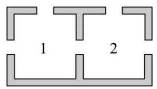
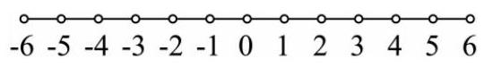
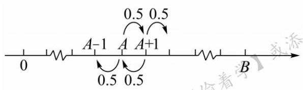
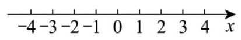
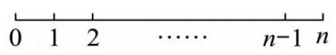

# 第15章 概率统计

## 15-1 条件概率

### 15-1-1

> 原PDF：[打开学生版PDF](<file:///C:/Users/lucky12345/Documents/%E9%AB%98%E4%B8%AD%E6%95%B0%E5%AD%A6%E5%A4%8D%E4%B9%A0/%E5%88%86%E7%B1%BB%E7%89%88/01_%E5%AD%A6%E7%94%9F%E7%89%88-%E8%AE%B2%E4%B9%89/15-1%E6%A6%82%E7%8E%87%E7%BB%9F%E8%AE%A1%EF%BC%9A%E6%9D%A1%E4%BB%B6%E6%A6%82%E7%8E%87-%E8%AE%B2%E4%B9%89.pdf>)

袋子中装有 3 个红球和 4 个蓝球, 甲先从袋子中随机摸一个球, 摸出的球不再放回, 然后乙从袋子中随机摸一个球, 若甲、乙两人摸到红球的概率分别为 ${p}_{1},{p}_{2}$ ,则 ( )

A. ${p}_{1} = {p}_{2}$ B. ${p}_{1} < {p}_{2}$

C. ${p}_{1} > {p}_{2}$ D. ${p}_{1} > {p}_{2}$ 或 ${p}_{1} < {p}_{2}$

### 15-1-2

> 原PDF：[打开学生版PDF](<file:///C:/Users/lucky12345/Documents/%E9%AB%98%E4%B8%AD%E6%95%B0%E5%AD%A6%E5%A4%8D%E4%B9%A0/%E5%88%86%E7%B1%BB%E7%89%88/01_%E5%AD%A6%E7%94%9F%E7%89%88-%E8%AE%B2%E4%B9%89/15-1%E6%A6%82%E7%8E%87%E7%BB%9F%E8%AE%A1%EF%BC%9A%E6%9D%A1%E4%BB%B6%E6%A6%82%E7%8E%87-%E8%AE%B2%E4%B9%89.pdf>)

袋中有除颜色外完全相同的白球和黑球共 10 个, 现从袋中不放回地连取两个，至少有一个白球的概率为 $\frac{13}{15}$ . 则第二次取出白球的概率为___；已知第二次取出白球，则第一次取出黑球的概率为___.

### 15-1-3

> 原PDF：[打开学生版PDF](<file:///C:/Users/lucky12345/Documents/%E9%AB%98%E4%B8%AD%E6%95%B0%E5%AD%A6%E5%A4%8D%E4%B9%A0/%E5%88%86%E7%B1%BB%E7%89%88/01_%E5%AD%A6%E7%94%9F%E7%89%88-%E8%AE%B2%E4%B9%89/15-1%E6%A6%82%E7%8E%87%E7%BB%9F%E8%AE%A1%EF%BC%9A%E6%9D%A1%E4%BB%B6%E6%A6%82%E7%8E%87-%E8%AE%B2%E4%B9%89.pdf>)

某苗木培育基地考察三种不同的树苗 $A, B, C$ ,经引种试验后发现,引种树苗 $A$ 的自然成活率为 0.8,引种树苗 $B, C$ 的自然成活率均为 0.9 .

(1)任取树苗 $A, B, C$ 各一棵,估计自然成活的棵树为 $X$ ,求 $X$ 的分布列及数学期望;

(2)该苗木培育基地决定引种n棵B种树苗，引种后没有自然成活的树苗中有 75%的树苗可经过人工栽培技术处理，处理后成活的概率为 0.8 ，其余的树苗不能成活.

①求一棵 $B$ 种树苗最终成活的概率；

②若每棵树苗引种最终成活后可获利 200 元，不成活的每棵亏损 50 元，培育过程中基地的其他费用为 2 万元，该基地为了获利不低于 150 万元，至少引种 $B$ 种树苗多少棵?

### 15-1-4

> 原PDF：[打开学生版PDF](<file:///C:/Users/lucky12345/Documents/%E9%AB%98%E4%B8%AD%E6%95%B0%E5%AD%A6%E5%A4%8D%E4%B9%A0/%E5%88%86%E7%B1%BB%E7%89%88/01_%E5%AD%A6%E7%94%9F%E7%89%88-%E8%AE%B2%E4%B9%89/15-1%E6%A6%82%E7%8E%87%E7%BB%9F%E8%AE%A1%EF%BC%9A%E6%9D%A1%E4%BB%B6%E6%A6%82%E7%8E%87-%E8%AE%B2%E4%B9%89.pdf>)

已知 $P\left( \bar{A}\right)  = \frac{1}{4}, P\left( {\bar{B} \mid  A}\right)  = \frac{1}{3}, P\left( {B \mid  \bar{A}}\right)  = \frac{1}{2}$ ,则 $P\left( \bar{B}\right)  =$ (   )

A. $\frac{5}{12}$ B. $\frac{5}{8}$ C. $\frac{3}{8}$ D. $\frac{1}{4}$

### 15-1-5

> 原PDF：[打开学生版PDF](<file:///C:/Users/lucky12345/Documents/%E9%AB%98%E4%B8%AD%E6%95%B0%E5%AD%A6%E5%A4%8D%E4%B9%A0/%E5%88%86%E7%B1%BB%E7%89%88/01_%E5%AD%A6%E7%94%9F%E7%89%88-%E8%AE%B2%E4%B9%89/15-1%E6%A6%82%E7%8E%87%E7%BB%9F%E8%AE%A1%EF%BC%9A%E6%9D%A1%E4%BB%B6%E6%A6%82%E7%8E%87-%E8%AE%B2%E4%B9%89.pdf>)

若样本空间 $\Omega$ 中的事件 ${A}_{1},{A}_{2},{A}_{3}$ 满足 $P\left( {A}_{1}\right)  = P\left( {{A}_{1} \mid  {A}_{3}}\right)  = \frac{1}{4}, P\left( {A}_{2}\right)  = \frac{2}{3}$ , $P\left( {\overline{{A}_{2}} \mid  {A}_{3}}\right)  = \frac{2}{5}, P\left( {\overline{{A}_{2}} \mid  \overline{{A}_{3}}}\right)  = \frac{1}{6}$ ，则 $P\left( {{A}_{1}\overline{{A}_{3}}}\right)  =$ ( )

A. $\frac{1}{14}$ B. $\frac{1}{7}$ C. $\frac{2}{7}$ D. $\frac{5}{28}$

### 15-1-6

> 原PDF：[打开学生版PDF](<file:///C:/Users/lucky12345/Documents/%E9%AB%98%E4%B8%AD%E6%95%B0%E5%AD%A6%E5%A4%8D%E4%B9%A0/%E5%88%86%E7%B1%BB%E7%89%88/01_%E5%AD%A6%E7%94%9F%E7%89%88-%E8%AE%B2%E4%B9%89/15-1%E6%A6%82%E7%8E%87%E7%BB%9F%E8%AE%A1%EF%BC%9A%E6%9D%A1%E4%BB%B6%E6%A6%82%E7%8E%87-%E8%AE%B2%E4%B9%89.pdf>)

某商场有 $a, b$ 两种抽奖活动, $a, b$ 两种抽奖活动中奖的概率分别为 $\frac{2}{5},\frac{3}{5}$ ,每人只能参加其中一种抽奖活动. 甲参加 $a, b$ 两种抽奖活动的概率分别为 $\frac{2}{5},\frac{3}{5}$ , 已知甲中奖，则甲参加 $a$ 抽奖活动中奖的概率为( )

A. $\frac{9}{25}$ B. $\frac{4}{25}$ C. $\frac{9}{13}$ D. $\frac{4}{13}$

### 15-1-7

> 原PDF：[打开学生版PDF](<file:///C:/Users/lucky12345/Documents/%E9%AB%98%E4%B8%AD%E6%95%B0%E5%AD%A6%E5%A4%8D%E4%B9%A0/%E5%88%86%E7%B1%BB%E7%89%88/01_%E5%AD%A6%E7%94%9F%E7%89%88-%E8%AE%B2%E4%B9%89/15-1%E6%A6%82%E7%8E%87%E7%BB%9F%E8%AE%A1%EF%BC%9A%E6%9D%A1%E4%BB%B6%E6%A6%82%E7%8E%87-%E8%AE%B2%E4%B9%89.pdf>)

设某医院仓库中有 10 盒同样规格的 X 光片，其中甲厂、乙厂、丙厂生产的分别为 5 盒、3 盒、2 盒，且甲、乙、丙三厂生产该种 X 光片的次品率依次为 $\frac{1}{10}$ ， $\frac{1}{15},\frac{1}{20}$ ,现从这 10 盒中任取一盒,再从这盒中任取一张 $\mathrm{X}$ 光片,则取得的 $\mathrm{X}$ 光片是次品的概率为( )

A. $\frac{2}{25}$ B. $\frac{1}{10}$ C. $\frac{3}{20}$ D. $\frac{1}{5}$

### 15-1-8

> 原PDF：[打开学生版PDF](<file:///C:/Users/lucky12345/Documents/%E9%AB%98%E4%B8%AD%E6%95%B0%E5%AD%A6%E5%A4%8D%E4%B9%A0/%E5%88%86%E7%B1%BB%E7%89%88/01_%E5%AD%A6%E7%94%9F%E7%89%88-%E8%AE%B2%E4%B9%89/15-1%E6%A6%82%E7%8E%87%E7%BB%9F%E8%AE%A1%EF%BC%9A%E6%9D%A1%E4%BB%B6%E6%A6%82%E7%8E%87-%E8%AE%B2%E4%B9%89.pdf>)

2025 贺岁档电影精彩纷呈，小明期待去影院观看. 小明家附近有甲、乙两家影院,小明第一天去甲、乙两家影院观影的概率分别为 $\frac{2}{5}$ 和 $\frac{3}{5}$ . 如果他第一天去甲影院,那么第二天去甲影院的概率为 $\frac{3}{5}$ ; 如果他第一天去乙影院,那么第二天去甲影院的概率为 $\frac{1}{2}$ . 若小明第二天去了甲影院,则第一天去乙影院的概率为 ( )

A. $\frac{23}{50}$ B. $\frac{1}{2}$ C. $\frac{2}{5}$ D. $\frac{5}{9}$

### 15-1-9

> 原PDF：[打开学生版PDF](<file:///C:/Users/lucky12345/Documents/%E9%AB%98%E4%B8%AD%E6%95%B0%E5%AD%A6%E5%A4%8D%E4%B9%A0/%E5%88%86%E7%B1%BB%E7%89%88/01_%E5%AD%A6%E7%94%9F%E7%89%88-%E8%AE%B2%E4%B9%89/15-1%E6%A6%82%E7%8E%87%E7%BB%9F%E8%AE%A1%EF%BC%9A%E6%9D%A1%E4%BB%B6%E6%A6%82%E7%8E%87-%E8%AE%B2%E4%B9%89.pdf>)

某公司进行招聘，甲、乙、丙被录取的概率分别为 $\frac{2}{3},\frac{4}{5},\frac{3}{4}$ ,且他们是否被录取互不影响，若甲、乙、丙三人中恰有两人被录取，则甲被录取的概率为 ( )

A. $\frac{10}{13}$ B. $\frac{2}{3}$ C. $\frac{7}{13}$ D. $\frac{7}{30}$

### 15-1-10

> 原PDF：[打开学生版PDF](<file:///C:/Users/lucky12345/Documents/%E9%AB%98%E4%B8%AD%E6%95%B0%E5%AD%A6%E5%A4%8D%E4%B9%A0/%E5%88%86%E7%B1%BB%E7%89%88/01_%E5%AD%A6%E7%94%9F%E7%89%88-%E8%AE%B2%E4%B9%89/15-1%E6%A6%82%E7%8E%87%E7%BB%9F%E8%AE%A1%EF%BC%9A%E6%9D%A1%E4%BB%B6%E6%A6%82%E7%8E%87-%E8%AE%B2%E4%B9%89.pdf>)

在一个抽奖游戏中共有 5 扇关闭的门, 其中 2 扇门后面有奖品, 其余门后没有奖品, 主持人知道奖品在哪些门后. 参赛者先选择一扇门, 但不立即打开. 主持人打开剩下的门当中一扇无奖品的门, 然后让参赛者决定是否换另一扇仍然关闭的门. 参赛者选择不换门和换门获奖的概率分别为( )

A. $\frac{2}{5};\frac{1}{2}$ B. $\frac{1}{2};\frac{2}{3}$ C. $\frac{2}{5};\frac{8}{15}$ D. $\frac{1}{3};\frac{2}{3}$

### 15-1-11

> 原PDF：[打开学生版PDF](<file:///C:/Users/lucky12345/Documents/%E9%AB%98%E4%B8%AD%E6%95%B0%E5%AD%A6%E5%A4%8D%E4%B9%A0/%E5%88%86%E7%B1%BB%E7%89%88/01_%E5%AD%A6%E7%94%9F%E7%89%88-%E8%AE%B2%E4%B9%89/15-1%E6%A6%82%E7%8E%87%E7%BB%9F%E8%AE%A1%EF%BC%9A%E6%9D%A1%E4%BB%B6%E6%A6%82%E7%8E%87-%E8%AE%B2%E4%B9%89.pdf>)

在一个抽奖游戏中共有 $n\left( {n \geq  3, n \in  {\mathbf{N}}^{ * }}\right)$ 扇关闭的门,其中 $k(k \leq  n - 2, k \in \; {\mathbf{N}}^{ * }$ )扇门后面有奖品,其余门后没有奖品,主持人知道奖品在哪些门后. 参赛者先选择一扇门, 但不立即打开. 主持人打开剩下的门当中一扇无奖品的门, 然后让参赛者决定是否换另一扇仍然关闭的门. 参赛者选择不换门和换门的获奖概率分别为( )

A. $\frac{k}{n};\frac{k}{n - 1}$ B. $\frac{k}{n - 1};\frac{k}{n - 2}$

C. $\frac{k}{n};\frac{k\left( {n - 1}\right) }{n\left( {n - 2}\right) }$ D. $\frac{k - 1}{n - 2};\frac{k}{n - 2}$

### 15-1-12

> 原PDF：[打开学生版PDF](<file:///C:/Users/lucky12345/Documents/%E9%AB%98%E4%B8%AD%E6%95%B0%E5%AD%A6%E5%A4%8D%E4%B9%A0/%E5%88%86%E7%B1%BB%E7%89%88/01_%E5%AD%A6%E7%94%9F%E7%89%88-%E8%AE%B2%E4%B9%89/15-1%E6%A6%82%E7%8E%87%E7%BB%9F%E8%AE%A1%EF%BC%9A%E6%9D%A1%E4%BB%B6%E6%A6%82%E7%8E%87-%E8%AE%B2%E4%B9%89.pdf>)

托马斯・贝叶斯在研究 “逆向概率” 的问题中得到了一个公式: $P\left( {{A}_{i} \mid  B}\right)  = \; \frac{P\left( {A}_{i}\right) P\left( {B \mid  {A}_{i}}\right) }{\mathop{\sum }\limits_{{j = 1}}^{n}P\left( {A}_{j}\right) P\left( {B \mid  {A}_{j}}\right) }$ ,这个公式被称为贝叶斯公式 (贝叶斯定理),其中 $\mathop{\sum }\limits_{{j = 1}}^{n}P\left( {A}_{j}\right) P\left( {B \mid  {A}_{j}}\right)$ 称为 $B$ 的全概率. 春夏换季是流行性感冒爆发期,已知 $A, B, C$ 三个地区分别有 $3\% ,6\% ,5\%$ 的人患了流感,且这三个地区的人口数之比是 $9 : 8 : 5$ ,现从这三个地区中任意选取 1 人，若选取的这人患了流感，则这人来自 $B$ 地区的概率是( )

A. 0.25 B. 0.27 C. 0.48 D. 0.52

### 15-1-13

> 原PDF：[打开学生版PDF](<file:///C:/Users/lucky12345/Documents/%E9%AB%98%E4%B8%AD%E6%95%B0%E5%AD%A6%E5%A4%8D%E4%B9%A0/%E5%88%86%E7%B1%BB%E7%89%88/01_%E5%AD%A6%E7%94%9F%E7%89%88-%E8%AE%B2%E4%B9%89/15-1%E6%A6%82%E7%8E%87%E7%BB%9F%E8%AE%A1%EF%BC%9A%E6%9D%A1%E4%BB%B6%E6%A6%82%E7%8E%87-%E8%AE%B2%E4%B9%89.pdf>)

流感病毒分为甲、乙、丙三型，甲型流感病毒最容易发生变异，流感大流行就是甲型流感病毒出现新亚型或旧亚型重现引起的. 根据以往的临床记录, 某种诊断甲型流感病毒的试验具有如下的效果:若以 $A$ 表示事件 “试验反应为阳性”,以 $C$ 表示事件 “被诊断者患有甲型流感”,则有 $P\left( {A \mid  C}\right)  = {0.9}, P\left( {\bar{A} \mid  \bar{C}}\right)  =$ 0.9 . 现对自然人群进行普查,设被试验的人患有甲型流感的概率为 0.005 , 即 $P\left( C\right)  = {0.005}$ ,则 $P\left( {C \mid  A}\right)  =$ (   )

A. $\frac{9}{208}$ B. $\frac{19}{218}$ C. $\frac{1}{22}$ D. $\frac{7}{108}$

### 15-1-14

> 原PDF：[打开学生版PDF](<file:///C:/Users/lucky12345/Documents/%E9%AB%98%E4%B8%AD%E6%95%B0%E5%AD%A6%E5%A4%8D%E4%B9%A0/%E5%88%86%E7%B1%BB%E7%89%88/01_%E5%AD%A6%E7%94%9F%E7%89%88-%E8%AE%B2%E4%B9%89/15-1%E6%A6%82%E7%8E%87%E7%BB%9F%E8%AE%A1%EF%BC%9A%E6%9D%A1%E4%BB%B6%E6%A6%82%E7%8E%87-%E8%AE%B2%E4%B9%89.pdf>)

已知肿瘤中 $1\%$ 为恶性肿瘤， ${99}\%$ 为良性肿瘤，用一台 $\mathrm{X}$ 光机判断肿瘤类型， 误诊的概率为 0.1，若有一患者被诊断为恶性肿瘤，则其被误诊的概率为( )

A. $\frac{9}{427}$ B. $\frac{11}{12}$ C. $\frac{11}{27}$ D. $\frac{3}{20}$

## 15-2 递推求概率

### 15-2-1

> 原PDF：[打开学生版PDF](<file:///C:/Users/lucky12345/Documents/%E9%AB%98%E4%B8%AD%E6%95%B0%E5%AD%A6%E5%A4%8D%E4%B9%A0/%E5%88%86%E7%B1%BB%E7%89%88/01_%E5%AD%A6%E7%94%9F%E7%89%88-%E8%AE%B2%E4%B9%89/15-2%E6%A6%82%E7%8E%87%E7%BB%9F%E8%AE%A1%EF%BC%9A%E9%80%92%E6%8E%A8%E6%B1%82%E6%A6%82%E7%8E%87-%E8%AE%B2%E4%B9%89.pdf>)

某学校篮球队有 5 名队员做传球训练. 第一次由队员甲将球传出，每次传球时传球者都等可能地将球传给另外四人中的任何一人，则第 5 次传球后球在队员甲手中的概率为___.

### 15-2-2

> 原PDF：[打开学生版PDF](<file:///C:/Users/lucky12345/Documents/%E9%AB%98%E4%B8%AD%E6%95%B0%E5%AD%A6%E5%A4%8D%E4%B9%A0/%E5%88%86%E7%B1%BB%E7%89%88/01_%E5%AD%A6%E7%94%9F%E7%89%88-%E8%AE%B2%E4%B9%89/15-2%E6%A6%82%E7%8E%87%E7%BB%9F%E8%AE%A1%EF%BC%9A%E9%80%92%E6%8E%A8%E6%B1%82%E6%A6%82%E7%8E%87-%E8%AE%B2%E4%B9%89.pdf>)

已知 $A$ 细胞有 0.4 的概率会变异成 $B$ 细胞，0.6 的概率死亡； $B$ 细胞有 0.5 的概率变异成 $A$ 细胞，0.5 的概率死亡，细胞死亡前有可能变异数次. 下列结论成立的是( )

A. 一个细胞为 $A$ 细胞，其死亡前是 $A$ 细胞的概率为 0.75

B. 一个细胞为 $A$ 细胞，其死亡前是 $B$ 细胞的概率为 0.2

C. 一个细胞为 $B$ 细胞，其死亡前是 $A$ 细胞的概率为 0.35

D. 一个细胞为 $B$ 细胞，其死亡前是 $B$ 细胞的概率为 0.7

### 15-2-3

> 原PDF：[打开学生版PDF](<file:///C:/Users/lucky12345/Documents/%E9%AB%98%E4%B8%AD%E6%95%B0%E5%AD%A6%E5%A4%8D%E4%B9%A0/%E5%88%86%E7%B1%BB%E7%89%88/01_%E5%AD%A6%E7%94%9F%E7%89%88-%E8%AE%B2%E4%B9%89/15-2%E6%A6%82%E7%8E%87%E7%BB%9F%E8%AE%A1%EF%BC%9A%E9%80%92%E6%8E%A8%E6%B1%82%E6%A6%82%E7%8E%87-%E8%AE%B2%E4%B9%89.pdf>)

“布朗运动” 是指微小颗粒永不停息的无规则随机运动, 在如图所示的试验容器中, 容器由两个仓组成, 某粒子作布朗运动时, 每次会从所在仓的通道口中随机选择一个到达相邻仓或者容器外, 一旦粒子到达容器外就会被外部捕获装置所捕获, 此时试验结束. 已知该粒子初始位置在 1 号仓, 则试验结束时该粒子是从 1 号仓到达容器外的概率为( )

A. $\frac{2}{3}$ B. $\frac{20}{27}$ C. $\frac{3}{4}$ D. $\frac{7}{9}$

### 15-2-4

> 原PDF：[打开学生版PDF](<file:///C:/Users/lucky12345/Documents/%E9%AB%98%E4%B8%AD%E6%95%B0%E5%AD%A6%E5%A4%8D%E4%B9%A0/%E5%88%86%E7%B1%BB%E7%89%88/01_%E5%AD%A6%E7%94%9F%E7%89%88-%E8%AE%B2%E4%B9%89/15-2%E6%A6%82%E7%8E%87%E7%BB%9F%E8%AE%A1%EF%BC%9A%E9%80%92%E6%8E%A8%E6%B1%82%E6%A6%82%E7%8E%87-%E8%AE%B2%E4%B9%89.pdf>)

(2021 新高考 II 卷) 一种微生物群体可以经过自身繁殖不断生存下来, 设一个这种微生物为第 0 代,经过一次繁殖后为第 1 代,再经过一次繁殖后为第 2 代……，该微生物每代繁殖的个数是相互独立的且有相同的分布列，设 $X$ 表示 1 个微生物个体繁殖下一代的个数, $P\left( {X = i}\right)  = {p}_{i}\left( {i = 0,1,2,3}\right)$ .

(1)已知 ${p}_{0} = {0.4},{p}_{1} = {0.3},{p}_{2} = {0.2},{p}_{3} = {0.1}$ ，求 $E\left( X\right)$ ；

(2)设 $p$ 表示该种微生物经过多代繁殖后临近灭绝的概率， $p$ 是关于 $x$ 的方程: ${p}_{0} + {p}_{1}x + {p}_{2}{x}^{2} + {p}_{3}{x}^{3} = x$ 的一个最小正实根,求证: 当 $E\left( X\right)  \leq  1$ 时, $p = 1$ , 当 $E\left( X\right)  > 1$ 时, $p < 1$ ;

(3)根据你的理解说明(2)问结论的实际含义.

### 15-2-5

> 原PDF：[打开学生版PDF](<file:///C:/Users/lucky12345/Documents/%E9%AB%98%E4%B8%AD%E6%95%B0%E5%AD%A6%E5%A4%8D%E4%B9%A0/%E5%88%86%E7%B1%BB%E7%89%88/01_%E5%AD%A6%E7%94%9F%E7%89%88-%E8%AE%B2%E4%B9%89/15-2%E6%A6%82%E7%8E%87%E7%BB%9F%E8%AE%A1%EF%BC%9A%E9%80%92%E6%8E%A8%E6%B1%82%E6%A6%82%E7%8E%87-%E8%AE%B2%E4%B9%89.pdf>)

(2025 浙江杭州模拟)阿尔法狗(AlphaGo)是谷歌公司开发的人工智能程序， 它第一个战胜了围棋世界冠军. 它可以借助计算机，通过深度神经网络模拟人脑的机制来学习、判断、决策. 工程师分别用人类围棋对弈的近 100 万、 500 万、 1000 万种不同走法三个阶段来训练阿尔法狗, 三个阶段的阿尔法狗依次简记为甲、乙、丙.

(1)测试阶段，让某围棋手与甲、乙、丙三个阿尔法狗各比赛一局，各局比赛结果相互独立. 已知该棋手与甲、乙、丙比赛获胜的概率分别为 $\frac{1}{2},\frac{1}{3},\frac{1}{4}$ . 记该棋手连胜两局的概率为 $p$ ,试判断该棋手在第二局与谁比赛 $p$ 最大,并写出判断过程.

(2)工程师让甲和乙进行围棋比赛，规定每局比赛胜者得 1 分，负者得 0 分， 没有平局,比赛进行到一方比另一方多两分为止,多得两分的一方赢得比赛. 已知每局比赛中,甲获胜的概率为 $\alpha$ ,乙获胜的概率为 $\beta$ ,且每局比赛结果相互独立.

(i) 若比赛最多进行 5 局,求比赛结束时比赛局数 $X$ 的分布列及期望 $E\left( X\right)$ 的最大值;

(ii) 若比赛不限制局数,记 “甲赢得比赛” 为事件 $M$ ,证明: $P\left( M\right)  = \frac{{\alpha }^{2}}{{\alpha }^{2} + {\beta }^{2}}$ .

## 15-3 随机过程

### 15-3-1

> 原PDF：[打开学生版PDF](<file:///C:/Users/lucky12345/Documents/%E9%AB%98%E4%B8%AD%E6%95%B0%E5%AD%A6%E5%A4%8D%E4%B9%A0/%E5%88%86%E7%B1%BB%E7%89%88/01_%E5%AD%A6%E7%94%9F%E7%89%88-%E8%AE%B2%E4%B9%89/15-3%E6%A6%82%E7%8E%87%E7%BB%9F%E8%AE%A1%EF%BC%9A%E9%9A%8F%E6%9C%BA%E8%BF%87%E7%A8%8B-%E8%AE%B2%E4%B9%89.pdf>)

某学校有 $A, B$ 两家餐厅,王同学开学第 1 天午餐时去 $A$ 餐厅用餐的概率是 $\frac{2}{3}$ . 如果第 1 天去 $A$ 餐厅，那么第 2 天继续去 $A$ 餐厅的概率为 $\frac{1}{3}$ ；如果第 1 天去 $B$ 餐厅， 那么第 2 天去 $A$ 餐厅的概率为 $\frac{1}{2}$ ,如此往复.

(1)计算王同学第 2 天去 $A$ 餐厅用餐的概率；

(2)记王同学第 $n$ 天去 $A$ 餐厅用餐概率为 ${P}_{n}$ ，求 ${P}_{n}$ .

### 15-3-2

> 原PDF：[打开学生版PDF](<file:///C:/Users/lucky12345/Documents/%E9%AB%98%E4%B8%AD%E6%95%B0%E5%AD%A6%E5%A4%8D%E4%B9%A0/%E5%88%86%E7%B1%BB%E7%89%88/01_%E5%AD%A6%E7%94%9F%E7%89%88-%E8%AE%B2%E4%B9%89/15-3%E6%A6%82%E7%8E%87%E7%BB%9F%E8%AE%A1%EF%BC%9A%E9%9A%8F%E6%9C%BA%E8%BF%87%E7%A8%8B-%E8%AE%B2%E4%B9%89.pdf>)

连续抛一枚正面出现的概率为p 的硬币, 直至出现正面为止. 设需要抛掷的次数为随机变量 X，则 $E\left( \mathrm{X}\right)  =$ ___.

### 15-3-3

> 原PDF：[打开学生版PDF](<file:///C:/Users/lucky12345/Documents/%E9%AB%98%E4%B8%AD%E6%95%B0%E5%AD%A6%E5%A4%8D%E4%B9%A0/%E5%88%86%E7%B1%BB%E7%89%88/01_%E5%AD%A6%E7%94%9F%E7%89%88-%E8%AE%B2%E4%B9%89/15-3%E6%A6%82%E7%8E%87%E7%BB%9F%E8%AE%A1%EF%BC%9A%E9%9A%8F%E6%9C%BA%E8%BF%87%E7%A8%8B-%E8%AE%B2%E4%B9%89.pdf>)

马尔科夫链是一种随机过程, 它具有马尔科夫性质, 也称为 “无记忆性”, 即一个系统在某时刻的状态仅与前一时刻的状态有关. 为了让学生体验马尔科夫性质, 数学老师在课堂上指导学生做了一个游戏. 他给小明和小美各一个不透明的箱子,每个箱子中都有 $x$ 个红球和 1 个白球,这些球除了颜色不同之外,其他的物质特征完全一样. 规定 “两人同时从各自的箱子中取出一个球放入对方的箱子中”为一次操作,假设经过 $n$ 次操作之后小明箱子里的白球个数为随机变量 ${X}_{n}$ , 且 $P\left( {{X}_{1} = 1}\right)  = \frac{5}{8}$ .

(1)求 $x$ 的值；

(2)求 $P\left( {{X}_{n} = 1}\right)$ ；

(3)证明: $E\left( {X}_{n}\right)$ 为定值.

### 15-3-4

> 原PDF：[打开学生版PDF](<file:///C:/Users/lucky12345/Documents/%E9%AB%98%E4%B8%AD%E6%95%B0%E5%AD%A6%E5%A4%8D%E4%B9%A0/%E5%88%86%E7%B1%BB%E7%89%88/01_%E5%AD%A6%E7%94%9F%E7%89%88-%E8%AE%B2%E4%B9%89/15-3%E6%A6%82%E7%8E%87%E7%BB%9F%E8%AE%A1%EF%BC%9A%E9%9A%8F%E6%9C%BA%E8%BF%87%E7%A8%8B-%E8%AE%B2%E4%B9%89.pdf>)

如图所示，一个质点在随机外力的作用下，从原点 0 出发，每隔 $1\mathrm{\;s}$ 等可能地向左或向右移动一个单位，共移动 6 次. 该质点位于 4 的概率为___；在该质点有且仅有一次经过点 1 的条件下，共经过两次 2 的概率为___.

### 15-3-5

> 原PDF：[打开学生版PDF](<file:///C:/Users/lucky12345/Documents/%E9%AB%98%E4%B8%AD%E6%95%B0%E5%AD%A6%E5%A4%8D%E4%B9%A0/%E5%88%86%E7%B1%BB%E7%89%88/01_%E5%AD%A6%E7%94%9F%E7%89%88-%E8%AE%B2%E4%B9%89/15-3%E6%A6%82%E7%8E%87%E7%BB%9F%E8%AE%A1%EF%BC%9A%E9%9A%8F%E6%9C%BA%E8%BF%87%E7%A8%8B-%E8%AE%B2%E4%B9%89.pdf>)

(2023 浙江杭州二模) 马尔科夫链是概率统计中的一个重要模型, 也是机器学习和人工智能的基石，在强化学习、自然语言处理、金融领域、天气预测等方面都有着极其广泛的应用. 其数学定义为: 假设我们的序列状态是 $\cdots ,{X}_{t - 2},{X}_{t - 1}$ , ${X}_{t},{X}_{t + 1},\ldots$ ,那么 ${X}_{t + 1}$ 时刻的状态的条件概率仅依赖前一状态 ${X}_{t}$ ,即 $P\left( {{X}_{t + 1} \mid  \ldots ,{X}_{t - 2},{X}_{t - 1},{X}_{t}}\right)  = P\left( {{X}_{t + 1} \mid  {X}_{t}}\right) .$

现实生活中也存在着许多马尔科夫链, 例如著名的赌徒模型.

假如一名赌徒进入赌场参与一个赌博游戏,每一局赌徒赌赢的概率为 50%,且每局赌赢可以赢得 1 元, 每一局赌徒赌输的概率为 50%, 且赌输就要输掉 1 元. 赌徒会一直玩下去, 直到遇到如下两种情况才会结束赌博游戏: 一种是手中赌金为 0 元,即赌徒输光; 一种是赌金达到预期的 $B$ 元,赌徒停止赌博. 记赌徒的本金为 $A\left( {A \in  {\mathbf{N}}^{ * }, A < B}\right)$ ,赌博过程如下图的数轴所示.

当赌徒手中有 $n$ 元 $\left( {0 \leq  n \leq  B, n \in  \mathbf{N}}\right)$ 时,最终输光的概率为 $P\left( n\right)$ ,请回答下列问题:

(1)请直接写出 $P\left( 0\right)$ 与 $P\left( B\right)$ 的数值；

(2)证明 $\{ P\left( n\right) \}$ 是一个等差数列，并写出公差 $d$ ；

(3)当 $A = {100}$ 时，分别计算 $B = {200}, B = {1000}$ 时， $P\left( A\right)$ 的数值，并结合实际,解释当 $B \rightarrow  \infty$ 时, $P\left( A\right)$ 的统计含义.

### 15-3-6

> 原PDF：[打开学生版PDF](<file:///C:/Users/lucky12345/Documents/%E9%AB%98%E4%B8%AD%E6%95%B0%E5%AD%A6%E5%A4%8D%E4%B9%A0/%E5%88%86%E7%B1%BB%E7%89%88/01_%E5%AD%A6%E7%94%9F%E7%89%88-%E8%AE%B2%E4%B9%89/15-3%E6%A6%82%E7%8E%87%E7%BB%9F%E8%AE%A1%EF%BC%9A%E9%9A%8F%E6%9C%BA%E8%BF%87%E7%A8%8B-%E8%AE%B2%E4%B9%89.pdf>)

(1)如图，在一条无限长的轨道上，一个质点在随机外力的作用下，从位置 0 出发，每次向左或向右移动一个单位长度的概率都为 $\frac{1}{2}$ ，设移动 $n$ 次后质点位于位置 ${X}_{n}$ .

(i) 求随机变量 ${X}_{4}$ 的分布列及 $E\left( {X}_{4}\right)$ ;

(ii) 求 $E\left( {X}_{n}\right)$ .

(2)如图，若轨道上只有 $0,1,2,\ldots , n$ 这 $n + 1$ 个位置，质点向左或右移动一个单位长度的概率都为 $\frac{1}{2}$ ,若在 0 处,则只能向右移动; 现有一个质点从 0 出发,求它首次移动到 $n$ 的步数的期望.

### 15-3-7

> 原PDF：[打开学生版PDF](<file:///C:/Users/lucky12345/Documents/%E9%AB%98%E4%B8%AD%E6%95%B0%E5%AD%A6%E5%A4%8D%E4%B9%A0/%E5%88%86%E7%B1%BB%E7%89%88/01_%E5%AD%A6%E7%94%9F%E7%89%88-%E8%AE%B2%E4%B9%89/15-3%E6%A6%82%E7%8E%87%E7%BB%9F%E8%AE%A1%EF%BC%9A%E9%9A%8F%E6%9C%BA%E8%BF%87%E7%A8%8B-%E8%AE%B2%E4%B9%89.pdf>)

将一枚均匀的硬币连续抛掷 $n$ 次, ${P}_{n}$ 表示没有出现连续 3 次正面的概率. 给出下列四个结论:

① ${P}_{3} = \frac{7}{8}$ ；

② ${P}_{4} = \frac{15}{16}$ ；

③ 当 $n \geq  2$ 时， ${P}_{n + 1} < {P}_{n}$ ；

④ ${P}_{n} = \frac{1}{2}{P}_{n - 1} + \frac{1}{4}{P}_{n - 2} + \frac{1}{8}{P}_{n - 3}\left( {n \geq  4}\right)$ .

其中，所有正确结论的序号是___.

### 15-3-8

> 原PDF：[打开学生版PDF](<file:///C:/Users/lucky12345/Documents/%E9%AB%98%E4%B8%AD%E6%95%B0%E5%AD%A6%E5%A4%8D%E4%B9%A0/%E5%88%86%E7%B1%BB%E7%89%88/01_%E5%AD%A6%E7%94%9F%E7%89%88-%E8%AE%B2%E4%B9%89/15-3%E6%A6%82%E7%8E%87%E7%BB%9F%E8%AE%A1%EF%BC%9A%E9%9A%8F%E6%9C%BA%E8%BF%87%E7%A8%8B-%E8%AE%B2%E4%B9%89.pdf>)

(2025 成都二诊)某答题挑战赛规则如下:比赛按轮依次进行，只有答完一轮才能进入下一轮, 若连续两轮均答错, 则挑战终止; 每一轮系统随机地派出一道通识题或专识题,派出通识题的概率为 $\frac{1}{3}$ ,派出专识题的概率为 $\frac{2}{3}$ . 已知某选手答对通识题与专识题的概率分别为 $\frac{3}{5},\frac{1}{5}$ ,且各轮答题正确与否相互独立.

(1)求该选手在一轮答题中答对题目的概率；

(2)记该选手在第 $n$ 轮答题结束时挑战依然未终止的概率为 ${p}_{n}$ .

(i) 求 ${p}_{3},{p}_{4}$ ;

(ii) 证明: 存在实数 $\lambda$ ,使得数列 $\left\{  {{p}_{n + 1} - \lambda {p}_{n}}\right\}$ 为等比数列.

## 15-4 综合应用

### 15-4-1

> 原PDF：[打开学生版PDF](<file:///C:/Users/lucky12345/Documents/%E9%AB%98%E4%B8%AD%E6%95%B0%E5%AD%A6%E5%A4%8D%E4%B9%A0/%E5%88%86%E7%B1%BB%E7%89%88/01_%E5%AD%A6%E7%94%9F%E7%89%88-%E8%AE%B2%E4%B9%89/15-4%E6%A6%82%E7%8E%87%E7%BB%9F%E8%AE%A1%EF%BC%9A%E7%BB%BC%E5%90%88%E5%BA%94%E7%94%A8-%E8%AE%B2%E4%B9%89.pdf>)

(2023 年新高考 I)甲、乙两人投篮，每次由其中一人投篮，规则如下:若命中则此人继续投篮，若未命中则换为对方投篮. 无论之前投篮情况如何，甲每次投篮的命中率均为 0.6 ，乙每次投篮的命中率均为 0.8 。由抽签确定第 1 次投篮的人选，第 1 次投篮的人是甲、乙的概率各为 0.5 .

(1)求第 2 次投篮的人是乙的概率；

(2)求第 $i$ 次投篮的人是甲的概率；

(3)已知:若随机变量 ${X}_{i}$ 服从两点分布，且 $P\left( {{X}_{i} = 1}\right)  = 1 - P\left( {{X}_{i} = 0}\right)  = {q}_{i}, i = \; 1,2,\cdots , n$ ,则 $E\left( {\mathop{\sum }\limits_{{i = 1}}^{n}{X}_{i}}\right)  = \mathop{\sum }\limits_{{i = 1}}^{n}{q}_{i}$ . 记前 $n$ 次 (即从第 1 次到第 $n$ 次投篮) 中甲投篮的次数为 $Y$ ,求 $E\left( Y\right)$ .

### 15-4-2

> 原PDF：[打开学生版PDF](<file:///C:/Users/lucky12345/Documents/%E9%AB%98%E4%B8%AD%E6%95%B0%E5%AD%A6%E5%A4%8D%E4%B9%A0/%E5%88%86%E7%B1%BB%E7%89%88/01_%E5%AD%A6%E7%94%9F%E7%89%88-%E8%AE%B2%E4%B9%89/15-4%E6%A6%82%E7%8E%87%E7%BB%9F%E8%AE%A1%EF%BC%9A%E7%BB%BC%E5%90%88%E5%BA%94%E7%94%A8-%E8%AE%B2%E4%B9%89.pdf>)

(2025 湖北调考) 某商家推出一个活动: 将 $n$ 件价值各不相同的产品依次展示在参与者面前, 参与者可以选择当前展示的这件产品, 也可以不选择这件产品, 若选择这件产品, 该活动立刻结束; 若不选择这件产品, 则看下一件产品, 以此类推, 整个过程参与者只能继续前进, 不能返回, 直至结束. 同学甲认为最好的一定留在最后,决定始终选择最后一件,设他取到最大价值产品的概率为 ${P}_{1}$ ; 同学乙采用了如下策略: 不取前 $k\left( {1 \leq  k < n}\right)$ 件产品,自第 $k + 1$ 件开始,只要发现比他前面见过的每一件产品的价值都大的, 就选择这件产品, 否则就取最后一件,设他取到最大价值产品的概率为 ${P}_{2}$ .

(1)若 $n = 4, k = 2$ ，求 ${P}_{1}$ 和 ${P}_{2}$ ；

(2)若价值最大的产品是第 $k + m$ 件( $1 \leq  m \leq  n - k$ )，求 ${P}_{2}$ ；

(3)当 $n$ 趋向于无穷大时，从理论的角度(即 $k \in  \mathbf{R}$ )，求 ${P}_{2}$ 的最大值及 ${P}_{2}$ 取最大值时 $k$ 的值. (取 $\mathop{\sum }\limits_{{i = k}}^{{n - 1}}\frac{1}{i} = \ln \frac{n}{k}$ )
