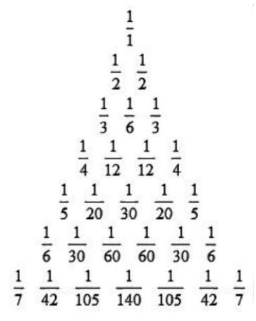
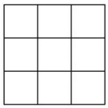
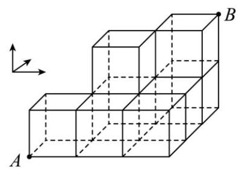

# 第16章 排列组合

## 16-1 基本方法及容斥定理

### 16-1-1

> 原PDF：[打开学生版PDF](<file:///C:/Users/lucky12345/Documents/%E9%AB%98%E4%B8%AD%E6%95%B0%E5%AD%A6%E5%A4%8D%E4%B9%A0/%E5%88%86%E7%B1%BB%E7%89%88/01_%E5%AD%A6%E7%94%9F%E7%89%88-%E8%AE%B2%E4%B9%89/16-1%E6%8E%92%E5%88%97%E7%BB%84%E5%90%88%EF%BC%9A%E5%9F%BA%E6%9C%AC%E6%96%B9%E6%B3%95%E5%8F%8A%E5%AE%B9%E6%96%A5%E5%AE%9A%E7%90%86-%E8%AE%B2%E4%B9%89.pdf>)

(2025 湖北武汉九调)有编号为 1,2,..., $n$ 的 $n$ 个空盒子 $\left( {n \geq  2, n \in  \mathbf{N}}\right)$ ，另有编号为 $1,2,\cdots , k$ 的 $k$ 个球 $\left( {2 \leq  k \leq  n, k \in  \mathbf{N}}\right)$ ,现将 $k$ 个球分别放入 $n$ 个盒子中,每个盒子最多放入一个球. 放球时,先将 1 号球随机放入 $n$ 个盒子中的其中一个,剩下的球按照球编号从小到大的顺序依次放置, 规则如下: 若球的编号对应的盒子为空, 则将该球放入对应编号的盒子中; 若球的编号对应的盒子为非空, 则将该球随机放入剩余空盒子中的其中一个. 记 $k$ 号球能放入 $k$ 号盒子的概率为 $P\left( {n, k}\right)$ .

(1)求 $P\left( {3,3}\right)$ ；

(2)当 $n \geq  3$ 时，求 $P\left( {n,3}\right)$ ；

(3) 求 $P\left( {n, k}\right)$ .

### 16-1-2

> 原PDF：[打开学生版PDF](<file:///C:/Users/lucky12345/Documents/%E9%AB%98%E4%B8%AD%E6%95%B0%E5%AD%A6%E5%A4%8D%E4%B9%A0/%E5%88%86%E7%B1%BB%E7%89%88/01_%E5%AD%A6%E7%94%9F%E7%89%88-%E8%AE%B2%E4%B9%89/16-1%E6%8E%92%E5%88%97%E7%BB%84%E5%90%88%EF%BC%9A%E5%9F%BA%E6%9C%AC%E6%96%B9%E6%B3%95%E5%8F%8A%E5%AE%B9%E6%96%A5%E5%AE%9A%E7%90%86-%E8%AE%B2%E4%B9%89.pdf>)

(2010 北京高考)8 名学生和 2 位老师站成一排合影, 2 位老师不相邻的排法种数为( )

A. ${A}_{8}^{8}{A}_{9}^{2}$ B. ${A}_{8}^{8}{C}_{9}^{2}$ C. ${A}_{8}^{8}{A}_{7}^{2}$ D. ${A}_{8}^{8}{C}_{7}^{2}$

### 16-1-3

> 原PDF：[打开学生版PDF](<file:///C:/Users/lucky12345/Documents/%E9%AB%98%E4%B8%AD%E6%95%B0%E5%AD%A6%E5%A4%8D%E4%B9%A0/%E5%88%86%E7%B1%BB%E7%89%88/01_%E5%AD%A6%E7%94%9F%E7%89%88-%E8%AE%B2%E4%B9%89/16-1%E6%8E%92%E5%88%97%E7%BB%84%E5%90%88%EF%BC%9A%E5%9F%BA%E6%9C%AC%E6%96%B9%E6%B3%95%E5%8F%8A%E5%AE%B9%E6%96%A5%E5%AE%9A%E7%90%86-%E8%AE%B2%E4%B9%89.pdf>)

(2023 四川雅安一模)甲 ，乙，丙，丁 4 个学校将分别组织部分学生开展研学活动,现有 $A, B, C, D, E$ 五个研学基地供选择,每个学校只选择一个基地,则 4 个学校中至少有 3 个学校所选研学基地不相同的选择种数共有( )

A. 420 B. 460 C. 480 D. 520

### 16-1-4

> 原PDF：[打开学生版PDF](<file:///C:/Users/lucky12345/Documents/%E9%AB%98%E4%B8%AD%E6%95%B0%E5%AD%A6%E5%A4%8D%E4%B9%A0/%E5%88%86%E7%B1%BB%E7%89%88/01_%E5%AD%A6%E7%94%9F%E7%89%88-%E8%AE%B2%E4%B9%89/16-1%E6%8E%92%E5%88%97%E7%BB%84%E5%90%88%EF%BC%9A%E5%9F%BA%E6%9C%AC%E6%96%B9%E6%B3%95%E5%8F%8A%E5%AE%B9%E6%96%A5%E5%AE%9A%E7%90%86-%E8%AE%B2%E4%B9%89.pdf>)

(2023全国模拟)某市选派 9 名医生到 3 个乡镇义诊，其中有 5 名男医生，4 名女医生，要求每个乡镇分配 3 名医生，则每个乡镇均有男医生的分配方法种数为( )

A. 360 B. 1480 C. 1080 D. 1440

### 16-1-5

> 原PDF：[打开学生版PDF](<file:///C:/Users/lucky12345/Documents/%E9%AB%98%E4%B8%AD%E6%95%B0%E5%AD%A6%E5%A4%8D%E4%B9%A0/%E5%88%86%E7%B1%BB%E7%89%88/01_%E5%AD%A6%E7%94%9F%E7%89%88-%E8%AE%B2%E4%B9%89/16-1%E6%8E%92%E5%88%97%E7%BB%84%E5%90%88%EF%BC%9A%E5%9F%BA%E6%9C%AC%E6%96%B9%E6%B3%95%E5%8F%8A%E5%AE%B9%E6%96%A5%E5%AE%9A%E7%90%86-%E8%AE%B2%E4%B9%89.pdf>)

(2024 全国模拟) 有 3 对双胞胎站成一排拍照, 恰有一对双胞胎相邻的站法有( )

A. 144 种 B. 240 种 C. 288 种 D. 336 种

### 16-1-6

> 原PDF：[打开学生版PDF](<file:///C:/Users/lucky12345/Documents/%E9%AB%98%E4%B8%AD%E6%95%B0%E5%AD%A6%E5%A4%8D%E4%B9%A0/%E5%88%86%E7%B1%BB%E7%89%88/01_%E5%AD%A6%E7%94%9F%E7%89%88-%E8%AE%B2%E4%B9%89/16-1%E6%8E%92%E5%88%97%E7%BB%84%E5%90%88%EF%BC%9A%E5%9F%BA%E6%9C%AC%E6%96%B9%E6%B3%95%E5%8F%8A%E5%AE%B9%E6%96%A5%E5%AE%9A%E7%90%86-%E8%AE%B2%E4%B9%89.pdf>)

(2024 四川南充模拟)距高考 30 天之际，高三某班级五位同学打算利用周末亲近大自然，陶冶情操，释放压力. 这五位同学准备星期天在凌云山景区，印象嘉陵江湿地公园，西山风景区三个景点中选择一个去游玩，已知每个景点至少有一位同学会选，五位同学都会进行选择并且只能选择其中一个景点，若学生甲和学生乙准备选同一个景点，则不同的选法种数为( )

A. 18 B. 36 C. 48 D. 32

### 16-1-7

> 原PDF：[打开学生版PDF](<file:///C:/Users/lucky12345/Documents/%E9%AB%98%E4%B8%AD%E6%95%B0%E5%AD%A6%E5%A4%8D%E4%B9%A0/%E5%88%86%E7%B1%BB%E7%89%88/01_%E5%AD%A6%E7%94%9F%E7%89%88-%E8%AE%B2%E4%B9%89/16-1%E6%8E%92%E5%88%97%E7%BB%84%E5%90%88%EF%BC%9A%E5%9F%BA%E6%9C%AC%E6%96%B9%E6%B3%95%E5%8F%8A%E5%AE%B9%E6%96%A5%E5%AE%9A%E7%90%86-%E8%AE%B2%E4%B9%89.pdf>)

(2022 江西模拟)某校有 5 名大学生打算前往观看冰球，速滑，花滑三场比赛，每场比赛至少有 1 名学生且至多 2 名学生前往，则甲同学不去观看冰球比赛的方案种数有( )

A. 48 B. 54 C. 60 D. 72

### 16-1-8

> 原PDF：[打开学生版PDF](<file:///C:/Users/lucky12345/Documents/%E9%AB%98%E4%B8%AD%E6%95%B0%E5%AD%A6%E5%A4%8D%E4%B9%A0/%E5%88%86%E7%B1%BB%E7%89%88/01_%E5%AD%A6%E7%94%9F%E7%89%88-%E8%AE%B2%E4%B9%89/16-1%E6%8E%92%E5%88%97%E7%BB%84%E5%90%88%EF%BC%9A%E5%9F%BA%E6%9C%AC%E6%96%B9%E6%B3%95%E5%8F%8A%E5%AE%B9%E6%96%A5%E5%AE%9A%E7%90%86-%E8%AE%B2%E4%B9%89.pdf>)

(2024 江西新余模拟)为了协调城乡教育资源的平衡，政府决定派甲，乙， 丙等六名教师去往包括希望中学在内的三所学校支教(每所学校至少安排一名教师). 受某些因素影响, 甲乙教师不被安排在同一所学校, 丙教师不去往希望中学，则不同的分配方法有( )种

A. 144 B. 260 C. 320 D. 540

### 16-1-9

> 原PDF：[打开学生版PDF](<file:///C:/Users/lucky12345/Documents/%E9%AB%98%E4%B8%AD%E6%95%B0%E5%AD%A6%E5%A4%8D%E4%B9%A0/%E5%88%86%E7%B1%BB%E7%89%88/01_%E5%AD%A6%E7%94%9F%E7%89%88-%E8%AE%B2%E4%B9%89/16-1%E6%8E%92%E5%88%97%E7%BB%84%E5%90%88%EF%BC%9A%E5%9F%BA%E6%9C%AC%E6%96%B9%E6%B3%95%E5%8F%8A%E5%AE%B9%E6%96%A5%E5%AE%9A%E7%90%86-%E8%AE%B2%E4%B9%89.pdf>)

(2024 安徽模拟)甲，乙等 6 名高三同学计划今年暑假在 $A, B, C, D$ 四个景点中选择一个打卡游玩, 若每个景点至少有一个同学去打卡游玩, 每位同学都会选择一个景点打卡游玩，且甲，乙都单独 1 人去某一个景点打卡游玩，则不同游玩方法有( )

A. 96 种 B. 132 种 C. 168 种 D. 204 种

【变式】甲或乙中, 至少一人, 单独 1 人去某一个景点打卡游玩, 则不同的游玩方法有多少种?

## 16-2 二项式定理

### 16-2-1

> 原PDF：[打开学生版PDF](<file:///C:/Users/lucky12345/Documents/%E9%AB%98%E4%B8%AD%E6%95%B0%E5%AD%A6%E5%A4%8D%E4%B9%A0/%E5%88%86%E7%B1%BB%E7%89%88/01_%E5%AD%A6%E7%94%9F%E7%89%88-%E8%AE%B2%E4%B9%89/16-2%E6%8E%92%E5%88%97%E7%BB%84%E5%90%88%EF%BC%9A%E4%BA%8C%E9%A1%B9%E5%BC%8F%E5%AE%9A%E7%90%86-%E8%AE%B2%E4%B9%89.pdf>)

(多选) (2023 山东滨州模拟) 若 ${\left( a + b + c\right) }^{6}$ 的展开式是关于 $a, b, c$ 的多项式, 则下列说法正确的是( )

A. 展开式中每一项的次数都是 6 B. 展开式中含 ${a}^{3}{b}^{2}c$ 项的系数是 60

C. 所有项的系数之和为 ${2}^{6}$ D. 展开式中共有 28 项

### 16-2-2

> 原PDF：[打开学生版PDF](<file:///C:/Users/lucky12345/Documents/%E9%AB%98%E4%B8%AD%E6%95%B0%E5%AD%A6%E5%A4%8D%E4%B9%A0/%E5%88%86%E7%B1%BB%E7%89%88/01_%E5%AD%A6%E7%94%9F%E7%89%88-%E8%AE%B2%E4%B9%89/16-2%E6%8E%92%E5%88%97%E7%BB%84%E5%90%88%EF%BC%9A%E4%BA%8C%E9%A1%B9%E5%BC%8F%E5%AE%9A%E7%90%86-%E8%AE%B2%E4%B9%89.pdf>)

(2015 上海高考)在 ${\left( 1 + x + \frac{1}{{x}^{2015}}\right) }^{10}$ 的展开式中， ${x}^{2}$ 项的系数为___(结果用数值表示).

### 16-2-3

> 原PDF：[打开学生版PDF](<file:///C:/Users/lucky12345/Documents/%E9%AB%98%E4%B8%AD%E6%95%B0%E5%AD%A6%E5%A4%8D%E4%B9%A0/%E5%88%86%E7%B1%BB%E7%89%88/01_%E5%AD%A6%E7%94%9F%E7%89%88-%E8%AE%B2%E4%B9%89/16-2%E6%8E%92%E5%88%97%E7%BB%84%E5%90%88%EF%BC%9A%E4%BA%8C%E9%A1%B9%E5%BC%8F%E5%AE%9A%E7%90%86-%E8%AE%B2%E4%B9%89.pdf>)

(2008江西高考)(1 + $\sqrt[3]{x}{)}^{6}{\left( 1 + \frac{1}{\sqrt[4]{x}}\right) }^{10}$ 展开式中的常数项为( )

A. 1 B. 46 C. 4245 D. 4246

### 16-2-4

> 原PDF：[打开学生版PDF](<file:///C:/Users/lucky12345/Documents/%E9%AB%98%E4%B8%AD%E6%95%B0%E5%AD%A6%E5%A4%8D%E4%B9%A0/%E5%88%86%E7%B1%BB%E7%89%88/01_%E5%AD%A6%E7%94%9F%E7%89%88-%E8%AE%B2%E4%B9%89/16-2%E6%8E%92%E5%88%97%E7%BB%84%E5%90%88%EF%BC%9A%E4%BA%8C%E9%A1%B9%E5%BC%8F%E5%AE%9A%E7%90%86-%E8%AE%B2%E4%B9%89.pdf>)

(2012 湖北高考)设 $a \in  \mathbf{Z}$ ，且 $0 \leq  a < {13}$ ，若 ${51}^{2012} + a$ 能被 13 整除，则 $a =$ ( )

A. 0 B. 1 C. 11 D. 12

### 16-2-5

> 原PDF：[打开学生版PDF](<file:///C:/Users/lucky12345/Documents/%E9%AB%98%E4%B8%AD%E6%95%B0%E5%AD%A6%E5%A4%8D%E4%B9%A0/%E5%88%86%E7%B1%BB%E7%89%88/01_%E5%AD%A6%E7%94%9F%E7%89%88-%E8%AE%B2%E4%B9%89/16-2%E6%8E%92%E5%88%97%E7%BB%84%E5%90%88%EF%BC%9A%E4%BA%8C%E9%A1%B9%E5%BC%8F%E5%AE%9A%E7%90%86-%E8%AE%B2%E4%B9%89.pdf>)

(2014 福建高考)用 $a$ 代表红球， $b$ 代表蓝球， $c$ 代表黑球，由加法原理及乘法原理,从 1 个红球和 1 个蓝球中取出若干个球的所有取法可由 $\left( {1 + a}\right) \left( {1 + b}\right)$ 的展开式 $1 + a + b + {ab}$ 表示出来,如: “ 1 ” 表示一个球都不取、“ $a$ ” 表示取出一个红球,而 “ ${ab}$ ” 则表示把红球和蓝球都取出来. 以此类推,下列各式中,其展开式可用来表示从 5 个无区别的红球、 5 个无区别的蓝球、 5 个有区别的黑球中取出若干个球，且所有的蓝球都取出或都不取出的所有取法的是 ( )

A. $\left( {1 + a + {a}^{2} + {a}^{3} + {a}^{4} + {a}^{5}}\right) {\left( 1 + {b}^{5}\right) }^{2}{\left( 1 + c\right) }^{5}$

B. $\left( {1 + {a}^{5}}\right) \left( {1 + b + {b}^{2} + {b}^{3} + {b}^{4} + {b}^{5}}\right) {\left( 1 + c\right) }^{5}$

C. ${\left( 1 + a\right) }^{5}\left( {1 + b + {b}^{2} + {b}^{3} + {b}^{4} + {b}^{5}}\right) \left( {1 + {c}^{5}}\right)$

D. $\left( {1 + {a}^{5}}\right) {\left( 1 + b\right) }^{5}\left( {1 + c + {c}^{2} + {c}^{3} + {c}^{4} + {c}^{5}}\right)$

### 16-2-6

> 原PDF：[打开学生版PDF](<file:///C:/Users/lucky12345/Documents/%E9%AB%98%E4%B8%AD%E6%95%B0%E5%AD%A6%E5%A4%8D%E4%B9%A0/%E5%88%86%E7%B1%BB%E7%89%88/01_%E5%AD%A6%E7%94%9F%E7%89%88-%E8%AE%B2%E4%B9%89/16-2%E6%8E%92%E5%88%97%E7%BB%84%E5%90%88%EF%BC%9A%E4%BA%8C%E9%A1%B9%E5%BC%8F%E5%AE%9A%E7%90%86-%E8%AE%B2%E4%B9%89.pdf>)

(2006 湖北高考)将杨辉三角中的每一个数 ${\mathrm{C}}_{n}^{r}$ 都换成分数 $\frac{1}{\left( {n + 1}\right) {\mathrm{C}}_{n}^{r}}$ ，就得到一个如下图所示的分数三角形，称为莱布尼茨三角形，从莱布尼茨三角形可看出 $\frac{1}{\left( {n + 1}\right) {\mathrm{C}}_{n}^{r}} + \frac{1}{\left( {n + 1}\right) {\mathrm{C}}_{n}^{x}} = \frac{1}{n{\mathrm{C}}_{n - 1}^{r}}$ ,其中 $x =$ ___，令 ${a}_{n} = \frac{1}{3} + \frac{1}{12} + \frac{1}{30} + \frac{1}{60} + \cdots  + \; \frac{1}{n{\mathrm{C}}_{n - 1}^{2}} + \frac{1}{\left( {n + 1}\right) {\mathrm{C}}_{n}^{2}}$ ,则 $\mathop{\lim }\limits_{{n \rightarrow  \infty }}{a}_{n} =$ ___.

### 16-2-7

> 原PDF：[打开学生版PDF](<file:///C:/Users/lucky12345/Documents/%E9%AB%98%E4%B8%AD%E6%95%B0%E5%AD%A6%E5%A4%8D%E4%B9%A0/%E5%88%86%E7%B1%BB%E7%89%88/01_%E5%AD%A6%E7%94%9F%E7%89%88-%E8%AE%B2%E4%B9%89/16-2%E6%8E%92%E5%88%97%E7%BB%84%E5%90%88%EF%BC%9A%E4%BA%8C%E9%A1%B9%E5%BC%8F%E5%AE%9A%E7%90%86-%E8%AE%B2%E4%B9%89.pdf>)

(2019 江苏高考)设 ${\left( 1 + x\right) }^{n} = {a}_{0} + {a}_{1}x + {a}_{2}{x}^{2} + \cdots  + {a}_{n}{x}^{n}, n \geq  4, n \in  {\mathbf{N}}^{ * }$ . 已知 ${a}_{3}^{2} = 2{a}_{2}{a}_{4}$ .

(1)求 $n$ 的值；

(2)设 ${\left( 1 + \sqrt{3}\right) }^{n} = a + b\sqrt{3}$ ，其中 $a, b \in  {N}^{ * }$ ，求 ${a}^{2} - 3{b}^{2}$ 的值.

### 16-2-8

> 原PDF：[打开学生版PDF](<file:///C:/Users/lucky12345/Documents/%E9%AB%98%E4%B8%AD%E6%95%B0%E5%AD%A6%E5%A4%8D%E4%B9%A0/%E5%88%86%E7%B1%BB%E7%89%88/01_%E5%AD%A6%E7%94%9F%E7%89%88-%E8%AE%B2%E4%B9%89/16-2%E6%8E%92%E5%88%97%E7%BB%84%E5%90%88%EF%BC%9A%E4%BA%8C%E9%A1%B9%E5%BC%8F%E5%AE%9A%E7%90%86-%E8%AE%B2%E4%B9%89.pdf>)

(2003全国高考)已知数列 $\left\{  {a}_{n}\right\}$ ( $n$ 为正整数) 是首项为 ${a}_{1}$ ，公比为 $q$ 的等比数列.

(1)求和: ${a}_{1}{\mathrm{C}}_{2}^{0} - {a}_{2}{\mathrm{C}}_{2}^{1} + {a}_{3}{\mathrm{C}}_{2}^{2},{a}_{1}{\mathrm{C}}_{3}^{0} - {a}_{2}{\mathrm{C}}_{3}^{1} + {a}_{3}{\mathrm{C}}_{3}^{2} - {a}_{4}{\mathrm{C}}_{3}^{3}$ ；

(2)由(1)的结果归纳概括出关于正整数 $n$ 的一个结论,并加以证明.

## 16-3 插板法

### 16-3-1

> 原PDF：[打开学生版PDF](<file:///C:/Users/lucky12345/Documents/%E9%AB%98%E4%B8%AD%E6%95%B0%E5%AD%A6%E5%A4%8D%E4%B9%A0/%E5%88%86%E7%B1%BB%E7%89%88/01_%E5%AD%A6%E7%94%9F%E7%89%88-%E8%AE%B2%E4%B9%89/16-3%E6%8E%92%E5%88%97%E7%BB%84%E5%90%88%EF%BC%9A%E6%8F%92%E6%9D%BF%E6%B3%95-%E8%AE%B2%E4%B9%89.pdf>)

(2024 全国模拟)四元一次方程 ${x}_{1} + {x}_{2} + {x}_{3} + {x}_{4} = {10}$ 的正整数解有___组.

### 16-3-2

> 原PDF：[打开学生版PDF](<file:///C:/Users/lucky12345/Documents/%E9%AB%98%E4%B8%AD%E6%95%B0%E5%AD%A6%E5%A4%8D%E4%B9%A0/%E5%88%86%E7%B1%BB%E7%89%88/01_%E5%AD%A6%E7%94%9F%E7%89%88-%E8%AE%B2%E4%B9%89/16-3%E6%8E%92%E5%88%97%E7%BB%84%E5%90%88%EF%BC%9A%E6%8F%92%E6%9D%BF%E6%B3%95-%E8%AE%B2%E4%B9%89.pdf>)

(2024全国模拟)将 8 个相同的小球放入 5 个编号为 1, 2, 3, 4, 5 的盒子，每个盒子都不空的方法数为___，恰有一个空盒子的方法数为___.

### 16-3-3

> 原PDF：[打开学生版PDF](<file:///C:/Users/lucky12345/Documents/%E9%AB%98%E4%B8%AD%E6%95%B0%E5%AD%A6%E5%A4%8D%E4%B9%A0/%E5%88%86%E7%B1%BB%E7%89%88/01_%E5%AD%A6%E7%94%9F%E7%89%88-%E8%AE%B2%E4%B9%89/16-3%E6%8E%92%E5%88%97%E7%BB%84%E5%90%88%EF%BC%9A%E6%8F%92%E6%9D%BF%E6%B3%95-%E8%AE%B2%E4%B9%89.pdf>)

(2024 江苏苏州模拟) 随机取 $\{ \left( {x, y, z, w}\right)  \mid  x + y + z + w = {20}, x, y, z, w \in  \mathbf{N}$ \} 中的一个元素，则 $x > 0, y > 1, z > 2, w > 3$ 的概率为___.

### 16-3-4

> 原PDF：[打开学生版PDF](<file:///C:/Users/lucky12345/Documents/%E9%AB%98%E4%B8%AD%E6%95%B0%E5%AD%A6%E5%A4%8D%E4%B9%A0/%E5%88%86%E7%B1%BB%E7%89%88/01_%E5%AD%A6%E7%94%9F%E7%89%88-%E8%AE%B2%E4%B9%89/16-3%E6%8E%92%E5%88%97%E7%BB%84%E5%90%88%EF%BC%9A%E6%8F%92%E6%9D%BF%E6%B3%95-%E8%AE%B2%E4%B9%89.pdf>)

满足 ${x}_{1} + {x}_{2} + {x}_{3} = {12}$ 的非负整数解 $\left( {{x}_{1},{x}_{2},{x}_{3}}\right)$ 共有___个.

### 16-3-5

> 原PDF：[打开学生版PDF](<file:///C:/Users/lucky12345/Documents/%E9%AB%98%E4%B8%AD%E6%95%B0%E5%AD%A6%E5%A4%8D%E4%B9%A0/%E5%88%86%E7%B1%BB%E7%89%88/01_%E5%AD%A6%E7%94%9F%E7%89%88-%E8%AE%B2%E4%B9%89/16-3%E6%8E%92%E5%88%97%E7%BB%84%E5%90%88%EF%BC%9A%E6%8F%92%E6%9D%BF%E6%B3%95-%E8%AE%B2%E4%B9%89.pdf>)

(2024 湖北模拟)不等式 ${x}_{1} + {x}_{2} + {x}_{3} \leq  {12}$ ，其中 ${x}_{1},{x}_{2},{x}_{3}$ 是非负整数，则使不等式成立的三元数组 $\left( {{x}_{1},{x}_{2},{x}_{3}}\right)$ 有多少组( )

A. 560 B. 455 C. 91 D. 55

### 16-3-6

> 原PDF：[打开学生版PDF](<file:///C:/Users/lucky12345/Documents/%E9%AB%98%E4%B8%AD%E6%95%B0%E5%AD%A6%E5%A4%8D%E4%B9%A0/%E5%88%86%E7%B1%BB%E7%89%88/01_%E5%AD%A6%E7%94%9F%E7%89%88-%E8%AE%B2%E4%B9%89/16-3%E6%8E%92%E5%88%97%E7%BB%84%E5%90%88%EF%BC%9A%E6%8F%92%E6%9D%BF%E6%B3%95-%E8%AE%B2%E4%B9%89.pdf>)

从 $1 \sim  {10}$ 中选出三个正整数,要求两两不相邻. 那么所有可能的方法数为 ___.

## 16-4 综合应用

### 16-4-1

> 原PDF：[打开学生版PDF](<file:///C:/Users/lucky12345/Documents/%E9%AB%98%E4%B8%AD%E6%95%B0%E5%AD%A6%E5%A4%8D%E4%B9%A0/%E5%88%86%E7%B1%BB%E7%89%88/01_%E5%AD%A6%E7%94%9F%E7%89%88-%E8%AE%B2%E4%B9%89/16-4%E6%8E%92%E5%88%97%E7%BB%84%E5%90%88%EF%BC%9A%E7%BB%BC%E5%90%88%E5%BA%94%E7%94%A8-%E8%AE%B2%E4%B9%89.pdf>)

(2021 浙江模拟)某盒中有 9 个大小相同的球，分别标号为 1, 2, ..., 9，从盒中任取 3 个球, 则取出的 3 个球的标号之和能被 3 整除的概率是___；记者为取出的 3 个球的标号之和被 3 除的余数,则随机变量 $\xi$ 的数学期望 $E\left( \xi \right)  =$ ___.

### 16-4-2

> 原PDF：[打开学生版PDF](<file:///C:/Users/lucky12345/Documents/%E9%AB%98%E4%B8%AD%E6%95%B0%E5%AD%A6%E5%A4%8D%E4%B9%A0/%E5%88%86%E7%B1%BB%E7%89%88/01_%E5%AD%A6%E7%94%9F%E7%89%88-%E8%AE%B2%E4%B9%89/16-4%E6%8E%92%E5%88%97%E7%BB%84%E5%90%88%EF%BC%9A%E7%BB%BC%E5%90%88%E5%BA%94%E7%94%A8-%E8%AE%B2%E4%B9%89.pdf>)

(2008 湖南高考) 对有 $n\left( {n \geq  4}\right)$ 个元素的总体 $\{ 1,2,3,\cdots , n\}$ 进行抽样,先将总体分成两个子总体 $\{ 1,2,\cdots , m\}$ 和 $\{ m + 1, m + 2,\cdots , n\}$ ( $m$ 是给定的正整数,且 $2 \leq \; m \leq  n - 2$ ),再从每个子总体中各随机抽取 2 个元素组成样本,用 ${P}_{ij}$ 表示元素 $i$ 和 $j$ 同时出现在样本中的概率,则 ${P}_{1n} =$ ___；所有 ${P}_{ij}\left( {1 \leq  i < j \leq  n}\right)$ 的和等于___.

### 16-4-3

> 原PDF：[打开学生版PDF](<file:///C:/Users/lucky12345/Documents/%E9%AB%98%E4%B8%AD%E6%95%B0%E5%AD%A6%E5%A4%8D%E4%B9%A0/%E5%88%86%E7%B1%BB%E7%89%88/01_%E5%AD%A6%E7%94%9F%E7%89%88-%E8%AE%B2%E4%B9%89/16-4%E6%8E%92%E5%88%97%E7%BB%84%E5%90%88%EF%BC%9A%E7%BB%BC%E5%90%88%E5%BA%94%E7%94%A8-%E8%AE%B2%E4%B9%89.pdf>)

(2024 河北模拟)将 1,2,3,...,9 这 9 个数填入如图所示的格子中(要求每个数都要填入,每个格子中只能填一个数),记第 1 行中最大的数为 $a$ ,第 2 行中最大的数为 $b$ ,第 3 行中最大的数为 $c$ ,则 $a < b < c$ 的填法共有___种.

第1行

第2行

第3行

### 16-4-4

> 原PDF：[打开学生版PDF](<file:///C:/Users/lucky12345/Documents/%E9%AB%98%E4%B8%AD%E6%95%B0%E5%AD%A6%E5%A4%8D%E4%B9%A0/%E5%88%86%E7%B1%BB%E7%89%88/01_%E5%AD%A6%E7%94%9F%E7%89%88-%E8%AE%B2%E4%B9%89/16-4%E6%8E%92%E5%88%97%E7%BB%84%E5%90%88%EF%BC%9A%E7%BB%BC%E5%90%88%E5%BA%94%E7%94%A8-%E8%AE%B2%E4%B9%89.pdf>)

(2018 天津南开三模)用五种不同颜色给三棱台 ${ABC} - {DEF}$ 的六个顶点染色， 要求每个点染一种颜色, 且每条棱的两个端点染不同颜色. 则不同的染色方法有 ___种.

### 16-4-5

> 原PDF：[打开学生版PDF](<file:///C:/Users/lucky12345/Documents/%E9%AB%98%E4%B8%AD%E6%95%B0%E5%AD%A6%E5%A4%8D%E4%B9%A0/%E5%88%86%E7%B1%BB%E7%89%88/01_%E5%AD%A6%E7%94%9F%E7%89%88-%E8%AE%B2%E4%B9%89/16-4%E6%8E%92%E5%88%97%E7%BB%84%E5%90%88%EF%BC%9A%E7%BB%BC%E5%90%88%E5%BA%94%E7%94%A8-%E8%AE%B2%E4%B9%89.pdf>)

(2024 江苏苏州模拟)现有一只蜜蜂沿如图所示的用 8 个完全一样的正方体搭建的几何体的棱并按照箭头所指的相互垂直的三个方向从 $A$ 点飞行到 $B$ 点， 可能的飞行路径共有___种(用数字作答).

