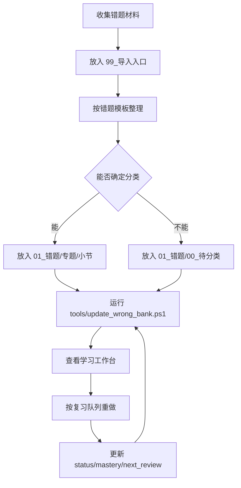

# 工作流

## 每次导入后

1. 确认一题一页。
2. 确认 YAML 字段完整。
3. 运行 `tools/update_wrong_bank.ps1`。
4. 查看 [[系统体检]]，修掉红色问题。
5. 回到 [[学习工作台]]。

## 每次复习后

1. 改 `status`。
2. 改 `mastery`。
3. 写 `last_review`。
4. 写 `next_review`。
5. 若仍错，`repeat_count` 加 1，并补一句更具体的 `anti_mistake_tip`。

## 每周复盘

1. 看 [[错题统计]] 的高频错因。
2. 看 [[知识点地图]] 的高频知识点和方法。
3. 从 [[复习队列]] 里挑 5 到 10 题重做。
4. 在 `02_复盘` 写一页周复盘。

